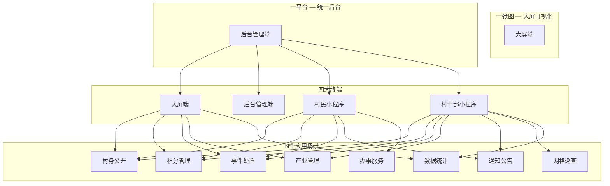
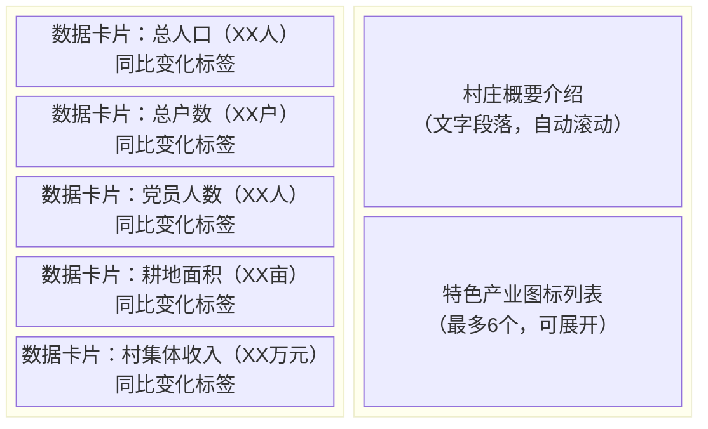
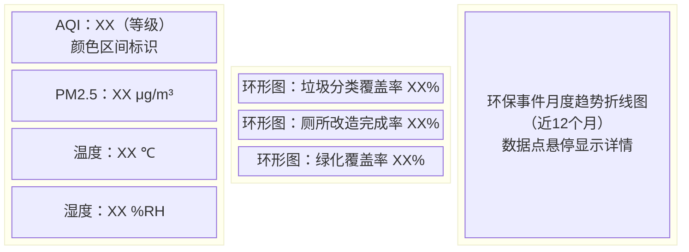
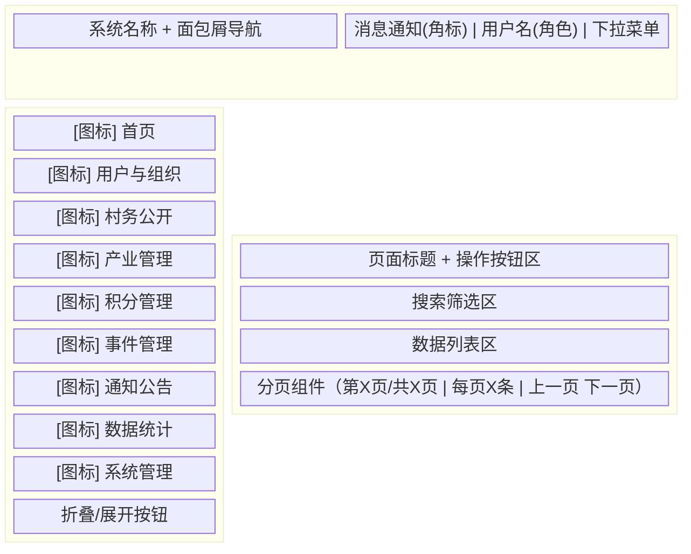
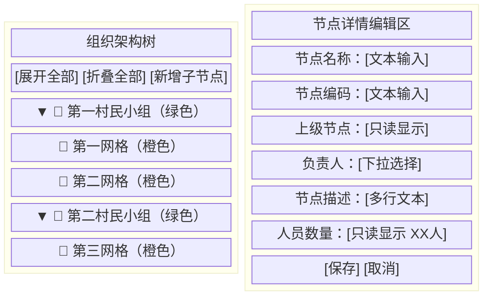
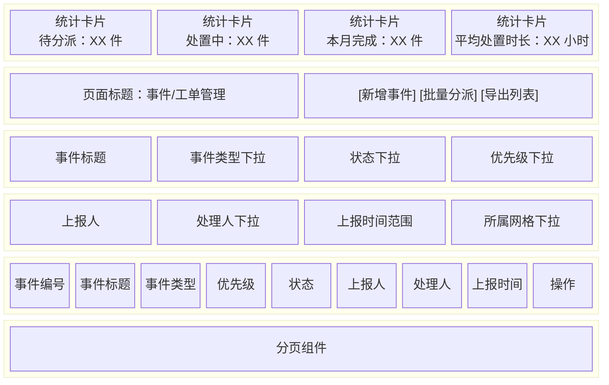

# 数字乡村（村级版）需求说明书

| 字段 | 内容 |
|------|------|
| 项目名称 | 数字乡村（村级版） |
| 文档版本 | V1.0 |
| 文档类型 | 产品需求说明书（PRD） |
| 编写日期 | 2026-06-30 |

---

## 目录

- [1 政策背景](#1-政策背景)
- [2 建设目标](#2-建设目标)
- [3 建设范围](#3-建设范围)
- [4 组织分工](#4-组织分工)
- [5 功能需求](#5-功能需求)
  - [5.0 功能概览](#50-功能概览)
  - [5.1 大屏端](#51-大屏端)
  - [5.2 后台管理端](#52-后台管理端)
  - [5.3 村民小程序端](#53-村民小程序端)
  - [5.4 村干部小程序端](#54-村干部小程序端)
- [6 数据需求](#6-数据需求)
- [7 非功能性需求](#7-非功能性需求)
- [8 验收标准](#8-验收标准)
- [9 运维保障](#9-运维保障)
- [10 附录](#10-附录)

---

## 1 政策背景

### 1.1 政策依据

2019年，中共中央办公厅、国务院办公厅印发《数字乡村发展战略纲要》，明确了数字乡村建设的总体架构和阶段性目标，要求加快信息化技术在乡村治理、生产经营、公共服务等领域的应用。2024年，中共中央、国务院发布《乡村全面振兴规划（2024）》，将数字化作为"三农"工作的重要抓手，提出推进智慧农业、数字治理、线上服务三大方向。同年，中央网信办等部门联合印发《数字乡村发展行动计划（2024-2026年）》，设定了行政村5G通达率超90%、农业生产信息化率达40%以上的量化指标。

乡村振兴的总要求概括为二十字方针：**产业兴旺、生态宜居、乡风文明、治理有效、生活富裕**。本系统围绕这五个维度构建村级数字治理能力，每个维度对应一个独立的数据展示与业务管理模块。

### 1.2 当前乡村治理痛点

村务公开主要依赖村委会公告栏的纸质张贴，更新周期长，外出务工村民难以及时获取。村干部入户走访、事件巡查、诉求处理等工作缺乏信息化记录手段，月底整理台账通常需要2至3个工作日。产业数据（合作社产值、农产品产量、电商销售额等）分散在不同部门和个人手中，村委会没有一个统一的数据汇总渠道。乡风建设缺少量化评价工具，"文明家庭""好媳妇好婆婆"等评比主要靠主观印象，难以形成持续的激励闭环。

### 1.3 数字化转型需求

村民需要一个线上渠道查看村务信息、办理日常事务、参与村庄事务讨论。村干部需要一套移动办公工具来接收任务、上报巡查记录、处理村民诉求、发布通知。村委会需要一个数据可视化的展示窗口，向上级领导和来访人员直观呈现村庄发展状况。乡镇/县级管理部门需要一个统一的后台来管理所辖各村的人员、数据、内容和运行情况。

---

## 2 建设目标

### 2.1 总体目标

为单个行政村搭建一套覆盖村务管理、村民服务、数据可视化三个方面的数字化应用系统，实现村务在线公开、村民线上办事、干部移动办公、村庄数据一屏统览。

### 2.2 分维度目标

| 维度 | 目标指标 |
|------|----------|
| 产业兴旺 | 村内合作社、企业、种养大户信息全部入库；产业数据按季度更新，覆盖率不低于90% |
| 生态宜居 | 环境事件（垃圾乱堆、污水直排等）从村民上报到干部确认处置的闭环率不低于85% |
| 乡风文明 | 积分制参与家庭户数占全村常住户数的比例不低于60%；积分兑换率不低于50% |
| 治理有效 | 村务公开内容100%线上发布；村民上报事件平均处置时长不超过48小时 |
| 生活富裕 | 村民线上办事申请比例不低于30%；常见办事事项（如证明开具、补助申请）可通过小程序提交 |

### 2.3 非目标

本系统在当前版本中不涉及以下内容：

- 不对接省级/国家级政务数据平台，不做跨部门数据互通
- 不包含农业生产物联网设备（传感器、摄像头等）的直接接入，仅预留数据导入接口
- 不做村民线上缴费、线上交易等涉及资金流转的功能
- 不做村干部绩效考核的自动化评分，仅提供工作记录和统计数据作为参考依据

---

## 3 建设范围

### 3.1 系统总体架构

系统采用"1+1+4+N"架构模式：



"一张图"指大屏端以可视化图表集中展示村庄各维度数据。"一平台"指后台管理端统一管理所有业务数据、用户权限和系统配置。"四大终端"分别为大屏端、后台管理端、村民小程序、村干部小程序。"N个应用场景"覆盖村务公开、积分管理、事件处置、产业管理、通知公告、网格巡查、办事服务、数据统计等具体功能。

### 3.2 四端定位与边界

| 端 | 使用形态 | 面向角色 | 核心定位 |
|----|----------|----------|----------|
| 大屏端 | 村委大厅/会议室大屏（1920x1080 横屏） | 村干部、来访领导 | 数据可视化展示，直观呈现村庄五大维度概况 |
| 后台管理端 | PC 浏览器 Web 应用 | 系统管理员、村委负责人 | 数据管理与系统配置，用户管理、内容管理、报表导出 |
| 村民小程序 | 微信小程序 | 全体村民 | 日常服务与村务参与，查看公开信息、提交办事申请、参与积分活动 |
| 村干部小程序 | 微信小程序（与村民端共用，按角色区分入口） | 村干部 | 移动办公，任务执行、巡查打卡、通知发布、诉求处理 |

### 3.3 用户角色定义

| 角色 | 可使用端 | 核心场景 |
|------|----------|----------|
| 系统管理员 | 后台管理端 | 管理所有用户账号、角色权限、系统参数、数据字典；不可见具体村务业务数据 |
| 村委负责人 | 后台管理端 + 大屏端 | 审核村务公开内容、查看各维度统计数据、管理村干部账号 |
| 村干部 | 村干部小程序 + 大屏端 | 执行巡查任务、处理村民事件/诉求、发布通知、审核积分、填写工作日志 |
| 村民 | 村民小程序 + 大屏端（仅查看） | 查看村务公开、提交办事申请、参与村民说事、上报问题、查看和兑换积分 |

### 3.4 技术约束概览

- 大屏端适配分辨率：1920 x 1080（横屏），支持全屏轮播模式
- 后台管理端支持浏览器：Chrome 90+、Edge 90+、Firefox 88+
- 小程序端基础库版本：微信基础库 2.25.0 及以上
- 系统默认支持单村部署，数据按村隔离
- 所有端均通过统一后端 API 交互

---

## 4 组织分工

### 4.1 建设方职责

| 角色 | 职责 |
|------|------|
| 项目负责人 | 统筹项目推进节奏，协调乡镇/县级部门资源，组织阶段性验收 |
| 业务对接人 | 提供村务管理的实际流程、政策规则、数据口径和表单模板 |
| 测试验收人 | 参与用户验收测试（UAT），按验收标准逐项确认 |

### 4.2 实施方职责

| 角色 | 职责 |
|------|------|
| 项目经理 | 制定开发计划、协调前后端资源、控制进度和风险 |
| 产品经理 | 需求分析、PRD 编写、原型设计、需求评审 |
| 前端工程师 | 大屏端、后台管理端、小程序端（村民端+村干部端）的前端开发 |
| 后端工程师 | API 接口开发、数据库设计、权限体系实现 |
| 测试工程师 | 用例编写、功能测试、兼容性测试、性能测试 |
| 运维工程师 | 服务器部署、域名配置、SSL 证书、日常运维 |

### 4.3 协作机制

**需求确认流程**：产品经理输出 PRD 和原型 → 建设方业务对接人逐章审阅 → 双方对齐后签字确认进入开发。

**变更控制流程**：任何需求变更由建设方项目负责人书面提出 → 产品经理评估影响范围和工作量 → 双方协商确认后更新 PRD 版本号。

**里程碑节点**：需求确认完成 → 原型确认完成 → 开发完成 → 内部测试通过 → 用户验收测试通过 → 正式上线。

---

## 5 功能需求

### 5.0 功能概览

以下总表列出四个端所有一级和二级功能模块：

| # | 端 | 一级模块 | 二级模块 | 优先级 | 说明 |
|---|-----|----------|----------|--------|------|
| 1 | 大屏端 | 村情总览 | 基础数据展示 | P0 | 人口、户数、面积、党员等核心指标 |
| 2 | 大屏端 | 产业兴旺 | 产业分布与产值 | P0 | 产业地图、产值占比、趋势图 |
| 3 | 大屏端 | 生态宜居 | 环境与基础设施 | P0 | 空气质量、垃圾分类、绿化率 |
| 4 | 大屏端 | 乡风文明 | 文明建设与积分 | P1 | 积分参与率、文明家庭、文化活动 |
| 5 | 大屏端 | 治理有效 | 事件处置与网格 | P0 | 事件处置率、巡查覆盖率、调解率 |
| 6 | 大屏端 | 生活富裕 | 收入与公共服务 | P1 | 人均收入、社保覆盖、培训场次 |
| 7 | 后台管理端 | 用户与组织管理 | 村民管理 | P0 | 村民信息增删改查、批量导入 |
| 8 | 后台管理端 | 用户与组织管理 | 村干部管理 | P0 | 村干部信息维护、角色分配 |
| 9 | 后台管理端 | 用户与组织管理 | 组织架构管理 | P0 | 村-组-网格层级结构维护 |
| 10 | 后台管理端 | 用户与组织管理 | 角色权限管理 | P0 | RBAC 权限配置 |
| 11 | 后台管理端 | 村务公开管理 | 内容发布与审核 | P0 | 党务、村务、财务公开内容管理 |
| 12 | 后台管理端 | 产业信息管理 | 产业/企业/合作社登记 | P1 | 产业信息维护、统计 |
| 13 | 后台管理端 | 积分管理 | 积分规则配置 | P1 | 加减分项、分值设置 |
| 14 | 后台管理端 | 积分管理 | 积分审核与兑换管理 | P1 | 审核积分记录、管理兑换商品 |
| 15 | 后台管理端 | 事件/工单管理 | 事件登记与跟踪 | P0 | 事件创建、分派、处置、归档 |
| 16 | 后台管理端 | 通知公告管理 | 公告发布与推送 | P0 | 公告编辑、推送范围、已读统计 |
| 17 | 后台管理端 | 数据统计与报表 | 数据汇总与导出 | P1 | 各维度统计报表、数据导出 |
| 18 | 后台管理端 | 系统管理 | 数据字典与日志 | P0 | 字典维护、操作日志查看 |
| 19 | 村民小程序 | 首页 | 功能入口与通知 | P0 | 宫格入口、通知滚动、快捷服务 |
| 20 | 村民小程序 | 村务公开 | 三务公开查看 | P0 | 党务/村务/财务分类浏览 |
| 21 | 村民小程序 | 办事服务 | 指南查询与在线申请 | P0 | 办事指南、线上表单提交 |
| 22 | 村民小程序 | 积分中心 | 积分查看与兑换 | P1 | 个人积分、兑换商城 |
| 23 | 村民小程序 | 村民说事 | 议题发起与讨论 | P1 | 发起话题、参与讨论 |
| 24 | 村民小程序 | 随手拍 | 问题上报 | P0 | 拍照+定位+描述上报 |
| 25 | 村民小程序 | 个人中心 | 个人信息与记录 | P0 | 信息管理、办事记录、积分 |
| 26 | 村干部小程序 | 工作台 | 待办与数据概览 | P0 | 待办事项、今日工作数据 |
| 27 | 村干部小程序 | 任务管理 | 任务接收与执行 | P0 | 任务列表、执行反馈 |
| 28 | 村干部小程序 | 网格巡查 | 巡查计划与打卡 | P0 | 巡查打卡、异常上报 |
| 29 | 村干部小程序 | 通知发布 | 通知发送 | P0 | 编辑通知、选择推送范围 |
| 30 | 村干部小程序 | 积分审核 | 积分审核操作 | P1 | 审核通过/驳回/调整 |
| 31 | 村干部小程序 | 村民诉求处理 | 诉求查看与回复 | P0 | 诉求列表、处理反馈 |
| 32 | 村干部小程序 | 工作日志 | 日志填写与查看 | P1 | 工作记录、照片附件 |
| 33 | 村干部小程序 | 数据查看 | 本村数据概览 | P1 | 移动端卡片式数据展示 |

### 5.1 大屏端

大屏端面向村委会会议室或大厅的大屏展示场景，目标分辨率 1920×1080 横屏，信息架构为"一页五维度 + 村情总览"。各模块数据通过后台 API 获取，默认每 5 分钟自动刷新一次，也可由管理员在后台配置刷新频率。

#### 5.1.1 大屏端整体设计说明

**模块概述**

大屏端采用单页固定布局，所有内容在一张页面内按区域划分展示，不涉及页面跳转。页面顶部为标题栏，显示村名、当前日期时间以及维度切换 Tab。标题栏下方是内容区域，按"左两列 + 中间主区域 + 右两列"的五列结构排布各模块的可视化图表。用户通过顶部或底部的 Tab 切换产业兴旺、生态宜居、乡风文明、治理有效、生活富裕五个维度，切换后对应区域的内容和图表同步更新，顶部标题栏和基础布局保持不变。

**布局结构**

| 区域 | 占比 | 用途 |
|------|------|------|
| 顶部标题栏 | 高度 80px | 村名、日期时间、维度 Tab 导航 |
| 左侧第一列 | 宽度 15% | 左侧上区——辅助数据或指标卡片 |
| 左侧第二列 | 宽度 20% | 左侧下区——图表或列表 |
| 中间主区域 | 宽度 30% | 核心可视化（地图、趋势图、排行榜等） |
| 右侧第二列 | 宽度 20% | 右侧上区——图表或列表 |
| 右侧第一列 | 宽度 15% | 右侧下区——辅助数据或趋势图 |

**导航与切换**

顶部 Tab 栏列出六个入口：村情总览、产业兴旺、生态宜居、乡风文明、治理有效、生活富裕。默认选中"村情总览"。用户点击任意 Tab，内容区域的五个分栏同步切换为该维度对应的数据模块。Tab 切换无页面刷新，仅局部更新图表和数据。

**数据刷新策略**

| 配置项 | 默认值 | 说明 |
|--------|--------|------|
| 自动刷新间隔 | 5 分钟 | 前端定时调用后台 API 拉取最新数据 |
| 刷新范围 | 全量 | 当前维度下所有指标同步刷新 |
| 刷新失败处理 | 保留上一次数据，显示提示条 | 网络异常时不在页面上清空已有数据 |
| 全屏轮播 | 可选 | 开启后按设定间隔（默认 30 秒）自动切换维度 Tab |
| 轮播间隔 | 30 秒 | 管理员可在后台配置，范围 10 秒至 120 秒 |

**交互说明**

- 鼠标悬停在图表的数据项上时，显示该数据项的详细数值和标签浮层。
- 图表支持点击某一数据项后弹出详情浮层，展示该项的明细数据列表。
- 顶部标题栏右侧提供全屏按钮，点击后浏览器进入全屏模式（Fullscreen API）。
- 轮播模式下，用户手动点击 Tab 后暂停自动轮播，30 秒无操作后恢复轮播。


#### 5.1.2 村情总览模块

**模块概述**

村情总览是用户打开大屏后看到的默认页面，用于在一张视图中呈现村庄的基本面貌和核心数据。页面采用左右分栏布局：左侧以数据卡片形式展示人口、户数、党员人数、耕地面积、村集体收入等五项基础指标；右侧上半部分显示村庄概要文字介绍，下半部分以图标列表展示本村的特色产业类型。用户无需切换维度即可快速了解村庄的整体情况。

**展示指标**

| 指标名称 | 数据类型 | 单位 | 来源 |
|----------|----------|------|------|
| 总人口 | 数值 | 人 | 后台「村民管理」模块统计 |
| 总户数 | 数值 | 户 | 后台「村民管理」模块统计 |
| 党员人数 | 数值 | 人 | 后台「村民管理」政治面貌字段统计 |
| 耕地面积 | 数值 | 亩 | 后台「村情基础数据」维护 |
| 村集体年收入 | 数值 | 万元 | 后台「产业信息管理」汇总 |
| 村庄概要介绍 | 文本 | — | 后台「村情基础数据」维护，不超过200字 |
| 特色产业列表 | 图标 + 名称 | — | 后台「产业信息管理」取前6项 |

**交互说明**

- 五张数据卡片各自带有同比变化标签（如"+2.3%"），颜色区分增长（绿色）和下降（红色），数据来源于后台记录的上年度同期值。
- 右侧特色产业图标列表最多展示6个产业，超出部分折叠，点击"展开"后显示全部。
- 村庄概要介绍文本超过可视区域时自动滚动，鼠标悬停时暂停滚动。



#### 5.1.3 产业兴旺模块

**模块概述**

产业兴旺模块展示本村各类产业的空间分布、产值对比和经营主体详情。左侧为产业分布地图占位区域，用标签标注各产业在村域内的位置；中间为各产业产值柱状图，用户可直观比较不同产业的产值高低；右侧为产业详情列表，逐条列出每个经营主体的名称、产业类型、年产值和从业人数。用户通过该页面可以快速了解村里"有哪些产业、分布在哪里、产值有多少"。

**展示指标**

| 区域 | 指标名称 | 数据类型 | 说明 |
|------|----------|----------|------|
| 左侧 | 产业分布地图 | 地图 + 标签 | 村域底图上标注各产业点位及名称 |
| 左侧 | 产业数量统计 | 数值 | 当前登记的产业总数 |
| 中间 | 各产业产值柱状图 | 柱状图 | X轴为产业类型，Y轴为产值（万元），按降序排列 |
| 中间 | 产业总产值 | 数值 | 所有产业产值合计 |
| 右侧 | 产业详情列表 | 列表 | 每行包含：名称、类型、产值（万元）、从业人数（人） |
| 右侧 | 列表排序 | — | 默认按产值降序，可点击切换为按从业人数排序 |

**交互说明**

- 左侧地图上的产业标签可点击，点击后右侧列表高亮对应产业条目，中间柱状图对应柱体高亮。
- 中间柱状图的柱体可悬停查看精确数值，点击后右侧列表滚动到对应条目。
- 右侧列表支持按"产值"或"从业人数"两种方式排序，点击列表标题切换。
- 右侧列表超过可视区域时自动滚动展示，鼠标悬停时暂停。


#### 5.1.4 生态宜居模块

**模块概述**

生态宜居模块围绕村庄人居环境展示环境监测数据、基础设施覆盖率和环保事件趋势。左侧以仪表盘或数字卡片展示空气质量指数（AQI）、PM2.5浓度、温度、湿度四项实时监测数据；中间以三个环形图展示垃圾分类覆盖率、厕所改造完成率、绿化覆盖率三项核心指标的达标进度；右侧为环保事件趋势折线图，展示近12个月村民上报的环境事件数量变化。用户可以直观判断当前环境状况和治理进展。

**展示指标**

| 区域 | 指标名称 | 数据类型 | 单位 | 来源 |
|------|----------|----------|------|------|
| 左侧 | 空气质量 AQI | 数值 + 等级 | — | 环境监测设备数据接入或手动填报 |
| 左侧 | PM2.5 | 数值 | μg/m³ | 同上 |
| 左侧 | 温度 | 数值 | ℃ | 同上 |
| 左侧 | 湿度 | 数值 | %RH | 同上 |
| 中间 | 垃圾分类覆盖率 | 百分比 | % | 后台汇总 |
| 中间 | 厕所改造完成率 | 百分比 | % | 后台汇总 |
| 中间 | 绿化覆盖率 | 百分比 | % | 后台汇总 |
| 右侧 | 环保事件月度趋势 | 折线图 | 件/月 | 后台「事件/工单管理」统计，近12个月 |

**交互说明**

- 左侧四项监测数据每 5 分钟随页面刷新同步更新，若数据超过 30 分钟未更新则在数值旁显示"数据延迟"警告标识。
- AQI 数值根据国家标准以不同颜色区间显示（优-绿色、良-黄色、轻度-橙色、中度-红色）。
- 中间三个环形图的中心显示百分比数值，环形颜色根据达标情况区分（≥80%为绿色，50%-79%为黄色，<50%为红色）。
- 右侧折线图的数据点可悬停查看当月事件数量和环比变化值。



#### 5.1.5 乡风文明模块

**模块概述**

乡风文明模块展示村庄文明建设的参与情况和典型榜样。左侧以指标卡片展示积分制参与率和积分兑换率两项数据；中间为文明家庭榜单，列出本年度评选出的文明家庭名称和排名；右侧上半部分为文化活动日历，标注近期和已举办的活动日期，下半部分为时间轴形式的文化活动记录列表。用户可以了解积分制的运行效果和村庄文化活动的开展频次。

**展示指标**

| 区域 | 指标名称 | 数据类型 | 说明 |
|------|----------|----------|------|
| 左侧 | 积分制参与率 | 百分比 | 参与积分家庭户数 / 全村常住户数 |
| 左侧 | 积分兑换率 | 百分比 | 已兑换积分总量 / 累计发放积分总量 |
| 左侧 | 累计发放积分 | 数值 | 本年度累计发放积分总分 |
| 中间 | 文明家庭榜单 | 列表 | 排名 + 家庭户主姓名 + 总积分，前10名 |
| 右侧 | 文化活动日历 | 日历控件 | 当月日历，有活动的日期标记圆点 |
| 右侧 | 文化活动记录 | 时间轴 | 每条包含：日期、活动名称、参与人数 |

**交互说明**

- 左侧积分制参与率和兑换率各以进度条 + 百分比数值的形式展示，目标值（如80%）以虚线标记在进度条上。
- 中间文明家庭榜单默认展示前10名，点击"查看全部"弹出浮层展示完整列表。
- 右侧日历中标记圆点的日期可点击，点击后下方时间轴自动滚动到对应活动条目。
- 右侧时间轴超出可视区域时自动滚动，鼠标悬停暂停。


#### 5.1.6 治理有效模块

**模块概述**

治理有效模块呈现村庄事件处置的流转效率和网格化管理成效。左侧为事件处置漏斗图，按"上报→分派→处置→闭环"四个阶段逐层收窄，展示各阶段事件数量；中间为网格巡查覆盖率地图占位区域，标注各网格的巡查状态；右侧上方展示矛盾纠纷调解成功率指标，下方为信访量月度趋势折线图。用户可以查看事件处理在哪个环节存在积压，以及矛盾纠纷和信访的整体趋势。

**展示指标**

| 区域 | 指标名称 | 数据类型 | 说明 |
|------|----------|----------|------|
| 左侧 | 上报事件数 | 数值 | 本年度村民上报事件总数 |
| 左侧 | 已分派事件数 | 数值 | 已分派给村干部处理的事件数 |
| 左侧 | 已处置事件数 | 数值 | 村干部已反馈处理结果的事件数 |
| 左侧 | 已闭环事件数 | 数值 | 村民确认结果、事件完结的数量 |
| 左侧 | 事件处置漏斗 | 漏斗图 | 四层：上报→分派→处置→闭环 |
| 中间 | 网格巡查覆盖率 | 百分比 | 已巡查网格数 / 网格总数 |
| 中间 | 网格状态地图 | 地图 | 村域底图标注各网格的巡查状态（已巡查/未巡查） |
| 右侧 | 矛盾纠纷调解率 | 百分比 | 调解成功数 / 受理总数 |
| 右侧 | 信访量月度趋势 | 折线图 | 近12个月信访件数量变化 |

**交互说明**

- 左侧漏斗图的每一层可悬停查看该阶段事件数量和占上一阶段的比例。
- 中间地图以不同填充色区分网格巡查状态（已巡查为绿色，未巡查为灰色），点击网格弹出巡查详情浮层（最近巡查时间、巡查人、异常记录数）。
- 右侧矛盾纠纷调解率以仪表盘形式展示，中心显示百分比。
- 右侧信访量趋势折线图的数据点可悬停查看当月信访件数量。


#### 5.1.7 生活富裕模块

**模块概述**

生活富裕模块展示村民收入水平、社会保障覆盖和公共服务供给情况。左侧为人均可支配收入年度趋势柱状图，展示近5年收入变化；中间上方为社保参保率指标卡，下方为电商相关数据（电商从业人数、线上销售额）；右侧上方为公共服务设施覆盖情况（卫生室、文化广场、快递点等），下方为农民技能培训场次和参训人数统计。用户可以了解村民收入增长趋势和基本公共服务的供给水平。

**展示指标**

| 区域 | 指标名称 | 数据类型 | 单位 | 说明 |
|------|----------|----------|------|------|
| 左侧 | 人均可支配收入趋势 | 柱状图 | 元/年 | 近5年数据，X轴为年份 |
| 左侧 | 最近年度人均收入 | 数值 | 元 | 柱状图最新年份的数值 |
| 中间 | 养老保险参保率 | 百分比 | % | 参保人数 / 应参保人数 |
| 中间 | 医疗保险参保率 | 百分比 | % | 同上 |
| 中间 | 电商从业人数 | 数值 | 人 | 从事电商销售的村民数量 |
| 中间 | 线上年销售额 | 数值 | 万元 | 本年度累计 |
| 右侧 | 公共服务设施列表 | 图标列表 | — | 卫生室、文化广场、快递点、农家书屋等，标注是否已覆盖 |
| 右侧 | 技能培训场次 | 数值 | 场 | 本年度已开展 |
| 右侧 | 技能培训参训人数 | 数值 | 人次 | 本年度累计 |

**交互说明**

- 左侧柱状图的柱体可悬停查看精确数值和同比增幅，点击柱体弹出浮层显示该年收入构成明细（工资性收入、经营性收入、财产性收入、转移性收入）。
- 中间社保参保率以两个并列的环形进度条展示，中心显示百分比。
- 中间电商数据以数字卡片形式展示，悬停显示同比变化。
- 右侧公共服务设施列表每项以图标 + 名称 + 覆盖状态（已覆盖/未覆盖）的形式展示，未覆盖项以红色标记。
- 右侧培训统计以数字卡片形式展示，下方附带最近一期培训的名称和日期。


### 5.2 后台管理端

后台管理端是面向系统管理员和村委负责人的 PC Web 应用，承载全部业务数据的维护、审核与管理工作。技术形态为响应式 Web 应用，最低支持分辨率 1366×768，推荐分辨率 1920×1080。支持浏览器：Chrome 90+、Edge 90+、Firefox 88+。

#### 5.2.1 后台端整体设计说明

**模块概述**

后台管理端采用经典的管理后台三栏布局：左侧导航栏（可折叠）+ 顶部工具栏（用户信息、消息通知、退出）+ 右侧内容区。所有业务模块通过左侧一级菜单和二级菜单进入，内容区根据菜单切换加载对应页面。页面操作统一采用弹窗确认、行内提示和 Toast 消息三种反馈机制。权限控制采用基于角色的访问控制（RBAC），系统管理员拥有全部权限，村委负责人和村干部根据分配的角色权限访问对应功能模块。

**全局布局规范**

| 区域 | 位置 | 尺寸 | 说明 |
|------|------|------|------|
| 顶部工具栏 | 页面顶部固定 | 高度 56px | 左侧显示系统名称和面包屑，右侧显示消息通知图标（带未读数角标）、当前登录用户姓名和角色、下拉菜单（个人设置、修改密码、退出登录） |
| 左侧导航栏 | 顶部工具栏下方左侧 | 展开宽度 220px，折叠宽度 64px | 一级菜单以图标+文字形式展示，可展开折叠；一级菜单展开后显示二级菜单；当前激活菜单项高亮；底部显示"折叠/展开"切换按钮 |
| 右侧内容区 | 顶部工具栏下方右侧 | 自适应剩余宽度 | 根据菜单切换加载对应页面内容，支持页面内滚动；内容区顶部显示当前模块标题和面包屑路径 |

**导航结构**

左侧一级菜单及其二级菜单如下：

| 一级菜单 | 二级菜单 |
|----------|----------|
| 首页 | 工作台概览 |
| 用户与组织 | 村民管理、村干部管理、组织架构、角色权限 |
| 村务公开 | 内容列表、待审核列表 |
| 产业管理 | 产业信息列表 |
| 积分管理 | 积分规则、积分审核、积分兑换 |
| 事件管理 | 事件列表、事件统计 |
| 通知公告 | 公告列表、已发列表 |
| 数据统计 | 数据报表 |
| 系统管理 | 数据字典、操作日志、系统参数 |

**面包屑导航**

内容区顶部显示当前页面的面包屑路径，格式为"一级菜单 > 二级菜单 > 当前操作"。例如："用户与组织 > 村民管理 > 编辑村民"。面包屑中除最后一项外，其余项均可点击，点击后跳转至对应页面。用户通过面包 breadcrumb 可以随时回到上一级页面，无需依赖浏览器后退按钮。

**操作反馈机制**

| 反馈类型 | 触发场景 | 展示方式 | 持续时间 |
|----------|----------|----------|----------|
| 成功提示 | 新增、编辑、删除、审核通过等操作成功后 | 页面顶部绿色 Toast 提示条 | 3 秒后自动消失 |
| 失败提示 | 操作失败（网络异常、校验不通过、权限不足等） | 页面顶部红色 Toast 提示条，显示具体错误信息 | 5 秒后自动消失，用户也可手动关闭 |
| 警告提示 | 操作可能产生较大影响（如批量删除、发布内容） | 页面顶部橙色 Toast 提示条 | 5 秒后自动消失 |
| 确认弹窗 | 删除操作、批量操作、发布/撤回操作、重要状态变更 | 居中弹窗，包含标题、提示文字、取消按钮（默认聚焦）和确认按钮（红色或蓝色） | 用户手动关闭 |
| 行内校验提示 | 表单字段输入不符合规则时 | 字段下方红色文字提示 | 字段重新获得焦点并修改后消失 |

**确认弹窗规范**

- 标题：简洁描述操作类型，如"确认删除""确认发布""确认撤回"。
- 内容：说明操作影响的具体数据和后果，如"将删除选中的 3 条村民记录，删除后不可恢复，是否继续？"。
- 按钮：左侧"取消"按钮（灰色，默认聚焦，按 Enter 触发取消），右侧"确认"按钮（删除操作为红色，其他操作为蓝色）。确认按钮点击后执行操作并关闭弹窗，取消按钮点击后关闭弹窗不做任何操作。按 Esc 键等同于点击取消。

**分页规范**

所有列表页统一采用后端分页，每页默认显示 20 条记录。分页组件位于列表底部，显示当前页码、总页数、总记录数，并提供"上一页""下一页"按钮和页码输入框。用户可选择每页显示条数：10 / 20 / 50 / 100。页码超过 7 页时采用省略号折叠。



#### 5.2.2 用户与组织管理模块

##### 5.2.2.1 村民信息管理

**模块概述**

村民信息管理模块用于维护本村全体村民的基本信息，是系统的基础数据模块。村委管理员可以通过该模块新增、编辑、删除村民记录，支持按条件搜索和筛选，支持通过 Excel 模板批量导入村民数据。村民信息是村务公开、积分管理、事件管理等其他业务模块的基础数据来源。

**列表页功能**

列表页以表格形式展示村民基本信息，表头固定，表格内容区域可纵向滚动。表格上方为搜索筛选区，表格下方为分页组件。

**搜索与筛选条件**

| 筛选项 | 类型 | 说明 |
|--------|------|------|
| 姓名 | 文本输入框 | 支持模糊匹配，输入后实时搜索（防抖 300ms） |
| 身份证号 | 文本输入框 | 支持精确匹配和后四位模糊匹配 |
| 手机号码 | 文本输入框 | 支持精确匹配和后四位模糊匹配 |
| 所属组 | 下拉选择 | 数据来源于组织架构中的村民小组列表 |
| 政治面貌 | 下拉选择 | 选项：中共党员、中共预备党员、共青团员、群众、其他 |
| 是否党员 | 开关切换 | 快速筛选党员/非党员 |

**操作按钮**

| 按钮 | 权限要求 | 说明 |
|------|----------|------|
| 新增村民 | 系统管理员、村委负责人 | 打开新增村民表单弹窗 |
| 批量导入 | 系统管理员、村委负责人 | 打开文件上传弹窗，下载模板后上传填写好的 Excel |
| 导出列表 | 系统管理员、村委负责人 | 导出当前筛选条件下的村民列表为 Excel 文件 |
| 批量删除 | 系统管理员 | 勾选多条记录后出现，点击后弹出确认弹窗 |

**列表字段**

| 字段名 | 类型 | 宽度 | 说明 |
|--------|------|------|------|
| 勾选框 | 复选框 | 40px | 支持全选/取消全选当前页 |
| 姓名 | 文本 | 100px | — |
| 性别 | 枚举 | 60px | 男/女 |
| 身份证号 | 文本 | 180px | 中间8位以星号脱敏显示（如：320\*\*\*\*\*\*\*\*1234） |
| 手机号码 | 文本 | 120px | 中间4位以星号脱敏显示（如：138\*\*\*\*5678） |
| 所属组 | 文本 | 100px | 显示村民小组名称 |
| 政治面貌 | 枚举 | 100px | — |
| 是否党员 | 标签 | 80px | 党员显示蓝色标签，非党员不显示 |
| 操作 | 按钮 | 150px | "编辑""详情""删除"三个操作 |

**编辑页（新增/编辑村民）字段定义**

| 字段名 | 类型 | 长度限制 | 是否必填 | 校验规则 |
|--------|------|----------|----------|----------|
| 姓名 | 文本输入 | 2-20 字符 | 是 | 不允许特殊字符（仅允许中文、英文字母和·） |
| 性别 | 单选 | — | 是 | 选项：男、女 |
| 身份证号 | 文本输入 | 18 位 | 是 | 符合 GB 11643 标准，18位数字+最后一位校验码（允许末位X）；同一村内不可重复 |
| 出生日期 | 日期选择 | — | 自动取自身份证 | 根据身份证号第7-14位自动解析，不可手动修改 |
| 手机号码 | 文本输入 | 11 位 | 是 | 符合中国大陆手机号规则（1开头，第二位3-9）；同一村内不可重复 |
| 所属组 | 下拉选择 | — | 是 | 选项来源于组织架构中的村民小组，数据联动 |
| 住宅地址 | 文本输入 | 2-200 字符 | 否 | — |
| 政治面貌 | 下拉选择 | — | 是 | 选项：中共党员、中共预备党员、共青团员、群众、其他 |
| 是否党员 | 开关 | — | 自动取自政治面貌 | 政治面貌为"中共党员"或"中共预备党员"时自动开启，不可手动关闭 |
| 学历 | 下拉选择 | — | 否 | 选项：文盲、小学、初中、高中/中专、大专、本科、研究生及以上 |
| 婚姻状况 | 下拉选择 | — | 否 | 选项：未婚、已婚、离异、丧偶 |
| 是否常驻人口 | 开关 | — | 是 | 默认为"是" |
| 备注 | 多行文本 | 最多 500 字符 | 否 | — |

**批量导入规则**

- 下载 Excel 模板，模板包含所有必填字段列，每列标题附带填写说明。
- 单次导入上限 500 条记录。
- 导入时逐行校验，校验不通过的行记录错误原因，导入完成后显示结果报告：成功条数、失败条数、失败行号及错误原因。
- 身份证号和手机号码在导入时进行全村去重校验，重复记录标记为失败。
- 已存在的身份证号记录，按"更新"策略覆盖已有数据（可在导入弹窗中选择"仅新增"或"新增并更新"）。

**删除规则**

- 单条删除：点击"删除"按钮后弹出确认弹窗，确认后执行逻辑删除（标记 deleted=1），不物理删除。
- 批量删除：勾选记录后点击"批量删除"，弹出确认弹窗，显示将删除的记录条数。
- 已被关联的村民记录（如有关联的积分记录、事件记录、办事申请记录）不允许删除，弹窗提示"该村民存在关联业务数据，无法删除"。


##### 5.2.2.2 村干部信息管理

**模块概述**

村干部信息管理模块用于维护本村村干部（含村两委成员、网格员等）的基本信息和职务分配。村干部在系统中拥有独立的管理维度，除基本的个人信息外，还包括职务、负责区域（网格）、分管工作等字段。村干部信息同步影响角色权限分配和任务分派逻辑。

**列表页功能**

列表页结构与村民管理一致，搜索筛选区、操作按钮、数据列表、分页组件四部分组成。

**搜索与筛选条件**

| 筛选项 | 类型 | 说明 |
|--------|------|------|
| 姓名 | 文本输入框 | 支持模糊匹配 |
| 职务 | 下拉选择 | 选项来源于数据字典"村干部职务"分类 |
| 负责网格 | 下拉选择 | 数据来源于组织架构中的网格列表 |
| 状态 | 下拉选择 | 在任/离任 |

**列表字段**

| 字段名 | 类型 | 宽度 | 说明 |
|--------|------|------|------|
| 勾选框 | 复选框 | 40px | 支持全选 |
| 姓名 | 文本 | 100px | — |
| 手机号码 | 文本 | 120px | 中间4位脱敏 |
| 职务 | 文本 | 120px | 可多职务，以逗号分隔 |
| 负责网格 | 文本 | 100px | 可多个网格，以逗号分隔 |
| 分管工作 | 文本 | 150px | — |
| 状态 | 标签 | 80px | 在任（绿色标签）/ 离任（灰色标签） |
| 操作 | 按钮 | 120px | "编辑""详情" |

**编辑页（新增/编辑村干部）字段定义**

村干部编辑页在村民信息的基础上增加以下字段：

| 字段名 | 类型 | 长度限制 | 是否必填 | 校验规则 |
|--------|------|----------|----------|----------|
| 职务 | 多选下拉 | 最多选 5 项 | 是 | 选项来源于数据字典"村干部职务"分类（如：村党支部书记、村委会主任、村委委员、网格员等） |
| 负责网格 | 多选下拉 | — | 是 | 选项来源于组织架构中的网格节点 |
| 分管工作 | 文本输入 | 2-100 字符 | 否 | — |
| 入职日期 | 日期选择 | — | 是 | 不晚于当前日期 |
| 状态 | 单选 | — | 是 | 选项：在任、离任。选择"离任"时需填写离任日期 |
| 离任日期 | 日期选择 | — | 条件必填 | 状态为"离任"时必填，且不早于入职日期 |
| 系统角色 | 多选下拉 | — | 是 | 选项来源于角色权限管理中的角色列表。分配系统角色后，该村干部登录后台或小程序时自动获得对应权限 |

**业务规则**

- 村干部必须在村民列表中存在，新增村干部时先从已有村民中检索，若不存在则需先在村民管理中新增该村民。
- 状态变更为"离任"时，系统自动解除该村干部与负责网格的关联，但不删除历史任务记录和事件处理记录。
- 修改系统角色后，该村干部的权限在下一次登录或刷新页面后生效。


##### 5.2.2.3 组织架构管理

**模块概述**

组织架构管理模块用于维护本村的"村-村民小组-网格"三级树形结构。树的根节点为行政村（系统初始化时自动创建），第二级为村民小组（村委管理员维护），第三级为网格（按村民小组划分）。组织架构是村民所属组、村干部负责网格、事件分派范围等业务逻辑的基础数据。

**树形结构展示**

页面左侧以树形控件展示组织架构，右侧为选中节点的详情编辑区。树节点可展开/折叠，支持拖拽排序调整同级节点的顺序。

| 层级 | 节点图标 | 颜色标识 | 说明 |
|------|----------|----------|------|
| 村（根节点） | 村庄图标 | 蓝色 | 系统初始化自动创建，不可删除，仅可编辑名称和描述 |
| 村民小组 | 组图标 | 绿色 | 由村委管理员新增和维护 |
| 网格 | 网格图标 | 橙色 | 挂在村民小组下，由村委管理员新增和维护 |

**操作说明**

| 操作 | 触发方式 | 说明 |
|------|----------|------|
| 新增子节点 | 选中父节点后点击"新增"按钮或右键菜单 | 弹出表单填写节点名称和描述 |
| 编辑节点 | 点击节点右侧"编辑"按钮 | 弹出表单修改节点名称和描述 |
| 删除节点 | 点击节点右侧"删除"按钮 | 仅允许删除无子节点且无关联人员的节点；有关联人员时弹出提示"该节点下存在关联人员，请先迁移后再删除" |
| 展开全部 | 树形控件上方工具栏按钮 | 展开所有层级的节点 |
| 折叠全部 | 树形控件上方工具栏按钮 | 折叠到仅显示第一级节点 |

**节点编辑字段**

| 字段名 | 类型 | 长度限制 | 是否必填 | 校验规则 |
|--------|------|----------|----------|----------|
| 节点名称 | 文本输入 | 2-50 字符 | 是 | 同一层级下不可重名 |
| 节点编码 | 文本输入 | 2-20 字符 | 是 | 字母+数字，同一层级下不可重复；建议格式：村为 V01，组为 G01/G02，网格为 W0101/W0102 |
| 上级节点 | 只读显示 | — | 自动取值 | 显示当前节点的父节点名称 |
| 负责人 | 下拉选择 | — | 否 | 选项来源于村干部列表 |
| 节点描述 | 多行文本 | 最多 200 字符 | 否 | — |
| 人员数量 | 只读显示 | — | 自动统计 | 显示该节点及下级节点关联的村民总数 |



##### 5.2.2.4 角色权限管理

**模块概述**

角色权限管理模块实现基于角色的访问控制（RBAC）。管理员可以创建角色、为角色分配功能权限和数据权限。角色创建后分配给村干部或系统管理员，从而控制其可访问的功能模块和可操作的数据范围。系统预置三个角色（超级管理员、村委负责人、村干部），管理员可根据实际需求新增自定义角色。

**角色列表页**

列表页以表格形式展示所有角色，上方为操作按钮区。

| 字段名 | 类型 | 说明 |
|--------|------|------|
| 角色名称 | 文本 | — |
| 角色编码 | 文本 | 系统唯一标识，创建后不可修改 |
| 角色描述 | 文本 | — |
| 关联人员数 | 数值 | 当前被分配该角色的人数 |
| 状态 | 标签 | 启用（绿色）/ 停用（灰色） |
| 是否预置 | 标签 | 预置角色不可删除，仅可修改权限配置 |
| 操作 | 按钮 | "编辑权限""编辑信息""停用/启用" |

**权限配置弹窗**

点击"编辑权限"后打开全屏弹窗，弹窗左侧为功能权限树，右侧为数据权限配置。

**功能权限树结构**

功能权限按一级菜单-二级菜单-操作按钮三级组织：

| 层级 | 说明 | 示例 |
|------|------|------|
| 一级菜单 | 后台一级导航模块 | 用户与组织、村务公开、积分管理 |
| 二级菜单 | 一级菜单下的子模块 | 村民管理、村干部管理、积分规则 |
| 操作按钮 | 二级菜单下的具体操作 | 查看、新增、编辑、删除、审核、导出、导入 |

权限树的每个节点前带复选框。勾选父节点自动勾选其下所有子节点；取消父节点自动取消其下所有子节点。取消某个子节点时，若其父节点其他子节点均未勾选，则父节点也自动取消。

**数据权限配置**

| 配置项 | 类型 | 选项 | 说明 |
|--------|------|------|------|
| 数据范围 | 单选 | 全部数据、本组数据、本人数据 | 控制该角色在列表页中可查看的数据范围。"全部数据"可查看全村，"本组数据"仅可查看该村干部所属组的数据，"本人数据"仅可查看与自己相关的记录 |
| 是否可导出 | 开关 | — | 控制是否拥有导出功能的使用权限 |
| 是否可审核 | 开关 | — | 控制是否拥有审核功能的使用权限 |

**预置角色及默认权限**

| 角色名称 | 角色编码 | 默认数据范围 | 默认权限说明 |
|----------|----------|-------------|-------------|
| 超级管理员 | super_admin | 全部数据 | 拥有所有模块的全部操作权限，不可删除，不可停用 |
| 村委负责人 | village_leader | 全部数据 | 拥有除系统管理（数据字典、系统参数）外的所有模块操作权限 |
| 村干部 | village_cadre | 本组数据 | 拥有积分审核、事件处置、通知发布、巡查管理等模块的部分操作权限 |

**业务规则**

- 预置角色的名称、编码和删除权限不可修改，仅可修改其权限配置。
- 自定义角色可以删除，删除前系统检查关联人员，若存在关联人员则不允许删除，提示"该角色已分配给 X 人，请先解除关联后再删除"。
- 修改角色的权限配置后，关联人员的权限在下次登录或刷新页面后生效。
- 停用角色后，关联人员的对应权限立即失效，直至角色被重新启用。


#### 5.2.3 村务公开管理模块

**模块概述**

村务公开管理模块用于管理本村党务公开、村务公开、财务公开三类信息的发布与审核。村委负责人或村干部编辑公开内容后提交审核，村委负责人审核通过后内容在村民小程序端和村干部小程序端可见。模块支持富文本编辑、附件上传、分类筛选和状态跟踪。

**内容列表页**

列表页以表格形式展示所有村务公开内容，支持搜索筛选和排序。

**搜索与筛选条件**

| 筛选项 | 类型 | 说明 |
|--------|------|------|
| 标题 | 文本输入框 | 支持模糊匹配 |
| 分类 | 下拉选择 | 选项：党务公开、村务公开、财务公开 |
| 发布状态 | 下拉选择 | 选项：草稿、待审核、已发布、已撤回 |
| 发布时间 | 日期范围选择器 | 起止日期，精确到日 |
| 发布人 | 下拉选择 | 选项来源于村干部列表 |

**列表字段**

| 字段名 | 类型 | 宽度 | 说明 |
|--------|------|------|------|
| 勾选框 | 复选框 | 40px | 支持全选 |
| 标题 | 文本 | 300px | 超过 30 字时截断显示省略号，悬停显示完整标题 |
| 分类 | 标签 | 100px | 党务公开（红色标签）、村务公开（蓝色标签）、财务公开（橙色标签） |
| 发布人 | 文本 | 100px | 创建该内容的村干部姓名 |
| 发布时间 | 日期时间 | 160px | 格式：YYYY-MM-DD HH:mm |
| 状态 | 标签 | 100px | 草稿（灰色）、待审核（黄色）、已发布（绿色）、已撤回（红色） |
| 操作 | 按钮 | 150px | 根据状态动态显示："查看""编辑""提交审核""撤回""删除" |

**操作按钮**

| 按钮 | 说明 |
|------|------|
| 新增公开内容 | 打开内容编辑弹窗，默认分类为"村务公开"，默认状态为"草稿" |
| 批量删除 | 勾选"草稿"或"已撤回"状态的记录后出现，仅允许删除这两种状态的记录 |
| 导出列表 | 导出当前筛选结果为 Excel |

**内容编辑弹窗**

| 字段名 | 类型 | 长度限制 | 是否必填 | 校验规则 |
|--------|------|----------|----------|----------|
| 标题 | 文本输入 | 5-100 字符 | 是 | 不可重复（同一分类下） |
| 分类 | 单选 | — | 是 | 选项：党务公开、村务公开、财务公开 |
| 正文 | 富文本编辑器 | 最多 20000 字符 | 是 | 支持加粗、斜体、标题、有序列表、无序列表、对齐方式、插入图片（单张不超过 5MB，最多插入 20 张） |
| 附件 | 文件上传 | 单个不超过 20MB，最多 10 个 | 否 | 支持格式：PDF、DOC、DOCX、XLS、XLSX、JPG、PNG、ZIP。上传后显示文件名、大小、上传时间，支持单个删除 |
| 摘要 | 多行文本 | 最多 200 字符 | 否 | 用于列表页预览展示，不填则自动取正文前 100 字符 |
| 置顶 | 开关 | — | 否 | 开启后该内容在村民小程序端同类列表中置顶显示 |

**审核流程状态流转**

```
草稿 → [提交审核] → 待审核 → [审核通过] → 已发布
                                → [审核驳回] → 草稿（驳回原因回填至编辑备注）
已发布 → [撤回] → 已撤回 → [重新编辑] → 草稿
已发布 → [撤回] → 已撤回 → [提交审核] → 待审核
```

| 当前状态 | 允许操作 | 下一状态 | 操作权限 |
|----------|----------|----------|----------|
| 草稿 | 编辑 | 草稿 | 创建人 |
| 草稿 | 提交审核 | 待审核 | 创建人 |
| 草稿 | 删除 | —（逻辑删除） | 创建人、系统管理员 |
| 待审核 | 审核通过 | 已发布 | 村委负责人、超级管理员 |
| 待审核 | 审核驳回 | 草稿 | 村委负责人、超级管理员（驳回时需填写驳回原因） |
| 已发布 | 撤回 | 已撤回 | 村委负责人、超级管理员（撤回时需填写撤回原因） |
| 已撤回 | 编辑 | 草稿 | 创建人 |
| 已撤回 | 提交审核 | 待审核 | 创建人 |
| 已撤回 | 删除 | —（逻辑删除） | 创建人、系统管理员 |

**业务规则**

- "审核驳回"操作必须填写驳回原因（5-200 字符），驳回后内容状态回到草稿，驳回原因显示在内容编辑页顶部。
- "撤回"操作必须填写撤回原因（5-200 字符），撤回后已发布内容从村民端和村干部端隐藏。
- 已发布的内容不可编辑，仅可撤回后重新编辑。
- 同一分类下标题不可重复，编辑时若修改标题需进行重复性校验。
- 附件上传使用后台统一文件存储服务，上传后返回文件 URL 存储到数据库。

```mermaid
block-beta
    columns 1
    block:titlebar:1
        columns 2
        t["页面标题：村务公开管理"]
        btns["[新增公开内容] [批量删除] [导出列表]"]
    end
    block:tabs:1
        columns 4
        tab1["全部"]
        tab2["待审核（带数量角标）"]
        tab3["已发布"]
        tab4["草稿/已撤回"]
    end
    block:filter:1
        columns 5
        f1["标题输入框"]
        f2["分类下拉"]
        f3["状态下拉"]
        f4["发布时间范围"]
        f5["发布人下拉"]
    end
    block:table:1
        columns 8
        c1["勾选"]
        c2["标题"]
        c3["分类标签"]
        c4["发布人"]
        c5["发布时间"]
        c6["状态标签"]
        c7["操作"]
        c8[""]
    end
    block:pagination:1
        page["分页组件"]
    end
```

#### 5.2.4 产业信息管理模块

**模块概述**

产业信息管理模块用于登记和管理本村的产业经营主体信息，包括农业种养大户、合作社、企业、个体工商户等。管理员可以新增、编辑产业信息，系统自动汇总各产业类型的数量、产值、从业人数等统计数据。

**列表页功能**

**搜索与筛选条件**

| 筛选项 | 类型 | 说明 |
|--------|------|------|
| 名称 | 文本输入框 | 支持模糊匹配 |
| 产业类型 | 下拉选择 | 选项来源于数据字典"产业类型"分类（如：种植业、养殖业、加工业、服务业、电商等） |
| 经营主体类型 | 下拉选择 | 选项：合作社、企业、种养大户、个体工商户、其他 |
| 状态 | 下拉选择 | 选项：正常经营、暂停经营、已注销 |

**列表字段**

| 字段名 | 类型 | 宽度 | 说明 |
|--------|------|------|------|
| 名称 | 文本 | 200px | — |
| 产业类型 | 标签 | 100px | 以不同颜色区分 |
| 经营主体类型 | 文本 | 120px | — |
| 负责人 | 文本 | 100px | — |
| 年产值（万元） | 数值 | 120px | 右对齐，显示两位小数 |
| 从业人数（人） | 数值 | 100px | 右对齐，取整数 |
| 联系电话 | 文本 | 120px | 中间4位脱敏 |
| 状态 | 标签 | 100px | 正常经营（绿色）、暂停经营（黄色）、已注销（灰色） |
| 操作 | 按钮 | 120px | "编辑""详情""删除" |

**编辑页字段定义**

| 字段名 | 类型 | 长度限制 | 是否必填 | 校验规则 |
|--------|------|----------|----------|----------|
| 名称 | 文本输入 | 2-100 字符 | 是 | 不可重复 |
| 产业类型 | 下拉选择 | — | 是 | 选项来源于数据字典"产业类型"分类 |
| 经营主体类型 | 下拉选择 | — | 是 | 选项：合作社、企业、种养大户、个体工商户、其他 |
| 负责人姓名 | 文本输入 | 2-20 字符 | 是 | — |
| 负责人电话 | 文本输入 | 11 位 | 是 | 符合手机号规则 |
| 注册地址 | 文本输入 | 2-200 字符 | 是 | — |
| 经营地址 | 文本输入 | 2-200 字符 | 否 | 默认与注册地址相同 |
| 统一社会信用代码 | 文本输入 | 18 位 | 否 | 合作社和企业填写，校验格式 |
| 年产值（万元） | 数字输入 | — | 是 | 非负数，最多两位小数，最大值 99999.99 |
| 从业人数（人） | 数字输入 | — | 是 | 正整数，最大值 99999 |
| 主要产品/服务 | 多行文本 | 最多 500 字符 | 否 | — |
| 成立日期 | 日期选择 | — | 否 | 不晚于当前日期 |
| 状态 | 单选 | — | 是 | 选项：正常经营、暂停经营、已注销 |
| 备注 | 多行文本 | 最多 500 字符 | 否 | — |

**数据统计卡片**

列表页上方显示四个统计卡片，数据根据当前筛选条件实时计算：

| 统计项 | 说明 |
|--------|------|
| 产业总数 | 当前筛选条件下的产业记录总数 |
| 总产值（万元） | 所有筛选结果的年产值之和 |
| 总从业人数（人） | 所有筛选结果的从业人数之和 |
| 正常经营数量 | 状态为"正常经营"的产业记录数 |

**业务规则**

- 删除产业记录前系统检查是否被大屏端引用，被引用的记录可删除但大屏端对应展示数据同步置零。
- 修改年产值或从业人数后，统计数据卡片自动刷新。
- 经营主体类型为"合作社"或"企业"时，统一社会信用代码字段标记为条件必填。

```mermaid
block-beta
    columns 1
    block:stats:1
        columns 4
        s1["统计卡片\n产业总数：XX 个"]
        s2["统计卡片\n总产值：XX 万元"]
        s3["统计卡片\n总从业人数：XX 人"]
        s4["统计卡片\n正常经营：XX 个"]
    end
    block:titlebar:1
        columns 2
        t["页面标题：产业信息管理"]
        btns["[新增产业] [导出列表]"]
    end
    block:filter:1
        columns 4
        f1["名称输入框"]
        f2["产业类型下拉"]
        f3["经营主体类型下拉"]
        f4["状态下拉"]
    end
    block:table:1
        columns 10
        c1["名称"]
        c2["产业类型"]
        c3["经营主体类型"]
        c4["负责人"]
        c5["年产值"]
        c6["从业人数"]
        c7["联系电话"]
        c8["状态"]
        c9["操作"]
        c10[""]
    end
    block:pagination:1
        page["分页组件"]
    end
```

#### 5.2.5 积分管理模块

##### 5.2.5.1 积分规则配置

**模块概述**

积分规则配置模块用于管理积分制的加减分规则。管理员可以新增、编辑、启用/停用积分规则。每条规则定义了行为描述、加减分类型、分值和适用范围。积分规则是村干部审核村民积分申请和系统自动积分计算的基础。

**列表页字段**

| 字段名 | 类型 | 宽度 | 说明 |
|--------|------|------|------|
| 勾选框 | 复选框 | 40px | — |
| 规则名称 | 文本 | 200px | — |
| 加减分类型 | 标签 | 100px | 加分（绿色标签）/ 减分（红色标签） |
| 分值 | 数值 | 80px | 加分显示"+X"，减分显示"-X" |
| 适用范围 | 文本 | 120px | 全村 / 指定组 |
| 已使用次数 | 数值 | 100px | 该规则被引用的积分记录总数 |
| 状态 | 标签 | 80px | 启用（绿色）/ 停用（灰色） |
| 操作 | 按钮 | 120px | "编辑""启用/停用""删除" |

**编辑页字段定义**

| 字段名 | 类型 | 长度限制 | 是否必填 | 校验规则 |
|--------|------|----------|----------|----------|
| 规则名称 | 文本输入 | 2-50 字符 | 是 | 不可重复 |
| 加减分类型 | 单选 | — | 是 | 选项：加分、减分 |
| 分值 | 数字输入 | — | 是 | 正整数，加分范围 1-100，减分范围 1-100 |
| 规则描述 | 多行文本 | 最多 200 字符 | 是 | 描述该规则对应的具体行为，如"主动参与村庄环境卫生整治" |
| 适用范围 | 单选 | — | 是 | 选项：全村（所有村民小组）、指定组（勾选具体的村民小组） |
| 指定组 | 多选下拉 | — | 条件必填 | 适用范围选择"指定组"时必填 |
| 状态 | 单选 | — | 是 | 选项：启用、停用。默认为启用 |
| 备注 | 多行文本 | 最多 200 字符 | 否 | — |

**业务规则**

- 停用规则后，新提交的积分申请不可引用该规则，但已有的积分记录不受影响。
- 已被积分记录引用的规则不可删除，系统提示"该规则已被 X 条积分记录引用，请先停用后再删除"。停用后且无新引用时可删除。
- 分值修改后仅影响新申请的积分，已有积分记录的分值不追溯调整。


##### 5.2.5.2 积分审核

**模块概述**

积分审核模块用于村干部审核村民提交的积分申请。村干部可以查看待审核列表，对每条申请执行"通过""驳回"或"调整分值"操作。审核通过后积分计入村民个人账户，审核驳回后村民可在小程序端收到驳回通知并重新提交。

**待审核列表页**

**搜索与筛选条件**

| 筛选项 | 类型 | 说明 |
|--------|------|------|
| 村民姓名 | 文本输入框 | 模糊匹配 |
| 审核状态 | 下拉选择 | 选项：待审核、已通过、已驳回 |
| 积分类型 | 下拉选择 | 选项：加分、减分 |
| 申请时间 | 日期范围选择器 | 精确到日 |
| 所属组 | 下拉选择 | 选项来源于组织架构中的村民小组 |

**列表字段**

| 字段名 | 类型 | 宽度 | 说明 |
|--------|------|------|------|
| 村民姓名 | 文本 | 100px | — |
| 所属组 | 文本 | 100px | — |
| 积分规则 | 文本 | 150px | 申请引用的规则名称 |
| 积分类型 | 标签 | 80px | 加分（绿色）/ 减分（红色） |
| 申请分值 | 数值 | 80px | 村民申请的分值 |
| 实际分值 | 数值 | 80px | 审核后确认的分值，未审核时显示"—" |
| 申请时间 | 日期时间 | 150px | — |
| 审核状态 | 标签 | 100px | 待审核（黄色）、已通过（绿色）、已驳回（红色） |
| 操作 | 按钮 | 180px | 待审核状态显示"通过""驳回""调整分值"；已审核状态显示"详情" |

**审核操作说明**

| 操作 | 说明 |
|------|------|
| 通过 | 按申请分值直接通过，积分计入村民账户，状态变为"已通过" |
| 驳回 | 需填写驳回原因（5-200 字符），状态变为"已驳回"，村民端收到驳回通知 |
| 调整分值 | 弹出分值调整弹窗，填写调整后的分值和调整原因，确认后积分按调整值计入，状态变为"已通过" |

**分值调整弹窗**

| 字段名 | 类型 | 校验规则 |
|--------|------|----------|
| 原始分值 | 只读 | 显示村民申请的分值 |
| 调整后分值 | 数字输入 | 正整数，加分范围 1-100，减分范围 1-100 |
| 调整原因 | 多行文本 | 5-200 字符，必填 |

**状态流转**

```
待审核 → [通过] → 已通过
待审核 → [驳回] → 已驳回（需填写驳回原因）
待审核 → [调整分值] → 已通过（按调整值计入，需填写调整原因）
已驳回 → [村民重新提交] → 待审核
```

**业务规则**

- 每条积分申请仅允许审核一次，审核完成后不可再次修改。
- 村干部只能审核其负责网格内村民的积分申请，数据权限由角色配置中的数据范围控制。
- 通过或调整分值后，系统实时更新村民个人积分余额和积分统计数据。

```mermaid
block-beta
    columns 1
    block:titlebar:1
        columns 2
        t["页面标题：积分审核"]
        btns["[导出列表]"]
    end
    block:tabs:1
        columns 3
        tab1["待审核（带数量角标）"]
        tab2["已通过"]
        tab3["已驳回"]
    end
    block:filter:1
        columns 5
        f1["村民姓名"]
        f2["审核状态下拉"]
        f3["积分类型下拉"]
        f4["申请时间范围"]
        f5["所属组下拉"]
    end
    block:table:1
        columns 10
        c1["村民姓名"]
        c2["所属组"]
        c3["积分规则"]
        c4["积分类型"]
        c5["申请分值"]
        c6["实际分值"]
        c7["申请时间"]
        c8["审核状态"]
        c9["操作"]
        c10[""]
    end
    block:pagination:1
        page["分页组件"]
    end
```

##### 5.2.5.3 积分兑换管理

**模块概述**

积分兑换管理模块用于管理村民可兑换的商品目录。管理员可以新增、编辑、上下架兑换商品，设置每件商品所需的积分数量和库存。村民在小程序端提交兑换申请后，管理员在后台确认发货并扣减库存和村民积分。

**兑换商品列表页**

**搜索与筛选条件**

| 筛选项 | 类型 | 说明 |
|--------|------|------|
| 商品名称 | 文本输入框 | 模糊匹配 |
| 商品分类 | 下拉选择 | 选项来源于数据字典"兑换商品分类"（如：生活用品、农资用品、文具等） |
| 状态 | 下拉选择 | 选项：上架、下架 |

**列表字段**

| 字段名 | 类型 | 宽度 | 说明 |
|--------|------|------|------|
| 商品名称 | 文本 | 150px | — |
| 商品分类 | 文本 | 100px | — |
| 所需积分 | 数值 | 100px | — |
| 库存数量 | 数值 | 100px | 库存为 0 时红色显示 |
| 已兑换数量 | 数值 | 100px | — |
| 状态 | 标签 | 80px | 上架（绿色）/ 下架（灰色） |
| 操作 | 按钮 | 150px | "编辑""上架/下架""库存管理""删除" |

**商品编辑页字段定义**

| 字段名 | 类型 | 长度限制 | 是否必填 | 校验规则 |
|--------|------|----------|----------|----------|
| 商品名称 | 文本输入 | 2-50 字符 | 是 | 不可重复 |
| 商品分类 | 下拉选择 | — | 是 | 选项来源于数据字典"兑换商品分类" |
| 商品图片 | 图片上传 | 单张不超过 5MB | 是 | 支持 JPG、PNG 格式，建议尺寸 400x400px |
| 所需积分 | 数字输入 | — | 是 | 正整数，范围 1-99999 |
| 库存数量 | 数字输入 | — | 是 | 非负整数，最大值 99999 |
| 商品描述 | 多行文本 | 最多 500 字符 | 否 | — |
| 状态 | 单选 | — | 是 | 选项：上架、下架 |

**库存管理弹窗**

| 字段名 | 类型 | 说明 |
|--------|------|------|
| 当前库存 | 只读 | 显示当前库存数量 |
| 调整方式 | 单选 | 入库（增加库存）/ 出库（减少库存） |
| 调整数量 | 数字输入 | 正整数 |
| 调整原因 | 多行文本 | 5-200 字符，必填 |
| 调整后库存 | 只读 | 自动计算：当前库存 + 入库数量 或 当前库存 - 出库数量 |

**兑换记录列表**

列表页下方可展开兑换记录区域，展示村民的兑换申请及处理状态：

| 字段名 | 类型 | 说明 |
|--------|------|------|
| 村民姓名 | 文本 | — |
| 商品名称 | 文本 | — |
| 兑换积分 | 数值 | — |
| 申请时间 | 日期时间 | — |
| 处理状态 | 标签 | 待发货、已发货、已取消 |
| 操作 | 按钮 | 待发货状态显示"确认发货"，已发货状态显示"详情" |

**业务规则**

- 库存为 0 的商品，村民端自动隐藏不可见。
- 下架的商品，村民端自动隐藏不可见。
- 确认发货时，系统自动扣减村民个人积分和商品库存。
- 已发货的兑换记录不可撤回。

```mermaid
block-beta
    columns 1
    block:titlebar:1
        columns 2
        t["页面标题：积分兑换管理"]
        btns["[新增商品]"]
    end
    block:filter:1
        columns 3
        f1["商品名称输入框"]
        f2["商品分类下拉"]
        f3["状态下拉"]
    end
    block:table:1
        columns 8
        c1["商品名称"]
        c2["商品分类"]
        c3["所需积分"]
        c4["库存数量"]
        c5["已兑换数量"]
        c6["状态"]
        c7["操作（编辑/上下架/库存管理/删除）"]
        c8[""]
    end
    block:subtab:1
        columns 1
        subtabTitle["兑换记录"]
        subtable["村民姓名 | 商品名称 | 兑换积分 | 申请时间 | 处理状态 | 操作"]
    end
    block:pagination:1
        page["分页组件"]
    end
```

#### 5.2.6 事件/工单管理模块

**模块概述**

事件/工单管理模块用于管理村民上报的问题事件和村委内部巡查发现的事件的全生命周期，包括事件登记、分派、处置、确认闭环和归档关闭。管理员可以查看事件列表、跟踪事件处理进度、进行事件分派和统计分析。

**事件列表页**

**搜索与筛选条件**

| 筛选项 | 类型 | 说明 |
|--------|------|------|
| 事件标题 | 文本输入框 | 模糊匹配 |
| 事件类型 | 下拉选择 | 选项来源于数据字典"事件类型"分类（如：环境卫生、基础设施、邻里纠纷、安全隐患、其他） |
| 事件状态 | 下拉选择 | 选项：待分派、已分派、处置中、已完成、已关闭 |
| 优先级 | 下拉选择 | 选项：紧急、高、中、低 |
| 上报人 | 文本输入框 | 模糊匹配 |
| 处理人 | 下拉选择 | 选项来源于村干部列表 |
| 上报时间 | 日期范围选择器 | 精确到日 |
| 所属网格 | 下拉选择 | 选项来源于组织架构中的网格列表 |

**列表字段**

| 字段名 | 类型 | 宽度 | 说明 |
|--------|------|------|------|
| 事件编号 | 文本 | 120px | 系统自动生成，格式：EV-YYYYMMDD-XXXX |
| 事件标题 | 文本 | 200px | — |
| 事件类型 | 标签 | 100px | 以不同颜色区分类型 |
| 优先级 | 标签 | 60px | 紧急（红色）、高（橙色）、中（黄色）、低（灰色） |
| 事件状态 | 标签 | 100px | 待分派（灰色）、已分派（蓝色）、处置中（黄色）、已完成（绿色）、已关闭（黑色） |
| 上报人 | 文本 | 80px | — |
| 处理人 | 文本 | 80px | 未分派时显示"—" |
| 上报时间 | 日期时间 | 150px | — |
| 操作 | 按钮 | 180px | 根据状态动态显示操作按钮 |

**操作按钮**

| 按钮 | 说明 |
|------|------|
| 新增事件 | 管理员手动录入事件（与村民上报的渠道不同） |
| 批量分派 | 勾选"待分派"状态的事件后出现，弹出分派弹窗统一指定处理人 |
| 导出列表 | 导出当前筛选结果为 Excel |

**事件详情页字段定义**

| 字段名 | 类型 | 长度限制 | 是否必填 | 校验规则 |
|--------|------|----------|----------|----------|
| 事件标题 | 文本输入 | 5-100 字符 | 是 | — |
| 事件类型 | 下拉选择 | — | 是 | 选项来源于数据字典"事件类型"分类 |
| 优先级 | 单选 | — | 是 | 选项：紧急、高、中、低 |
| 事件描述 | 多行文本 | 最多 2000 字符 | 是 | — |
| 事件图片 | 图片上传 | 单张不超过 5MB，最多 9 张 | 否 | 支持 JPG、PNG 格式 |
| 事发地点 | 文本输入 | 2-200 字符 | 是 | — |
| 上报人 | 下拉选择 | — | 是 | 管理员手动新增时从村民列表选择；村民上报时自动填充 |
| 上报时间 | 日期时间 | — | 自动生成 | 管理员手动新增时为当前时间；村民上报时间为小程序提交时间 |
| 所属网格 | 下拉选择 | — | 是 | 选项来源于组织架构中的网格列表 |
| 处理人 | 下拉选择 | — | 条件必填 | 分派时必填，选项来源于村干部列表 |
| 处理结果 | 多行文本 | 最多 2000 字符 | 条件必填 | 处置完成时必填 |
| 处理图片 | 图片上传 | 单张不超过 5MB，最多 9 张 | 否 | 处理前后对比照片 |
| 闭环确认人 | 只读 | — | 自动填充 | 村民在小程序端确认后自动记录 |

**状态流转**

```
待分派 → [分派] → 已分派（需指定处理人）
已分派 → [开始处置] → 处置中（处理人点击开始处置）
处置中 → [提交处理结果] → 已完成（需填写处理结果，可附图）
已完成 → [村民确认] → 已关闭（村民在小程序端确认）
已完成 → [超时未确认（7天）] → 已关闭（系统自动关闭）
已完成 → [村民不满意/驳回] → 处置中（处理人需重新处置）
待分派 → [关闭] → 已关闭（管理员判定无需处理，需填写关闭原因）
已分派 → [关闭] → 已关闭（管理员判定无需处理，需填写关闭原因）
```

| 当前状态 | 允许操作 | 下一状态 | 操作权限 |
|----------|----------|----------|----------|
| 待分派 | 分派 | 已分派 | 系统管理员、村委负责人 |
| 待分派 | 关闭 | 已关闭 | 系统管理员、村委负责人（需填写关闭原因） |
| 已分派 | 开始处置 | 处置中 | 处理人（小程序端操作） |
| 已分派 | 重新分派 | 已分派 | 系统管理员、村委负责人（更换处理人） |
| 已分派 | 关闭 | 已关闭 | 系统管理员、村委负责人（需填写关闭原因） |
| 处置中 | 提交处理结果 | 已完成 | 处理人（小程序端操作，需填写处理结果） |
| 已完成 | 村民确认 | 已关闭 | 村民（小程序端操作） |
| 已完成 | 系统自动关闭 | 已关闭 | 系统定时任务（完成后 7 天村民未确认则自动关闭） |
| 已完成 | 驳回重处 | 处置中 | 村民（小程序端操作，需填写不满意原因） |

**事件统计区**

列表页上方显示事件统计卡片：

| 统计项 | 说明 |
|--------|------|
| 待分派事件数 | 状态为"待分派"的事件总数，大于 0 时红色显示 |
| 处置中事件数 | 状态为"已分派"和"处置中"的事件总数 |
| 本月已完成数 | 本月状态变更为"已完成"或"已关闭"的事件数 |
| 平均处置时长 | 近 30 天已完成事件从"已分派"到"已完成"的平均耗时（小时） |



#### 5.2.7 通知公告管理模块

**模块概述**

通知公告管理模块用于村委会向村民发布通知和公告。管理员可以编辑公告内容、选择推送范围（全村、指定村民小组、指定村民）和推送时间。发布后公告推送到村民小程序端消息中心和村干部小程序端工作台。系统记录每条公告的已读/未读统计数据。

**公告列表页**

**搜索与筛选条件**

| 筛选项 | 类型 | 说明 |
|--------|------|------|
| 公告标题 | 文本输入框 | 模糊匹配 |
| 推送状态 | 下拉选择 | 选项：草稿、已推送、已撤回 |
| 推送范围 | 下拉选择 | 选项：全村、指定组、指定人 |
| 推送时间 | 日期范围选择器 | 精确到日 |
| 发布人 | 下拉选择 | 选项来源于村干部列表 |

**列表字段**

| 字段名 | 类型 | 宽度 | 说明 |
|--------|------|------|------|
| 标题 | 文本 | 250px | — |
| 推送范围 | 标签 | 100px | 全村（蓝色）/ 指定组（绿色）/ 指定人（橙色） |
| 推送人数 | 数值 | 80px | 推送范围内的目标人数 |
| 已读人数 | 数值 | 80px | — |
| 已读率 | 百分比 | 80px | 已读人数 / 推送人数，低于 50% 时橙色显示 |
| 推送时间 | 日期时间 | 150px | — |
| 推送状态 | 标签 | 80px | 草稿（灰色）、已推送（绿色）、已撤回（红色） |
| 操作 | 按钮 | 120px | "详情""撤回""删除" |

**公告编辑弹窗**

| 字段名 | 类型 | 长度限制 | 是否必填 | 校验规则 |
|--------|------|----------|----------|----------|
| 标题 | 文本输入 | 5-100 字符 | 是 | — |
| 公告内容 | 富文本编辑器 | 最多 10000 字符 | 是 | 支持加粗、斜体、标题、列表、插入图片（单张不超过 5MB，最多 10 张） |
| 推送范围 | 单选 | — | 是 | 选项：全村、指定组、指定人 |
| 指定组 | 多选下拉 | — | 条件必填 | 推送范围为"指定组"时必填，选项来源于组织架构中的村民小组 |
| 指定人 | 多选 | — | 条件必填 | 推送范围为"指定人"时必填，支持按姓名搜索选择村民 |
| 推送时间 | 日期时间选择 | — | 是 | 可选择"立即推送"或"定时推送"。定时推送时选择具体日期时间，不可早于当前时间 5 分钟 |
| 是否置顶 | 开关 | — | 否 | 开启后在村民端消息列表置顶显示 |
| 附件 | 文件上传 | 单个不超过 20MB，最多 5 个 | 否 | 支持格式：PDF、DOC、DOCX、JPG、PNG |

**已读统计详情**

点击列表中"已读人数"或"已读率"后弹出已读统计弹窗：

| 字段名 | 说明 |
|--------|------|
| 推送总人数 | 推送范围内的目标人数 |
| 已读人数 | 已打开查看公告的人数 |
| 未读人数 | 未查看公告的人数 |
| 已读人员列表 | 表格列出已读人员的姓名、所属组、阅读时间 |
| 未读人员列表 | 表格列出未读人员的姓名、所属组 |

**状态流转**

```
草稿 → [立即推送] → 已推送
草稿 → [定时推送] → 已推送（到达设定时间后自动推送）
已推送 → [撤回] → 已撤回（需填写撤回原因，已推送的通知不从村民端删除但标记为已撤回）
草稿 → [删除] → —（逻辑删除）
已撤回 → [删除] → —（逻辑删除）
```

**业务规则**

- 定时推送的公告在到达设定时间前，管理员可以修改公告内容或取消推送。
- 定时推送的公告在到达设定时间后，状态自动从"草稿"变为"已推送"。
- 撤回公告后，村民端消息列表中该公告显示"已撤回"标记，但已读状态保留不变。
- 推送范围为"全村"时，推送人数取全部村民数；推送范围为"指定组"时，取所选组的村民数之和；推送范围为"指定人"时，取所选村民数。

```mermaid
block-beta
    columns 1
    block:titlebar:1
        columns 2
        t["页面标题：通知公告管理"]
        btns["[新增公告]"]
    end
    block:filter:1
        columns 5
        f1["公告标题输入框"]
        f2["推送状态下拉"]
        f3["推送范围下拉"]
        f4["推送时间范围"]
        f5["发布人下拉"]
    end
    block:table:1
        columns 9
        c1["标题"]
        c2["推送范围"]
        c3["推送人数"]
        c4["已读人数"]
        c5["已读率"]
        c6["推送时间"]
        c7["推送状态"]
        c8["操作（详情/撤回/删除）"]
        c9[""]
    end
    block:pagination:1
        page["分页组件"]
    end
```

#### 5.2.8 数据统计与报表模块

**模块概述**

数据统计与报表模块汇总展示村庄各维度的核心数据指标，支持按时间范围筛选和数据导出。页面顶部以统计卡片形式展示产业兴旺、生态宜居、乡风文明、治理有效、生活富裕五个维度的关键指标，下方提供详细数据表格和图表，支持导出为 Excel 文件。

**五大维度统计卡片**

| 维度 | 指标名称 | 数据来源 | 说明 |
|------|----------|----------|------|
| 产业兴旺 | 产业总数 / 总产值（万元） | 产业信息管理模块 | 分别展示产业数量和总产值两个数值 |
| 生态宜居 | 环境事件处置率 | 事件/工单管理模块 | 近30天环境类事件已完成数 / 总数 |
| 乡风文明 | 积分参与率 / 兑换率 | 积分管理模块 | 参与家庭占比和已兑换积分占比 |
| 治理有效 | 事件处置率 / 平均处置时长 | 事件/工单管理模块 | 近30天已完成事件占比和平均处理时间 |
| 生活富裕 | 人均收入 / 社保参保率 | 后台维护的统计数据 | 展示人均可支配收入和社保参保率 |

每个维度统计卡片采用维度主题色（产业-绿色、生态-青色、文明-橙色、治理-蓝色、富裕-紫色），卡片包含主指标数值、同比变化标签和趋势迷你图。

**详细数据区**

维度统计卡片下方为 Tab 切换的详细数据区，每个维度对应一个 Tab：

**产业兴旺详情 Tab**

| 数据项 | 展示形式 | 说明 |
|--------|----------|------|
| 各产业类型数量 | 柱状图 | X轴为产业类型，Y轴为数量 |
| 各产业类型产值 | 柱状图 | X轴为产业类型，Y轴为产值（万元） |
| 经营主体类型分布 | 饼图 | 合作社/企业/种养大户/个体工商户占比 |
| 产业明细表 | 数据表格 | 名称、类型、负责人、产值、从业人数、状态 |

**乡风文明详情 Tab**

| 数据项 | 展示形式 | 说明 |
|--------|----------|------|
| 积分规则使用统计 | 柱状图 | X轴为规则名称，Y轴为使用次数 |
| 村民积分排行 | 数据表格 | 前20名村民的姓名、总积分、排名 |
| 积分兑换统计 | 数据表格 | 各商品的已兑换数量、消耗积分总量 |
| 月度积分发放趋势 | 折线图 | 近12个月的月度积分发放总量 |

**治理有效详情 Tab**

| 数据项 | 展示形式 | 说明 |
|--------|----------|------|
| 事件类型分布 | 饼图 | 各事件类型占比 |
| 事件月度趋势 | 折线图 | 近12个月各月事件数量 |
| 各网格事件统计 | 柱状图 | X轴为网格名称，Y轴为事件数量 |
| 干部处理事件排行 | 数据表格 | 各村干部本月处理事件数量和处理率 |

**筛选条件**

| 筛选项 | 类型 | 说明 |
|--------|------|------|
| 时间范围 | 日期范围选择器 | 默认近30天，可选：近7天、近30天、近90天、近半年、近一年、自定义 |
| 所属组 | 下拉选择 | 全部 / 指定村民小组 |
| 维度 | Tab 切换 | 产业兴旺 / 乡风文明 / 治理有效 |

**数据导出**

| 导出项 | 格式 | 说明 |
|--------|------|------|
| 当前维度数据 | Excel（.xlsx） | 导出当前 Tab 下的详细数据表格 |
| 全维度汇总 | Excel（.xlsx） | 导出五个维度统计卡片的汇总数据到同一个工作簿的不同 Sheet |
| 村民积分明细 | Excel（.xlsx） | 导出全部村民的积分明细（姓名、总积分、本月积分、兑换记录） |
| 事件处置明细 | Excel（.xlsx） | 导出指定时间范围内的事件处置明细 |

**业务规则**

- 统计数据根据筛选条件实时计算，不进行缓存。
- 数据导出受数据权限控制，村干部只能导出其数据范围内的数据。
- 导出操作添加到操作日志，记录导出人、导出时间、导出内容和数据范围。
- 单次导出上限 10000 条记录，超过限制时提示用户缩小筛选范围。

```mermaid
block-beta
    columns 1
    block:cards:1
        columns 5
        card1["产业兴旺（绿色）\n产业总数：XX\n总产值：XX 万元\n[趋势迷你图]"]
        card2["生态宜居（青色）\n处置率：XX%\n[同比标签]"]
        card3["乡风文明（橙色）\n参与率：XX%\n兑换率：XX%"]
        card4["治理有效（蓝色）\n处置率：XX%\n平均时长：XXh"]
        card5["生活富裕（紫色）\n人均收入：XX元\n参保率：XX%"]
    end
    block:filter:1
        columns 3
        f1["时间范围选择器"]
        f2["所属组下拉"]
        f3["[导出当前维度] [导出全维度汇总]"]
    end
    block:tabs:1
        columns 3
        tab1["产业兴旺"]
        tab2["乡风文明"]
        tab3["治理有效"]
    end
    block:detail:1
        columns 2
        chart1["图表区\n（柱状图/饼图/折线图）"]
        table1["数据表格区\n（明细数据列表）"]
    end
```

#### 5.2.9 系统管理模块

##### 5.2.9.1 数据字典管理

**模块概述**

数据字典管理模块用于维护系统中各类下拉选择项和枚举值的基础数据。管理员可以创建字典分类、在分类下维护字典项。数据字典为产业类型、事件类型、村干部职务、兑换商品分类等业务模块提供统一的数据来源，修改字典项后引用该字典的模块自动同步更新。

**字典分类管理**

页面左侧为字典分类列表，右侧为选中分类下的字典项列表。

**分类列表字段**

| 字段名 | 类型 | 说明 |
|--------|------|------|
| 分类编码 | 文本 | 系统唯一标识，创建后不可修改 |
| 分类名称 | 文本 | 显示名称 |
| 字典项数量 | 数值 | 该分类下的字典项总数 |
| 是否系统预置 | 标签 | 系统预置分类不可删除 |
| 操作 | 按钮 | "编辑""删除"（预置分类仅显示"编辑"） |

**分类编辑字段**

| 字段名 | 类型 | 长度限制 | 是否必填 | 校验规则 |
|--------|------|----------|----------|----------|
| 分类编码 | 文本输入 | 2-30 字符 | 是 | 字母、数字、下划线，不可重复 |
| 分类名称 | 文本输入 | 2-50 字符 | 是 | 不可重复 |
| 排序号 | 数字输入 | — | 是 | 正整数，控制分类在列表中的显示顺序 |
| 备注 | 多行文本 | 最多 200 字符 | 否 | — |

**字典项列表字段**

| 字段名 | 类型 | 说明 |
|--------|------|------|
| 勾选框 | 复选框 | — |
| 字典项标签 | 文本 | 显示值，如"种植业""养殖业" |
| 字典项值 | 文本 | 存储值，如"planting""breeding" |
| 排序号 | 数值 | 控制显示顺序 |
| 状态 | 标签 | 启用（绿色）/ 停用（灰色） |
| 操作 | 按钮 | "编辑""启用/停用""删除" |

**字典项编辑字段**

| 字段名 | 类型 | 长度限制 | 是否必填 | 校验规则 |
|--------|------|----------|----------|----------|
| 字典项标签 | 文本输入 | 2-50 字符 | 是 | 同一分类下不可重复 |
| 字典项值 | 文本输入 | 2-50 字符 | 是 | 同一分类下不可重复，建议使用英文或拼音缩写 |
| 排序号 | 数字输入 | — | 是 | 正整数 |
| 状态 | 单选 | — | 是 | 选项：启用、停用 |

**预置字典分类**

| 分类编码 | 分类名称 | 典型字典项 |
|----------|----------|------------|
| industry_type | 产业类型 | 种植业、养殖业、加工业、服务业、电商 |
| event_type | 事件类型 | 环境卫生、基础设施、邻里纠纷、安全隐患、其他 |
| cadre_position | 村干部职务 | 村党支部书记、村委会主任、村委委员、网格员 |
| exchange_category | 兑换商品分类 | 生活用品、农资用品、文具、日用品 |
| education_level | 学历 | 文盲、小学、初中、高中/中专、大专、本科、研究生及以上 |
| political_status | 政治面貌 | 中共党员、中共预备党员、共青团员、群众、其他 |

**业务规则**

- 停用字典项后，引用该字典项的业务模块在编辑表单中不再显示该选项，但已有的历史数据不受影响。
- 预置字典分类和预置字典项不可删除，但可以停用和编辑标签文字。
- 自定义字典分类下无字典项时可删除；有字典项时需先删除所有字典项。
- 字典项修改后，引用该字典项的页面在下次加载时自动获取最新值。

```mermaid
block-beta
    columns 2
    block:category:1
        columns 1
        catTitle["字典分类列表"]
        cat1["[编辑] 产业类型（industry_type） — 5项"]
        cat2["[编辑] 事件类型（event_type） — 5项"]
        cat3["[编辑] 村干部职务（cadre_position） — 4项"]
        cat4["[编辑] 兑换商品分类（exchange_category） — 4项"]
        catBtn["[新增分类]"]
    end
    block:items:1
        columns 1
        itemTitle["字典项列表 — 产业类型"]
        itemBtns["[新增字典项]"]
        itemTable["勾选 | 字典项标签 | 字典项值 | 排序号 | 状态 | 操作"]
        i1["☑ 种植业 | planting | 1 | 启用 | 编辑/停用/删除"]
        i2["☑ 养殖业 | breeding | 2 | 启用 | 编辑/停用/删除"]
        i3["☑ 加工业 | processing | 3 | 启用 | 编辑/停用/删除"]
    end
```

##### 5.2.9.2 操作日志查看

**模块概述**

操作日志模块自动记录后台管理端所有用户的操作行为，包括登录/登出、数据的增删改、审核操作、导出操作等。管理员可以通过操作日志追溯操作人、操作时间、操作类型和操作结果，用于安全审计和问题排查。

**搜索与筛选条件**

| 筛选项 | 类型 | 说明 |
|--------|------|------|
| 操作人 | 下拉选择 | 选项来源于所有后台用户列表，含"全部"选项 |
| 操作类型 | 下拉选择 | 选项：登录、登出、新增、编辑、删除、审核通过、审核驳回、导出、导入、分派、发布、撤回、其他 |
| 操作模块 | 下拉选择 | 选项：用户管理、村务公开、产业管理、积分管理、事件管理、通知公告、系统管理、登录认证 |
| 操作时间 | 日期范围选择器 | 精确到日 |
| 操作结果 | 下拉选择 | 选项：成功、失败 |
| IP 地址 | 文本输入框 | 精确匹配或模糊匹配 |

**列表字段**

| 字段名 | 类型 | 宽度 | 说明 |
|--------|------|------|------|
| 操作时间 | 日期时间 | 160px | 精确到秒，格式：YYYY-MM-DD HH:mm:ss |
| 操作人 | 文本 | 100px | — |
| 操作类型 | 标签 | 100px | 以不同颜色区分类型 |
| 操作模块 | 文本 | 120px | — |
| 操作内容 | 文本 | 300px | 操作摘要描述，如"新增村民：张三""删除事件：EV-20260630-0001""审核通过村务公开：关于XX的通知" |
| 操作结果 | 标签 | 80px | 成功（绿色）/ 失败（红色） |
| IP 地址 | 文本 | 120px | — |

**日志详情弹窗**

点击列表中某条日志可查看详细信息：

| 字段名 | 说明 |
|--------|------|
| 操作时间 | 精确到秒 |
| 操作人 | 用户姓名 + 角色 |
| 操作类型 | — |
| 操作模块 | — |
| 操作内容 | 操作摘要 |
| 操作结果 | 成功/失败 |
| IP 地址 | — |
| 请求参数 | 操作时提交的关键参数（敏感信息如密码、身份证号脱敏） |
| 响应结果 | 操作的返回结果摘要或错误信息 |
| User-Agent | 浏览器和操作系统信息 |

**业务规则**

- 操作日志为只读数据，任何角色（包括超级管理员）均不可编辑或删除日志记录。
- 日志记录由系统自动生成，前端不传递日志数据，后端通过 AOP 切面统一拦截和记录。
- 操作日志保留期限为 180 天，超过 180 天的日志由系统定时任务自动清理。
- 敏感字段的值在日志中脱敏处理：身份证号保留前3位和后4位，手机号保留前3位和后4位，密码不记录。
- 支持导出操作日志为 Excel 文件，单次导出上限 50000 条。

```mermaid
block-beta
    columns 1
    block:titlebar:1
        columns 2
        t["页面标题：操作日志"]
        btns["[导出日志]"]
    end
    block:filter:1
        columns 3
        f1["操作人下拉 | 操作类型下拉"]
        f2["操作模块下拉 | 操作结果下拉"]
        f3["操作时间范围 | IP地址输入"]
    end
    block:table:1
        columns 7
        c1["操作时间"]
        c2["操作人"]
        c3["操作类型"]
        c4["操作模块"]
        c5["操作内容"]
        c6["操作结果"]
        c7["IP地址"]
    end
    block:pagination:1
        page["分页组件"]
    end
```

##### 5.2.9.3 系统参数配置

**模块概述**

系统参数配置模块用于管理员维护系统运行时的全局参数，如大屏数据刷新频率、事件自动关闭天数、积分兑换比例、文件上传大小限制等。参数修改后立即生效或下次请求时生效，无需重启服务。

**参数列表页**

参数按分类分组展示，每个分类以可折叠面板形式呈现。

**参数分类及预置参数**

**基础设置**

| 参数编码 | 参数名称 | 参数值 | 值类型 | 说明 |
|----------|----------|--------|--------|------|
| system_name | 系统名称 | 数字乡村（村级版） | 文本 | 显示在后台管理端顶部和登录页 |
| village_name | 村庄名称 | — | 文本 | 需管理员填写，显示在大屏端标题栏 |
| refresh_interval | 大屏数据刷新间隔（秒） | 300 | 数字 | 单位：秒，范围 60-3600 |
| carousel_enabled | 大屏是否开启轮播 | true | 布尔 | true/false |
| carousel_interval | 轮播间隔（秒） | 30 | 数字 | 单位：秒，范围 10-120 |

**事件管理设置**

| 参数编码 | 参数名称 | 参数值 | 值类型 | 说明 |
|----------|----------|--------|--------|------|
| event_auto_close_days | 事件完成后自动关闭天数 | 7 | 数字 | 村民未确认时系统自动关闭的天数 |
| event_max_handle_hours | 事件最大处理时长（小时） | 48 | 数字 | 超过此时长的事件在列表中红色高亮 |

**积分设置**

| 参数编码 | 参数名称 | 参数值 | 值类型 | 说明 |
|----------|----------|--------|--------|------|
| points_exchange_rate | 积分兑换比例 | 1:1 | 文本 | X积分 = Y元，用于展示参考 |
| points_max_per_month | 村民每月最大加分上限 | 200 | 数字 | 单个村民每月可获得的加分上限 |

**文件上传设置**

| 参数编码 | 参数名称 | 参数值 | 值类型 | 说明 |
|----------|----------|--------|--------|------|
| upload_max_size_mb | 单文件最大上传大小（MB） | 20 | 数字 | 单位：MB |
| upload_max_count | 单次最大上传文件数 | 10 | 数字 | 单次操作最多上传的文件数量 |
| upload_allowed_types | 允许的文件类型 | jpg,png,pdf,doc,docx,xls,xlsx,zip | 文本 | 以逗号分隔的文件扩展名 |

**参数编辑规范**

| 操作 | 说明 |
|------|------|
| 修改参数值 | 点击参数值右侧"编辑"按钮，根据参数类型显示对应的输入控件（文本框/数字输入框/开关/下拉选择）。修改后点击"保存"即时生效 |
| 参数值校验 | 数字类型参数校验最小值和最大值范围；布尔类型参数显示为开关；文本类型参数校验长度 |
| 操作记录 | 参数修改操作自动记录到操作日志，包含参数编码、修改前的值、修改后的值 |

**业务规则**

- 系统预置参数不可删除，仅可修改参数值。
- 管理员可新增自定义参数，新增时需填写参数编码、参数名称、参数值、值类型、默认值、说明。
- 参数值修改后立即生效（参数缓存在服务端内存中，修改后刷新缓存）。
- 不合法的参数值（如数字类型输入了文字、超出范围等）不允许保存，行内提示错误原因。

```mermaid
block-beta
    columns 1
    block:titlebar:1
        t["页面标题：系统参数配置"]
    end
    block:params:1
        columns 1
        panel1["▼ 基础设置"]
        p1["system_name | 系统名称 | 数字乡村（村级版） | [编辑]"]
        p2["village_name | 村庄名称 | XX村 | [编辑]"]
        p3["refresh_interval | 大屏刷新间隔 | 300秒 | [编辑]"]
        p4["carousel_enabled | 大屏轮播 | 开启 | [编辑]"]
        p5["carousel_interval | 轮播间隔 | 30秒 | [编辑]"]
        panel2["▼ 事件管理设置"]
        p6["event_auto_close_days | 自动关闭天数 | 7天 | [编辑]"]
        p7["event_max_handle_hours | 最大处理时长 | 48小时 | [编辑]"]
        panel3["▼ 积分设置"]
        p8["points_exchange_rate | 兑换比例 | 1:1 | [编辑]"]
        p9["points_max_per_month | 月加分上限 | 200 | [编辑]"]
        panel4["▼ 文件上传设置"]
        p10["upload_max_size_mb | 文件大小限制 | 20MB | [编辑]"]
        p11["upload_max_count | 上传数量限制 | 10 | [编辑]"]
        p12["upload_allowed_types | 允许文件类型 | jpg,png,pdf,... | [编辑]"]
    end
```

### 5.3 村民小程序端

村民小程序是面向本村常住村民及外出务工村民的微信小程序，村民通过小程序查看村务公开信息、在线办理村级事务、参与村庄议题讨论、上报身边环境问题、查看和管理个人积分。技术形态为微信小程序，最低支持基础库版本 2.19.4，最低支持微信版本 7.0.0，适配 iOS 12.0 及以上、Android 7.0 及以上系统。

#### 5.3.1 村民端整体设计说明

**模块概述**

村民小程序采用标准的微信小程序 TabBar 导航结构，底部固定 4 个 Tab 页：首页、服务、积分、我的。所有业务功能通过首页宫格入口或 Tab 页进入。小程序首次打开时需完成微信授权登录和实名认证，审核通过后方可使用全部功能。页面设计遵循微信小程序官方设计规范（WeUI），配色以绿色为主色调（与乡村振兴主题呼应），文字采用系统默认字体栈。

**登录注册流程**

村民使用小程序需经过三步认证：

```mermaid
graph TD
    A[打开小程序] --> B{是否已微信授权?}
    B -->|否| C[微信授权登录页<br/>获取头像+昵称+OpenID]
    B -->|是| D{是否已完成实名认证?}
    C --> E{是否在本村村民库中?}
    E -->|是| F[实名认证页<br/>填写身份证号+姓名]
    E -->|否| G[提示页：非本村村民<br/>请联系村委会登记]
    F --> H[提交实名信息]
    H --> I{村委会审核}
    I -->|审核通过| J[进入首页，正常使用]
    I -->|审核驳回| K[驳回原因页<br/>可重新提交]
    I -->|待审核| L[等待审核页<br/>仅可查看通知公告]
    D -->|是| J
    D -->|否| F
```

实名认证表单字段：

| 字段名 | 类型 | 长度限制 | 是否必填 | 校验规则 | 说明 |
|--------|------|----------|----------|----------|------|
| 姓名 | 文本 | 2-20 字符 | 是 | 与身份证号姓名一致 | 从微信获取，不可修改 |
| 身份证号 | 文本 | 18 位 | 是 | 18位标准身份证号校验（含末位X），与后台村民库匹配 | 手动输入，支持末位大写 X |
| 手机号 | 文本 | 11 位 | 否 | 11位手机号格式校验 | 手动输入，用于接收通知 |

**全局状态定义**

| 状态 | 说明 | 可用功能 |
|------|------|----------|
| 未授权 | 未完成微信授权 | 仅可查看登录引导页 |
| 已授权未实名 | 已获取 OpenID，未完成实名认证 | 仅可查看实名认证引导页 |
| 待审核 | 已提交实名信息，等待村委会审核 | 仅可查看通知公告列表和详情 |
| 审核驳回 | 实名信息审核未通过 | 可查看驳回原因、重新提交认证信息、查看通知公告 |
| 正常使用 | 审核通过 | 全部功能 |

**TabBar 导航结构**

| Tab 序号 | Tab 名称 | 图标 | 说明 |
|----------|----------|------|------|
| 1 | 首页 | house | 通知公告、功能入口宫格、活动推荐 |
| 2 | 服务 | grid | 村务公开、办事服务、村民说事、随手拍 |
| 3 | 积分 | medal | 个人积分卡片、积分明细、积分兑换 |
| 4 | 我的 | user | 个人信息、办事记录、意见反馈、退出登录 |

**全局交互规范**

| 交互场景 | 行为规范 |
|----------|----------|
| 页面加载 | 超过 1 秒的请求显示居中 loading 动画；超过 5 秒显示"网络加载失败，请点击重试" |
| 下拉刷新 | 首页、列表页支持下拉刷新，顶部显示微信标准 loading 样式 |
| 上拉加载 | 列表页默认每页 20 条，上拉到底部自动加载下一页，全部加载完成后显示"没有更多了" |
| 操作反馈 | 成功操作弹出顶部绿色 Toast（2秒消失）；失败弹出顶部红色 Toast（3秒消失，显示错误原因） |
| 表单校验 | 提交前逐字段校验，不合格字段下方显示红色提示文字，页面自动滚动至第一个不合格字段 |
| 照片上传 | 支持拍照和相册选取，单张图片不超过 10MB，格式支持 JPG/PNG，最多上传 9 张 |
| 确认操作 | 删除、退出登录等不可逆操作弹出底部 ActionSheet 或居中确认弹窗，需用户二次确认 |
| 空状态 | 列表无数据时显示居中空状态插图 + 文字提示（如"暂无公告""暂无记录"） |

**页面流转总图**

```mermaid
graph TD
    subgraph TabBar
        Home["首页"]
        Service["服务"]
        Points["积分"]
        My["我的"]
    end

    Home --> NoticeList["通知公告列表"]
    Home --> GW["村务公开"]
    Home --> BS["办事服务"]
    Home --> SY["村民说事"]
    Home --> SS["随手拍"]
    Home --> NoticeDetail["公告详情"]
    Home --> Guide["办事指南"]

    Service --> GW
    Service --> BS
    Service --> SY
    Service --> SS

    GW --> GWList["三务公开列表<br/>Tab: 党务/村务/财务"]
    GWList --> GWDetail["公开内容详情"]

    BS --> GuideList["办事指南列表"]
    BS --> Apply["线上申请"]
    GuideList --> GuideDetail["指南详情"]
    Apply --> Progress["办理进度查询"]

    SY --> TopicList["议题列表"]
    SY --> NewTopic["发起议题"]
    TopicList --> TopicDetail["议题详情<br/>+ 发表评论"]
    NewTopic --> TopicList

    SS --> Report["事件上报"]
    SS --> MyReport["我的上报列表"]
    Report --> MyReport
    MyReport --> ReportDetail["上报处理详情"]

    Points --> PointCard["个人积分卡片"]
    Points --> PointDetail["积分明细流水"]
    Points --> PointMall["积分兑换商城"]
    Points --> ExchangeLog["兑换记录"]
    PointMall --> ExchangeConfirm["确认兑换"]

    My --> Profile["个人信息"]
    My --> MyBiz["我的办事记录"]
    My --> MyPoints["我的积分"]
    My --> MyTopics["我的议题"]
    My --> MyReports["我的上报"]
    My --> Feedback["意见反馈"]
    My --> About["关于我们"]
    My --> Logout["退出登录"]
```

#### 5.3.2 首页模块

**模块概述**

首页是村民打开小程序后看到的第一个页面（TabBar 第一项），承担信息展示和功能导航两个职责。页面从上到下分为三个区域：顶部通知公告滚动条、中部功能入口宫格、底部活动推荐/Banner 区域。通知滚动条自动轮播村委会发布的最新 3 条通知公告，点击可跳转至公告详情。宫格区域提供 8 个常用功能的一键入口，覆盖村务公开、办事服务、村民说事、随手拍等核心功能。底部 Banner 区域展示当前村庄活动推荐或重要通知，支持点击跳转。

**页面布局结构**

```
+------------------------------------------+
|  顶部通知公告滚动条（最新3条，自动轮播）    |
|  左侧喇叭图标 | 文字左右滚动              |
+------------------------------------------+
|                                          |
|  +------+ +------+ +------+ +------+    |
|  |村务  | |办事  | |村民  | |随手  |    |
|  |公开  | |服务  | |说事  | |拍    |    |
|  +------+ +------+ +------+ +------+    |
|  +------+ +------+ +------+ +------+    |
|  |通知  | |办事  | |便民  | |更多  |    |
|  |公告  | |指南  | |电话  | |服务  |    |
|  +------+ +------+ +------+ +------+    |
|                                          |
+------------------------------------------+
|  Banner / 活动推荐区域                     |
|  （可左右滑动，1-3张图片）                 |
+------------------------------------------+
|          TabBar: 首页 | 服务 | 积分 | 我的 |
+------------------------------------------+
```

**功能点列表**

**FP-5.3.2-01 通知公告滚动条**

| 属性 | 说明 |
|------|------|
| 功能描述 | 在首页顶部以横向滚动方式展示村委会发布的最新 3 条通知公告标题，自动轮播切换 |
| 数据来源 | 调用后台通知公告接口，按发布时间倒序取前 3 条 |
| 轮播规则 | 每条公告停留 3 秒，文字从右向左滚动显示；标题超过 30 个字符时截断并加省略号 |
| 点击行为 | 点击当前公告跳转至通知公告详情页，暂停轮播；从详情页返回后恢复轮播 |
| 空状态 | 无公告时显示"暂无通知"静态文字，不显示滚动条 |
| 未读标记 | 如有未读公告，滚动条右侧显示红色圆点角标，全部已读后角标消失 |

**FP-5.3.2-02 功能入口宫格**

宫格为 2 行 4 列布局，共 8 个功能入口：

| 序号 | 入口名称 | 图标 | 点击跳转目标 | 说明 |
|------|----------|------|-------------|------|
| 1 | 村务公开 | 文件图标 | 服务 Tab → 村务公开 | 进入三务公开列表页 |
| 2 | 办事服务 | 表单图标 | 服务 Tab → 办事服务 | 进入办事服务页（指南列表 + 线上申请） |
| 3 | 村民说事 | 对话图标 | 服务 Tab → 村民说事 | 进入议题列表页 |
| 4 | 随手拍 | 相机图标 | 服务 Tab → 随手拍 | 进入随手拍页（事件上报） |
| 5 | 通知公告 | 喇叭图标 | 通知公告列表页 | 显示全部通知公告列表 |
| 6 | 办事指南 | 书籍图标 | 办事指南列表页 | 显示全部办事指南列表 |
| 7 | 便民电话 | 电话图标 | 便民电话列表页 | 显示村委会及各职能部门联系电话 |
| 8 | 更多服务 | 省略号图标 | 更多服务页 | 显示所有可用功能入口的完整列表 |

每个宫格入口尺寸固定，图标居上（48×48px），文字居下（12px 单行），间距均匀。长按入口无特殊操作。点击入口时图标缩放至 0.9 倍后恢复（点击反馈动画 150ms）。

**FP-5.3.2-03 Banner / 活动推荐区域**

| 属性 | 说明 |
|------|------|
| 功能描述 | 在宫格下方展示 1-3 张 Banner 图，用于村庄活动推荐或重要通知展示 |
| 数据来源 | 后台配置，支持设置图片、跳转链接、展示时间范围 |
| 轮播规则 | 自动轮播，每张停留 4 秒；支持左右滑动手动切换；底部显示小圆点指示器，当前页圆点高亮 |
| 点击行为 | 点击跳转至后台配置的目标页面（可为公告详情、办事指南详情或外部链接） |
| 尺寸规范 | 宽度 100%，高度按图片比例自适应，最小高度 120px，最大高度 200px；图片格式 JPG/PNG |
| 空状态 | 无 Banner 时该区域不显示，页面不留空白 |

**FP-5.3.2-04 便民电话列表页**

| 属性 | 说明 |
|------|------|
| 功能描述 | 展示村委会及各职能部门的联系电话 |
| 列表内容 | 村委会值班电话、村支书电话、村主任电话、网格员电话、卫生室电话、民政专干电话等（具体条目由后台配置） |
| 列表项显示 | 部门/岗位名称 + 电话号码，右侧显示"拨打"按钮 |
| 拨打行为 | 点击"拨打"按钮调起系统拨号功能，直接拨打对应电话号码；无拨号权限时提示"无法拨打电话" |

**业务规则**

| 规则编号 | 规则描述 |
|----------|----------|
| BR-5.3.2-01 | 通知公告滚动条仅展示"已发布"状态且发布时间在当前时间之前的公告 |
| BR-5.3.2-02 | 用户在通知公告详情页停留超过 3 秒，自动将该条公告标记为"已读" |
| BR-5.3.2-03 | Banner 图片由后台管理员配置，最多 3 张，超期（超出展示时间范围）自动下线 |
| BR-5.3.2-04 | 便民电话条目由后台管理员维护，前端仅做展示，不做编辑 |

**页面流转图**

```mermaid
graph TD
    A[首页] -->|点击通知滚动条| B[通知公告详情]
    A -->|点击宫格入口| C{根据入口类型跳转}
    C -->|村务公开| D[村务公开列表]
    C -->|办事服务| E[办事服务页]
    C -->|村民说事| F[村民说事列表]
    C -->|随手拍| G[随手拍页]
    C -->|通知公告| H[通知公告列表]
    C -->|办事指南| I[办事指南列表]
    C -->|便民电话| J[便民电话列表]
    C -->|更多服务| K[更多服务页]
    A -->|点击Banner| L{Banner跳转目标}
    L -->|公告详情| B
    L -->|办事指南详情| M[办事指南详情]
    L -->|外部链接| N[WebView 页面]
    B -->|返回| A
    H -->|点击列表项| B
```

#### 5.3.3 村务公开模块

**模块概述**

村务公开模块为村民提供查看党务公开、村务公开、财务公开三类信息的入口。村民通过顶部 Tab 切换三个分类，每个分类下以列表形式展示对应公开内容。列表项显示标题、发布日期和内容摘要，点击进入详情页查看完整内容和附件。支持按关键词搜索公开内容。

**页面布局结构**

列表页布局：

```
+------------------------------------------+
|  < 返回        村务公开          搜索图标  |
+------------------------------------------+
|  [ 党务 ]   [ 村务 ]   [ 财务 ]          |
+------------------------------------------+
|  +--------------------------------------+ |
|  | 关于XX村党支部换届选举结果公示        | |
|  | 2026-06-15                           | |
|  | 经村民大会投票表决，选举产生新一届    | |
|  | 村党支部委员...                       | |
|  +--------------------------------------+ |
|  +--------------------------------------+ |
|  | XX村2026年第二季度党员活动计划       | |
|  | 2026-06-01                           | |
|  | 根据镇党委要求，结合本村实际情况...   | |
|  +--------------------------------------+ |
|  ...                                     |
+------------------------------------------+
|          TabBar: 首页 | 服务 | 积分 | 我的 |
+------------------------------------------+
```

详情页布局：

```
+------------------------------------------+
|  < 返回                                  |
+------------------------------------------+
|  关于XX村党支部换届选举结果公示          |
|  分类：党务公开    发布日期：2026-06-15  |
+------------------------------------------+
|  正文内容区域                             |
|  （富文本，支持段落、加粗、列表等格式）    |
|                                          |
|  附件区域（如有）                         |
|  [📎 附件1.pdf  120KB  点击下载]         |
|  [📎 附件2.jpg  85KB   点击预览]         |
+------------------------------------------+
```

**功能点列表**

**FP-5.3.3-01 三务公开列表页**

| 属性 | 说明 |
|------|------|
| 功能描述 | 分 Tab 展示党务公开、村务公开、财务公开三类内容列表 |
| Tab 默认选中 | 默认选中"村务" Tab；用户切换 Tab 后记录选中状态，下次进入时恢复上次选中的 Tab |
| 列表排序 | 按发布时间倒序排列（最新在前） |
| 列表项展示 | 标题（最多显示 1 行，超出截断加省略号）、发布日期（YYYY-MM-DD 格式）、内容摘要（最多 2 行，超出截断加省略号） |
| 分页方式 | 后端分页，每页 20 条，上拉加载更多，全部加载后显示"没有更多了" |
| 下拉刷新 | 支持下拉刷新，刷新后回到第一页重新加载 |
| 空状态 | 当前分类无公开内容时显示"暂无公开信息"空状态插图 |

**FP-5.3.3-02 搜索功能**

| 属性 | 说明 |
|------|------|
| 功能描述 | 点击列表页右上角搜索图标弹出搜索框，输入关键词搜索当前分类下的公开内容 |
| 搜索范围 | 标题和正文内容 |
| 匹配方式 | 模糊匹配（like 查询） |
| 搜索结果 | 实时搜索（输入即搜索，300ms 防抖），搜索结果替换当前列表显示；无结果时显示"未找到相关内容" |
| 清空搜索 | 点击搜索框右侧"取消"按钮清空搜索内容，恢复原始列表 |
| 关键词校验 | 最少输入 2 个字符才触发搜索；最多输入 50 个字符 |

**FP-5.3.3-03 公开内容详情页**

| 属性 | 说明 |
|------|------|
| 功能描述 | 展示单条公开内容的完整信息 |
| 标题区 | 显示公开内容标题、所属分类（党务/村务/财务）、发布日期 |
| 正文区 | 以富文本格式展示完整内容，支持段落、加粗、有序列表、无序列表、表格等排版格式 |
| 附件区 | 如有附件，在正文下方显示附件列表；附件项显示文件名、文件大小；点击 PDF 附件使用微信内置 PDF 阅读器打开；点击图片附件进入图片预览（支持双指缩放）；其他格式附件提示"请在电脑端查看" |
| 浏览量 | 详情页底部显示"阅读 X 次"，每次打开详情页浏览量 +1（同一用户同一条记录 24 小时内只计 1 次） |

**业务规则**

| 规则编号 | 规则描述 |
|----------|----------|
| BR-5.3.3-01 | 仅展示后台已发布（状态为"已发布"）的公开内容，草稿和待审核内容不可见 |
| BR-5.3.3-02 | 搜索关键词不得包含特殊字符（<>{}|$ 等），包含时前端过滤并提示"请输入有效关键词" |
| BR-5.3.3-03 | 附件仅支持 PDF、JPG、PNG 格式的在线预览；其他格式（如 Word、Excel）仅可下载，不强制用户安装对应应用 |

**页面流转图**

```mermaid
graph TD
    A[村务公开列表页] -->|切换Tab| A
    A -->|点击搜索图标| B[搜索状态<br/>输入关键词]
    B -->|输入关键词| C[搜索结果列表]
    B -->|点击取消| A
    C -->|点击列表项| D[公开内容详情页]
    A -->|点击列表项| D
    D -->|点击附件| E{附件类型}
    E -->|PDF| F[微信PDF阅读器]
    E -->|图片| G[图片预览页]
    E -->|其他| H[下载或提示]
    D -->|返回| A
```

#### 5.3.4 办事服务模块

**模块概述**

办事服务模块为村民提供两类功能：办事指南查询和线上办事申请。办事指南列表展示村委会支持的各项办事事项，村民可查看每个事项的办理流程、所需材料和咨询电话。线上申请功能允许村民通过表单填写和材料照片上传的方式提交办事申请，提交后生成唯一的申请编号，村民可凭该编号查询办理进度。

**页面布局结构**

办事服务主页布局：

```
+------------------------------------------+
|  < 返回        办事服务                   |
+------------------------------------------+
|  +--------------------------------------+ |
|  |  搜索办事事项...                       | |
|  +--------------------------------------+ |
|                                          |
|  +--------------------------------------+ |
|  | 📋 办事指南                  查看全部 >| |
|  |  常见办事事项，了解办理流程和材料       | |
|  +--------------------------------------+ |
|  +--------------------------------------+ |
|  | ✏️ 线上申请                  去申请 >  | |
|  |  填写表单提交办事申请                  | |
|  +--------------------------------------+ |
|  +--------------------------------------+ |
|  | 📊 办理进度查询            去查询 >    | |
|  |  输入申请编号查询办理进度              | |
|  +--------------------------------------+ |
+------------------------------------------+
|          TabBar: 首页 | 服务 | 积分 | 我的 |
+------------------------------------------+
```

**功能点列表**

**FP-5.3.4-01 办事指南列表页**

| 属性 | 说明 |
|------|------|
| 功能描述 | 展示村委会支持的各项办事事项列表，村民可查看办理须知 |
| 列表排序 | 后台可配置排序（按常用程度或字母顺序），默认按后台配置排序 |
| 列表项展示 | 事项图标 + 事项名称（如"开具户籍证明""申请低保补助""办理建房审批"等） |
| 分类筛选 | 支持按分类筛选：民政保障、户籍管理、建房审批、农业补贴、其他（分类由后台配置） |
| 搜索 | 支持按事项名称关键词搜索，300ms 防抖，最少输入 2 字符 |
| 分页 | 后端分页，每页 20 条，上拉加载更多 |

**FP-5.3.4-02 办事指南详情页**

| 属性 | 说明 |
|------|------|
| 功能描述 | 展示单个办事事项的详细办理指南 |

办事指南详情页展示以下信息：

| 展示字段 | 说明 |
|----------|------|
| 事项名称 | 办事事项的全称 |
| 事项分类 | 所属分类（民政保障/户籍管理/建房审批/农业补贴/其他） |
| 办理条件 | 办理该事项需要满足的前置条件（文本列表） |
| 所需材料 | 办理该事项需要准备的材料清单，每项材料以列表形式展示（如身份证原件、户口本复印件、申请表等） |
| 办理流程 | 办理步骤说明，以有序列表或流程图形式展示（如：提交申请 → 村委会初审 → 乡镇审核 → 办结） |
| 办理时限 | 预计办理天数（如"15个工作日"） |
| 咨询电话 | 该事项的咨询电话（如无专门电话则显示村委会值班电话） |
| 注意事项 | 其他需要村民注意的事项说明 |

**FP-5.3.4-03 线上申请**

| 属性 | 说明 |
|------|------|
| 功能描述 | 村民选择办事事项后，在线填写申请表单并上传材料照片，提交办事申请 |

线上申请表单字段：

| 字段名 | 类型 | 长度限制 | 是否必填 | 校验规则 | 说明 |
|--------|------|----------|----------|----------|------|
| 申请事项 | 下拉选择 | - | 是 | 必须从办事指南列表中选择，不可手动输入 | 选择后自动加载该事项对应的表单模板 |
| 申请人姓名 | 文本自动填充 | 2-20 字符 | 是 | 自动填充实名认证姓名，不可修改 | |
| 身份证号 | 文本自动填充 | 18 位 | 是 | 自动填充实名认证身份证号，不可修改 | |
| 联系电话 | 数字 | 11 位 | 是 | 11位手机号格式校验 | 自动填充认证手机号，可修改 |
| 详细地址 | 文本 | 5-100 字符 | 是 | 不能全为空格或特殊字符 | 当前居住地址 |
| 申请事由 | 多行文本 | 10-500 字符 | 是 | 不能全为空格或特殊字符 | 描述申请的具体事由 |
| 材料照片 | 图片上传 | 最多 9 张 | 视事项而定 | 单张不超过 10MB，格式 JPG/PNG；标注"必传"的材料项必须上传至少 1 张 | 按办事指南中标注的必传材料项分类上传 |

提交后行为：

| 属性 | 说明 |
|------|------|
| 提交成功 | 显示"申请已提交"成功提示页，展示申请编号（格式：SQ+年份+6位流水号，如 SQ202600001）、申请事项名称、提交时间、当前状态（待审核）；同时显示"查看办理进度"和"返回首页"两个按钮 |
| 提交失败 | 显示红色 Toast 提示具体错误原因（如网络异常、材料不完整等） |
| 草稿保存 | 用户未填完表单退出时弹出确认弹窗"是否保存草稿？"，确认后保存为草稿；草稿列表在申请首页展示，可继续编辑或删除 |

**FP-5.3.4-04 办理进度查询**

| 属性 | 说明 |
|------|------|
| 功能描述 | 村民查询已提交的办事申请当前处理进度 |
| 查询方式 | 两种方式：1）在我的办事记录列表中直接查看；2）在进度查询页输入申请编号查询 |
| 列表展示 | 我的办事记录列表按提交时间倒序排列，列表项显示申请编号、申请事项名称、提交日期、当前状态标签 |
| 状态筛选 | 列表顶部提供状态筛选 Tab：全部 / 待审核 / 审核通过 / 办理中 / 已完成 / 已驳回 |

申请状态流转：

```
待审核 → 审核通过 → 办理中 → 已完成
待审核 → 已驳回（村民可修改后重新提交，回到"待审核"）
```

各状态详细说明：

| 状态 | 含义 | 可执行操作 | 状态标签颜色 |
|------|------|-----------|-------------|
| 待审核 | 申请已提交，等待村委会审核 | 可修改申请内容、可撤回申请 | 橙色 |
| 审核通过 | 村委会审核通过，进入办理流程 | 仅可查看 | 蓝色 |
| 办理中 | 相关部门正在办理中 | 仅可查看 | 蓝色 |
| 已完成 | 办理完成 | 仅可查看，可查看办理结果 | 绿色 |
| 已驳回 | 审核未通过，附驳回原因 | 可查看驳回原因、修改后重新提交 | 红色 |

**进度详情页**

展示申请的完整处理过程时间线，包括：

| 时间节点 | 展示内容 |
|----------|----------|
| 提交时间 | 申请人提交申请的时间，显示"已提交申请" |
| 审核时间 | 村委会审核的时间，通过显示"审核通过"，驳回显示"审核驳回 + 驳回原因" |
| 办理时间 | 相关部门开始办理的时间，显示"开始办理" |
| 办结时间 | 办理完成的时间，显示"办理完成" + 办理结果说明 |

**业务规则**

| 规则编号 | 规则描述 |
|----------|----------|
| BR-5.3.4-01 | 办事指南内容由后台管理员维护，村民端仅做展示，不可修改 |
| BR-5.3.4-02 | 线上申请提交后不可删除申请记录，仅可撤回（撤回后状态变为"已撤回"，不可恢复） |
| BR-5.3.4-03 | 草稿保存期限为 30 天，超过 30 天的草稿自动删除 |
| BR-5.3.4-04 | 已驳回的申请，村民修改后重新提交生成新的申请编号，原驳回记录保留在历史中 |
| BR-5.3.4-05 | 每个村民同时最多存在 5 条"待审核"或"办理中"状态的申请，超出时提示"您有过多未完成的申请，请等待处理完成后再提交新申请" |
| BR-5.3.4-06 | 材料照片中的"必传"项对应办事指南中标注为"必需"的材料，未上传全部必传材料时提交按钮置灰不可点击 |

**页面流转图**

```mermaid
graph TD
    A[办事服务主页] -->|点击办事指南| B[办事指南列表]
    A -->|点击线上申请| C{是否有草稿?}
    A -->|点击进度查询| D[我的办事记录列表]
    B -->|点击列表项| E[办事指南详情]
    C -->|有草稿| F[草稿列表<br/>继续编辑/删除]
    C -->|无草稿| G[选择申请事项]
    F -->|继续编辑| H[线上申请表单]
    G -->|选择事项| H
    H -->|填写表单+上传材料| I{提交校验}
    I -->|校验通过| J[提交成功页<br/>显示申请编号]
    I -->|校验失败| K[提示错误<br/>高亮不合格字段]
    I -->|未完成退出| L{是否保存草稿?}
    L -->|是| F
    L -->|否| A
    J -->|查看进度| D
    D -->|按状态筛选| D
    D -->|点击列表项| M[申请进度详情<br/>时间线展示]
    M -->|已驳回| N[查看驳回原因]
    N -->|修改重新提交| H
    E -->|返回| B
    B -->|返回| A
    D -->|返回| A
```

#### 5.3.5 积分中心模块

**模块概述**

积分中心模块（TabBar 第三项"积分"）为村民提供个人积分查看、积分明细查询、积分兑换商城和兑换记录查看四项功能。积分制是村庄乡风文明建设的重要抓手，村民通过参与村庄事务（如志愿服务、参加文化活动、环境整治等）获得积分，积分可在兑换商城中兑换实物商品或服务券。村干部在后台审核积分记录后生效，村民可实时查看积分变动情况。

**页面布局结构**

积分 Tab 主页布局：

```
+------------------------------------------+
|            我的积分                       |
+------------------------------------------+
|  +--------------------------------------+ |
|  |  当前总积分          本月获得  本月消费| |
|  |      1,280             +60     -30    | |
|  +--------------------------------------+ |
|                                          |
|  [ 积分明细 ]    [ 积分兑换 ]  [ 兑换记录]| |
|                                          |
|  +--------------------------------------+ |
|  |  近期积分变动                          | |
|  |  +2026-06-28 参加志愿服务 +10          | |
|  |  +2026-06-25 门前卫生达标   +5          | |
|  |  -2026-06-20 兑换洗衣液     -30        | |
|  |  +2026-06-15 参加村民会议   +10         | |
|  +--------------------------------------+ |
|                                          |
|  查看全部明细 >                           |
+------------------------------------------+
|          TabBar: 首页 | 服务 | 积分 | 我的 |
+------------------------------------------+
```

**功能点列表**

**FP-5.3.5-01 个人积分卡片**

| 属性 | 说明 |
|------|------|
| 功能描述 | 在积分 Tab 页顶部展示村民当前积分概览 |
| 展示数据 | 当前总积分（大字号居中显示）、本月获得积分（绿色 +XX）、本月消费积分（红色 -XX） |
| 数据来源 | 从后台积分接口实时获取，下拉刷新时同步更新 |
| 积分为零 | 总积分为 0 时正常显示"0"，不显示空状态 |
| 积分说明 | 卡片右下角显示"积分规则"文字链接，点击跳转至积分规则说明页，展示积分获得和扣减规则列表（内容从后台获取） |

**FP-5.3.5-02 积分明细流水**

| 属性 | 说明 |
|------|------|
| 功能描述 | 展示村民全部积分变动记录的流水列表 |
| 列表排序 | 按发生时间倒序排列（最新在前） |
| 列表项展示 | 日期（YYYY-MM-DD）、变动类型名称（如"参加志愿服务""门前卫生达标""兑换洗衣液"）、分值变动（获得为绿色 +XX，消费为红色 -XX）、备注说明（如适用） |
| 筛选 | 顶部提供筛选条件：时间范围（本月/近三月/近半年/全部）、类型（全部/获得/消费） |
| 分页 | 后端分页，每页 20 条，上拉加载更多 |
| 空状态 | 无积分记录时显示"暂无积分记录"空状态插图 |

积分明细表字段：

| 字段名 | 类型 | 说明 |
|--------|------|------|
| 记录ID | 字符串 | 系统自动生成 |
| 发生日期 | 日期 | 积分变动发生的时间 |
| 变动类型 | 枚举 | 获得/消费/调整（后台管理员手动调整） |
| 积分项名称 | 文本 | 对应的积分规则项名称（如"参加志愿服务"）或兑换商品名称 |
| 分值变动 | 整数 | 正数为获得，负数为消费 |
| 备注 | 文本 | 补充说明（可为空） |
| 审核状态 | 枚举 | 待审核/已通过/已驳回（仅"获得"类型的积分有审核状态） |

**FP-5.3.5-03 积分兑换商城**

| 属性 | 说明 |
|------|------|
| 功能描述 | 展示可供兑换的商品列表，村民使用积分兑换商品 |
| 商品列表 | 网格布局（2列），每个商品卡片展示商品图片（正方形缩略图）、商品名称、所需积分、剩余库存 |
| 库存显示 | 库存 > 10 显示"库存充足"（灰色文字）；库存 1-10 显示"仅剩 X 件"（橙色文字）；库存为 0 显示"已兑完"（红色文字），商品卡片置灰不可点击 |
| 商品排序 | 默认按后台排序权重展示，支持按"积分从低到高""积分从高到低"排序 |
| 分类筛选 | 如后台配置了商品分类（如生活用品/食品/文具），顶部显示分类 Tab 筛选 |
| 空状态 | 无上架商品时显示"暂无可兑换商品"空状态插图 |

商品列表项字段：

| 字段名 | 类型 | 说明 |
|--------|------|------|
| 商品ID | 字符串 | 系统自动生成 |
| 商品名称 | 文本 | 最多 20 个字符 |
| 商品图片 | 图片 | 缩略图 400x400px |
| 所需积分 | 整数 | 兑换该商品需要的积分数量 |
| 剩余库存 | 整数 | 当前可兑换数量 |
| 商品分类 | 文本 | 后台配置的分类名称 |

**FP-5.3.5-04 积分兑换流程**

村民点击商品卡片进入兑换确认页：

| 属性 | 说明 |
|------|------|
| 确认页展示 | 商品图片（大图）、商品名称、所需积分、当前总积分 |
| 积分不足判断 | 当前总积分 < 所需积分时，兑换按钮置灰并显示"积分不足，还差 X 积分" |
| 确认兑换 | 点击"确认兑换"按钮弹出确认弹窗："确认使用 XX 积分兑换 [商品名称]？" |
| 兑换成功 | 扣减积分，库存减 1，生成兑换记录；显示兑换成功页（商品信息 + 兑换时间 + 兑换单号）；弹出绿色 Toast"兑换成功" |
| 兑换失败 | 显示红色 Toast 提示具体原因（如库存不足、网络异常等） |

**FP-5.3.5-05 兑换记录**

| 属性 | 说明 |
|------|------|
| 功能描述 | 展示村民全部积分兑换记录列表 |
| 列表排序 | 按兑换时间倒序排列（最新在前） |
| 列表项展示 | 兑换时间（YYYY-MM-DD）、商品名称、消耗积分（红色 -XX）、兑换状态（待领取/已领取/已取消） |
| 状态说明 | 兑换成功后默认状态为"待领取"，村民到村委会领取实物后由村干部在后台标记为"已领取" |
| 状态筛选 | 顶部提供筛选 Tab：全部 / 待领取 / 已领取 / 已取消 |
| 分页 | 后端分页，每页 20 条，上拉加载更多 |
| 空状态 | 无兑换记录时显示"暂无兑换记录"空状态插图 |

**业务规则**

| 规则编号 | 规则描述 |
|----------|----------|
| BR-5.3.5-01 | 积分获得需经村干部在后台审核通过后才正式计入村民总积分；审核驳回的积分不计入 |
| BR-5.3.5-02 | 积分消费（兑换）实时扣减，无需审核；兑换成功后积分立即扣减，不可撤销 |
| BR-5.3.5-03 | 积分不可转赠其他村民，不可提现，不可兑换现金 |
| BR-5.3.5-04 | 积分年终不清零，长期有效（具体年度结算规则由后台配置） |
| BR-5.3.5-05 | 商品库存为 0 时自动下架（前端置灰不可点击），后台补货后自动上架 |
| BR-5.3.5-06 | 每个商品每位村民每月最多兑换 3 件，超出时提示"该商品本月兑换已达上限" |

**页面流转图**

```mermaid
graph TD
    A[积分 Tab 主页] -->|点击积分明细| B[积分明细流水页]
    A -->|点击积分兑换| C[积分兑换商城]
    A -->|点击兑换记录| D[兑换记录列表]
    A -->|点击积分规则| E[积分规则说明页]
    C -->|点击商品卡片| F{库存和积分判断}
    F -->|库存为0| G[商品置灰<br/>提示已兑完]
    F -->|积分不足| H[兑换确认页<br/>按钮置灰显示差额]
    F -->|库存充足且积分足够| I[兑换确认页]
    I -->|点击确认兑换| J{弹出确认弹窗}
    J -->|确认| K{兑换处理}
    K -->|成功| L[兑换成功页<br/>显示兑换单号]
    K -->|失败| M[Toast提示失败原因]
    J -->|取消| I
    L -->|返回| C
    B -->|按时间/类型筛选| B
    D -->|按状态筛选| D
```

#### 5.3.6 村民说事模块

**模块概述**

村民说事模块为村民提供一个线上讨论村庄事务的平台。村民可以发起议题（如村庄规划建议、公共设施维护意见、邻里纠纷调解需求等），其他村民可参与讨论并发表评论。该模块通过线上"说事"的形式拓宽村民参与村庄治理的渠道，使外出务工村民也能远程参与村庄事务讨论。

**页面布局结构**

议题列表页布局：

```
+------------------------------------------+
|  < 返回    村民说事        + 发起议题     |
+------------------------------------------+
|  +--------------------------------------+ |
|  | 关于村口道路硬化修缮的建议            | |
|  | 发起人：张三  |  参与人数：12          | |
|  | 最新回复：2026-06-28 14:30            | |
|  | 评论数：8                             | |
|  +--------------------------------------+ |
|  +--------------------------------------+ |
|  | 建议在村文化广场增设健身器材           | |
|  | 发起人：李四  |  参与人数：23          | |
|  | 最新回复：2026-06-25 09:15            | |
|  | 评论数：15                            | |
|  +--------------------------------------+ |
|  ...                                     |
+------------------------------------------+
|          TabBar: 首页 | 服务 | 积分 | 我的 |
+------------------------------------------+
```

**功能点列表**

**FP-5.3.6-01 议题列表页**

| 属性 | 说明 |
|------|------|
| 功能描述 | 展示所有村民发起的议题列表 |
| 列表排序 | 按最新回复时间倒序排列（有新评论的议题排在前面） |
| 列表项展示 | 议题标题（最多 1 行，超出截断加省略号）、发起人姓名、参与人数、最新回复时间（格式：YYYY-MM-DD HH:mm）、评论总数 |
| 筛选 | 顶部提供筛选 Tab：全部 / 我发起的 / 我参与的 |
| 分页 | 后端分页，每页 20 条，上拉加载更多 |
| 下拉刷新 | 支持下拉刷新 |
| 发起议题入口 | 页面右上角"发起议题"按钮（+ 图标），点击进入发起议题页 |
| 空状态 | 无议题时显示"暂无议题，快来发起第一个议题吧"空状态插图 |

议题列表项字段：

| 字段名 | 类型 | 说明 |
|--------|------|------|
| 议题ID | 字符串 | 系统自动生成 |
| 议题标题 | 文本 | 最多 50 个字符 |
| 发起人 | 文本 | 发起人姓名 |
| 参与人数 | 整数 | 参与评论的不同村民人数 |
| 评论总数 | 整数 | 该议题下的所有评论条数 |
| 最新回复时间 | 日期时间 | 最后一条评论的时间 |
| 发起时间 | 日期时间 | 议题创建时间 |

**FP-5.3.6-02 发起议题**

| 属性 | 说明 |
|------|------|
| 功能描述 | 村民填写议题内容并发布，创建一个新的讨论议题 |

发起议题表单字段：

| 字段名 | 类型 | 长度限制 | 是否必填 | 校验规则 | 说明 |
|--------|------|----------|----------|----------|------|
| 议题标题 | 单行文本 | 5-50 字符 | 是 | 不能全为空格或特殊字符 | 简明扼要描述议题内容 |
| 内容描述 | 多行文本 | 20-1000 字符 | 是 | 不能全为空格或特殊字符 | 详细描述议题背景、建议内容 |
| 图片 | 图片上传 | 最多 9 张 | 否 | 单张不超过 10MB，格式 JPG/PNG | 如有相关现场照片可上传作为补充 |

发布后行为：

| 属性 | 说明 |
|------|------|
| 发布成功 | 显示绿色 Toast"议题发布成功"，自动跳转至该议题详情页 |
| 发布失败 | 显示红色 Toast 提示具体错误原因 |

**FP-5.3.6-03 议题详情页**

| 属性 | 说明 |
|------|------|
| 功能描述 | 展示单个议题的完整内容和评论列表，村民可在此页面发表评论 |

议题详情页内容区域：

| 展示区域 | 内容 |
|----------|------|
| 标题区 | 议题标题、发起人姓名、发起时间（YYYY-MM-DD HH:mm 格式） |
| 内容区 | 议题正文内容（支持换行段落）；如有图片，在正文下方以图片列表形式展示，点击可全屏预览（支持双指缩放） |
| 评论列表 | 按时间顺序排列（最新在前），每条评论显示评论人头像、评论人姓名、评论时间、评论内容；回复类评论显示缩进和对原评论的引用 |
| 发表评论 | 评论列表底部固定输入框区域 |

评论输入框区域：

| 属性 | 说明 |
|------|------|
| 输入方式 | 底部固定区域，包含文本输入框和发送按钮 |
| 输入限制 | 评论内容 2-500 字符，不能全为空格 |
| 发送按钮 | 未输入内容时按钮置灰不可点击；输入内容后按钮变为可用状态（蓝色） |
| 发送成功 | 评论立即追加到评论列表顶部，输入框清空，显示绿色 Toast"评论成功" |
| 发送失败 | 显示红色 Toast 提示具体错误原因，已输入的内容保留不清空 |

**业务规则**

| 规则编号 | 规则描述 |
|----------|----------|
| BR-5.3.6-01 | 所有通过实名认证的村民均可发起议题和发表评论，未通过认证的村民不可操作 |
| BR-5.3.6-02 | 议题标题和评论内容不得包含违反法律法规、人身攻击、广告推广等不当内容；后台管理员有权删除违规议题和评论 |
| BR-5.3.6-03 | 议题发起后不可修改标题和内容，不可删除；如需修正，可在评论区补充说明 |
| BR-5.3.6-04 | 每位村民每天最多发起 3 个新议题，超出时提示"今日发起议题数量已达上限，请明天再试" |
| BR-5.3.6-05 | 每位村民每个议题每天最多发表 20 条评论，超出时提示"您今天在该议题下的评论已达上限" |
| BR-5.3.6-06 | 村干部可在后台对议题进行标记（如"已关注""已转办"），标记状态在详情页标题下方展示 |

**页面流转图**

```mermaid
graph TD
    A[议题列表页] -->|点击+发起议题| B[发起议题表单]
    A -->|点击列表项| C[议题详情页]
    A -->|切换筛选Tab| A
    B -->|填写标题+内容+图片| D{提交校验}
    D -->|校验通过| E[发布成功<br/>跳转至详情页]
    D -->|校验失败| F[提示错误<br/>高亮不合格字段]
    C -->|查看内容| C
    C -->|点击图片| G[图片全屏预览]
    C -->|输入评论| H{发表评论}
    H -->|成功| C
    H -->|失败| I[Toast提示<br/>输入内容保留]
    C -->|返回| A
    G -->|返回| C
```

#### 5.3.7 随手拍模块

**模块概述**

随手拍模块为村民提供身边环境问题快速上报的功能。村民发现垃圾乱堆、污水直排、道路损坏、公共设施损坏等环境或基础设施问题后，可通过拍照+GPS定位+文字描述的方式一键上报，上报后生成唯一的上报编号。村干部在后台接收上报事件并安排处理，村民可实时查看上报事件的处理进度。该模块是"生态宜居"维度中事件处置闭环的前端入口。

**页面布局结构**

随手拍主页布局：

```
+------------------------------------------+
|  < 返回        随手拍                     |
+------------------------------------------+
|                                          |
|  +--------------------------------------+ |
|  |         [ 拍照上报 ]                  | |
|  |         立即上报身边问题              | |
|  +--------------------------------------+ |
|                                          |
|  +--------------------------------------+ |
|  |  我的上报记录                   查看全部| |
|  |  待处理 2  |  处理中 1  |  已完成 5   | |
|  +--------------------------------------+ |
|                                          |
|  +--------------------------------------+ |
|  | 垃圾乱堆放 - 村东路口                | |
|  | 上报时间：2026-06-28                  | |
|  | 状态：[处理中]                        | |
|  +--------------------------------------+ |
|  +--------------------------------------+ |
|  | 路灯不亮 - 村委门口路段              | |
|  | 上报时间：2026-06-25                  | |
|  | 状态：[待处理]                        | |
|  +--------------------------------------+ |
+------------------------------------------+
|          TabBar: 首页 | 服务 | 积分 | 我的 |
+------------------------------------------+
```

事件上报页布局：

```
+------------------------------------------+
|  < 返回        事件上报                   |
+------------------------------------------+
|  +--------------------------------------+ |
|  |  [ + ]                               | |
|  |  拍照或从相册选取                      | |
|  |  （最多上传9张，至少上传1张）          | |
|  +--------------------------------------+ |
|                                          |
|  事件分类：[下拉选择]                     |
|  （垃圾乱堆/污水直排/道路损坏/设施损坏/   |
|   违章建筑/安全隐患/其他）               |
|                                          |
|  事件描述：                               |
|  +--------------------------------------+ |
|  |  请描述问题的具体情况...              | |
|  |                                       | |
|  +--------------------------------------+ |
|                                          |
|  事发地点：                               |
|  +--------------------------------------+ |
|  |  [自动定位] 村东路口十字处             | |
|  |  [手动调整位置]                        | |
|  +--------------------------------------+ |
|                                          |
|         [ 提交上报 ]                      |
+------------------------------------------+
```

**功能点列表**

**FP-5.3.7-01 事件上报**

| 属性 | 说明 |
|------|------|
| 功能描述 | 村民通过拍照上传、选择事件分类、填写描述和GPS定位的方式上报环境/设施问题 |

事件上报表单字段：

| 字段名 | 类型 | 长度限制 | 是否必填 | 校验规则 | 说明 |
|--------|------|----------|----------|----------|------|
| 现场照片 | 图片上传 | 1-9 张 | 是 | 单张不超过 10MB，格式 JPG/PNG；至少上传 1 张 | 支持拍照和从相册选取 |
| 事件分类 | 下拉选择 | - | 是 | 必须从预设分类中选择 | 预设分类：垃圾乱堆、污水直排、道路损坏、设施损坏、违章建筑、安全隐患、其他 |
| 事件描述 | 多行文本 | 10-500 字符 | 是 | 不能全为空格或特殊字符 | 描述问题的具体位置和情况 |
| 事发地点 | GPS定位+手动调整 | - | 是 | 定位成功即可；如GPS定位失败，允许手动输入地址 | 微信小程序getLocation接口获取经纬度，转换为地址文字 |

GPS定位规则：

| 属性 | 说明 |
|------|------|
| 自动定位 | 进入上报页面时自动调用微信getLocation接口获取当前位置经纬度，通过逆地理编码转换为地址文字 |
| 定位权限 | 如用户未授权地理位置权限，弹出授权弹窗引导用户开启；用户拒绝后显示"无法获取位置，请手动选择"并显示手动输入框 |
| 手动调整 | 自动定位后，用户可在地图上拖拽标记点调整位置；调整后地址文字同步更新 |
| 定位精度 | 要求精度不超过 100 米，超出时提示"定位精度较低，请在空旷处重试或手动调整" |

提交后行为：

| 属性 | 说明 |
|------|------|
| 提交成功 | 显示"上报成功"提示页，展示上报编号（格式：SB+年份+6位流水号，如 SB202600001）、事件分类、上报时间、当前状态（待处理）；显示"查看我的上报"和"继续上报"两个按钮 |
| 提交失败 | 显示红色 Toast 提示具体错误原因 |

**FP-5.3.7-02 我的上报列表**

| 属性 | 说明 |
|------|------|
| 功能描述 | 展示村民提交的全部上报事件列表 |
| 列表排序 | 按上报时间倒序排列（最新在前） |
| 列表项展示 | 事件缩略图（第一张照片，左对齐）、事件分类 + 事件描述摘要（最多 1 行）、上报时间、处理状态标签 |
| 状态筛选 | 列表顶部提供筛选 Tab：全部 / 待处理 / 处理中 / 已完成 |
| 统计概览 | 筛选 Tab 上方显示数量统计："待处理 X | 处理中 X | 已完成 X" |
| 分页 | 后端分页，每页 20 条，上拉加载更多 |
| 空状态 | 无上报记录时显示"暂无上报记录"空状态插图 |

**FP-5.3.7-03 处理进度详情页**

| 属性 | 说明 |
|------|------|
| 功能描述 | 展示单条上报事件的完整信息及处理进度 |

处理进度详情页展示：

| 展示区域 | 内容 |
|----------|------|
| 照片区 | 上报时上传的全部照片，可左右滑动查看，支持点击全屏预览 |
| 基本信息区 | 上报编号、事件分类、事件描述、事发地点（文字+可展开查看地图标记位置）、上报人、上报时间 |
| 状态标签 | 当前处理状态，用不同颜色标签区分 |
| 处理进度时间线 | 上报 → 接收 → 处理中 → 已完成（或已驳回），每个节点显示时间、操作人和处理说明 |

事件处理状态流转：

```
待处理 → 处理中 → 已完成
待处理 → 已驳回
```

各状态详细说明：

| 状态 | 含义 | 颜色 |
|------|------|------|
| 待处理 | 村民已上报，等待村干部接收处理 | 橙色 |
| 处理中 | 村干部已接收，正在安排处理 | 蓝色 |
| 已完成 | 事件已处理完毕 | 绿色 |
| 已驳回 | 上报内容不属实或不属于处理范围 | 红色 |

已驳回状态时，详情页展示驳回原因（村干部填写的文字说明），村民可在驳回原因下方看到"重新上报"按钮。

**业务规则**

| 规则编号 | 规则描述 |
|----------|----------|
| BR-5.3.7-01 | 每位村民每天最多上报 10 条事件，超出时提示"今日上报数量已达上限，请明天再试" |
| BR-5.3.7-02 | 事件上报后不可修改内容和照片，不可删除；已驳回的事件可重新上报（生成新的上报编号） |
| BR-5.3.7-03 | GPS定位采用 WGS-84 坐标系，后台存储经纬度用于地图展示 |
| BR-5.3.7-04 | 照片在上传前进行压缩，单张压缩后不超过 2MB（保证清晰度的前提下缩小体积） |
| BR-5.3.7-05 | 事件分类选项由后台管理员维护，前端从后台动态获取；如后台新增分类，前端自动同步 |

**页面流转图**

```mermaid
graph TD
    A[随手拍主页] -->|点击拍照上报| B[事件上报页]
    A -->|点击我的上报记录| C[我的上报列表]
    B -->|拍照/选图| D[图片预览区<br/>1-9张]
    B -->|选择分类+填写描述+定位| E{提交校验}
    E -->|校验通过| F[上报成功页<br/>显示上报编号]
    E -->|校验失败| G[提示错误<br/>高亮不合格字段]
    F -->|查看上报| C
    F -->|继续上报| B
    C -->|切换状态筛选| C
    C -->|点击列表项| H[处理进度详情页]
    H -->|查看照片| I[照片全屏预览]
    H -->|查看地图位置| J[地图标记页]
    H -->|已驳回| K[显示驳回原因<br/>+ 重新上报按钮]
    K -->|重新上报| B
    I -->|返回| H
    J -->|返回| H
    H -->|返回| C
```

#### 5.3.8 个人中心模块

**模块概述**

个人中心模块（TabBar 第四项"我的"）是村民管理个人信息和查看各类个人记录的入口。页面顶部展示村民基本信息（头像、姓名、所属组），下方以列表形式展示功能入口：我的办事记录、我的积分、我的议题、我的上报、意见反馈、关于我们、退出登录。个人中心还支持基本信息编辑功能。

**页面布局结构**

```
+------------------------------------------+
|                                          |
|  [头像]    张三                          |
|            第一村民小组                   |
|            138****1234                   |
|                                          |
|  +--------------------------------------+ |
|  |  我的信息                  编辑 >     | |
|  +--------------------------------------+ |
|  +--------------------------------------+ |
|  |  我的办事记录                          | |
|  +--------------------------------------+ |
|  +--------------------------------------+ |
|  |  我的积分                              | |
|  +--------------------------------------+ |
|  +--------------------------------------+ |
|  |  我的议题                              | |
|  +--------------------------------------+ |
|  +--------------------------------------+ |
|  |  我的上报                              | |
|  +--------------------------------------+ |
|  +--------------------------------------+ |
|  |  意见反馈                              | |
|  +--------------------------------------+ |
|  +--------------------------------------+ |
|  |  关于我们                              | |
|  +--------------------------------------+ |
|  +--------------------------------------+ |
|  |  退出登录                              | |
|  +--------------------------------------+ |
+------------------------------------------+
|          TabBar: 首页 | 服务 | 积分 | 我的 |
+------------------------------------------+
```

**功能点列表**

**FP-5.3.8-01 个人信息展示**

| 属性 | 说明 |
|------|------|
| 功能描述 | 在个人中心顶部展示村民的基本信息 |

个人信息展示字段：

| 展示字段 | 数据来源 | 说明 |
|----------|----------|------|
| 头像 | 微信头像 | 从微信授权信息获取，显示为圆形头像（64x64px） |
| 姓名 | 实名认证姓名 | 通过实名认证后显示，未认证显示微信昵称 |
| 所属组 | 后台村民库数据 | 显示村民所属村民小组名称，如"第一村民小组" |
| 手机号 | 实名认证手机号 | 中间4位脱敏显示，如 138\*\*\*\*1234；未填写手机号显示"未绑定" |

**FP-5.3.8-02 基本信息编辑**

| 属性 | 说明 |
|------|------|
| 功能描述 | 村民编辑个人可修改的基本信息 |
| 入口 | 点击个人信息区域右侧"编辑"按钮进入编辑页 |

可编辑字段：

| 字段名 | 类型 | 长度限制 | 是否必填 | 校验规则 | 说明 |
|--------|------|----------|----------|----------|------|
| 头像 | 图片上传 | - | 否 | 不超过 5MB，格式 JPG/PNG | 支持从微信头像获取或拍照/相册选取；未上传时使用微信默认头像 |
| 姓名 | 文本 | 2-20 字符 | 是 | 实名认证通过后不可修改；未认证时可修改 | |
| 手机号 | 数字 | 11 位 | 否 | 11位手机号格式校验；修改手机号需验证新手机号短信验证码 | |
| 详细地址 | 文本 | 5-100 字符 | 否 | 不能全为空格 | 当前居住地址 |

不可编辑字段（仅展示）：

| 字段名 | 说明 |
|--------|------|
| 身份证号 | 实名认证后不可修改，以 \*\*\*\*\*\*\*\*\*\*\*\*\*\*\*\*\*\*\*\*X 格式脱敏展示 |
| 所属组 | 由后台管理员维护，村民不可修改 |
| 实名认证状态 | 显示"已认证"（绿色）或"未认证"（灰色），不可修改 |

保存后行为：显示绿色 Toast"保存成功"，返回个人信息展示页并刷新数据。

**FP-5.3.8-03 我的办事记录**

| 属性 | 说明 |
|------|------|
| 功能描述 | 展示该村民提交的全部办事申请记录，等同于办事服务模块中的"我的办事记录列表" |
| 跳转 | 点击跳转至办事服务模块的"我的办事记录列表"页 |
| 列表项 | 显示申请编号、申请事项名称、提交日期、当前状态标签 |
| 快捷统计 | 列表顶部显示"待审核 X / 办理中 X / 已完成 X"数量统计 |

**FP-5.3.8-04 我的积分**

| 属性 | 说明 |
|------|------|
| 功能描述 | 展示该村民的积分概要信息，等同于积分中心模块的首页 |
| 跳转 | 点击跳转至积分 Tab 页 |
| 展示内容 | 当前总积分、本月获得、本月消费、近期 5 条积分变动记录 |

**FP-5.3.8-05 我的议题**

| 属性 | 说明 |
|------|------|
| 功能描述 | 展示该村民发起的全部议题列表，等同于村民说事模块中"我发起的"筛选结果 |
| 跳转 | 点击跳转至村民说事模块的议题列表页（自动选中"我发起的"筛选 Tab） |
| 列表项 | 显示议题标题、发起时间、评论数、最新回复时间 |

**FP-5.3.8-06 我的上报**

| 属性 | 说明 |
|------|------|
| 功能描述 | 展示该村民提交的全部事件上报记录，等同于随手拍模块中的"我的上报列表" |
| 跳转 | 点击跳转至随手拍模块的"我的上报列表"页 |
| 列表项 | 显示事件缩略图、事件分类+描述、上报时间、处理状态标签 |

**FP-5.3.8-07 意见反馈**

| 属性 | 说明 |
|------|------|
| 功能描述 | 村民向后台提交意见建议或问题反馈 |

意见反馈表单字段：

| 字段名 | 类型 | 长度限制 | 是否必填 | 校验规则 | 说明 |
|--------|------|----------|----------|----------|------|
| 反馈类型 | 下拉选择 | - | 是 | 必须选择 | 预设选项：功能建议、Bug反馈、投诉建议、其他 |
| 反馈内容 | 多行文本 | 10-1000 字符 | 是 | 不能全为空格或特殊字符 | 详细描述反馈内容 |
| 联系方式 | 文本 | 5-20 字符 | 否 | 手机号或微信号格式 | 方便后台联系反馈人（可选） |
| 图片 | 图片上传 | 最多 3 张 | 否 | 单张不超过 10MB，格式 JPG/PNG | 如有相关截图或照片可上传 |

提交后行为：

| 属性 | 说明 |
|------|------|
| 提交成功 | 显示"感谢您的反馈，我们会尽快处理"提示，表单清空，停留在反馈页面 |
| 提交失败 | 显示红色 Toast 提示具体错误原因 |

**FP-5.3.8-08 关于我们**

| 属性 | 说明 |
|------|------|
| 功能描述 | 展示小程序基本信息 |
| 展示内容 | 小程序名称、版本号（如 V1.0.0）、开发单位名称、技术支持单位名称 |
| 联系方式 | 如后台配置了客服电话或投诉电话，在此展示并提供一键拨打功能 |
| 免责声明 | 版权声明和免责条款（后台配置，富文本展示） |

**FP-5.3.8-09 退出登录**

| 属性 | 说明 |
|------|------|
| 功能描述 | 村民退出当前登录状态 |
| 触发方式 | 点击"退出登录"列表项 |
| 确认弹窗 | 弹出居中确认弹窗："确认退出登录？"，左侧"取消"按钮，右侧"确认"按钮（红色） |
| 退出后行为 | 清除本地登录态（不清除实名认证信息），跳转至微信授权登录页；下次打开小程序需重新微信授权，但无需重新实名认证 |
| 取消退出 | 点击"取消"按钮或弹窗外部区域，关闭弹窗不做任何操作 |

**业务规则**

| 规则编号 | 规则描述 |
|----------|----------|
| BR-5.3.8-01 | 基本信息编辑中，姓名和身份证号在实名认证通过后不可修改；如信息有误需联系村委会在后台修正 |
| BR-5.3.8-02 | 手机号修改需短信验证码验证；验证码有效期 5 分钟，每天最多发送 5 次验证码 |
| BR-5.3.8-03 | 意见反馈提交后不支持修改和删除；后台管理员可在后台查看和管理反馈记录 |
| BR-5.3.8-04 | 退出登录仅清除微信授权登录态（OpenID 映射），不清除实名认证信息；村民再次微信授权后自动恢复已认证状态 |
| BR-5.3.8-05 | 个人中心各功能入口（我的办事记录、我的积分等）实际跳转至对应模块的列表页，数据范围自动限定为当前村民 |

**页面流转图**

```mermaid
graph TD
    A[个人中心主页] -->|点击编辑| B[基本信息编辑页]
    A -->|点击我的办事记录| C[办事记录列表]
    A -->|点击我的积分| D[积分Tab页]
    A -->|点击我的议题| E[议题列表<br/>筛选:我发起的]
    A -->|点击我的上报| F[我的上报列表]
    A -->|点击意见反馈| G[意见反馈页]
    A -->|点击关于我们| H[关于我们页]
    A -->|点击退出登录| I{确认弹窗}
    B -->|保存| J{保存结果}
    J -->|成功| A
    J -->|失败| K[Toast提示错误]
    G -->|提交反馈| L{提交结果}
    L -->|成功| M[感谢提示]
    L -->|失败| N[Toast提示错误]
    I -->|确认| O[清除登录态<br/>跳转登录页]
    I -->|取消| A
```

### 5.4 村干部小程序端

村干部小程序是面向村两委成员（村党支部书记、村委会主任、村委委员、网格员等）的移动办公工具，承载任务接收与执行、网格巡查、通知发布、积分审核、村民诉求处理、工作日志填写、村级数据查看等功能。村干部小程序与村民端共用同一个微信小程序（包名和 AppID 相同），用户登录后系统根据用户角色标识（存储在用户表中的 `role` 字段）自动切换到对应的入口和 TabBar。村干部也可通过"切换身份"功能使用村民端的全部功能。技术形态为微信小程序，最低支持基础库版本 2.19.4，最低支持微信版本 7.0.0，适配 iOS 12.0 及以上、Android 7.0 及以上系统。

#### 5.4.1 村干部端整体设计说明

**模块概述**

村干部小程序采用独立的 TabBar 导航结构，底部固定 4 个 Tab 页：工作台、巡查、通知、我的。村干部登录后直接进入"工作台"首页，不经过村民端首页。所有办公功能通过工作台宫格入口或 Tab 页进入。村干部与村民端共用的页面包括：村务公开列表页和详情页、办事指南列表页和详情页、积分兑换商城、通知公告详情页。这些共用页面通过"切换身份"入口进入村民视图后访问，页面内逻辑和展示保持与村民端一致。

**角色识别与身份切换机制**

```mermaid
graph TD
    A[微信授权登录<br/>获取OpenID] --> B{查询用户角色}
    B -->|role=cadre<br/>村干部| C[加载村干部TabBar<br/>进入工作台首页]
    B -->|role=villager<br/>村民| D[加载村民TabBar<br/>进入村民端首页]
    B -->|role=null<br/>未认证| E[进入身份认证引导页]
    C --> F{当前身份状态}
    F -->|村干部身份| G[显示村干部工作台]
    F -->|已切换为村民| H[显示村民端首页<br/>TabBar: 首页/服务/积分/我的]
    G -->|点击切换身份| H
    H -->|点击切回村干部| G
```

身份切换功能说明：

| 属性 | 说明 |
|------|------|
| 功能描述 | 村干部在工作台或村民视图中，通过顶部或个人中心中的"切换身份"入口，在村干部和村民两种视图之间切换 |
| 切换入口位置 | 1）工作台首页右上角"切换身份"按钮；2）村干部"我的"页面顶部身份卡片区域 |
| 切换方向 | 村干部视图 -> 村民视图（切换后 TabBar 变为村民端的4个Tab）；村民视图 -> 村干部视图（切回村干部TabBar） |
| 切换后行为 | 切换到村民视图后，功能入口和页面展示与普通村民完全一致，可查看村务公开、参与积分兑换、查看通知公告等 |
| 默认视图 | 每次打开小程序，默认进入村干部视图（工作台首页），不保留上次的身份切换状态 |

**TabBar 导航结构**

| Tab 序号 | Tab 名称 | 图标 | 说明 |
|----------|----------|------|------|
| 1 | 工作台 | briefcase | 待办事项、今日工作数据、快捷功能入口 |
| 2 | 巡查 | patrol | 巡查计划、巡查打卡、巡查记录 |
| 3 | 通知 | bell | 已发通知、通知发布 |
| 4 | 我的 | user | 个人信息、工作日志、数据查看、切换身份、退出登录 |

**村干部端与村民端共用页面清单**

以下页面在村干部切换到村民视图后可直接访问，页面逻辑和展示与村民端完全一致，不需要额外开发：

| 共用页面 | 所属村民端模块 | 差异点 |
|----------|----------------|--------|
| 村务公开列表 | 村务公开模块 | 无差异，村干部以村民身份查看 |
| 村务公开详情 | 村务公开模块 | 无差异 |
| 办事指南列表 | 办事服务模块 | 无差异，村干部仅可查看指南，不可提交办事申请 |
| 办事指南详情 | 办事服务模块 | 无差异 |
| 积分兑换商城 | 积分中心模块 | 无差异，村干部可使用自己的积分兑换商品 |
| 兑换记录 | 积分中心模块 | 无差异 |
| 通知公告详情 | 首页模块 | 无差异，村干部可查看自己发送和接收的通知 |
| 议题列表 | 村民说事模块 | 无差异，村干部可浏览和评论 |
| 议题详情 | 村民说事模块 | 无差异 |
| 关于我们 | 个人中心模块 | 无差异 |

**全局交互规范**

| 交互场景 | 行为规范 |
|----------|----------|
| 页面加载 | 超过 1 秒的请求显示居中 loading 动画；超过 5 秒显示"网络加载失败，请点击重试" |
| 下拉刷新 | 工作台首页、巡查记录列表、通知列表、诉求列表等支持下拉刷新 |
| 上拉加载 | 列表页默认每页 20 条，上拉到底部自动加载下一页，全部加载完成后显示"没有更多了" |
| 操作反馈 | 成功操作弹出顶部绿色 Toast（2秒消失）；失败弹出顶部红色 Toast（3秒消失，显示错误原因） |
| 表单校验 | 提交前逐字段校验，不合格字段下方显示红色提示文字，页面自动滚动至第一个不合格字段 |
| 照片上传 | 支持拍照和相册选取，单张图片不超过 10MB，格式支持 JPG/PNG，最多上传 9 张 |
| 确认操作 | 删除、驳回、身份切换等操作弹出底部 ActionSheet 或居中确认弹窗 |
| 空状态 | 列表无数据时显示居中空状态插图 + 文字提示 |
| GPS 定位 | 巡查打卡和随手拍上报时调用微信 `wx.getLocation` 获取当前位置，需用户授权定位权限；定位失败时提示"无法获取当前位置，请检查定位权限设置" |

**页面流转总图**

```mermaid
graph TD
    subgraph TabBar村干部端
        WS["工作台"]
        XC["巡查"]
        TZ["通知"]
        MY["我的"]
    end

    WS --> RWGL["任务管理"]
    WS --> TZFB["通知发布"]
    WS --> JFSH["积分审核"]
    WS --> CMSQ["村民诉求"]
    WS --> GZZJ["工作日志"]
    WS --> SJCZ["数据查看"]

    RWGL --> RWList["任务列表<br/>Tab:待接收/进行中/已完成/已过期"]
    RWList --> RWDetail["任务详情"]
    RWDetail --> Jieshou["接收任务"]
    RWDetail --> Zhixing["执行任务<br/>填写结果+拍照"]
    RWDetail --> Fanhui["任务反馈"]

    XC --> XJH["巡查计划列表"]
    XC --> XCDK["巡查打卡"]
    XC --> XCJL["巡查记录列表"]
    XC --> XCTJ["巡查统计"]
    XCDK --> SSJH["异常上报<br/>跳转随手拍"]
    SSJH --> CMSQ

    TZ --> YFTZ["已发通知列表"]
    TZ --> FBXZ["通知编辑发布"]

    JFSH --> SHList["待审核积分列表"]
    SHList --> SHDetail["审核详情<br/>通过/驳回/调整分值"]
    SHList --> SHHistory["审核历史"]

    CMSQ --> SQList["诉求列表<br/>Tab:随手拍/办事咨询/建议意见"]
    SQList --> SQDetail["诉求详情"]
    SQDetail --> Reply["回复操作"]

    GZZJ --> RZWrite["日志填写"]
    GZZJ --> RZList["日志列表"]
    RZList --> RZDetail["日志详情"]

    SJCZ --> DataOverview["本村数据概览"]
    DataOverview --> DimData["维度详细数据<br/>Tab:产业/生态/文明/治理/富裕"]

    MY --> Profile["个人信息"]
    MY --> SwitchRole["切换身份"]
    MY --> Logout["退出登录"]

    SwitchRole --> VillagerView["村民视图<br/>TabBar:首页/服务/积分/我的"]
    VillagerView --> GWView["村务公开"]
    VillagerView --> JFView["积分兑换"]
```

#### 5.4.2 工作台首页模块

**模块概述**

工作台首页是村干部登录后的第一个页面（TabBar 第一项），集中展示待办事项、今日工作数据和快捷功能入口。页面顶部为待办事项卡片区域（红色角标显示数量），中部为今日工作数据统计，下部为快捷功能宫格入口。页面整体采用卡片式布局，信息层级清晰，村干部打开小程序后可快速了解当前需要处理的事项。

**页面布局结构**

```
+------------------------------------------+
|  村干部工作台              [切换身份]      |
+------------------------------------------+
|  待办事项                                 |
|  +-------+ +-------+ +--------+ +------+ |
|  |待处理  | |待审核  | |待回复   | |待处理 | |
|  |事件  3 | |积分  5 | |议题   2| |办事   | |
|  +-------+ +-------+ +--------+ +------+ |
+------------------------------------------+
|  今日工作                                 |
|  已巡查 2 次  |  已处理 1 件  |  已发 0 条 |
+------------------------------------------+
|  +-------+ +-------+ +-------+ +-------+ |
|  |任务管理| |网格巡查| |通知发布| |积分审核| |
|  +-------+ +-------+ +-------+ +-------+ |
|  +-------+ +-------+ +-------+ +-------+ |
|  |村民诉求| |工作日志| |数据查看| |随手拍 | |
|  +-------+ +-------+ +-------+ +-------+ |
+------------------------------------------+
|        TabBar: 工作台 | 巡查 | 通知 | 我的 |
+------------------------------------------+
```

**功能点列表**

**FP-5.4.2-01 待办事项卡片展示**

| 属性 | 说明 |
|------|------|
| 功能描述 | 在工作台首页顶部展示 4 类待办事项卡片，每个卡片显示待处理数量角标，点击后跳转至对应的处理页面 |

待办事项卡片定义：

| 卡片名称 | 统计规则 | 点击跳转目标 | 角标样式 |
|----------|----------|-------------|----------|
| 待处理事件 | 统计当前村干部负责网格内"待处理"和"处理中"状态的事件数量 | 村民诉求处理模块（Tab：待处理） | 红色圆形角标，显示数量 |
| 待审核积分 | 统计当前村干部待审核的积分申请数量（0 时不显示角标） | 积分审核模块 | 红色圆形角标，显示数量 |
| 待回复议题 | 统计村民说事中当前村干部负责的"待回复"议题数量（0 时不显示角标） | 村民诉求处理模块（Tab：建议意见） | 红色圆形角标，显示数量 |
| 待处理办事 | 统计当前村干部待审核的办事申请数量（0 时不显示角标） | 村民诉求处理模块（Tab：办事咨询） | 红色圆形角标，显示数量 |

数量为 0 时，对应卡片仍然展示，但不显示红色角标。数量大于 99 时，显示"99+"。待办数据在每次进入工作台页面时从后端实时查询。

**FP-5.4.2-02 今日工作数据展示**

| 属性 | 说明 |
|------|------|
| 功能描述 | 在待办事项卡片下方展示村干部当日已完成的工作数据统计，数据按自然日统计 |

今日工作数据指标：

| 指标名称 | 统计规则 | 数据来源 |
|----------|----------|----------|
| 已巡查次数 | 当日已完成打卡的巡查次数 | 巡查记录表，统计当日该村干部完成的巡查打卡记录数 |
| 已处理事件 | 当日状态从"待处理"变更为"处理中"或"已关闭"的事件数量 | 事件表，统计当日该村干部操作处理的事件数 |
| 已发通知 | 当日已发送的通知数量 | 通知表，统计当日该村干部发送的通知数 |

数据为 0 时显示"0"，不隐藏。时间范围为当日 00:00:00 至当前时间。

**FP-5.4.2-03 快捷功能入口**

| 属性 | 说明 |
|------|------|
| 功能描述 | 以宫格形式展示常用办公功能入口，每个入口包含图标和文字标签，点击跳转至对应功能页面 |

快捷功能入口定义：

| 序号 | 入口名称 | 图标说明 | 点击跳转目标 |
|------|----------|----------|-------------|
| 1 | 任务管理 | 文件夹图标 | 任务管理模块 - 任务列表页 |
| 2 | 网格巡查 | 路线图标 | 巡查 Tab - 巡查计划列表 |
| 3 | 通知发布 | 喇叭图标 | 通知发布模块 - 通知编辑页 |
| 4 | 积分审核 | 对勾图标 | 积分审核模块 - 待审核列表 |
| 5 | 村民诉求 | 对话框图标 | 村民诉求处理模块 - 诉求列表 |
| 6 | 工作日志 | 编辑本图标 | 工作日志模块 - 日志填写页 |
| 7 | 数据查看 | 图表图标 | 数据查看模块 - 本村数据概览 |
| 8 | 随手拍 | 相机图标 | 村民诉求处理模块（跳转至异常上报，等同于村民端随手拍功能） |

宫格采用 4 列 2 行布局，图标尺寸 48x48px，图标下方文字 12px。

**业务规则**

| 规则编号 | 规则描述 |
|----------|----------|
| BR-5.4.2-01 | 待办事项数量在每次进入工作台页面时实时统计，不做本地缓存；切换 Tab 后再次回到工作台时重新查询 |
| BR-5.4.2-02 | 今日工作数据按自然日统计，跨日零点后自动清零重新统计 |
| BR-5.4.2-03 | 待处理事件仅统计分配给当前村干部（通过 `assignee_id` 字段匹配）的事件；非本村干部分配的事件不统计在内 |
| BR-5.4.2-04 | 快捷功能入口中的"随手拍"用于村干部主动发现问题时快速上报，跳转至异常上报页面（等同于村民端随手拍），但上报人信息自动填充为当前村干部 |
| BR-5.4.2-05 | 工作台页面支持下拉刷新，刷新后重新拉取全部待办数据和工作数据 |

**页面流转图**

```mermaid
graph TD
    A[工作台首页] -->|点击待处理事件卡片| B[村民诉求处理<br/>Tab:待处理]
    A -->|点击待审核积分卡片| C[积分审核模块<br/>待审核列表]
    A -->|点击待回复议题卡片| D[村民诉求处理<br/>Tab:建议意见]
    A -->|点击待处理办事卡片| E[村民诉求处理<br/>Tab:办事咨询]
    A -->|点击任务管理| F[任务列表页]
    A -->|点击网格巡查| G[巡查计划列表]
    A -->|点击通知发布| H[通知编辑页]
    A -->|点击积分审核| C
    A -->|点击村民诉求| I[诉求列表页]
    A -->|点击工作日志| J[日志填写页]
    A -->|点击数据查看| K[数据概览页]
    A -->|点击随手拍| L[异常上报页]
    A -->|点击切换身份| M{确认切换?}
    M -->|确认| N[村民视图首页]
    M -->|取消| A
```

#### 5.4.3 任务管理模块

**模块概述**

任务管理模块用于村干部接收上级（乡镇干部、村委负责人）下发的各项任务，并跟踪任务执行进度。村干部从任务列表中查看分配给自己的任务，按状态筛选，查看任务详情，确认接收任务，填写执行结果并拍照取证后标记完成。任务数据由后台管理端创建和分配，村干部端仅做接收、执行和反馈操作。

**页面布局结构**

```
+------------------------------------------+
|  < 任务管理                               |
+------------------------------------------+
|  [待接收] [进行中] [已完成] [已过期]       |
+------------------------------------------+
|  +--------------------------------------+ |
|  | [进行中]  清理河道垃圾                  | |
|  | 分派人: 李书记  截止: 2026-07-05       | |
|  | 2026-06-28 14:00                      | |
|  +--------------------------------------+ |
|  +--------------------------------------+ |
|  | [待接收]  走访慰问困难户               | |
|  | 分派人: 王主任  截止: 2026-07-10       | |
|  | 2026-06-29 09:00                      | |
|  +--------------------------------------+ |
+------------------------------------------+
```

**功能点列表**

**FP-5.4.3-01 任务列表**

| 属性 | 说明 |
|------|------|
| 功能描述 | 展示分配给当前村干部的全部任务列表，支持按状态筛选 |

任务列表字段：

| 展示字段 | 说明 |
|----------|------|
| 任务状态标签 | 颜色区分：待接收（橙色）、进行中（蓝色）、已完成（绿色）、已过期（灰色） |
| 任务标题 | 显示任务标题，最多显示 1 行，超出部分省略号 |
| 分派人 | 任务分派人的姓名 |
| 截止时间 | 显示"截止: YYYY-MM-DD"，已过期任务显示红色文字 |
| 创建时间 | 任务创建时间，格式 YYYY-MM-DD HH:mm |

状态筛选 Tab 说明：

| Tab 名称 | 筛选条件 | 列表排序 |
|----------|----------|----------|
| 待接收 | `status=pending AND assignee_id=当前用户` | 按截止时间升序排列（最近的在前） |
| 进行中 | `status=in_progress AND assignee_id=当前用户` | 按截止时间升序排列 |
| 已完成 | `status=completed AND assignee_id=当前用户` | 按完成时间降序排列（最近完成的在前） |
| 已过期 | `status=expired AND assignee_id=当前用户` | 按截止时间降序排列（最近过期的在前） |

默认选中"待接收" Tab。每个 Tab 旁显示对应状态的任务数量。

**FP-5.4.3-02 任务详情**

| 属性 | 说明 |
|------|------|
| 功能描述 | 展示任务的完整详细信息，包括任务基本信息、内容描述、要求附件、执行记录 |

任务详情页字段：

| 字段名 | 类型 | 说明 |
|--------|------|------|
| 任务标题 | 文本 | 展示任务标题 |
| 任务状态 | 标签 | 当前任务状态标签，颜色与列表一致 |
| 内容描述 | 多行文本 | 任务的具体内容和要求说明 |
| 分派人 | 文本 | 分派该任务的上级人员姓名 |
| 分派时间 | 文本 | 格式 YYYY-MM-DD HH:mm |
| 截止时间 | 文本 | 格式 YYYY-MM-DD，已过期时红色高亮 |
| 要求附件 | 文件列表 | 后台创建任务时上传的附件（如文件、图片等），支持预览和下载 |
| 执行记录 | 时间线 | 如任务已开始执行，按时间倒序展示执行过程记录（操作人、操作内容、操作时间） |

**FP-5.4.3-03 接收任务**

| 属性 | 说明 |
|------|------|
| 功能描述 | 村干部确认接收一个待接收状态的任务 |
| 触发条件 | 任务状态为"待接收"时，详情页底部显示"确认接收"按钮 |
| 操作流程 | 点击"确认接收" -> 弹出确认弹窗"确认接收该任务？" -> 确认后任务状态变更为"进行中"，记录接收人和接收时间 -> 弹出绿色 Toast"已接收" -> 返回任务列表（自动切换到"进行中"Tab） |
| 接收时间 | 记录为操作按钮点击的时间戳 |

**FP-5.4.3-04 执行任务**

| 属性 | 说明 |
|------|------|
| 功能描述 | 村干部对"进行中"的任务填写处理结果并标记完成 |
| 触发条件 | 任务状态为"进行中"时，详情页底部显示"填写处理结果"按钮 |

执行任务表单字段：

| 字段名 | 类型 | 长度限制 | 是否必填 | 校验规则 | 说明 |
|--------|------|----------|----------|----------|------|
| 处理结果 | 多行文本 | 10-1000 字符 | 是 | 不能为纯空格 | 描述任务执行过程和结果 |
| 现场照片 | 图片上传 | 1-9 张 | 是 | 单张不超过 10MB，JPG/PNG | 执行任务时的现场照片取证 |

操作流程：点击"填写处理结果" -> 进入执行表单页 -> 填写处理结果并上传照片 -> 点击"提交" -> 校验通过后任务状态变更为"已完成"，记录完成时间和处理结果 -> 弹出绿色 Toast"任务已完成" -> 返回任务列表（自动切换到"已完成"Tab）。

**FP-5.4.3-05 任务反馈与归档**

| 属性 | 说明 |
|------|------|
| 功能描述 | 已完成的任务在详情页中展示完整的处理记录，供村干部和上级查看 |
| 展示内容 | 任务基本信息 + 分派信息 + 执行过程时间线（接收时间、完成时间、处理结果文字、现场照片缩略图可点击放大） |
| 归档规则 | 已完成的任务保留 180 天后自动归档，归档后仍在"已完成"列表中展示，但不可编辑和操作 |

**业务规则**

| 规则编号 | 规则描述 |
|----------|----------|
| BR-5.4.3-01 | 任务列表仅展示分配给当前村干部的任务，不展示其他村干部的任务 |
| BR-5.4.3-02 | "待接收"状态的任务在截止时间到达后，系统自动将状态变更为"已过期"（后台定时任务扫描） |
| BR-5.4.3-03 | 已过期任务不可再接收，详情页不显示"确认接收"按钮，仅展示任务信息 |
| BR-5.4.3-04 | 已完成的任务不可修改处理结果和照片，如需补充信息可在后台端操作 |
| BR-5.4.3-05 | 任务执行时上传的照片与村民端随手拍照片使用同一存储服务，单张压缩后不超过 2MB |
| BR-5.4.3-06 | 截止时间前 24 小时，任务卡片标题旁显示"即将到期"黄色标签，提醒村干部尽快处理 |

**页面流转图**

```mermaid
graph TD
    A[任务列表页] -->|选择Tab筛选| A
    A -->|点击任务卡片| B[任务详情页]
    B -->|任务状态:待接收<br/>点击确认接收| C{确认弹窗}
    C -->|确认| D[状态变更为进行中<br/>Toast:已接收]
    D --> A
    C -->|取消| B
    B -->|任务状态:进行中<br/>点击填写处理结果| E[执行任务表单页]
    E -->|填写结果+上传照片<br/>点击提交| F{表单校验}
    F -->|校验通过| G[状态变更为已完成<br/>Toast:任务已完成]
    F -->|校验失败| H[显示字段错误提示]
    G --> A
    H --> E
    B -->|任务状态:已完成<br/>查看执行记录| I[已完成任务详情<br/>展示处理结果+照片]
```

#### 5.4.4 网格巡查模块

**模块概述**

网格巡查模块（TabBar 第二项"巡查"）用于村干部执行日常网格巡查工作。村干部可以查看巡查计划，按计划进行巡查打卡（GPS定位+拍照+文字记录），发现异常情况时直接跳转随手拍快速上报。模块同时提供巡查记录查询和巡查统计功能，帮助村干部了解本月巡查工作完成情况。

**页面布局结构**

```
+------------------------------------------+
|  巡查                                     |
+------------------------------------------+
|  +--------------------------------------+ |
|  | [巡查计划]  [巡查记录]  [巡查统计]    | |
|  +--------------------------------------+ |
|                                          |
|  +--------------------------------------+ |
|  | 巡查计划: 2026年6月第3周              | |
|  | 日期: 2026-06-30（周一）              | |
|  | 巡查区域: 第一网格（村东片区）         | |
|  | 巡查要点: 检查河道卫生、垃圾清运       | |
|  |                      [开始巡查]       | |
|  +--------------------------------------+ |
|  +--------------------------------------+ |
|  | 巡查计划: 2026年6月第4周              | |
|  | 日期: 2026-07-02（周三）              | |
|  | 巡查区域: 第二网格（村西片区）         | |
|  | 巡查要点: 检查道路安全、路灯照明       | |
|  |                      [开始巡查]       | |
|  +--------------------------------------+ |
+------------------------------------------+
|        TabBar: 工作台 | 巡查 | 通知 | 我的 |
+------------------------------------------+
```

**功能点列表**

**FP-5.4.4-01 巡查计划列表**

| 属性 | 说明 |
|------|------|
| 功能描述 | 展示由后台分配给当前村干部的巡查计划，按日期升序排列 |

巡查计划列表字段：

| 展示字段 | 说明 |
|----------|------|
| 计划标题 | 如"2026年6月第3周巡查计划" |
| 巡查日期 | 格式 YYYY-MM-DD（星期X），如"2026-06-30（周一）" |
| 巡查区域 | 预设的网格区域名称，如"第一网格（村东片区）" |
| 巡查要点 | 简要描述本次巡查重点内容，最多显示 2 行，超出省略号 |
| 计划状态 | 未开始（灰色）、进行中（蓝色）、已完成（绿色）；已过期的未完成计划显示"已过期"（红色） |
| 操作按钮 | 未完成的计划显示"开始巡查"按钮；已完成的计划显示"查看记录"按钮 |

计划状态规则：
- 未开始：当前日期 < 计划日期，且未完成打卡
- 进行中：当前日期 >= 计划日期，且未完成打卡
- 已完成：已完成巡查打卡
- 已过期：当前日期 > 计划日期 + 1 天，且未完成打卡

**FP-5.4.4-02 巡查打卡**

| 属性 | 说明 |
|------|------|
| 功能描述 | 村干部在巡查现场进行打卡记录，自动获取 GPS 定位并拍照存档 |
| 入口 | 巡查计划列表中点击"开始巡查"按钮 |

巡查打卡页面字段：

| 字段名 | 类型 | 长度限制 | 是否必填 | 校验规则 | 说明 |
|--------|------|----------|----------|----------|------|
| 巡查计划 | 文本展示 | — | — | 自动带入 | 从巡查计划带入，不可修改 |
| 巡查区域 | 文本展示 | — | — | 自动带入 | 从巡查计划带入，不可修改 |
| GPS定位 | 地图定位 | — | 是 | 需成功获取定位坐标 | 点击页面时自动获取，显示"定位成功：XX省XX市XX县XX村" |
| 巡查照片 | 图片上传 | 1-9 张 | 是 | 单张不超过 10MB，JPG/PNG | 拍摄巡查现场照片 |
| 巡查记录 | 多行文本 | 10-500 字符 | 是 | 不能为纯空格 | 描述巡查情况和发现的问题 |

打卡操作流程：
1. 进入打卡页面，自动获取 GPS 定位
2. 定位成功后显示当前地址信息
3. 拍摄或选取巡查照片（1-9 张）
4. 填写巡查记录文字
5. 点击"提交打卡"
6. 提交成功后对应巡查计划状态变更为"已完成"，弹出绿色 Toast"打卡成功"
7. 弹窗提示"是否发现异常情况需要上报？"，点击"是"跳转随手拍页（自动带入当前位置），点击"否"返回巡查计划列表

GPS 定位失败处理：
- 定位失败时，页面显示"定位失败"红色提示文字，"提交打卡"按钮置灰
- 提供"重新定位"按钮，点击后重新调用 `wx.getLocation`
- 连续 3 次定位失败，提示"无法获取定位，请检查手机定位权限后重试"，允许手动输入地址（需后台记录为"手动定位"）

**FP-5.4.4-03 异常情况上报**

| 属性 | 说明 |
|------|------|
| 功能描述 | 巡查过程中发现异常情况时，从打卡完成后的提示弹窗直接跳转至随手拍页面进行异常上报 |
| 入口 | 巡查打卡提交成功后的确认弹窗，点击"是，上报异常" |
| 数据传递 | 跳转随手拍页面时，自动带入当前 GPS 坐标和地址信息，照片输入框为空，需重新拍照 |
| 上报流程 | 后续操作与村民端随手拍完全一致：选择分类 -> 填写描述 -> 拍照 -> 提交 |

**FP-5.4.4-04 巡查记录列表**

| 属性 | 说明 |
|------|------|
| 功能描述 | 展示当前村干部的全部历史巡查记录，按时间倒序排列 |

巡查记录列表字段：

| 展示字段 | 说明 |
|----------|------|
| 巡查日期 | 格式 YYYY-MM-DD |
| 巡查区域 | 网格区域名称 |
| 巡查照片 | 展示第一张照片缩略图（80x80px） |
| 巡查记录 | 最多显示 2 行文字，超出省略号 |
| 定位方式 | GPS定位 或 手动定位（灰色文字） |

列表项点击进入巡查记录详情页，展示完整信息：全部照片（可左右滑动查看）、巡查记录全文、GPS 坐标和地址、所属巡查计划。

**FP-5.4.4-05 巡查统计**

| 属性 | 说明 |
|------|------|
| 功能描述 | 展示当前村干部本月的巡查工作统计数据 |

统计指标：

| 指标名称 | 计算规则 | 展示样式 |
|----------|----------|----------|
| 本月巡查次数 | 统计当前自然月内已完成打卡的巡查记录数 | 大字号数字 + "次" |
| 本月发现问题数 | 统计当前自然月内从巡查打卡跳转随手拍上报并成功提交的事件数量 | 大字号数字 + "个" |

统计周期说明：按当前自然月统计（每月 1 日 00:00:00 至月末 23:59:59）。上月数据不做展示，仅展示本月。

**业务规则**

| 规则编号 | 规则描述 |
|----------|----------|
| BR-5.4.4-01 | 巡查计划由后台管理端创建和分配，村干部端仅做展示和执行，不可修改计划内容 |
| BR-5.4.4-02 | 同一个巡查计划仅可打卡一次，重复打卡时提示"该巡查计划已完成打卡" |
| BR-5.4.4-03 | GPS 定位数据采用 WGS-84 坐标系，与村民端随手拍使用同一坐标系 |
| BR-5.4.4-04 | 巡查记录提交后不可修改和删除，如需补充信息需在后台管理端操作 |
| BR-5.4.4-05 | 巡查计划过期后（当前日期 > 计划日期 + 1 天），村干部仍可补打卡，但打卡记录中标记为"补打卡"，不影响统计 |
| BR-5.4.4-06 | 未分配巡查计划的村干部，巡查 Tab 首页显示空状态"暂无巡查计划，请联系村委负责人分配" |

**页面流转图**

```mermaid
graph TD
    A[巡查Tab首页] -->|切换Tab| B1[巡查计划列表]
    A -->|切换Tab| B2[巡查记录列表]
    A -->|切换Tab| B3[巡查统计]
    B1 -->|点击开始巡查| C[巡查打卡页]
    B1 -->|点击查看记录| D[巡查记录详情]
    C -->|自动获取GPS| E{定位结果}
    E -->|定位成功| F[填写照片+记录]
    E -->|定位失败| G[提示重新定位<br/>或手动输入地址]
    G -->|重新定位| C
    F -->|点击提交打卡| H{表单校验}
    H -->|校验通过| I[打卡成功<br/>更新计划状态]
    H -->|校验失败| J[显示错误提示]
    I --> K{发现异常?}
    K -->|是| L[跳转随手拍页<br/>带入GPS坐标]
    K -->|否| B1
    L -->|提交上报| M[上报成功<br/>返回巡查Tab]
    B2 -->|点击记录| D
```

#### 5.4.5 通知发布模块

**模块概述**

通知发布模块用于村干部向村民发送各类通知公告。村干部可以编辑通知内容、选择推送范围（全村/指定组/指定人）、使用通知模板快速填充常用内容，并查看已发送通知的已读统计数据。已发送通知在通知 Tab（TabBar 第三项）中列表展示。

**页面布局结构（通知编辑页）**

```
+------------------------------------------+
|  < 发布通知                               |
+------------------------------------------+
|  通知标题 [必填]                           |
|  +--------------------------------------+ |
|  |                                      | |
|  +--------------------------------------+ |
|                                          |
|  通知内容 [必填]                           |
|  +--------------------------------------+ |
|  |                                      | |
|  |                                      | |
|  +--------------------------------------+ |
|                                          |
|  推送范围                                 |
|  ○ 全村  ○ 指定组  ○ 指定人               |
|  [选择村民组 / 选择村民]                    |
|                                          |
|  使用模板: [会议通知] [活动通知] [政策宣传]  |
|                                          |
|  +--------------------------------------+ |
|  |           [立即发送]                   | |
|  +--------------------------------------+ |
+------------------------------------------+
```

**功能点列表**

**FP-5.4.5-01 通知编辑**

| 属性 | 说明 |
|------|------|
| 功能描述 | 村干部编辑并发送一条新通知 |

通知编辑表单字段：

| 字段名 | 类型 | 长度限制 | 是否必填 | 校验规则 | 说明 |
|--------|------|----------|----------|----------|------|
| 通知标题 | 单行文本 | 2-50 字符 | 是 | 不能为纯空格 | 通知的标题 |
| 通知内容 | 富文本编辑器 | 10-5000 字符 | 是 | 不能为纯空格 | 通知的正文内容，支持换行 |
| 附件 | 图片/文件上传 | 最多 9 张图片或 3 个文件 | 否 | 图片不超过 10MB（JPG/PNG），文件不超过 20MB（PDF/DOC/DOCX/XLS/XLSX） | 随通知一起发送的附件材料 |
| 推送范围 | 单选 + 多选 | — | 是 | 至少选择一个范围 | 三种模式：全村、指定村民小组、指定村民个人 |
| 推送范围-指定组 | 多选列表 | — | 选择"指定组"时必选 | 至少选择一个村民小组 | 从全村村民小组列表中选择一个或多个组 |
| 推送范围-指定人 | 多选列表 | — | 选择"指定人"时必选 | 至少选择一个村民 | 从全村村民列表中搜索并选择一个或多个村民，支持按姓名/手机号搜索 |

推送范围交互说明：
- 选择"全村"时，下方不显示选择项，通知推送给全村所有已实名认证的村民
- 选择"指定组"时，下方展开显示村民小组多选列表，列表数据从后台组织架构获取
- 选择"指定人"时，下方展开显示村民搜索选择器，支持按姓名搜索（防抖 300ms），选中后以标签形式展示，支持删除已选村民

发送方式：
- 当前版本仅支持"立即发送"，不支持定时发送
- 点击"立即发送"按钮后，调用后端接口创建通知并触发推送
- 推送成功后弹出绿色 Toast"通知发送成功"，跳转至"已发通知列表"

**FP-5.4.5-02 通知模板**

| 属性 | 说明 |
|------|------|
| 功能描述 | 提供常用通知模板，村干部选择模板后自动填充标题和内容，减少重复编辑 |
| 入口位置 | 通知编辑页"通知内容"区域上方，显示为横向排列的模板标签按钮 |

通知模板清单：

| 模板名称 | 自动填充的标题 | 自动填充的内容模板 |
|----------|---------------|-------------------|
| 会议通知 | 会议通知 | 定于 XXXX年XX月XX日（星期X）XX:XX 在 [地点] 召开 [会议主题] 会议，请相关人员准时参加。 |
| 活动通知 | 活动通知 | [活动名称] 活动将于 XXXX年XX月XX日 在 [地点] 举行，欢迎广大村民踊跃参加。 |
| 政策宣传 | 政策宣传 | [政策主题]：[政策要点摘要]。如有疑问，请联系村委会。 |

模板使用规则：
- 点击模板标签后，标题和内容字段自动填充模板内容
- 填充后的内容中标注 `[地点]`、`[会议主题]`、`[活动名称]` 等占位符，村干部需手动替换为实际内容
- 已有内容的字段被模板覆盖时，弹出确认弹窗"使用模板将覆盖当前已填写的内容，是否继续？"
- 模板内容仅为初始填充，村干部可自由修改

**FP-5.4.5-03 已发通知列表**

| 属性 | 说明 |
|------|------|
| 功能描述 | 在通知 Tab 中展示当前村干部已发送的全部通知，按发送时间倒序排列 |

已发通知列表字段：

| 展示字段 | 说明 |
|----------|------|
| 通知标题 | 通知标题文字，最多 1 行，超出省略号 |
| 发送时间 | 格式 YYYY-MM-DD HH:mm |
| 推送范围 | 显示"全村""XX组""X人"等推送范围摘要 |
| 已读/总数 | 如"已读 45/120"，显示已读人数和推送总人数 |
| 已读进度条 | 以进度条形式直观展示已读比例（绿色已读/灰色未读） |

列表项点击进入通知详情页，展示通知标题、内容、附件、发送时间、推送范围、已读统计数据。

**FP-5.4.5-04 已读统计**

| 属性 | 说明 |
|------|------|
| 功能描述 | 在通知详情页和列表中展示已读统计数据 |

已读统计字段：

| 统计项 | 说明 |
|--------|------|
| 推送总人数 | 通知推送范围内的实名认证村民总数 |
| 已读人数 | 已查看通知详情页（停留超过 3 秒）的村民人数 |
| 未读人数 | 推送总人数 - 已读人数 |
| 已读比例 | 已读人数 / 推送总人数 * 100%，保留 1 位小数 |

已读判定规则：村民在通知详情页停留超过 3 秒自动标记为"已读"，与村民端规则一致。

**业务规则**

| 规则编号 | 规则描述 |
|----------|----------|
| BR-5.4.5-01 | 通知发布后不可修改内容和推送范围，如需修正需撤回后重新发布（撤回操作在后台管理端执行） |
| BR-5.4.5-02 | 通知发送后立即推送到目标村民的微信服务通知（通过微信模板消息接口），同时在村民端首页通知公告列表中展示 |
| BR-5.4.5-03 | 推送范围为"指定人"时，被选中的村民必须已完成实名认证，未认证村民不参与推送，发送前提示"X位选中村民尚未完成实名认证，不会收到通知" |
| BR-5.4.5-04 | 每位村干部每天最多发送 10 条通知，超出时"立即发送"按钮置灰并提示"今日发送通知数量已达上限" |
| BR-5.4.5-05 | 通知模板由后台管理端维护，村干部端仅展示和使用，不可新增或修改模板 |

**页面流转图**

```mermaid
graph TD
    A[通知Tab首页] -->|点击已发通知列表项| B[通知详情页<br/>含已读统计]
    A -->|点击发布通知| C[通知编辑页]
    C -->|点击模板标签| D{当前字段有内容?}
    D -->|是| E{确认覆盖?}
    D -->|否| F[自动填充模板内容]
    E -->|确认| F
    E -->|取消| C
    F -->|编辑内容+选择范围| G{表单校验}
    G -->|校验通过| H[提交发送]
    G -->|校验失败| I[显示字段错误提示]
    H -->|发送成功| J[Toast:通知发送成功<br/>跳转已发列表]
    H -->|发送失败| K[Toast:发送失败<br/>请重试]
```

#### 5.4.6 积分审核模块

**模块概述**

积分审核模块用于村干部审核村民提交的积分申请。村民在参与村级事务（如志愿服务、环境整治、参加活动等）后通过小程序提交积分申请，村干部负责核实申请内容的真实性并做出通过、驳回或调整分值的审核决定。积分审核通过后正式计入村民总积分。

**页面布局结构（待审核列表）**

```
+------------------------------------------+
|  积分审核                                 |
+------------------------------------------+
|  [待审核(5)]  [审核历史]                  |
+------------------------------------------+
|  +--------------------------------------+ |
|  | 张三  积分事项: 参与河道清理            | |
|  | 申请分值: +10分  申请时间: 06-29 14:00  | |
|  |                      [去审核]        | |
|  +--------------------------------------+ |
|  +--------------------------------------+ |
|  | 李四  积分事项: 参加党员学习            | |
|  | 申请分值: +5分   申请时间: 06-28 10:30  | |
|  |                      [去审核]        | |
|  +--------------------------------------+ |
+------------------------------------------+
```

**功能点列表**

**FP-5.4.6-01 待审核积分列表**

| 属性 | 说明 |
|------|------|
| 功能描述 | 展示当前村干部待审核的积分申请列表，按申请时间升序排列（先申请的排在前面） |

待审核列表字段：

| 展示字段 | 说明 |
|----------|------|
| 村民姓名 | 申请积分的村民姓名 |
| 积分事项 | 申请积分的事项名称，如"参与河道清理""参加党员学习" |
| 申请分值 | 村民填写的申请分值，格式"+XX分" |
| 申请时间 | 格式 YYYY-MM-DD HH:mm |
| 超时标识 | 超过 48 小时未审核的申请，卡片左侧显示红色竖线，提示"超时未处理" |

列表项点击进入审核详情页。

**FP-5.4.6-02 审核操作**

| 属性 | 说明 |
|------|------|
| 功能描述 | 村干部对单条积分申请进行审核，可选择通过、驳回或调整分值 |

审核详情页展示字段：

| 展示字段 | 说明 |
|----------|------|
| 村民姓名 | — |
| 积分事项 | — |
| 申请分值 | — |
| 申请时间 | — |
| 申请说明 | 村民填写的积分申请说明文字 |
| 申请照片 | 村民上传的证明照片，可点击放大查看 |
| 积分规则对照 | 展示后台配置的该事项对应的积分规则标准分值，供村干部参考 |

审核操作选项：

| 操作 | 操作说明 | 确认方式 |
|------|----------|----------|
| 通过 | 以村民申请的原始分值通过审核 | 点击"通过"按钮 -> 确认弹窗"确认通过该积分申请（+XX分）？" -> 确认后积分计入村民总积分，状态变更为"已通过" |
| 驳回 | 驳回该积分申请，不计入积分 | 点击"驳回"按钮 -> 弹出驳回原因输入框（必填，10-200 字符）-> 确认后状态变更为"已驳回"，村民端显示驳回原因 |
| 调整分值 | 修改村民申请的分值后通过 | 点击"调整分值"按钮 -> 弹出分值输入框（正整数，1-100）-> 填写调整原因（必填）-> 确认后以调整后的分值计入村民总积分，状态变更为"已通过（调整）" |

审核结果通知：
- 审核通过/调整后，向村民发送微信模板消息通知
- 审核驳回后，向村民发送微信模板消息通知并附带驳回原因

**FP-5.4.6-03 审核历史记录**

| 属性 | 说明 |
|------|------|
| 功能描述 | 展示当前村干部已完成的全部审核记录（通过、驳回、调整分值），按审核时间倒序排列 |

审核历史列表字段：

| 展示字段 | 说明 |
|----------|------|
| 村民姓名 | — |
| 积分事项 | — |
| 原始分值 | 村民申请的原始分值 |
| 审核结果 | "已通过"（绿色标签）、"已驳回"（红色标签）、"已通过（调整）"（蓝色标签） |
| 最终分值 | 审核后实际计入的分值，驳回时显示"—" |
| 审核时间 | 格式 YYYY-MM-DD HH:mm |

列表项点击可查看审核详情（含审核操作记录、驳回原因或调整原因）。

**业务规则**

| 规则编号 | 规则描述 |
|----------|----------|
| BR-5.4.6-01 | 积分申请提交后超过 48 小时未审核，在待审核列表中以红色标识高亮提醒 |
| BR-5.4.6-02 | 审核通过后积分实时计入村民总积分，不可撤销；如审核有误需在后台管理端进行积分调整 |
| BR-5.4.6-03 | 驳回后的积分申请，村民可修改后重新提交，生成新的申请编号，原驳回记录保留在审核历史中 |
| BR-5.4.6-04 | 调整分值时，最终分值必须为正整数（1-100），不允许调整为 0 或负数 |
| BR-5.4.6-05 | 村干部不可审核自己提交的积分申请，如村干部同时也是村民身份需由其他村干部审核 |

**页面流转图**

```mermaid
graph TD
    A[积分审核模块] -->|Tab:待审核| B[待审核积分列表]
    A -->|Tab:审核历史| C[审核历史列表]
    B -->|点击列表项| D[审核详情页]
    D -->|点击通过| E{确认弹窗<br/>确认通过+XX分?}
    E -->|确认| F[状态:已通过<br/>积分入账<br/>Toast:审核通过]
    E -->|取消| D
    D -->|点击驳回| G[输入驳回原因<br/>10-200字符]
    G -->|提交| H[状态:已驳回<br/>Toast:已驳回]
    D -->|点击调整分值| I[输入新分值<br/>1-100正整数]
    I -->|输入分值| J[填写调整原因<br/>必填]
    J -->|提交| K[状态:已通过-调整<br/>积分入账<br/>Toast:审核通过]
    F --> B
    H --> B
    K --> B
    C -->|点击列表项| L[审核历史详情]
```

#### 5.4.7 村民诉求处理模块

**模块概述**

村民诉求处理模块统一处理村民通过随手拍、办事咨询、建议意见三个渠道提交的诉求。村干部可以按类型和状态筛选诉求，查看诉求详情（内容、图片、上报人信息），进行文字和图片回复，并标记处理状态。模块对处理时效进行监控，超过 24 小时未处理的诉求高亮提示。

**页面布局结构（诉求列表）**

```
+------------------------------------------+
|  < 村民诉求                               |
+------------------------------------------+
|  类型: [全部] [随手拍] [办事咨询] [建议意见]|
|  状态: [全部] [待处理] [处理中] [已回复] [已关闭]|
+------------------------------------------+
|  +--------------------------------------+ |
|  | [待处理]  🔴超时  村东河道垃圾堆积      | |
|  | 上报人: 张三  第一组  06-30 09:00      | |
|  | [缩略图]                              | |
|  +--------------------------------------+ |
|  +--------------------------------------+ |
|  | [处理中]  办理低保申请咨询              | |
|  | 上报人: 李四  第二组  06-29 15:30      | |
|  +--------------------------------------+ |
+------------------------------------------+
```

**功能点列表**

**FP-5.4.7-01 诉求列表**

| 属性 | 说明 |
|------|------|
| 功能描述 | 展示分配给当前村干部处理的全渠道村民诉求，支持按类型和状态两个维度筛选 |

诉求列表字段：

| 展示字段 | 说明 |
|----------|------|
| 诉求状态标签 | 颜色区分：待处理（橙色）、处理中（蓝色）、已回复（绿色）、已关闭（灰色） |
| 超时标识 | 超过 24 小时未处理的诉求，状态标签旁显示红色"超时"文字 |
| 诉求标题 | 事件标题或诉求摘要，最多 1 行，超出省略号 |
| 上报人信息 | 上报人姓名 + 所属组，如"张三 第一组" |
| 提交时间 | 格式 MM-DD HH:mm |
| 缩略图 | 如有照片则展示第一张缩略图（60x60px），无照片不展示 |

类型筛选 Tab：

| Tab 名称 | 数据来源 |
|----------|----------|
| 全部 | 随手拍事件 + 办事咨询记录 + 建议意见议题 |
| 随手拍 | 仅随手拍事件（对应村民端"随手拍"模块上报的事件） |
| 办事咨询 | 仅办事咨询（对应村民端"办事服务"模块提交的办事申请中需要村干部审核或答复的） |
| 建议意见 | 仅建议意见（对应村民端"村民说事"模块中的建议意见类议题） |

状态筛选 Tab：

| Tab 名称 | 筛选条件 |
|----------|----------|
| 全部 | 不限状态 |
| 待处理 | status = pending |
| 处理中 | status = processing |
| 已回复 | status = replied |
| 已关闭 | status = closed |

默认选中类型"全部" + 状态"全部"。列表按提交时间降序排列，超时未处理项排在前面。

**FP-5.4.7-02 诉求详情**

| 属性 | 说明 |
|------|------|
| 功能描述 | 展示单条诉求的完整详情信息，包含上报人信息、诉求内容、照片、处理记录 |

诉求详情页字段：

| 字段名 | 说明 |
|--------|------|
| 诉求标题 | 诉求标题或摘要 |
| 诉求类型 | "随手拍"/"办事咨询"/"建议意见"标签 |
| 当前状态 | 状态标签，颜色与列表一致 |
| 上报人姓名 | — |
| 上报人所属组 | — |
| 上报人手机号 | 脱敏显示，如 138\*\*\*\*5678，点击可拨打（拨号前需确认弹窗） |
| 提交时间 | 格式 YYYY-MM-DD HH:mm |
| 诉求内容 | 完整的诉求描述文字 |
| 诉求照片 | 全部照片可左右滑动查看，点击可放大至全屏 |
| 事件位置 | 仅随手拍类型显示，展示上报时的 GPS 地址和地图标记（如"XX村XX组XX路段"） |
| 处理记录时间线 | 按时间倒序展示该诉求的全部处理过程（操作人、操作内容、操作时间、回复内容） |

**FP-5.4.7-03 回复操作**

| 属性 | 说明 |
|------|------|
| 功能描述 | 村干部对诉求进行回复，支持文字和图片回复，并可更新处理状态 |

回复表单字段：

| 字段名 | 类型 | 长度限制 | 是否必填 | 校验规则 | 说明 |
|--------|------|----------|----------|----------|------|
| 回复内容 | 多行文本 | 10-500 字符 | 是 | 不能为纯空格 | 村干部的回复内容 |
| 回复照片 | 图片上传 | 0-9 张 | 否 | 单张不超过 10MB，JPG/PNG | 处理结果的照片证明 |
| 处理状态 | 单选 | — | 是 | — | 可选：标记为处理中 / 标记为已回复 / 标记为已关闭 |

状态标记规则：

| 操作 | 状态变更 | 说明 |
|------|----------|------|
| 标记为处理中 | 待处理 -> 处理中 | 已开始处理，回复记录追加到处理时间线 |
| 标记为已回复 | 任意 -> 已回复 | 已回复村民，村民可查看回复内容；微信模板消息通知上报人 |
| 标记为已关闭 | 任意 -> 已关闭 | 诉求处理完毕，关闭后不可再回复；微信模板消息通知上报人 |

回复提交成功后弹出绿色 Toast"回复成功"，返回诉求详情页并刷新处理记录。

**FP-5.4.7-04 处理时效提醒**

| 属性 | 说明 |
|------|------|
| 功能描述 | 对超过 24 小时未处理的诉求进行视觉高亮提醒 |

时效规则：

| 时间区间 | 提示方式 |
|----------|----------|
| 提交后 0-24 小时 | 正常展示，无特殊标识 |
| 提交后 24-48 小时 | 列表卡片左侧显示橙色竖线，状态标签旁显示"超时"橙色文字 |
| 提交后超过 48 小时 | 列表卡片左侧显示红色竖线，状态标签旁显示"严重超时"红色文字，工作台待办事项卡片中该类诉求数量单独计数 |

**业务规则**

| 规则编号 | 规则描述 |
|----------|----------|
| BR-5.4.7-01 | 诉求列表仅展示分配给当前村干部（`assignee_id` 匹配）的诉求，不展示其他村干部负责的诉求；如未指定分派人，则全部村干部均可看到 |
| BR-5.4.7-02 | 已关闭的诉求不可再次回复，详情页不显示回复输入区域 |
| BR-5.4.7-03 | 回复内容提交后不可修改和删除，如需补充可再次回复（追加到时间线） |
| BR-5.4.7-04 | 村干部回复后，系统通过微信模板消息通知上报人；通知失败时（如村民屏蔽了服务通知）不重试，村干部端不做提示 |
| BR-5.4.7-05 | 办事咨询类型的诉求，如涉及需要后台端审批的办事申请，村干部回复"已转交办理"后该办事申请自动流转至后台端审批流程 |
| BR-5.4.7-06 | 同一诉求支持多次回复，处理记录时间线按时间顺序展示全部回复 |

**页面流转图**

```mermaid
graph TD
    A[诉求列表页] -->|选择类型+状态筛选| A
    A -->|点击列表项| B[诉求详情页]
    B -->|查看上报人信息| C{点击拨打电话}
    C -->|确认| D[调用拨号功能]
    C -->|取消| B
    B -->|查看照片| E[全屏查看照片]
    B -->|点击回复按钮| F[回复表单页]
    F -->|填写回复内容+照片<br/>选择状态| G{表单校验}
    G -->|校验通过| H[提交回复]
    G -->|校验失败| I[显示字段错误提示]
    H -->|成功| J[Toast:回复成功<br/>返回详情页]
    H -->|失败| K[Toast:回复失败]
    J --> B
    B -->|查看处理记录| L[处理记录时间线]
```

#### 5.4.8 工作日志模块

**模块概述**

工作日志模块用于村干部记录日常工作内容，包括工作日期、工作内容描述、参与人员和现场照片。日志填写后自动按日期归档，村干部可以查看历史日志列表和日志详情。工作日志为村干部个人记录，不可删除（仅逻辑删除），作为工作台账的一部分。

**页面布局结构（日志填写页）**

```
+------------------------------------------+
|  < 填写工作日志                             |
+------------------------------------------+
|  日期 [2026-06-30]        [选择日期]       |
|                                          |
|  工作内容 [必填]                           |
|  +--------------------------------------+ |
|  |                                      | |
|  |                                      | |
|  +--------------------------------------+ |
|                                          |
|  参与人员                                  |
|  +--------------------------------------+ |
|  | [选择参与人员]  已选: 张三, 李四       | |
|  +--------------------------------------+ |
|                                          |
|  现场照片 [必填, 1-9张]                    |
|  +------+ +------+ +------+ +--------+  |
|  |[img1]| |[img2]| |[img3]| | [添加]  |  |
|  +------+ +------+ +------+ +--------+  |
|                                          |
|  +--------------------------------------+ |
|  |             [提交日志]                | |
|  +--------------------------------------+ |
+------------------------------------------+
```

**功能点列表**

**FP-5.4.8-01 日志填写**

| 属性 | 说明 |
|------|------|
| 功能描述 | 村干部填写一条新的工作日志 |

日志填写表单字段：

| 字段名 | 类型 | 长度限制 | 是否必填 | 校验规则 | 说明 |
|--------|------|----------|----------|----------|------|
| 日期 | 日期选择 | — | 是 | 不允许选择未来日期 | 默认为当天日期，可选择近 7 天内的日期；不允许填写未来日期 |
| 工作内容 | 多行文本 | 20-2000 字符 | 是 | 不能为纯空格 | 描述当天工作的具体内容 |
| 参与人员 | 多选人员选择 | — | 否 | — | 从村干部列表和村民列表中搜索选择，已选人员以标签形式展示，支持删除；最多选择 10 人 |
| 现场照片 | 图片上传 | 1-9 张 | 是 | 单张不超过 10MB，JPG/PNG | 工作现场的照片记录，支持拍照和相册选取 |

提交操作：
1. 点击"提交日志"按钮
2. 前端逐字段校验
3. 校验通过后调用后端接口保存
4. 提交成功后弹出绿色 Toast"日志提交成功"，跳转至日志列表页
5. 提交失败弹出红色 Toast 并显示错误原因

草稿保存：
- 日志填写页支持自动保存草稿（每 30 秒自动保存一次到本地缓存）
- 用户退出填写页时弹出确认弹窗"是否保存为草稿？"
- 草稿在日志列表页顶部展示"草稿（X）"入口，可继续编辑或删除
- 草稿保存期限 7 天，超过 7 天自动清除

**FP-5.4.8-02 日志列表**

| 属性 | 说明 |
|------|------|
| 功能描述 | 展示当前村干部的全部工作日志，按日期倒序排列（最近的排在前面） |

日志列表字段：

| 展示字段 | 说明 |
|----------|------|
| 日期 | 格式 YYYY-MM-DD |
| 工作内容摘要 | 最多显示 2 行文字，超出省略号 |
| 现场照片 | 展示第一张照片缩略图（80x80px），无照片显示默认占位图 |
| 参与人员 | 显示前 3 位参与人姓名，超出显示"等X人" |

列表页顶部如果有未提交的草稿，显示"有 X 条草稿未提交"提示条，点击可进入草稿列表。

**FP-5.4.8-03 日志详情**

| 属性 | 说明 |
|------|------|
| 功能描述 | 展示单条工作日志的完整详情 |

日志详情展示字段：

| 字段名 | 说明 |
|--------|------|
| 日期 | YYYY-MM-DD |
| 工作内容 | 完整的工作内容文字 |
| 参与人员 | 全部参与人员姓名列表 |
| 现场照片 | 全部照片，可左右滑动查看，点击可放大至全屏 |
| 填写人 | 当前村干部姓名 |
| 提交时间 | 格式 YYYY-MM-DD HH:mm |

**业务规则**

| 规则编号 | 规则描述 |
|----------|----------|
| BR-5.4.8-01 | 工作日志为村干部个人工作记录，提交后不可修改和删除（仅后台管理员可删除） |
| BR-5.4.8-02 | 每位村干部每天最多提交 5 条日志，超出时提示"今日日志提交数量已达上限" |
| BR-5.4.8-03 | 日志日期不允许选择未来日期，选择未来日期时前端校验不通过 |
| BR-5.4.8-04 | 参与人员列表从后台村干部库和村民库中获取，支持按姓名搜索（防抖 300ms） |
| BR-5.4.8-05 | 照片在上传前进行压缩，单张压缩后不超过 2MB |
| BR-5.4.8-06 | 草稿数据仅保存在本地缓存中，更换设备或清除缓存后草稿丢失，不做云端存储 |

**页面流转图**

```mermaid
graph TD
    A[工作日志模块] -->|点击填写日志| B[日志填写页]
    A -->|查看日志列表| C[日志列表页]
    C -->|点击草稿提示条| D[草稿列表]
    D -->|点击继续编辑| B
    D -->|点击删除草稿| E{确认删除?}
    E -->|确认| F[删除草稿<br/>返回草稿列表]
    E -->|取消| D
    C -->|点击日志列表项| G[日志详情页]
    G -->|查看照片| H[全屏查看照片]
    B -->|填写内容+选择人员+上传照片| I{表单校验}
    I -->|校验通过| J[提交日志<br/>Toast:提交成功]
    I -->|校验失败| K[显示字段错误提示]
    J --> C
    K --> B
    B -->|退出未提交| L{保存草稿?}
    L -->|确认保存| M[保存至本地草稿<br/>返回]
    L -->|不保存| C
```

#### 5.4.9 数据查看模块

**模块概述**

数据查看模块用于村干部在移动端查看本村的核心数据和各维度详细数据。数据从后台统计接口获取，以卡片式布局适配手机屏幕。概览页展示全村人口、事件处置率、积分参与率等核心指标；各维度详细数据按乡村振兴五大维度（产业兴旺、生态宜居、乡风文明、治理有效、生活富裕）分 Tab 展示，每个 Tab 包含 3-5 个关键指标和数据趋势图表。

**页面布局结构（数据概览页）**

```
+------------------------------------------+
|  < 数据查看                               |
+------------------------------------------+
|  XX村数据概览                              |
|                                          |
|  +-----------+ +-----------+ +---------+ |
|  | 常住人口   | | 户数      | | 党员数  | |
|  | 1,286 人  | | 412 户    | | 67 人  | |
|  +-----------+ +-----------+ +---------+ |
|                                          |
|  +-----------+ +-----------+ +---------+ |
|  | 事件处置率 | | 积分参与率| | 办事完成| |
|  | 92.3%     | | 68.5%     | | 85.2%  | |
|  +-----------+ +-----------+ +---------+ |
|                                          |
|  [产业] [生态] [文明] [治理] [富裕]       |
|  +--------------------------------------+ |
|  | 当前维度: 治理有效                    | |
|  |                                       | |
|  | +-----------+ +-----------+          | |
|  | | 本月事件数 | | 处置率    |          | |
|  | | 45 件     | | 92.3%     |          | |
|  | +-----------+ +-----------+          | |
|  |                                       | |
|  | 事件处理趋势                          | |
|  | [折线图: 近6个月事件数量]             | |
|  +--------------------------------------+ |
+------------------------------------------+
```

**功能点列表**

**FP-5.4.9-01 本村数据概览**

| 属性 | 说明 |
|------|------|
| 功能描述 | 在数据查看页顶部以卡片式布局展示本村核心数据指标 |

核心指标卡片：

| 指标名称 | 数据来源 | 说明 |
|----------|----------|------|
| 常住人口 | 村民信息表统计 `is_resident=1` 的人数 | 全村常住人口数量，实时统计 |
| 户数 | 村民信息表按家庭分组统计 | 全村常住户数 |
| 党员人数 | 村民信息表统计 `is_party_member=1` 的人数 | 全村党员总数 |
| 事件处置率 | 事件表中（已回复+已关闭）/ 总数 * 100% | 保留 1 位小数 |
| 积分参与率 | 有积分记录的家庭数 / 全村常住户数 * 100% | 保留 1 位小数 |
| 办事完成率 | 办事申请表中已完成数 / 总数 * 100% | 保留 1 位小数 |

卡片布局规则：
- 每行展示 3 个卡片，卡片宽度等分屏幕宽度，左右各留 12px 间距
- 卡片高度固定 80px，上部为指标数值（24px 粗体），下部为指标名称（12px 常规）
- 数值超过 999 时使用千分位分隔符（如 1,286）
- 百分比保留 1 位小数（如 92.3%）
- 卡片底部显示环比数据（与上月对比），上升显示绿色箭头，下降显示红色箭头，持平显示灰色横线

**FP-5.4.9-02 各维度详细数据**

| 属性 | 说明 |
|------|------|
| 功能描述 | 按乡村振兴五大维度分 Tab 展示详细数据，每个 Tab 包含 3-5 个关键指标和数据趋势 |

维度 Tab 定义：

| Tab 名称 | 关键指标 | 数据趋势 |
|----------|----------|----------|
| 产业 | 合作社数量、种养大户数、电商销售额（本月/本季）、主要农产品产量 | 电商销售额近 6 个月折线图 |
| 生态 | 环境事件数（本月）、环境事件处置率、河道巡查覆盖率、垃圾分类参与率 | 环境事件数近 6 个月柱状图 |
| 文明 | 积分参与家庭数、积分发放总量、积分兑换率、文明评比活动次数 | 积分发放量近 6 个月折线图 |
| 治理 | 事件总数（本月）、事件处置率、平均处置时长（小时）、村民诉求满意度 | 事件处置率近 6 个月折线图 |
| 富裕 | 线上办事申请数（本月）、办事完成率、低保户数、新增就业人数 | 线上办事数近 6 个月柱状图 |

各 Tab 页布局结构一致：
1. Tab 切换栏（5 个 Tab，固定在数据概览卡片下方）
2. 关键指标卡片区域（2-3 行，每行 2-3 个卡片）
3. 数据趋势图区域（1 个图表，展示近 6 个月数据趋势）

图表说明：
- 折线图：展示近 6 个月的数据变化趋势，X 轴为月份（1月-6月），Y 轴为数值
- 柱状图：展示近 6 个月的数据对比，X 轴为月份，Y 轴为数值
- 图表高度固定 200px，宽度自适应屏幕
- 图表数据从后台统计接口获取，每次切换 Tab 时刷新
- 数据加载中时显示骨架屏，加载失败时显示"数据加载失败，点击重试"

**业务规则**

| 规则编号 | 规则描述 |
|----------|----------|
| BR-5.4.9-01 | 数据查看模块为只读展示，村干部不可修改或导出数据 |
| BR-5.4.9-02 | 所有统计数据从后台管理端的统计接口获取，村干部端不进行本地计算 |
| BR-5.4.9-03 | 数据刷新策略：进入数据查看页时刷新一次，切换 Tab 时刷新当前 Tab 数据；页面不设置自动刷新定时器 |
| BR-5.4.9-04 | 环比数据与上月同期对比，如上月无数据（如新系统上线首月），显示"—"不显示箭头 |
| BR-5.4.9-05 | 趋势图展示近 6 个月数据，如数据不足 6 个月（如系统上线不足 6 个月），仅展示有数据的月份 |
| BR-5.4.9-06 | 村干部端数据查看模块展示的数据范围限定为本村数据，不展示其他村或全乡镇汇总数据 |

**页面流转图**

```mermaid
graph TD
    A[数据查看页] --> B[本村数据概览<br/>6个核心指标卡片]
    B --> C[维度Tab区域]
    C -->|点击产业Tab| D1[产业兴旺详情<br/>合作社数量+种养大户+电商销售+趋势图]
    C -->|点击生态Tab| D2[生态宜居详情<br/>环境事件+处置率+巡查覆盖+趋势图]
    C -->|点击文明Tab| D3[乡风文明详情<br/>积分参与+发放量+兑换率+趋势图]
    C -->|点击治理Tab| D4[治理有效详情<br/>事件数+处置率+处置时长+趋势图]
    C -->|点击富裕Tab| D5[生活富裕详情<br/>办事数+完成率+低保+就业+趋势图]
    D1 -->|切换Tab| D2
    D2 -->|切换Tab| D3
    D3 -->|切换Tab| D4
    D4 -->|切换Tab| D5
    D5 -->|切换Tab| D1
```

---

## 6 数据需求

### 6.1 核心数据实体

系统共包含 19 个核心数据实体，按业务域分类如下。

#### 6.1.1 人员与组织域

| 实体名称 | 说明 | 关键字段 | 数据来源 |
|----------|------|----------|----------|
| 村民 | 村庄常住人口和户籍人口的个人信息登记 | 村民ID、姓名、身份证号、手机号、性别、出生日期、户籍地址、常住地址、是否常住人口、是否党员、所属组ID、所属网格ID、家庭ID、人脸特征值（预留）、状态、创建时间 | 后台管理员手动录入或 Excel 批量导入 |
| 村干部 | 具有管理职责的村民，兼任网格员等角色 | 村干部ID、关联村民ID、职务、负责网格ID、负责区域描述、系统角色ID、任职状态（在任/离任）、任职时间、离任时间、创建时间 | 后台管理员从已有村民中关联创建 |
| 村组织 | 村-组-网格三级组织架构 | 组织节点ID、节点名称、节点层级（村/组/网格）、上级节点ID、负责人ID、节点描述、排序号、人员数量（统计值）、创建时间 | 后台管理员手动创建 |

#### 6.1.2 产业与经济域

| 实体名称 | 说明 | 关键字段 | 数据来源 |
|----------|------|----------|----------|
| 产业信息 | 村内合作社、企业、种养大户等经营主体信息 | 产业ID、经营主体名称、经营主体类型（合作社/企业/种养大户/个体户）、所属行业、统一社会信用代码、法人代表、从业人数、年产值、主要产品、联系地址、联系电话、图片、备注、创建时间 | 后台管理员手动录入 |

#### 6.1.3 村务公开域

| 实体名称 | 说明 | 关键字段 | 数据来源 |
|----------|------|----------|----------|
| 村务公开内容 | 党务、村务、财务三务公开信息 | 公开ID、标题、内容分类（党务/村务/财务）、正文、附件列表、发布状态（草稿/已发布/已撤回）、发布时间、撤回时间、发布人ID、创建时间 | 后台管理员编辑发布 |

#### 6.1.4 积分治理域

| 实体名称 | 说明 | 关键字段 | 数据来源 |
|----------|------|----------|----------|
| 积分规则 | 积分获取和扣减的评分标准 | 规则ID、规则名称、规则类型（获取/扣减）、适用对象、分值、条件描述、状态（启用/停用）、创建时间 | 后台管理员手动配置 |
| 积分记录 | 村民积分变动的逐笔记录 | 记录ID、村民ID、规则ID、分值变动（正数/负数）、变动后余额、变动原因、审核人ID、审核状态（待审核/已通过/已驳回）、审核时间、关联业务ID（如随手拍事件ID）、创建时间 | 村民小程序端提交申请，村干部端审核 |
| 积分兑换商品 | 积分商城上架的可兑换商品 | 商品ID、商品名称、商品图片、所需积分、库存数量、已兑换数量、兑换限额（每人每月）、商品状态（上架/下架）、创建时间 | 后台管理员手动录入 |
| 兑换记录 | 村民使用积分兑换商品的交易记录 | 兑换ID、村民ID、商品ID、消耗积分、兑换数量、兑换时间、发货状态（待发货/已发货）、发货时间、快递单号、创建时间 | 村民小程序端提交兑换，后台管理员确认发货 |

#### 6.1.5 事件工单域

| 实体名称 | 说明 | 关键字段 | 数据来源 |
|----------|------|----------|----------|
| 事件/工单 | 村民上报的问题或村干部巡查发现的事件 | 事件ID、事件编号（自动生成）、标题、事件描述、事件分类、事件来源（随手拍/巡查/后台）、上报人ID、上报人类型（村民/村干部）、上报时间、照片列表、位置信息（经度/纬度/地址）、处理状态（待分派/已分派/处置中/已回复/已关闭）、处理人ID、处理人分配时间、处置描述、处置照片、完成时间、关闭原因、创建时间 | 村民随手拍上报、村干部巡查上报、后台管理员创建 |
| 通知公告 | 向村民推送的消息通知 | 公告ID、标题、正文、公告类型（通知/公告/紧急）、推送范围（全村/指定组/指定人）、推送时间类型（立即/定时）、定时推送时间、发布状态（草稿/已推送/已撤回）、推送人ID、推送时间、已读人数、总推送人数、创建时间 | 后台管理员编辑发布，支持定时推送 |
| 办事指南 | 各类办事事项的流程说明和材料要求 | 指南ID、事项名称、事项分类、适用对象、办理流程（富文本）、所需材料列表（材料名+是否必需）、办理时限、办理地点、联系电话、排序号、状态（启用/停用）、创建时间 | 后台管理员手动配置 |
| 办事申请 | 村民通过小程序提交的办事申请 | 申请ID、申请编号（自动生成）、关联指南ID、申请人ID、申请事项名称、申请内容描述、材料附件列表、申请状态（待提交/待审核/办理中/已完成/已退回）、提交时间、审核人ID、审核意见、审核时间、完成时间、退回原因、创建时间 | 村民小程序端提交，后台管理员或村干部审核办理 |
| 村民议题 | 村民说事板块的话题讨论帖 | 议题ID、标题、内容描述、图片列表、发起人ID、发起人类型（村民/村干部）、议题分类、回复数量（统计值）、浏览量（统计值）、状态（讨论中/已关闭）、关闭原因、创建时间 | 村民和村干部小程序端发起 |
| 议题评论 | 村民对议题的回复和跟帖 | 评论ID、议题ID、评论人ID、评论人类型、评论内容、回复时间、状态（正常/已删除）、创建时间 | 村民和村干部小程序端提交 |

#### 6.1.6 日常工作域

| 实体名称 | 说明 | 关键字段 | 数据来源 |
|----------|------|----------|----------|
| 工作日志 | 村干部填写的工作记录 | 日志ID、填写人ID、日志类型（日常/专项/巡查）、工作内容、参与人员ID列表、照片列表、填写日期、创建时间 | 村干部小程序端填写，支持草稿保存 |
| 巡查记录 | 村干部按计划执行网格巡查的记录 | 记录ID、巡查计划ID、巡查人ID、巡查网格ID、巡查日期、巡查开始时间、巡查结束时间、巡查路线轨迹（坐标点序列）、异常记录列表（异常描述+照片）、是否补打卡、备注、创建时间 | 村干部小程序端巡查打卡自动生成 |

#### 6.1.7 系统管理域

| 实体名称 | 说明 | 关键字段 | 数据来源 |
|----------|------|----------|----------|
| 数据字典 | 系统中下拉选项、枚举值的统一管理 | 字典ID、字典分类编码、字典分类名称、字典项编码、字典项标签、排序号、状态（启用/停用）、创建时间 | 后台管理员手动维护，系统预置初始数据 |
| 操作日志 | 系统中关键操作的审计记录 | 日志ID、操作人ID、操作人姓名、操作模块、操作类型（增/删/改/查/导出/登录）、操作内容描述、请求参数（脱敏）、IP 地址、User-Agent、操作时间、耗时（ms） | 系统自动记录，后端 AOP 切面拦截 |

### 6.2 数据采集方式

| 采集方式 | 适用数据 | 采集入口 | 采集频率 | 说明 |
|----------|----------|----------|----------|------|
| 手动录入 | 产业信息、村务公开内容、积分规则、积分兑换商品、通知公告、办事指南、数据字典、巡查计划、村组织架构 | 后台管理端 | 按需录入，无固定周期 | 由后台管理员在日常工作中录入，录入后即时入库 |
| 批量导入 | 村民信息、村干部信息（关联村民部分） | 后台管理端 — Excel 模板下载 → 填写 → 上传 | 系统初始化时集中导入一次，后续增量新增或修改使用单条编辑 | 系统提供标准化 Excel 模板，支持数据校验和导入结果反馈（成功条数、失败条数及原因） |
| 小程序端上报 | 积分申请、随手拍事件、村民议题、议题评论、办事申请、巡查打卡记录、工作日志 | 村民小程序 / 村干部小程序 | 村民：日常随时上报；村干部：按巡查计划频次（如每周 1-3 次） | 上报内容经表单校验后提交至后端，照片上传前压缩至单张不超过 2MB |
| 系统自动生成 | 事件编号（如 EV-20260630-001）、申请编号、操作日志、统计数据（人口总数、事件处置率等）、数据字典初始值 | 后端服务 | 实时生成（编号/日志），定时计算（统计数据） | 事件编号格式：EV-yyyyMMdd-NNN（按日递增三位序号），统计数据通过后台定时任务每小时更新一次 |

### 6.3 数据流转关系

下图展示了系统各端之间的数据创建、修改和查看关系。

```mermaid
flowchart LR
    subgraph 后台管理端
        A[管理员] -->|创建/修改/删除| B[村务公开内容]
        A -->|创建/修改/删除| C[产业信息]
        A -->|创建/修改/删除| D[积分规则]
        A -->|创建/修改/删除| E[积分兑换商品]
        A -->|发布/撤回| F[通知公告]
        A -->|创建/修改| G[办事指南]
        A -->|导入/编辑| H[村民信息]
        A -->|创建/关联| I[村干部信息]
        A -->|创建/编辑| J[村组织架构]
        A -->|查看/导出| K[数据统计与报表]
        A -->|配置| L[数据字典]
        A -->|查看| M[操作日志]
        A -->|分派/处理| N[事件/工单]
        A -->|审核办理| O[办事申请]
    end

    subgraph 村民小程序
        P[村民] -->|查看| B
        P -->|查看| C
        P -->|查看| F
        P -->|查看| G
        P -->|提交| Q[积分申请]
        P -->|提交兑换| R[兑换记录]
        P -->|提交| S[办事申请]
        P -->|发起/评论| T[村民议题]
        P -->|上报| U[随手拍事件]
    end

    subgraph 村干部小程序
        V[村干部] -->|查看| B
        V -->|审核| Q
        V -->|确认发货| R
        V -->|审核办理| O
        V -->|回复/处理| N
        V -->|发布| F
        V -->|发起/评论| T
        V -->|填写| W[工作日志]
        V -->|巡查打卡| X[巡查记录]
        V -->|查看| K
    end

    subgraph 大屏端
        Y[来访人员/领导] -->|查看| K
        Y -->|查看| B
        Y -->|查看| C
    end

    U -->|存入| N
    X -->|关联| N
    Q -->|引用| D
    S -->|引用| G
    N -->|统计到| K
    Q -->|统计到| K
    O -->|统计到| K
    R -->|扣减商品库存| E
```

**数据流转说明：**

| 数据流向 | 说明 |
|----------|------|
| 后台 → 大屏 | 后台管理端录入的产业信息、村务公开内容以及系统统计数据，通过统计接口汇总后在大屏端展示 |
| 后台 → 村民小程序 | 管理员发布的村务公开、通知公告、办事指南，村民端以只读方式浏览 |
| 村民小程序 → 后台 | 村民提交的积分申请、办事申请、随手拍事件、村民议题，在后台管理端审核和处理 |
| 村干部小程序 → 后台 | 村干部填写的巡查记录、工作日志，以及审核积分、回复事件等操作结果同步至后台 |
| 后台 → 村干部小程序 | 后台分派的任务、推送的通知，村干部端接收后执行 |
| 村干部小程序 → 村民小程序 | 村干部发布的通知公告推送到村民端；村干部对村民诉求的回复，村民端可查看 |
| 村民小程序 → 村干部小程序 | 村民提交的事件和诉求，村干部端收到待处理通知 |
| 系统自动生成 → 后台 | 事件编号、操作日志等由后端自动写入，管理员在后台查看和导出 |

### 6.4 数据安全要求

#### 6.4.1 数据分级

| 数据级别 | 定义 | 示例数据 | 访问权限 |
|----------|------|----------|----------|
| 公开数据 | 可向全村及外部展示人员公开的信息 | 村务公开内容、通知公告、办事指南、产业基本信息（名称/类型/产品）、文明评比榜单 | 所有用户（含未登录来访者在大屏端查看） |
| 内部数据 | 仅限村干部和管理员在履行职责时查看的数据 | 村民姓名、手机号、身份证号、事件处理记录、积分明细、办事申请记录、工作日志、巡查轨迹、统计数据 | 已认证的村干部和后台管理员，按数据范围权限控制 |
| 敏感数据 | 泄露后可能对村民个人权益造成损害的数据 | 身份证号、家庭住址、人脸特征值、银行账户信息（预留）、密码哈希值 | 仅后台管理员在必要操作时可查看原始值，村干部端和村民端展示时必须脱敏 |

#### 6.4.2 敏感字段脱敏规则

| 字段名称 | 脱敏规则 | 脱敏示例 | 适用场景 |
|----------|----------|----------|----------|
| 身份证号 | 保留前 3 位和后 4 位，中间用星号替换 | 320\*\*\*\*\*\*\*\*\*\*\*1234 | 村干部端列表、导出报表、操作日志、大屏端 |
| 手机号 | 保留前 3 位和后 4 位，中间用星号替换 | 138\*\*\*\*5678 | 村干部端列表、村民端互相可见场景、导出报表、操作日志 |
| 家庭住址 | 保留到村/组级别，具体门牌号用星号替换 | XX村XX组\*\*\*号 | 村干部端列表中非本人负责网格的村民 |
| 密码 | 不记录原文，仅存储 bcrypt 哈希值；日志中不记录密码字段 | — | 所有场景 |

脱敏实现要求：
- 后端接口返回数据时，根据请求方的角色和当前操作场景决定是否脱敏
- 前端不承担脱敏逻辑，所有脱敏在后端完成
- 导出 Excel 报表时，导出人员的角色权限决定是否脱敏：管理员可导出原始值，村干部导出时自动脱敏
- 操作日志中记录的请求参数，敏感字段统一脱敏

#### 6.4.3 数据备份策略

| 备份项 | 备份内容 | 备份频率 | 保留周期 | 存储位置 |
|--------|----------|----------|----------|----------|
| 数据库全量备份 | MySQL 全库逻辑备份（mysqldump） | 每日凌晨 02:00 执行 | 保留最近 30 天 | 异地备份存储（与生产服务器不在同一物理机） |
| 数据库增量备份 | binlog 增量备份 | 每小时执行一次 | 保留最近 7 天 | 同上 |
| 文件存储备份 | 上传的图片、附件、导出报表等文件 | 每日凌晨 03:00 全量同步 | 保留最近 30 天 | 对象存储或 NAS，与生产存储隔离 |
| 配置文件备份 | 系统配置文件、Nginx 配置、应用配置 | 每次版本升级前手动备份 | 永久保留 | 版本管理工具（Git）或独立配置备份目录 |

恢复演练要求：每季度执行一次全量恢复演练，在测试环境中验证备份数据的完整性和可恢复性，记录恢复耗时并形成演练报告。

---

## 7 非功能性需求

### 7.1 性能要求

| 指标项 | 要求 | 测量方式 |
|--------|------|----------|
| 首屏加载时间 | ≤ 3 秒（在 4G 网络或 10Mbps 宽带环境下） | Chrome DevTools Performance 面板，从发起请求到首屏内容渲染完成（FCP） |
| 接口响应时间 — 普通查询 | ≤ 500ms（P95，含数据库查询） | 后端 AOP 切面记录接口执行耗时，统计 P95 值 |
| 接口响应时间 — 复杂统计 | ≤ 3 秒（P95，含多表关联聚合计算） | 同上 |
| 大屏数据刷新 | 默认 5 分钟轮询一次，刷新时接口响应 ≤ 2 秒 | 前端定时器 + 接口耗时监控 |
| 列表页加载 | 100 条数据以内 ≤ 2 秒 | 浏览器 Network 面板，从请求到列表渲染完成 |
| 文件上传 | 单张图片（≤ 5MB 原图）上传耗时 ≤ 5 秒 | 浏览器 Network 面板，从上传开始到服务端返回成功 |
| 并发用户数 | 同时在线用户 ≥ 200 人时系统正常运行 | JMeter 或 LoadRunner 压测，200 并发下接口响应时间不劣化超过 50% |
| 数据库查询 | 单表查询 ≤ 100ms，三表以内关联 ≤ 300ms | MySQL 慢查询日志，阈值设为 500ms |

### 7.2 可用性要求

| 指标项 | 要求 | 说明 |
|--------|------|------|
| 系统可用率 | ≥ 99.5%（按月度计算） | 月度可用时间 = 总时间 - 计划外停机时间，可用率 = 可用时间 / 总时间 |
| 计划外停机恢复时间 | ≤ 4 小时 | 从系统故障导致服务不可用到恢复服务的最长时间 |
| 计划内停机 | 每月不超过 1 次，每次不超过 2 小时 | 版本升级、数据迁移等维护操作需提前 48 小时通知用户 |
| 数据库可用率 | ≥ 99.9% | 数据库主从切换后服务恢复时间 ≤ 30 秒 |

### 7.3 安全要求

#### 7.3.1 身份认证

| 要求项 | 说明 |
|--------|------|
| 认证方式 | 小程序端使用微信授权登录（OpenID + UnionID），后台管理端使用账号密码登录 |
| Token 机制 | 登录成功后签发 JWT Token，Access Token 有效期 2 小时，Refresh Token 有效期 7 天 |
| 小程序免登录 | 微信授权登录后 7 天内无需重复登录，Token 过期后自动刷新；后台管理端 Token 过期后跳转登录页 |
| 登录安全 | 同一账号连续 5 次密码错误后锁定 30 分钟；支持管理员手动解锁 |
| 会话管理 | 同一账号在后台管理端最多同时登录 2 个浏览器窗口，超出时踢出最早登录的会话；小程序端不限设备数 |

#### 7.3.2 数据传输安全

| 要求项 | 说明 |
|--------|------|
| 全站 HTTPS | 所有 HTTP 请求强制跳转 HTTPS，SSL 证书使用 Let's Encrypt 或正规 CA 签发，证书到期前 30 天自动续期 |
| 接口签名 | 后台管理端与小程序端的敏感操作接口（积分兑换、积分审核、数据导出等）增加请求签名校验，防止参数篡改 |

#### 7.3.3 密码存储

| 要求项 | 说明 |
|--------|------|
| 加密算法 | 密码使用 bcrypt 算法加密存储，cost factor 不低于 10 |
| 密码策略 | 后台管理员密码长度不少于 8 位，必须包含大小写字母和数字；首次登录强制修改初始密码 |

#### 7.3.4 操作审计

| 要求项 | 说明 |
|--------|------|
| 审计范围 | 用户登录/登出、数据新增/修改/删除、文件导入导出、积分审核、事件分派、密码修改、角色权限变更 |
| 记录内容 | 操作人ID、操作人姓名、操作模块、操作类型、操作内容摘要、请求 IP、User-Agent、操作时间、接口耗时 |
| 日志存储 | 操作日志单独存储，与业务数据物理隔离；保留期限 180 天 |

#### 7.3.5 安全防护

| 威胁类型 | 防护措施 |
|----------|----------|
| SQL 注入 | 使用参数化查询（PreparedStatement / ORM 框架），禁止拼接 SQL 字符串；输入参数进行白名单校验 |
| XSS（跨站脚本攻击） | 前端输出进行 HTML 转义；富文本内容使用白名单标签过滤（如只允许 p/br/img/span 标签）；设置 Content-Security-Policy 头 |
| CSRF（跨站请求伪造） | 后台管理端接口校验 Referer 头；关键操作接口使用 Token 签名校验 |
| 文件上传漏洞 | 上传文件类型白名单校验（图片仅允许 jpg/png/gif/webp）；文件上传后重命名为随机 UUID 文件名；上传文件存储在非 Web 可直接访问的目录 |
| 接口越权 | 数据接口增加数据范围校验，村干部只能查看其负责网格的数据；村民只能查看自己的数据 |

### 7.4 兼容性要求

| 终端类型 | 兼容范围 | 说明 |
|----------|----------|------|
| 后台管理端 | Chrome 90+、Edge 90+、Firefox 88+、Safari 14+ | 不兼容 IE 系列；页面布局在 1366x768 至 1920x1080 分辨率下正常显示 |
| 村民小程序 | 微信基础库 2.25.0+ | 覆盖微信 8.0 及以上版本；iOS 需兼容 iOS 13+，Android 需兼容 Android 7.0+ |
| 村干部小程序 | 微信基础库 2.25.0+ | 同村民小程序 |
| 大屏端 | Chrome 90+（建议全屏模式，分辨率 1920x1080） | 大屏端仅支持 Chrome 浏览器，使用 WebGL 渲染地图组件 |

### 7.5 可维护性要求

| 要求项 | 说明 |
|--------|------|
| 前后端分离 | 前端（后台管理端 Vue/React、小程序原生/框架）与后端独立部署，通过 RESTful API 通信 |
| API 规范 | 接口遵循 RESTful 设计，统一请求/响应格式；接口版本号通过 URL 路径管理（如 /api/v1/xxx） |
| 统一日志格式 | 前端日志使用统一格式（时间戳 + 级别 + 模块 + 消息）；后端日志使用 JSON 结构化输出，包含 traceId 用于链路追踪 |
| 配置外置 | 数据库连接地址、Redis 地址、文件存储路径、短信/推送服务密钥等配置项通过配置文件或环境变量管理，不硬编码在源代码中 |
| 代码注释 | 业务逻辑代码注释覆盖率不低于 30%；公共组件和工具函数必须有 JSDoc 注释 |

### 7.6 可扩展性要求

| 扩展方向 | 当前版本 | 预留方案 |
|----------|----------|----------|
| IoT 设备接入 | 不直接对接传感器 | 后端预留标准化的数据接收接口（RESTful API + 数据格式约定），支持 JSON 格式的环境数据上报（温度、湿度、AQI 等），接入时仅需配置数据源和映射关系 |
| 第三方系统对接 | 不对接乡镇/县级平台 | 后端预留标准数据推送接口和 Webhook 回调机制；数据库设计预留 village_id 字段用于多村数据隔离 |
| 多村部署 | 当前版本按单村设计 | 架构上支持 SaaS 多租户模式扩展：数据库增加 village_id 维度，API 层增加租户识别中间件，数据查询统一带租户条件；切换为多村模式时需修改部署配置和租户路由逻辑，不改动业务代码 |
| 功能模块扩展 | 固定四端功能 | 前端采用模块化架构，后台管理端支持菜单和路由动态配置；新增功能模块时只需注册菜单和配置路由，不影响已有模块 |

---

## 8 验收标准

### 8.1 功能验收标准

#### 8.1.1 大屏端验收

| 编号 | 验收条件 | 验证方法 |
|------|----------|----------|
| AC-8.1.1-01 | 村情总览页的 5 张核心数据卡片（人口、户数、党员、事件处置率、积分参与率）数值与后台统计数据一致，误差为 0 | 在后台录入/修改基础数据后，大屏端刷新后比对数值 |
| AC-8.1.1-02 | 6 个维度 Tab（总览、产业、生态、文明、治理、富裕）切换正常，每个 Tab 下的图表和数据卡片正确渲染 | 逐一点击各 Tab，检查页面加载和数据展示 |
| AC-8.1.1-03 | 全屏模式下（Fullscreen API）页面布局正常拉伸，无元素溢出或重叠 | 点击全屏按钮进入全屏模式，检查各 Tab 页展示效果 |
| AC-8.1.1-04 | 轮播模式下，5 分钟自动切换到下一个 Tab，手动点击 Tab 后暂停轮播并在 30 秒后恢复 | 开启轮播模式后观察自动切换行为，手动操作后验证暂停和恢复 |
| AC-8.1.1-05 | 大屏数据在 5 分钟轮询后自动刷新，刷新后数值更新，无页面闪烁 | 修改后台数据后等待大屏自动刷新，比对刷新前后数值变化 |

#### 8.1.2 后台管理端验收

| 编号 | 验收条件 | 验证方法 |
|------|----------|----------|
| AC-8.1.2-01 | 村民信息 Excel 批量导入：上传包含 100 条记录的模板文件，导入成功条数 ≥ 98 条，失败条数给出具体错误原因 | 下载模板 → 填写数据（含 2 条故意错误数据） → 上传导入 → 检查导入结果 |
| AC-8.1.2-02 | 村务公开内容发布后，村民小程序端可查看该内容且内容完整（标题、正文、附件） | 后台发布一条村务公开 → 村民端刷新列表 → 打开详情比对内容 |
| AC-8.1.2-03 | 积分审核流程完整：村民端提交积分申请 → 村干部端审核通过/驳回 → 积分余额正确更新 | 提交积分申请 → 审核通过 → 检查村民积分余额变化 |
| AC-8.1.2-04 | 事件全状态流转正常：待分派 → 已分派 → 处置中 → 已回复 → 已关闭，每个状态变更后状态标签和操作按钮正确变化 | 后台创建事件 → 依次流转每个状态 → 检查状态和操作按钮 |
| AC-8.1.2-05 | 通知公告发布后，村民端消息列表出现对应公告，已读/未读状态正确标记 | 发布公告 → 村民端查看消息列表 → 点击阅读 → 已读状态更新 |
| AC-8.1.2-06 | 数据统计报表可导出 Excel，导出内容与页面展示数据一致 | 页面查看统计数据 → 导出 Excel → 比对表格数据和页面数据 |

#### 8.1.3 村民小程序验收

| 编号 | 验收条件 | 验证方法 |
|------|----------|----------|
| AC-8.1.3-01 | 微信授权登录流程正常：首次登录弹出授权弹窗 → 授权后跳转实名认证页 → 填写姓名和身份证号 → 提交后进入首页 | 新用户首次打开小程序，按流程操作，检查每步跳转和最终状态 |
| AC-8.1.3-02 | 村务公开列表正确展示已发布内容，点击进入详情页可查看完整正文和附件 | 村民端进入村务公开 → 浏览列表 → 打开详情页 |
| AC-8.1.3-03 | 办事申请可提交：选择办事事项 → 填写信息 → 上传必需材料 → 提交成功 → 申请列表出现该记录且状态为"待审核" | 选择办事指南中的事项 → 填写表单 → 上传材料 → 提交 → 检查申请列表 |
| AC-8.1.3-04 | 积分兑换流程完整：浏览商品 → 确认兑换 → 积分余额扣减 → 库存减少 → 兑换记录生成 | 确认村民积分充足 → 选择商品兑换 → 检查积分余额和商品库存变化 |
| AC-8.1.3-05 | 随手拍上报成功：拍照 → 选择分类 → 填写描述 → 提交后事件列表显示该上报记录且状态为"待分派" | 上报一个随手拍事件 → 检查事件列表和状态 |
| AC-8.1.3-06 | 村民说事可发起话题和评论：发起议题 → 议题列表显示 → 其他账号可评论 → 回复数量正确统计 | 账号A发起议题 → 账号B评论 → 检查回复数量 |

#### 8.1.4 村干部小程序验收

| 编号 | 验收条件 | 验证方法 |
|------|----------|----------|
| AC-8.1.4-01 | 村干部使用微信登录后，系统自动识别其村干部角色，底部 TabBar 显示"工作台/巡查/通知/我的"，不显示村民端 TabBar | 村干部微信登录 → 检查 TabBar 是否为村干部版 |
| AC-8.1.4-02 | 任务管理：后台分派任务 → 村干部端工作台出现待办任务 → 点击进入详情 → 上传处理照片 → 提交完成后任务状态变为"已完成" | 后台分派任务 → 村干部端处理 → 检查状态流转 |
| AC-8.1.4-03 | 巡查打卡：点击开始巡查 → GPS 定位获取位置 → 巡查结束拍照打卡 → 生成巡查记录 | 进入巡查模块 → 执行一次完整巡查 → 检查巡查记录 |
| AC-8.1.4-04 | 通知发布：村干部发布通知 → 选择推送范围（全村/指定组/指定人）→ 推送后村民端收到通知 | 发布通知 → 村民端检查消息列表 |
| AC-8.1.4-05 | 积分审核：村干部端收到待审核积分申请 → 查看详情 → 审核通过或驳回 → 村民端积分余额正确更新 | 村民提交积分 → 村干部审核 → 检查积分变化 |
| AC-8.1.4-06 | 村民诉求回复：村民上报事件后 → 村干部收到待处理通知 → 回复处理结果 → 村民端可查看回复内容 | 村民上报 → 村干部回复 → 村民端查看 |
| AC-8.1.4-07 | 工作日志：村干部填写工作日志（内容+人员+照片）→ 提交成功 → 后台可查看该日志 | 填写并提交日志 → 后台查询日志列表 |

### 8.2 性能验收标准

| 编号 | 验收条件 | 验证方法 |
|------|----------|----------|
| AC-8.2-01 | 后台管理端列表页（100 条数据内）加载时间 ≤ 2 秒 | Chrome DevTools Performance 面板测量 |
| AC-8.2-02 | 统计页（含图表渲染）加载时间 ≤ 5 秒 | Chrome DevTools Performance 面板测量 |
| AC-8.2-03 | 50 个用户并发操作时，接口响应时间不劣化超过 100%（普通查询 ≤ 1 秒，复杂统计 ≤ 6 秒） | JMeter 模拟 50 并发用户执行混合场景（登录、列表查询、数据提交、统计查询） |
| AC-8.2-04 | 大屏端 5 分钟轮询刷新正常，刷新期间页面无明显卡顿 | 大屏端持续运行 1 小时，监控每次刷新的接口响应时间和页面渲染时间 |

### 8.3 安全验收标准

| 编号 | 验收条件 | 验证方法 |
|------|----------|----------|
| AC-8.3-01 | SQL 注入测试：在所有输入框中注入 SQL 注入语句（如 `' OR 1=1 --`），系统不返回异常数据且不报错 | 使用 OWASP ZAP 或手工测试，对搜索框、登录框等注入测试 |
| AC-8.3-02 | XSS 测试：在输入框中注入 `<script>alert('xss')</script>`，提交后页面不执行脚本 | 在文本输入框（议题内容、事件描述等）中注入 XSS 脚本 |
| AC-8.3-03 | 未登录用户访问后台管理端任意页面，均跳转至登录页 | 清除登录态后，直接访问后台管理端各页面 URL |
| AC-8.3-04 | 敏感数据脱敏：村民端和村干部端列表中，身份证号显示为 `320***********1234` 格式，手机号显示为 `138****5678` 格式 | 查看各端列表页中的敏感字段展示 |
| AC-8.3-05 | 越权访问测试：村干部 A 无法查看/操作村干部 B 负责网格的数据 | 使用村干部 A 的账号，尝试访问村干部 B 负责网格的村民数据和事件 |

### 8.4 兼容性验收标准

| 编号 | 验收条件 | 验证方法 |
|------|----------|----------|
| AC-8.4-01 | 后台管理端在 Chrome（最新版）、Edge（最新版）、Firefox（最新版）、Safari（最新版）上页面布局和功能正常 | 在各浏览器中逐页检查布局、交互和数据展示 |
| AC-8.4-02 | 微信小程序在 iOS（iPhone 12/13 各一台）和 Android（华为/小米各一台）真机上运行正常，功能无异常 | 安装小程序到 4 款真机，逐功能测试 |
| AC-8.4-03 | 大屏端在 1920x1080 分辨率下，Chrome 浏览器全屏模式正常展示，无元素溢出 | 在 1920x1080 显示器上打开大屏端，逐 Tab 检查 |

### 8.5 交付物清单

| 序号 | 交付物名称 | 格式要求 | 交付数量 |
|------|-----------|----------|----------|
| 1 | 源代码（含注释） | 前端、后端、数据库脚本、部署脚本，代码注释覆盖率 ≥ 30% | 1 套 |
| 2 | 数据库设计文档 | 包含 ER 图、表结构说明、字段说明、索引设计 | 1 份 |
| 3 | API 接口文档 | 包含接口地址、请求参数、响应格式、错误码说明，推荐使用 Swagger/Apifox | 1 份 |
| 4 | 部署文档 | 包含服务器环境要求、部署步骤、配置说明、启动命令 | 1 份 |
| 5 | 用户操作手册 — 村干部版 | PDF 或 Word 格式，覆盖后台管理端和村干部小程序的操作流程 | 1 份 |
| 6 | 用户操作手册 — 村民版 | PDF 或 Word 格式，覆盖村民小程序的操作流程 | 1 份 |
| 7 | 测试报告 | 包含功能测试用例和结果、性能测试数据、安全测试结果、兼容性测试结果 | 1 份 |

---

## 9 运维保障

### 9.1 运维服务体系

| 项目 | 说明 |
|------|------|
| 运维团队配置 | 至少 1 名运维工程师，负责服务器日常监控、故障排查和处理、备份恢复、版本部署 |
| 值班制度 | 工作日（周一至周五 9:00-18:00）在线值守；非工作时间（含节假日）电话值班，接报后 30 分钟内响应 |
| 运维工具 | 服务器监控使用云平台自带监控（如阿里云云监控）或开源方案（Prometheus + Grafana）；日志管理使用 ELK 或平台日志服务 |
| 联系方式 | 运维联系人电话、钉钉/企业微信群号在后台管理端"关于"页面展示，便于用户报修 |

### 9.2 故障响应等级

| 故障等级 | 定义 | 响应时间 | 解决时间 | 通知方式 |
|----------|------|----------|----------|----------|
| P0 — 紧急 | 系统完全不可用：服务器宕机、数据库不可连接、全站无法访问 | 15 分钟 | 2 小时 | 电话 + 钉钉/企业微信群 + 短信 |
| P1 — 严重 | 核心功能不可用：登录失败、数据无法提交、小程序打开白屏 | 30 分钟 | 4 小时 | 电话 + 钉钉/企业微信群 |
| P2 — 一般 | 非核心功能异常：报表导出失败、统计数据不准确、个别页面显示错误 | 2 小时 | 8 小时 | 钉钉/企业微信群 |
| P3 — 轻微 | 界面显示或体验问题：文案错误、样式错位、加载速度较慢但不影响功能使用 | 24 小时 | 3 个工作日 | 钉钉/企业微信群 |

故障处理流程：发现/报告故障 → 运维人员确认等级 → 按响应时间要求介入处理 → 故障修复 → 验证恢复 → 编写故障报告（P0/P1 必须编写，P2/P3 视情况编写）。

### 9.3 系统监控

#### 9.3.1 服务器资源监控

| 监控项 | 告警阈值 | 告警方式 | 监控频率 |
|--------|----------|----------|----------|
| CPU 使用率 | > 80% 持续 5 分钟 | 钉钉/企业微信群通知 | 每 1 分钟采集 |
| 内存使用率 | > 85% 持续 5 分钟 | 钉钉/企业微信群通知 | 每 1 分钟采集 |
| 磁盘使用率 | > 90% | 钉钉/企业微信群通知 | 每 5 分钟采集 |
| 磁盘 I/O | IOPS 或吞吐量持续超过基线 200% | 钉钉/企业微信群通知 | 每 1 分钟采集 |

#### 9.3.2 应用监控

| 监控项 | 告警阈值 | 告警方式 | 说明 |
|--------|----------|----------|------|
| API 响应时间（P95） | > 2 秒（普通查询）或 > 5 秒（复杂统计） | 钉钉/企业微信群通知 | 按接口分组统计 |
| 5xx 错误率 | > 1%（5 分钟窗口内） | 电话 + 钉钉/企业微信群通知 | 5xx 错误可能表示服务异常 |
| 接口 QPS | 单接口 QPS > 100（异常流量预警） | 钉钉/企业微信群通知 | 防止恶意请求 |
| 小程序端请求成功率 | < 95% | 钉钉/企业微信群通知 | 可能存在接口兼容性问题 |

#### 9.3.3 日志监控

| 监控项 | 告警条件 | 告警方式 |
|--------|----------|----------|
| ERROR 级别日志 | 5 分钟内出现 ≥ 10 条 ERROR 日志 | 钉钉/企业微信群通知 |
| WARN 级别日志（特定关键词） | 日志内容包含"数据库连接失败""OOM""文件写入失败"等关键词 | 钉钉/企业微信群通知 |
| 登录异常 | 同一 IP 5 分钟内登录失败 ≥ 5 次 | 钉钉/企业微信群通知（可能为暴力破解） |

### 9.4 数据备份

| 备份项 | 备份方式 | 备份频率 | 保留周期 | 存储位置 |
|--------|----------|----------|----------|----------|
| 数据库全量备份 | mysqldump 逻辑备份 | 每日凌晨 02:00 | 30 天 | 异地存储（与生产机不同机房或不同云账号） |
| 数据库增量备份 | MySQL binlog 增量备份 | 每小时 | 7 天 | 异地存储 |
| 文件存储备份 | rsync 或对象存储跨区域复制 | 每日凌晨 03:00 | 30 天 | 对象存储或 NAS，与生产存储隔离 |
| 配置文件备份 | 手动备份 + Git 管理 | 每次变更时 | 永久保留 | Git 仓库 |

恢复演练要求：
- 频率：每季度 1 次
- 内容：在测试环境中执行一次全量恢复 + 一次增量恢复（恢复到指定时间点），验证数据完整性和一致性
- 输出：恢复演练报告，包含恢复耗时、数据校验结果、发现的问题和改进措施

### 9.5 版本升级

| 阶段 | 操作内容 | 注意事项 |
|------|----------|----------|
| 升级前通知 | 提前 48 小时通过系统公告、微信群等方式通知所有用户停机时间和影响范围 | 选择非工作时间（如凌晨 2:00-4:00）执行 |
| 数据备份 | 执行数据库全量备份 + 文件备份，确认备份文件完整可用 | 备份失败则中止升级 |
| 部署新版本 | 按部署文档执行新版本部署，更新数据库结构（如需）、刷新配置 | 部署脚本需提前在测试环境验证 |
| 冒烟测试 | 部署完成后执行冒烟测试：登录功能、核心数据查询、小程序端打开、大屏端加载 | 冒烟测试通过后方可通知用户恢复使用 |
| 恢复服务 | 停机维护页下线，恢复正常访问 | 通过公告通知用户系统已恢复 |
| 回滚预案 | 保留上一个版本的部署包和数据库备份；升级完成后 30 分钟内发现严重问题，立即执行回滚：停止新版本服务 → 恢复数据库备份 → 部署旧版本 → 恢复服务 | 回滚操作需在 30 分钟内完成 |

### 9.6 用户培训

| 项目 | 说明 |
|------|------|
| 培训对象 | 核心使用者：村干部（负责日常操作的人员，如村委委员、网格员）；数据查看者：村委负责人（主要查看大屏数据和统计报表） |
| 培训方式 | 现场集中培训（首次上线时组织）：在村委会会议室集中培训，使用投影仪演示操作流程，村干部跟随操作练习；录制操作视频（持续使用）：按功能模块录制操作演示视频，上传至云存储或微信群，供村干部随时回看 |
| 培训内容 | 后台管理操作：村民信息管理、村务公开发布、事件分派处理、数据报表查看；小程序日常使用：村干部端的工作台操作、巡查打卡、通知发布、积分审核；常见问题处理：密码重置、小程序无法打开、数据导出失败等 |
| 培训材料 | 用户操作手册（村干部版、村民版各一份）、操作视频合集、常见问题 FAQ 文档 |
| 培训频次 | 首次上线前培训 1 次（约 2-3 小时）；后续每次大版本更新后组织 1 次补充培训（约 1 小时） |

---

## 10 附录

### 10.1 术语表

| 术语 | 说明 |
|------|------|
| 三务公开 | 党务公开、村务公开、财务公开的统称，是村务民主管理的基本制度，要求村党组织、村民委员会和村集体经济组织将相关事项向村民公开 |
| 积分制 | 以积分为量化手段对村民行为进行评价和激励的治理方式。村民通过参与志愿服务、环境卫生维护、文明行为等获得积分，积分可兑换实物商品或服务 |
| 网格化 | 将村庄按地理区域划分为若干网格，每个网格指定负责人（网格员）进行管理，实现管理区域全覆盖、管理责任落实到人 |
| 随手拍 | 村民通过手机拍照上报村内问题的功能，上报内容包括问题照片、分类、描述和位置信息，提交后生成事件工单进入处置流程 |
| RBAC | 基于角色的访问控制（Role-Based Access Control），通过为用户分配角色、为角色配置权限来管理系统的访问控制。例如"系统管理员"角色拥有所有权限，"村干部"角色拥有其负责网格范围内的数据操作权限 |
| JWT | JSON Web Token，一种用于身份认证的开放标准（RFC 7519）。用户登录后服务端签发一个 Token，客户端后续请求携带该 Token 以证明身份 |
| OpenID | 微信为每个用户在每个公众号/小程序下的唯一标识。本系统使用 OpenID 作为村民在微信小程序端的身份标识 |
| UnionID | 微信为同一用户在不同应用下的统一标识。如果未来需要对接多个微信应用（如公众号+小程序），可使用 UnionID 实现用户身份打通 |

### 10.2 参考政策文件

| 文件名称 | 发布单位 | 年份 | 与本系统的关联 |
|----------|----------|------|----------------|
| 《数字乡村发展战略纲要》 | 中共中央办公厅、国务院办公厅 | 2019 | 系统总体建设方向和政策依据 |
| 《乡村全面振兴规划（2024）》 | 中共中央、国务院 | 2024 | 五大维度（产业、生态、文明、治理、富裕）的功能设计依据 |
| 《数字乡村发展行动计划（2024-2026年）》 | 中央网信办等部门 | 2024 | 数字化覆盖率、信息化率等量化目标的参考 |
| 《2024年数字乡村发展工作要点》 | 中央网信办等四部门 | 2024 | 村务公开线上化、积分治理等具体工作方向的参考 |

### 10.3 原型图索引

本 PRD 中共包含 43 张 Mermaid 原型图和流程图，按端分类如下。

#### 大屏端原型图（7 张）

| 图编号 | 图名称 | 所在章节 |
|--------|--------|----------|
| FIG-DS-01 | 大屏端 — 村情总览页布局 | 5.1.1 |
| FIG-DS-02 | 大屏端 — 产业兴旺页布局 | 5.1.2 |
| FIG-DS-03 | 大屏端 — 生态宜居页布局 | 5.1.3 |
| FIG-DS-04 | 大屏端 — 乡风文明页布局 | 5.1.4 |
| FIG-DS-05 | 大屏端 — 治理有效页布局 | 5.1.5 |
| FIG-DS-06 | 大屏端 — 生活富裕页布局 | 5.1.6 |
| FIG-DS-07 | 大屏端 — 维度 Tab 切换与轮播流程 | 5.0 |

#### 后台管理端原型图（10 张）

| 图编号 | 图名称 | 所在章节 |
|--------|--------|----------|
| FIG-ADMIN-01 | 后台端 — 村民管理列表页布局 | 5.2.1 |
| FIG-ADMIN-02 | 后台端 — 村干部管理列表页布局 | 5.2.1 |
| FIG-ADMIN-03 | 后台端 — 村组织架构管理页布局 | 5.2.1 |
| FIG-ADMIN-04 | 后台端 — 角色权限管理页布局 | 5.2.1 |
| FIG-ADMIN-05 | 后台端 — 村务公开管理列表页布局 | 5.2.2 |
| FIG-ADMIN-06 | 后台端 — 产业信息管理列表页布局 | 5.2.3 |
| FIG-ADMIN-07 | 后台端 — 积分规则管理列表页布局 | 5.2.4 |
| FIG-ADMIN-08 | 后台端 — 事件/工单管理列表页布局 | 5.2.5 |
| FIG-ADMIN-09 | 后台端 — 通知公告管理列表页布局 | 5.2.6 |
| FIG-ADMIN-10 | 后台端 — 数据统计与报表页布局 | 5.2.7 |

#### 村民小程序端原型图（8 张 + 1 张页面流转图）

| 图编号 | 图名称 | 所在章节 |
|--------|--------|----------|
| FIG-VILL-01 | 村民端 — 登录注册流程 | 5.3.1 |
| FIG-VILL-02 | 村民端 — 首页布局 | 5.3.2 |
| FIG-VILL-03 | 村民端 — 村务公开列表页和详情页布局 | 5.3.3 |
| FIG-VILL-04 | 村民端 — 办事服务列表页和申请页布局 | 5.3.4 |
| FIG-VILL-05 | 村民端 — 积分中心布局 | 5.3.5 |
| FIG-VILL-06 | 村民端 — 村民说事列表页和详情页布局 | 5.3.6 |
| FIG-VILL-07 | 村民端 — 随手拍上报页布局 | 5.3.7 |
| FIG-VILL-08 | 村民端 — 个人中心页布局 | 5.3.8 |
| FIG-VILL-FLOW | 村民端 — 页面流转总图 | 5.3.1 |

#### 村干部小程序端原型图（9 张 + 1 张页面流转图）

| 图编号 | 图名称 | 所在章节 |
|--------|--------|----------|
| FIG-CADRE-01 | 村干部端 — 角色识别与身份切换流程 | 5.4.1 |
| FIG-CADRE-02 | 村干部端 — 工作台首页布局 | 5.4.2 |
| FIG-CADRE-03 | 村干部端 — 任务管理列表页和详情页布局 | 5.4.3 |
| FIG-CADRE-04 | 村干部端 — 网格巡查打卡页布局 | 5.4.4 |
| FIG-CADRE-05 | 村干部端 — 通知发布页布局 | 5.4.5 |
| FIG-CADRE-06 | 村干部端 — 积分审核列表页和详情页布局 | 5.4.6 |
| FIG-CADRE-07 | 村干部端 — 村民诉求处理列表页和回复页布局 | 5.4.7 |
| FIG-CADRE-08 | 村干部端 — 工作日志列表页和填写页布局 | 5.4.8 |
| FIG-CADRE-09 | 村干部端 — 数据查看概览页和维度详情页布局 | 5.4.9 |
| FIG-CADRE-FLOW | 村干部端 — 页面流转总图 | 5.4.1 |

#### 系统级流程图（5 张）

| 图编号 | 图名称 | 所在章节 |
|--------|--------|----------|
| FIG-SYS-01 | 系统总体架构图（1+1+4+N） | 3.1 |
| FIG-SYS-02 | 统一分页组件规范流程 | 5.2（通用规范） |
| FIG-SYS-03 | 数据字典管理流程 | 5.2.8 |
| FIG-SYS-04 | 操作日志管理流程 | 5.2.9 |
| FIG-SYS-05 | 系统参数管理流程 | 5.2.10 |

