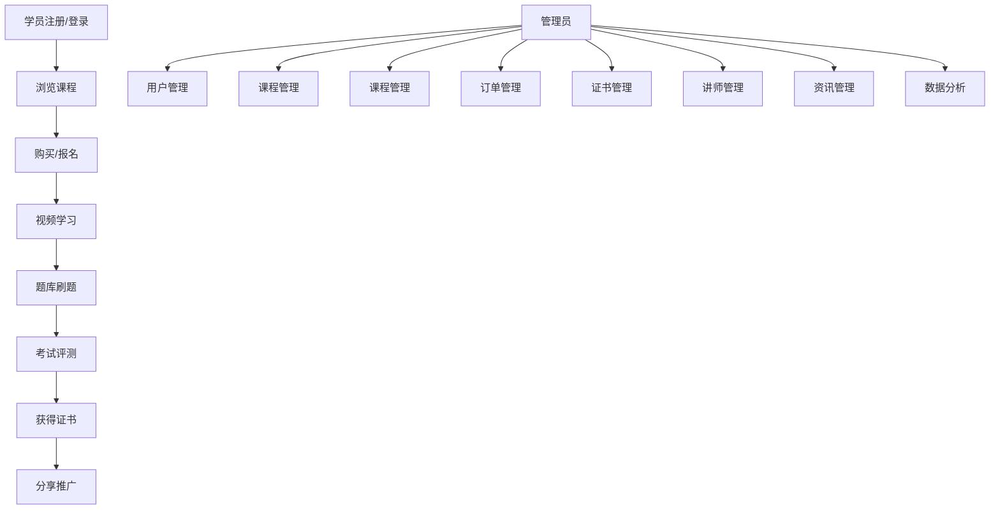

# 叁竹培训系统 - 需求规格说明书

**文档版本**: V3.2  
**编写日期**: 2026年5月31日  
**适用范围**: 叁竹养老培训管理平台  
**文档状态**: 正式版

---

## 目录

1. [产品说明](#1-产品说明)
2. [产品目标](#2-产品目标)
3. [系统用户](#3-系统用户)
4. [功能权限](#4-功能权限)
5. [用户痛点](#5-用户痛点)
6. [用户故事](#6-用户故事)
7. [产品效益](#7-产品效益)
8. [产品路线](#8-产品路线)
9. [技术路线](#9-技术路线)
10. [功能模块](#10-功能模块)
11. [业务流程](#11-业务流程)
12. [界面风格](#12-界面风格)
13. [部署结构和方式](#13-部署结构和方式)
14. [技术难点](#14-技术难点)
15. [非功能性需求](#15-非功能性需求)
16. [实施步骤和注意事项](#16-实施步骤和注意事项)
17. [附录](#附录)

---

## 1. 产品说明

### 1.1 产品概述

**叁竹培训系统**是一款面向养老行业从业人员的在线培训管理平台，旨在为养老机构、从业人员和管理部门提供一站式的培训、考证、学时管理服务。

### 1.2 产品定位

- **目标市场**: 养老行业培训机构、养老服务机构、从业人员
- **产品类型**: SaaS在线教育平台
- **核心价值**: 专业、便捷、高效的养老行业培训解决方案

### 1.3 产品口号

> 专业养老培训，助力人才成长

### 1.4 项目背景

叁竹培训是一个专注于**养老行业职业培训与技能认证**的在线教育平台。平台提供养老护理员、老年人能力评估师、健康照护师、营养配餐员等专业方向的在线课程、题库练习、证书认证等一站式培训服务。

### 1.5 系统架构

系统采用多端架构设计，包含以下四个主要端：

| 端名称 | 面向用户 | 主要功能 |
| :--- | :--- | :--- |
| **数据驾驶舱** | 高级管理人员 | 数据可视化、运营分析、决策支持 |
| **学员电脑网站端** | 学员（PC访问） | 课程浏览、搜索、购买、学习 |
| **学员小程序端** | 学员（移动端） | 视频学习、题库练习、证书查询 |
| **后台管理系统端** | 管理员 | 学员管理、课程管理、订单管理、系统设置 |

### 1.6 核心业务闭环



---

## 2. 产品目标

### 2.1 业务目标

| 序号 | 目标 | 说明 |
| :--- | :--- | :--- |
| 1 | 提升培训效率 | 通过在线平台，降低培训成本，提高学习效率 |
| 2 | 规范证书管理 | 实现证书申请、审核、发放全流程数字化 |
| 3 | 数据驱动决策 | 提供全面的运营数据分析，支持业务决策 |
| 4 | 扩大市场覆盖 | 通过线上平台，突破地域限制，服务更多学员 |

### 2.2 量化指标

| 指标 | 目标值 |
| :--- | :--- |
| 平台注册学员数 | 50,00+ |
| 课程完课率 | ≥75% |
| 证书通过率 | ≥90% |
| 系统响应时间 | ≤200ms |
| 系统可用性 | ≥99.9% |

---

## 3. 系统用户

### 3.1 用户角色定义

| 角色 | 描述 | 数量预估 |
| :--- | :--- | :--- |
| **超级管理员** | 系统最高权限，可管理所有模块 | 1-2人 |
| **运营数据员** | 负责课程、学员、订单等运营工作 | 5-10人 |
| **讲师** | 负责课程内容更新和学员答疑 | 50-150人 |
| **学员（会员）** | 付费学习的养老行业从业人员 | 5,000+ |
| **访客** | 未注册用户，可浏览课程信息 | 不限 |

### 3.2 用户画像

#### 超级管理员
- **年龄**: 25-45岁
- **职业**: 机构业务负责人
- **需求**: 全局数据监控、系统配置管理、权限分配

#### 运营数据员
- **年龄**: 25-35岁
- **职业**: 运营专员/数据分析师
- **需求**: 日常运营管理、数据统计分析、问题处理

#### 讲师
- **年龄**: 35-55岁
- **职业**: 养老行业专家/培训师
- **需求**: 课程内容管理、学员互动答疑

#### 学员（会员）
- **年龄**: 25-55岁
- **职业**: 养老护理员/健康照护师/营养师
- **需求**: 在线学习、证书考试、职业提升

---

## 4. 功能权限

### 4.1 权限矩阵

| 功能模块 | 超级管理员 | 运营数据员 | 讲师 | 学员 |
| :--- | :---: | :---: | :---: | :---: |
| 工作台/数据驾驶舱 | ✓ | ✓ | ✗ | ✗ |
| 学员管理 | ✓ | ✓ | ✗ | ✗ |
| 学习记录 | ✓ | ✓ | ✗ | ✓ |
| 课程管理 | ✓ | ✓ | ✓ | ✗ |
| 题库管理 | ✓ | ✓ | ✓ | ✗ |
| 课程分类 | ✓ | ✗ | ✗ | ✗ |
| 课程分享 | ✓ | ✓ | ✓ | ✗ |
| 试卷管理 | ✓ | ✓ | ✗ | ✗ |
| 模拟考试 | ✓ | ✓ | ✗ | ✗ |
| 练习管理 | ✓ | ✓ | ✓ | ✗ |
| 订单管理 | ✓ | ✓ | ✗ | ✓ |
| 退款管理 | ✓ | ✗ | ✗ | ✓ |
| 发票管理 | ✓ | ✓ | ✗ | ✓ |
| 讲师管理 | ✓ | ✗ | ✗ | ✗ |
| 证书管理 | ✓ | ✓ | ✗ | ✗ |
| 证书查询 | ✓ | ✓ | ✗ | ✓ |
| 资讯管理 | ✓ | ✓ | ✗ | ✓ |
| 资讯分类 | ✓ | ✗ | ✗ | ✗ |
| Banner管理 | ✓ | ✓ | ✗ | ✗ |
| 用户管理 | ✓ | ✗ | ✗ | ✗ |
| 部门管理 | ✓ | ✗ | ✗ | ✗ |
| 子机构管理 | ✓ | ✗ | ✗ | ✗ |
| 角色权限 | ✓ | ✗ | ✗ | ✗ |
| 消息管理 | ✓ | ✓ | ✓ | ✓ |
| 基础设置 | ✓ | ✗ | ✗ | ✗ |
| 支付配置 | ✓ | ✗ | ✗ | ✗ |
| 短信配置 | ✓ | ✗ | ✗ | ✗ |

### 4.2 详细权限说明

#### 超级管理员
- 拥有系统全部权限
- 可进行系统配置、权限管理、数据管理等所有操作
- 可管理用户、部门、子机构等系统设置

#### 运营数据员
- 可查看工作台和数据驾驶舱
- 学员中心：学员管理（查看/编辑）、学习记录（查看）
- 课程中心：课程管理（查看）、题库管理（CRUD）、课程分享（查看/新增/删除）、试卷管理（CRUD）、模拟考试（CRUD）
- 订单中心：订单管理（查看）、发票管理（查看/审核/开具）
- 证书中心：证书查询（查看/审核）
- 内容中心：资讯管理（查看）、资讯分类（查看）、Banner管理（查看/新增/编辑/删除）
- 消息中心：消息管理（查看）
- 不可进行用户管理、角色权限、部门管理、子机构管理、基础设置、支付配置、短信配置

#### 讲师
- 课程中心：课程管理（查看）、题库管理（CRUD）、课程分享（查看/新增/删除）、练习管理（查看/编辑）
- 不可进行系统级配置操作

#### 学员
- 可浏览课程、购买课程、在线学习
- 可查看学习记录、证书信息
- 可申请发票、发起退款
- 可进行题库练习、错题复习

### 4.3 RBAC 权限模型

后台管理系统采用基于角色的访问控制（RBAC），预置两种角色：
- **超级管理员**：全部模块的全部操作权限
- **运营数据员**：学员管理（查看+编辑）、学习记录（查看）、课程管理（仅查看）、题库管理（CRUD）、课程分享（查看/新增/删除）、试卷管理（CRUD）、模拟考试（CRUD）、订单管理（仅查看）、发票管理（查看/审核/开具）、证书查询（查看/审核）、资讯管理（仅查看）、Banner管理（查看/新增/编辑/删除），**无系统设置权限**

### 4.4 登录方式

- **手机号/用户名 + 密码** 登录（所有端通用）
- **微信授权登录**（移动端、网站端）
- **记住登录状态**（网站端 7 天免登录、移动端记住登录状态）

---

## 5. 用户痛点

### 5.1 学员痛点

| 序号 | 痛点描述 | 影响 |
| :--- | :--- | :--- |
| 1 | 线下培训时间成本高，难以平衡工作与学习 | 学习意愿降低，证书获取周期长 |
| 2 | 学习进度难以追踪，缺乏学习规划 | 学习效率低，完课率不高 |
| 3 | 证书查询不便，真伪验证困难 | 证书可信度受影响 |
| 4 | 练习题目有限，缺乏针对性训练 | 考试通过率不稳定 |
| 5 | 学习内容枯燥，缺乏互动性 | 学习体验差，容易放弃 |

### 5.2 管理员痛点

| 序号 | 痛点描述 | 影响 |
| :--- | :--- | :--- |
| 1 | 学员信息分散，管理效率低 | 运营成本高，易出错 |
| 2 | 缺乏数据可视化，决策缺乏依据 | 业务发展盲目，难以优化 |
| 3 | 证书审核流程繁琐，耗时较长 | 学员满意度下降 |
| 4 | 退款、发票处理流程不清晰 | 财务纠纷增多 |
| 5 | 系统权限管理复杂，安全风险高 | 数据泄露风险 |

---

## 6. 用户故事

### 6.1 学员视角

| 序号 | 用户故事 | 场景说明 |
| :--- | :--- | :--- |
| 1 | **作为**一名养老护理员，**我希望**能够在线学习课程，**以便**灵活安排学习时间 | 工作之余碎片化学习 |
| 2 | **作为**一名学员，**我希望**能查看学习进度，**以便**了解自己的学习情况 | 掌握学习节奏 |
| 3 | **作为**一名学员，**我希望**能进行题库练习，**以便**提高考试通过率 | 针对性复习 |
| 4 | **作为**一名学员，**我希望**能查询证书状态，**以便**及时获取证书 | 职业发展需求 |
| 5 | **作为**一名学员，**我希望**能调整视频播放速度，**以便**适应自己的学习节奏 | 个性化学习体验 |

### 6.2 管理员视角

| 序号 | 用户故事 | 场景说明 |
| :--- | :--- | :--- |
| 1 | **作为**超级管理员，**我希望**能查看实时数据看板，**以便**掌握平台运营状况 | 日常管理决策 |
| 2 | **作为**运营数据员，**我希望**能快速审核证书申请，**以便**提高服务效率 | 证书查询流程 |
| 3 | **作为**管理员，**我希望**能批量处理订单，**以便**提高工作效率 | 订单管理 |
| 4 | **作为**管理员，**我希望**能设置角色权限，**以便**保障系统安全 | 权限管理 |
| 5 | **作为**管理员，**我希望**能接收系统消息提醒，**以便**及时处理待办事项 | 工作提醒 |

### 6.3 讲师视角

| 序号 | 用户故事 | 场景说明 |
| :--- | :--- | :--- |
| 1 | **作为**讲师，**我希望**能管理课程内容，**以便**更新教学资料 | 课程维护 |
| 2 | **作为**讲师，**我希望**能查看学员学习情况，**以便**提供针对性指导 | 教学反馈 |
| 3 | **作为**讲师，**我希望**能维护题库，**以便**丰富练习内容 | 题库管理 |

---

## 7. 产品效益

### 7.1 社会效益

| 方面 | 效益描述 |
| :--- | :--- |
| **人才培养** | 提升养老行业从业人员专业素质，促进养老服务质量提升 |
| **行业规范** | 标准化培训内容，推动行业规范化发展 |
| **就业促进** | 通过认证体系，提高从业人员就业竞争力 |

### 7.2 经济效益

| 方面 | 效益描述 |
| :--- | :--- |
| **成本降低** | 线上培训减少场地、人力成本，提高培训效率 |
| **收入增长** | 通过课程销售、证书服务实现盈利 |
| **规模化发展** | 突破地域限制，服务更多客户 |

### 7.3 管理效益

| 方面 | 效益描述 |
| :--- | :--- |
| **效率提升** | 自动化流程减少人工操作，提高管理效率 |
| **数据驱动** | 全面数据分析支持科学决策 |
| **风险控制** | 完善的权限管理和审计机制保障数据安全 |

---

## 8. 产品路线

### 8.1 阶段规划

| 阶段 | 时间 | 目标 | 关键功能 |
| :--- | :--- | :--- | :--- |
| **Phase 1** | 2026年06 | 基础功能上线 | 课程管理、学员管理、订单管理、在线学习 |
| **Phase 2** | 2026年07 | 核心功能完善 | 题库系统、证书管理、数据驾驶舱 |
| **Phase 3** | 2026年08 | 用户体验优化 | 个性化推荐、学习社区、移动适配 |
| **Phase 4** | 2027年09 | 高级功能扩展 | AI智能学习助手、企业版功能 |

### 8.2 功能优先级

| 优先级 | 功能模块 | 说明 |
| :--- | :--- | :--- |
| P0 | 课程学习 | 核心功能，必须优先完成 |
| P0 | 订单管理 | 交易核心，保障业务运转 |
| P0 | 证书管理 | 核心业务流程 |
| P0 | 题库系统 | 提升学习效果 |
| P0 | 数据驾驶舱 | 支持管理决策 |
| P0 | 消息中心 | 提升用户体验 |
| P0 | 发票管理 | 完善财务流程 |
| P0 | 角色权限 | 系统安全保障 |

---

## 9. 技术路线

### 9.1 技术架构

```
┌─────────────────────────────────────────────────────────────────┐
│                      前端展示层                                │
│  ┌─────────────┐ ┌─────────────┐ ┌─────────────┐ ┌──────────┐ │
│  │ 数据驾驶舱   │ │ 网站端      │ │ 小程序端    │ │ 管理后台 │ │
│  └─────────────┘ └─────────────┘ └─────────────┘ └──────────┘ │
└───────────────────┬───────────────┬───────────────┬────────────┘
                    │               │               │
┌───────────────────▼───────────────▼───────────────▼────────────┐
│                      API网关层                                 │
│           统一认证、限流、日志、监控                            │
└────────────────────────────────────┬───────────────────────────┘
                                    │
┌────────────────────────────────────▼───────────────────────────┐
│                      业务逻辑层                                 │
│  ┌─────────┐ ┌─────────┐ ┌─────────┐ ┌─────────┐ ┌─────────┐ │
│  │课程服务 │ │用户服务 │ │订单服务 │ │题库服务 │ │证书服务 │ │
│  └─────────┘ └─────────┘ └─────────┘ └─────────┘ └─────────┘ │
└────────────────────────────────────┬───────────────────────────┘
                                    │
┌────────────────────────────────────▼───────────────────────────┐
│                      数据持久层                                 │
│           MySQL + Redis + MongoDB + 文件存储                   │
└─────────────────────────────────────────────────────────────────┘
```

### 9.2 技术栈选择

| 分类 | 技术 | 版本 | 说明 |
| :--- | :--- | :--- | :--- |
| **前端框架** | Vue.js | 3.x | 主应用框架 |
| **UI组件** | Element Plus | 2.x | 后台管理界面 |
| **小程序** | UniApp | 最新版 | 跨端小程序开发 |
| **图表库** | ECharts | 5.x | 数据可视化 |
| **后端框架** | Spring Boot | 3.x | Java后端服务 |
| **数据库** | MySQL | 8.x | 关系型数据库 |
| **缓存** | Redis | 7.x | 缓存和会话管理 |
| **消息队列** | RabbitMQ | 3.x | 异步任务处理 |
| **文件存储** | MinIO | 最新版 | 对象存储 |

### 9.3 关键技术特性

| 特性 | 实现方案 |
| :--- | :--- |
| **学时记录** | 服务端定时记录学习时长，防止作弊 |
| **断点续学** | 记录播放位置，下次继续播放 |
| **数据可视化** | ECharts图表组件，支持多维度分析 |
| **权限管理** | RBAC角色权限模型，细粒度控制 |

---

## 10. 功能模块

本章节详细描述系统四大端（数据驾驶舱、学员网站端、学员小程序端、后台管理系统端）的功能模块，按照「端 → 模块 → 菜单/子页面 → 功能点」四级结构组织，每个功能点包含页面元素、字段详情、交互说明和业务规则。

---

### 10.1 数据驾驶舱

**模块概述**: 面向高级管理人员的数据可视化分析平台，提供平台运营全维度数据监控与决策支持。

**优先级**: P1

**实现页面**: `datacockpit/cockpits.html`

**页面定位**: 数据驾驶舱首页，是平台的核心数据展示中心，以"一站式培训管理 | 数据驱动决策 | 智慧赋能教育"为核心理念，为管理人员提供直观、全面的运营数据概览。页面采用现代化的卡片式布局，通过图表、地图、动态列表等多种可视化方式呈现核心业务数据，支持点击查看详情和快速跳转其他平台。

---

#### 10.1.1 页面布局结构

页面整体采用顶部导航区 + KPI指标区 + 核心内容区 + 底部信息区的四层结构：

```
┌──────────────────────────────────────────────────────────────┐
│                        顶部导航区                              │
│  标题 | 副标题 | 平台入口按钮组 | 日期徽章                      │
├──────────────────────────────────────────────────────────────┤
│                      KPI指标卡片区 (9个)                       │
│  [机构人数] [子机构] [学员总数] [讲师数] [课程数] [题库量]      │
│  [通过率] [订单总数] [订单金额]                                 │
├────────────────┬─────────────────────────┬────────────────────┤
│    左侧区域     │       中央区域          │      右侧区域       │
│  ·人员分布图    │  ·分支机构分布地图      │  ·学员趋势图       │
│  ·课程分布图    │  ·学员报名动态列表     │  ·通过率趋势图     │
│  ·热销课程Top5  │                       │  ·证书数据统计     │
├────────────────┴─────────────────────────┴────────────────────┤
│                       底部区域                                 │
│           [订单趋势图 + 订单动态]  |  [最新资讯列表]           │
├──────────────────────────────────────────────────────────────┤
│                        页脚                                   │
│              数据更新时间 | 版权信息                            │
└──────────────────────────────────────────────────────────────┘
```

---

#### 10.1.2 页面元素详细描述

##### 10.1.2.1 顶部导航区

| 元素编号 | 元素名称 | 类型 | 描述 | 优先级 |
|----------|----------|------|------|--------|
| DC-01 | 页面标题 | 文本展示 | "叁竹培训管理驾驶舱"，渐变色效果，附带毕业帽图标 | P0 |
| DC-02 | 页面副标题 | 文本展示 | "一站式培训管理 | 数据驱动决策 | 智慧赋能教育" | P0 |
| DC-03 | 平台入口按钮组 | 按钮组 | 三个平台入口：学员网站端、学员移动端、后台管理端，支持悬浮动效 | P0 |
| DC-04 | 日期徽章 | 信息展示 | 绿色主题徽章，显示当前日期（格式：YYYY年MM月DD日），实时更新 | P0 |

**交互说明**:
- 平台入口按钮悬浮时背景变色、文字变白、上移缩放动效
- 点击按钮跳转到对应平台登录页面
- 日期实时更新，精确到秒

---

##### 10.1.2.2 KPI指标卡片区

| 元素编号 | 元素名称 | 类型 | 描述 | 优先级 |
|----------|----------|------|------|--------|
| DC-05 | 机构人数卡片 | 数字卡片 | 显示机构总人数，顶部绿色渐变条，图标：fa-users | P0 |
| DC-06 | 子机构个数卡片 | 数字卡片 | 显示子机构数量，图标：fa-building | P0 |
| DC-07 | 学员总数卡片 | 数字卡片 | 显示平台注册学员总数，千位分隔符格式化，图标：fa-graduation-cap | P0 |
| DC-08 | 讲师数量卡片 | 数字卡片 | 显示平台讲师总数，图标：fa-chalkboard-teacher | P0 |
| DC-09 | 课程总数卡片 | 数字卡片 | 显示课程总门数，图标：fa-book-open | P0 |
| DC-10 | 题库总量卡片 | 数字卡片 | 显示题目总数量，图标：fa-file-question | P0 |
| DC-11 | 考试通过率卡片 | 数字卡片 | 显示考试通过率百分比，附带环比增长标识，图标：fa-check-circle | P0 |
| DC-12 | 订单总数卡片 | 数字卡片 | 显示订单总笔数，图标：fa-shopping-cart | P0 |
| DC-13 | 订单金额卡片 | 数字卡片 | 显示订单总金额（万元），附带同比增长标识，图标：fa-yen-sign | P0 |

**字段详情**:

| 字段名 | 字段类型 | 数据格式 | 示例值 | 说明 |
|--------|----------|----------|--------|------|
| institution_count | int | 数字 | 286 | 机构总人数 |
| branch_count | int | 数字 | 12 | 子机构个数 |
| student_count | int | 千位分隔 | 5,236 | 学员总数 |
| teacher_count | int | 数字 | 156 | 讲师数量 |
| course_count | int | 数字 | 288 | 课程总数 |
| question_count | int | 数字 | 12,580 | 题库总量 |
| pass_rate | decimal | 百分比 | 92.5% | 考试通过率 |
| order_count | int | 数字 | 3,856 | 订单总数 |
| order_amount | decimal | 万元 | ¥285.6万 | 订单金额 |

**交互说明**:
- 卡片悬浮时上移、缩放、阴影加深动效
- 数字首次加载时有从0递增的动画效果
- 点击任意KPI卡片可打开详情弹窗
- 带增长标识的卡片显示正增长绿色徽章（如"↑ 3.2%"）

**业务规则**:
- 数据按角色权限过滤，机构管理员仅见本机构数据
- 数字格式化：千位以上使用逗号分隔
- 通过率和金额卡片显示环比增长百分比

---

##### 10.1.2.3 中央区域 - 分支机构分布地图

| 元素编号 | 元素名称 | 类型 | 描述 | 优先级 |
|----------|----------|------|------|--------|
| DC-14 | 中国地图容器 | 地图组件 | ECharts geo地图，填充全国省份，支持缩放 | P0 |
| DC-15 | 分支机构标记 | 散点图 | 在地图上标记12个分校位置，标记大小按学员数量缩放 | P0 |
| DC-16 | 总部标记 | 特殊标记 | 红色标记，标识湖南长沙总部位置 | P0 |
| DC-17 | 地图悬停提示 | 气泡提示 | 显示机构名称、省份、城市、学员数 | P0 |
| DC-18 | 地图标签 | 文字标签 | 悬浮时显示机构名称 | P1 |

**交互说明**:
- 支持鼠标滚轮缩放地图
- 鼠标悬浮在标记点上显示详情气泡
- 点击总部标记显示"湖南长沙总部"标签
- 分支机构标记大小根据学员数量动态计算

**业务规则**:
- 地图默认展示全国视图
- 分支机构包括：北京、上海、广州、深圳、成都、武汉、杭州、南京、重庆、济南、西安、厦门共12个分校
- 总部位于湖南长沙，与分校用不同颜色区分

---

##### 10.1.2.4 中央区域 - 学员报名动态

| 元素编号 | 元素名称 | 类型 | 描述 | 优先级 |
|----------|----------|------|------|--------|
| DC-19 | 动态列表标题 | 标题栏 | "学员报名动态"，附带用户图标 | P0 |
| DC-20 | 动态滚动容器 | 滚动区域 | 自动向上滚动，循环播放学员报名信息 | P0 |
| DC-21 | 动态列表项 | 列表项 | 显示学员姓名、省份、城市、课程、学习进度、时间 | P0 |
| DC-22 | 进度条 | 迷你进度条 | 显示学习进度百分比 | P0 |

**字段详情**:

| 字段名 | 字段类型 | 数据格式 | 示例值 | 说明 |
|--------|----------|----------|--------|------|
| student_name | varchar | 文本 | 张小明 | 学员姓名 |
| province | varchar | 文本 | 北京市 | 所属省份 |
| city | varchar | 文本 | 朝阳 | 所属城市 |
| course_name | varchar | 文本 | 养老护理员 | 报读课程 |
| progress | int | 百分比 | 65% | 学习进度 |
| enroll_time | datetime | 时间戳 | 2026-05-29 14:30 | 报名时间 |

**交互说明**:
- 列表自动向上滚动，30秒循环一次
- 鼠标悬浮暂停滚动
- 点击列表项可跳转至学员详情页

**业务规则**:
- 仅显示最近报名的学员动态
- 滚动内容循环播放，无缝衔接
- 进度条绿色渐变显示

---

##### 10.1.2.5 左侧区域 - 数据图表

| 元素编号 | 元素名称 | 类型 | 描述 | 优先级 |
|----------|----------|------|------|--------|
| DC-23 | 机构人员分布图 | 环形饼图 | ECharts饼图，展示讲师/管理员/客服/运营/其他人员比例 | P0 |
| DC-24 | 课程分布图 | 柱状图 | ECharts柱状图，展示各工种课程数量 | P0 |
| DC-25 | 热销课程Top5 | 排行榜 | 显示销量前5课程，含排名、名称、购买人数、收入金额 | P0 |

**图表配置详情**:

机构人员分布图（DC-23）：
```javascript
{
    type: 'pie',
    radius: ['45%', '75%'],
    center: ['40%', '50%'],
    data: [
        { value: 156, name: '讲师' },
        { value: 68, name: '管理员' },
        { value: 32, name: '客服' },
        { value: 22, name: '运营' },
        { value: 8, name: '其他' }
    ]
}
```

课程分布图（DC-24）：
```javascript
{
    type: 'bar',
    data: [
        { name: '养老护理员', value: 98 },
        { name: '评估师', value: 65 },
        { name: '照护师', value: 58 },
        { name: '配餐员', value: 42 },
        { name: '其他', value: 25 }
    ]
}
```

**交互说明**:
- 饼图悬浮高亮显示对应扇区
- 柱状图悬浮显示具体数值
- 热销课程前三名使用金色排名标识
- Top5排行榜悬浮整行高亮

---

##### 10.1.2.6 右侧区域 - 趋势图表

| 元素编号 | 元素名称 | 类型 | 描述 | 优先级 |
|----------|----------|------|------|--------|
| DC-26 | 学员数量趋势图 | 面积折线图 | 近6个月新增学员趋势，支持渐变填充 | P0 |
| DC-27 | 通过率趋势图 | 面积折线图 | 近6个月考试通过率趋势，Y轴范围70%-100% | P0 |
| DC-28 | 证书数据统计 | 统计卡片组 | 显示已颁发证书数、本月新增、证书有效率 | P0 |
| DC-29 | 证书类型明细 | 列表组件 | 各工种证书发放数量统计 | P1 |

**图表配置详情**:

学员数量趋势图（DC-26）：
```javascript
{
    type: 'line',
    smooth: true,
    data: [680, 520, 750, 890, 980, 1150],  // 1-6月新增学员
    xAxis: ['1月', '2月', '3月', '4月', '5月', '6月']
}
```

通过率趋势图（DC-27）：
```javascript
{
    type: 'line',
    smooth: true,
    yAxis: { min: 70, max: 100 },
    data: [85.2, 86.8, 88.5, 90.1, 91.8, 92.5],  // 百分比
    label: { show: true, formatter: '{c}%' }
}
```

**交互说明**:
- 折线图悬浮显示具体数值
- 数据点带圆点标记
- 面积图支持渐变填充效果
- 图表支持响应式缩放

---

##### 10.1.2.7 底部区域 - 订单与资讯

| 元素编号 | 元素名称 | 类型 | 描述 | 优先级 |
|----------|----------|------|------|--------|
| DC-30 | 订单趋势图 | 双折线图 | 同时展示订单数量和金额趋势 | P0 |
| DC-31 | 订单动态列表 | 滚动列表 | 实时显示最新订单，含订单号、课程、用户、金额、状态 | P0 |
| DC-32 | 最新资讯列表 | 列表组件 | 显示最新行业资讯、备考指南、平台公告等 | P0 |
| DC-33 | 资讯标签 | 标签组件 | 政策解读(蓝色)、备考指南(黄色)、平台公告(绿色)、行业动态(粉色)、功能更新(紫色) | P1 |

**订单状态说明**:

| 状态值 | 状态名称 | 标签颜色 | 说明 |
|--------|----------|----------|------|
| paid | 已支付 | 绿色 | 订单已完成支付 |
| pending | 待支付 | 黄色 | 等待用户支付 |
| refund | 已退款 | 红色 | 订单已退款 |

**交互说明**:
- 订单列表自动向上滚动，25秒循环一次
- 鼠标悬浮暂停滚动
- 资讯列表点击跳转至资讯详情页
- 不同类型资讯显示对应颜色标签

---

##### 10.1.2.8 详情弹窗

| 元素编号 | 元素名称 | 类型 | 描述 | 优先级 |
|----------|----------|------|------|--------|
| DC-34 | 弹窗容器 | 模态框 | 毛玻璃背景遮罩，白色圆角卡片，最大宽度800px | P0 |
| DC-35 | 弹窗头部 | 标题栏 | 渐变绿色背景，白色标题文字，关闭按钮 | P0 |
| DC-36 | 汇总数据区 | 统计卡片组 | 顶部展示核心汇总数据 | P0 |
| DC-37 | 详情图表 | ECharts图表 | 弹窗内嵌图表，展示详细数据 | P0 |
| DC-38 | 详情表格 | 数据表格 | 展示详细数据列表，支持排序 | P0 |
| DC-39 | 关闭按钮 | 按钮 | 右上角×按钮，点击关闭弹窗 | P0 |

**弹窗类型说明**:

| 弹窗标题 | 汇总指标 | 图表类型 | 数据维度 |
|----------|----------|----------|----------|
| 机构人数详情 | 总人数/讲师/管理员/其他 | 柱状图 | 部门分布 |
| 子机构个数详情 | 子机构数/总学员/平均学员 | 柱状图 | 各分校学员分布 |
| 学员总数详情 | 总学员/已购课/在读 | 折线图 | 月度新增趋势 |
| 讲师数量详情 | 讲师总数 | 柱状图 | 工种分布 |
| 课程总数详情 | 课程总数/各工种课程数 | 饼图 | 课程类型分布 |
| 题库总量详情 | 题库总量/各工种题数 | 饼图 | 题型分布 |
| 考试通过率详情 | 通过率/环比增长/累计通过 | 柱状图 | 工种对比 |
| 订单总数详情 | 总订单/已支付/待支付 | 折线图 | 月度订单趋势 |
| 订单金额详情 | 总金额/本月/同比增长 | 饼图 | 课程类型占比 |

**交互说明**:
- 点击KPI卡片打开对应详情弹窗
- 弹窗背景点击可关闭
- 弹窗内图表自动适配容器宽度
- ESC键可关闭弹窗

---

#### 10.1.3 交互说明

##### 10.1.3.1 数据筛选与时间范围

| 交互功能 | 描述 | 实现方式 |
|----------|------|----------|
| 日期显示 | 页面顶部显示当前日期，精确到秒 | JavaScript实时更新 |
| 数据刷新 | 数据更新时间显示在页脚 | 每秒更新时间戳 |
| 图表缩放 | 地图支持鼠标滚轮缩放 | ECharts roam配置 |

##### 10.1.3.2 图表交互

| 交互类型 | 描述 | 响应效果 |
|----------|------|----------|
| 悬浮高亮 | 图表元素悬浮时高亮显示 | 扇区放大、数值气泡显示 |
| 点击下钻 | KPI卡片点击打开详情弹窗 | 弹窗显示完整数据和图表 |
| 缩放响应 | 窗口大小变化时图表自适应 | ECharts resize事件 |
| 暂停滚动 | 鼠标进入滚动区域暂停自动滚动 | CSS animation暂停 |

##### 10.1.3.3 平台跳转

| 跳转目标 | 按钮位置 | 跳转方式 |
|----------|----------|----------|
| 学员网站端 | 顶部导航右侧 | 新窗口打开 `/website/eldercare/login.html` |
| 学员移动端 | 顶部导航右侧 | 新窗口打开 `/mobile/eldercare/login.html` |
| 后台管理端 | 顶部导航右侧 | 新窗口打开 `/backhand/eldercare/login.html` |

---

#### 10.1.4 业务规则

##### 10.1.4.1 数据权限控制

| 角色 | 数据范围 | 说明 |
|------|----------|------|
| 超级管理员 | 全平台数据 | 可查看所有机构和分校数据 |
| 机构管理员 | 本机构数据 | 仅可查看所属机构数据 |
| 运营数据员 | 机构数据 | 视配置显示本机构或全部数据 |

##### 10.1.4.2 数据更新频率

| 数据类型 | 更新频率 | 说明 |
|----------|----------|------|
| KPI指标 | 实时 | 每秒更新时间显示 |
| 图表数据 | 静态 | 展示当月/年度汇总数据 |
| 动态列表 | 实时 | 滚动展示最新报名记录 |
| 地图标记 | 静态 | 分支机构位置固定 |

##### 10.1.4.3 数据缓存策略

| 缓存策略 | 缓存时长 | 适用数据 |
|----------|----------|----------|
| 页面缓存 | 5分钟 | KPI汇总数据、图表数据 |
| 实时更新 | 每秒 | 日期时间显示 |
| 本地缓存 | 30秒 | 滚动列表数据 |

##### 10.1.4.4 响应式适配规则

| 屏幕宽度 | 布局调整 |
|----------|----------|
| ≤480px | KPI卡片2列，底部单列 |
| ≤768px | KPI卡片3列，侧边栏垂直排列 |
| ≤1000px | 中间区域单列，侧边栏水平排列 |
| ≤1200px | 地图核心区域2列，隐藏右侧部分 |
| ≤1400px | KPI卡片5列 |
| >1400px | KPI卡片6列，三列完整布局 |

---

#### 10.1.5 技术实现

##### 10.1.5.1 前端技术栈

| 技术 | 版本 | 用途 |
|------|------|------|
| HTML5 | - | 页面结构 |
| CSS3 | - | 样式与动画 |
| ECharts | 5.5.0 | 数据可视化图表 |
| Font Awesome | 6.0.0 | 图标库 |
| JavaScript | ES6+ | 交互逻辑 |

##### 10.1.5.2 性能优化

- 图表懒加载：首次进入可视区域再渲染
- 数字动画：KPI数字递增动画，提升视觉效果
- CSS动画：使用transform和opacity实现流畅动效
- 响应式设计：媒体查询适配多端屏幕

---

#### 10.1.6 页面元素汇总表

| 区域 | 元素数量 | 核心元素 |
|------|----------|----------|
| 顶部导航区 | 4个 | 标题、副标题、平台入口、日期 |
| KPI卡片区 | 9个 | 机构人数、子机构、学员、讲师、课程、题库、通过率、订单、金额 |
| 左侧区域 | 3个 | 人员分布图、课程分布图、热销课程Top5 |
| 中央区域 | 2个 | 中国地图、学员报名动态 |
| 右侧区域 | 3个 | 学员趋势图、通过率趋势图、证书统计 |
| 底部区域 | 2个 | 订单趋势+动态、最新资讯 |
| 详情弹窗 | 1套 | 9种类型详情弹窗组件 |
| **合计** | **24个** | - |

---

### 10.2 学员网站端

**模块概述**: 面向所有用户（含访客）的PC端展示与报名转化平台，核心目标是品牌展示与课程销售转化。

**优先级**: P0

---

#### 10.2.1 模块一：首页模块

##### 10.2.1.1 官网首页（index.html）

**页面定位**: 平台对外展示门户，面向所有用户，核心目标是品牌展示与课程转化。页面采用固定导航栏、左侧分类、主体内容、右侧推荐的三栏布局。

**页面元素**:

| 元素编号 | 元素名称 | 类型 | 描述 | 优先级 |
|----------|----------|------|------|--------|
| W-H01 | 导航栏 | 导航组件 | Logo、首页、课程中心、学习中心、资讯、登录/注册按钮或用户头像下拉菜单 | P0 |
| W-H02 | 课程分类触发器 | 按钮 | 点击展开课程分类下拉菜单，包含养老护理员、长期照护师等分类 | P0 |
| W-H03 | 搜索框 | 搜索功能组件 | 分类下拉框+关键词输入框+搜索按钮，支持按课程名称/讲师搜索 | P0 |
| W-H04 | 用户头像 | 头像组件 | 登录后显示用户头像，悬停展开下拉菜单（个人中心、我的学习、退出登录） | P0 |
| W-H05 | Banner轮播 | 图片轮播组件 | 5张宣传图自动轮播5秒切换，支持左右箭头和底部圆点手动切换 | P0 |
| W-H06 | 左侧分类导航 | 分类树形组件 | 培训分类菜单，支持展开子分类链接 | P0 |
| W-H07 | 直播课程区域 | 卡片横向滚动 | 展示直播课程列表，含封面图、直播状态（直播中/预告）、讲师头像、观看人数、课程标题 | P0 |
| W-H08 | 热门课程区域 | 4列课程卡片网格 | 展示4门热门课程，含封面图、课程名、学习人数、评分、价格 | P0 |
| W-H09 | 最新课程区域 | 4列课程卡片网格 | 展示4门最新课程，含封面图、课程名、学习人数、评分、价格 | P0 |
| W-H10 | 课程卡片 | 卡片组件 | 课程封面图、标签（热门/新课/免费/补贴）、课程名、学习人数、评分、价格（划线价） | P0 |
| W-H11 | 右侧推荐课程 | 列表组件 | 3门推荐课程，含缩略图、课程名、价格 | P1 |
| W-H12 | 学习排行榜 | 排行榜组件 | TOP5热门课程排名，含序号、课程名、学习人数 | P1 |
| W-H13 | 限时优惠卡片 | 促销卡片 | 新用户首单立减、团购8折优惠信息 | P1 |
| W-H14 | 页脚 | 页脚组件 | 品牌信息、导航链接、联系方式、版权信息 | P0 |

**交互说明**:
- Banner鼠标悬停暂停自动轮播，点击圆点或箭头切换
- 左侧分类导航鼠标悬停展开子分类
- 课程卡片鼠标悬停上浮6px并显示绿色边框
- 课程卡片点击跳转至课程详情页
- 直播课程状态标签："正在直播"红色脉冲动画，"预告"显示具体时间
- 登录后右上角显示用户头像，点击展开下拉菜单

**业务规则**:
- 未登录用户显示"登录"和"注册"按钮
- 已登录用户显示用户头像下拉菜单
- 热门课程按销量和评分综合排序
- 学习人数显示实际数字，已购用户需学习后才能评价
- Banner仅展示已发布的上架内容

---

##### 10.2.1.2 登录页（login.html）

**页面定位**: 用户登录入口，提供手机号/用户名+密码登录和微信授权登录两种方式。页面采用左右分栏布局，左侧品牌展示，右侧登录表单。

**页面元素**:

| 元素编号 | 元素名称 | 类型 | 描述 | 优先级 |
|----------|----------|------|------|--------|
| W-L01 | 品牌Logo | Logo组件 | 左侧品牌标识和"叁竹培训"文字 | P0 |
| W-L02 | 品牌标题 | 标题文本 | "开启您的职业发展之旅" | P0 |
| W-L03 | 品牌描述 | 描述文本 | 平台价值主张文字说明 | P0 |
| W-L04 | 功能特性列表 | 列表组件 | 专业认证课程、高清视频教学、专业导师指导三个特性图标+文字 | P0 |
| W-L05 | 欢迎标题 | 标题文本 | "欢迎回来" | P0 |
| W-L06 | 登录表单 | 表单组件 | 手机号/用户名输入框、密码输入框 | P0 |
| W-L07 | 账号输入框 | 输入框 | 手机号或用户名输入，支持清空， placeholder："手机号码 / 用户名" | P0 |
| W-L08 | 密码输入框 | 输入框 | 密码输入，支持显示/隐藏切换，placeholder："请输入密码" | P0 |
| W-L09 | 记住登录复选框 | 复选框 | 记住登录状态选项 | P0 |
| W-L10 | 忘记密码链接 | 链接 | 跳转至密码找回页面 | P1 |
| W-L11 | 登录按钮 | 主按钮 | "登 录"按钮，渐变背景，带加载状态 | P0 |
| W-L12 | 隐私协议复选框 | 复选框 | 必填，已阅读并同意《服务协议》与《隐私政策》 | P0 |
| W-L13 | 分隔线 | 分隔组件 | "快捷登录"文字分隔 | P0 |
| W-L14 | 微信登录按钮 | 次按钮 | 微信图标+"微信授权登录"文字 | P0 |
| W-L15 | 注册链接 | 链接文本 | "还没有账户？立即注册" | P0 |
| W-L16 | 登录成功弹窗 | 模态框 | 显示成功图标和自动跳转倒计时 | P0 |

**字段详情**:

| 字段名 | 类型 | 说明 | 必填 | 验证规则 |
|--------|------|------|------|----------|
| username | 字符串 | 手机号或用户名 | 是 | 手机号：11位数字；用户名：2-20位字符 |
| password | 字符串 | 登录密码 | 是 | 6-20位字符 |
| rememberMe | 布尔 | 记住登录状态 | 否 | 默认false |
| agreePrivacy | 布尔 | 同意隐私协议 | 是 | 必须勾选 |

**交互说明**:
- 账号输入框获得焦点时左侧图标变绿色
- 密码输入框点击眼睛图标切换显示/隐藏
- 输入过程中实时清除错误状态
- 登录按钮点击显示加载动画，禁用重复点击
- 登录成功后弹出成功模态框，2秒后自动跳转首页
- 微信登录点击后弹出授权确认

**业务规则**:
- 已登录用户访问自动跳转至首页
- 密码连续错误5次需等待15分钟后重试
- 记住登录状态有效期7天
- 登录成功后更新sessionStorage状态

---

##### 10.2.1.3 注册页（register.html）

**页面定位**: 新用户注册入口，通过手机号验证码方式注册账号。页面采用左右分栏布局，左侧品牌展示，右侧注册表单。

**页面元素**:

| 元素编号 | 元素名称 | 类型 | 描述 | 优先级 |
|----------|----------|------|------|--------|
| W-R01 | 品牌Logo | Logo组件 | 左侧品牌标识和"叁竹培训"文字 | P0 |
| W-R02 | 品牌标题 | 标题文本 | "开启您的职业发展之旅" | P0 |
| W-R03 | 品牌描述 | 描述文本 | 平台价值主张文字说明 | P0 |
| W-R04 | 功能特性列表 | 列表组件 | 专业认证课程、高清视频教学、专业导师指导三个特性 | P0 |
| W-R05 | 注册标题 | 标题文本 | "创建账户" | P0 |
| W-R06 | 注册表单 | 表单组件 | 手机号、验证码、密码、确认密码表单 | P0 |
| W-R07 | 手机号输入框 | 输入框 | 手机号输入，placeholder："请输入手机号码"，最大11位 | P0 |
| W-R08 | 验证码输入框 | 输入框 | 6位数字验证码输入 | P0 |
| W-R09 | 获取验证码按钮 | 按钮 | 倒计时60秒显示，点击发送验证码 | P0 |
| W-R10 | 登录密码输入框 | 输入框 | 密码输入，支持显示/隐藏，placeholder："请设置登录密码（8-20位，包含字母和数字）" | P0 |
| W-R11 | 密码强度指示器 | 进度条组件 | 4段式密码强度显示（弱/中等/强/非常强） | P0 |
| W-R12 | 确认密码输入框 | 输入框 | 确认密码输入，placeholder："请再次输入密码" | P0 |
| W-R13 | 用户协议复选框 | 复选框 | 必填，已阅读并同意《用户服务协议》和《隐私政策》 | P0 |
| W-R14 | 注册按钮 | 主按钮 | "注册"按钮，带图标 | P0 |
| W-R15 | 已有账号链接 | 链接文本 | "已有账号？去登录" | P0 |
| W-R16 | 注册成功弹窗 | 模态框 | 显示成功图标和"即将跳转到登录页面" | P0 |

**字段详情**:

| 字段名 | 类型 | 说明 | 必填 | 验证规则 |
|--------|------|------|------|----------|
| phone | 字符串 | 手机号 | 是 | 1[3-9]开头11位数字 |
| code | 字符串 | 验证码 | 是 | 6位数字 |
| password | 字符串 | 登录密码 | 是 | 8-20位，必须包含字母和数字 |
| confirmPassword | 字符串 | 确认密码 | 是 | 必须与密码一致 |
| agreeTerms | 布尔 | 同意用户协议 | 是 | 必须勾选 |

**交互说明**:
- 手机号输入时实时格式校验，非11位显示错误提示
- 获取验证码按钮点击后倒计时60秒，按钮禁用
- 密码输入时实时显示密码强度（共4级）
- 确认密码时实时比对，不一致显示错误
- 表单提交验证全部字段，全部通过弹出成功模态框
- 成功弹窗点击"立即登录"跳转登录页

**业务规则**:
- 已登录用户访问自动跳转至首页
- 验证码有效期5分钟
- 同一手机号60秒内不可重复获取验证码
- 密码强度规则：纯数字/纯字母为弱，同时包含为中等，12位以上同时包含为强/非常强
- 注册成功后自动跳转登录页

---

#### 10.2.2 模块二：课程中心

##### 10.2.2.1 课程列表页（course-list.html）

**页面定位**: 展示全部课程，支持按工种分类筛选、标签筛选、价格筛选、多维度排序。页面采用左侧分类导航、主体内容区域布局。

**页面元素**:

| 元素编号 | 元素名称 | 类型 | 描述 | 优先级 |
|----------|----------|------|------|--------|
| W-C01 | 左侧分类导航 | 分类树形组件 | 培训分类菜单，支持展开子分类（养老护理员、长期照护师、老年人能力评估师、医疗护理员、健康管理师、营养配餐员、其他培训） | P0 |
| W-C02 | 面包屑导航 | 导航组件 | 首页/课程分类/当前分类 | P0 |
| W-C03 | 筛选条件栏 | 筛选组件 | 分类筛选（全部/初级/中级/高级）、标签筛选（免费试听/持证上岗必备/政府补贴课程/人社部认证/继续教育学分） | P0 |
| W-C04 | 价格筛选 | 筛选标签 | 全部/免费/1-500元/500-1000元/1000元以上 | P0 |
| W-C05 | 排序方式 | 排序组件 | 综合/最新/最热/价格四个选项 | P0 |
| W-C06 | 课程数量统计 | 数字展示 | "共找到XX门课程" | P0 |
| W-C07 | 课程卡片网格 | 卡片列表 | 3列网格布局课程卡片 | P0 |
| W-C08 | 课程卡片 | 卡片组件 | 封面图、标签（政府补贴/热销/免费/新课/人社部认证/继续教育）、课程名、讲师·课时、5星评分、价格（划线价）、标签（持证上岗必备/人社部认证等） | P0 |
| W-C09 | 分页器 | 分页组件 | 首页/上一页、页码、...、末页/下一页 | P0 |
| W-C10 | 页脚 | 页脚组件 | 品牌信息、导航链接、联系方式 | P0 |

**交互说明**:
- 点击分类标签实时筛选当前行标签
- 排序方式点击立即刷新列表
- 课程卡片鼠标悬停上浮8px并显示绿色边框
- 课程卡片点击跳转至课程详情页
- 分页器点击切换页面，支持输入页码跳转

**业务规则**:
- 默认按综合排序展示
- 课程状态为"已上架"才显示
- 分类筛选支持单选
- 标签筛选支持多选
- 每页显示12门课程

---

##### 10.2.2.2 课程详情页（course-detail.html）

**页面定位**: 展示课程完整信息，包含课程介绍、章节目录、讲师信息、学员评价，提供购买和试听入口。页面采用主体内容+右侧边栏布局。

**页面元素**:

| 元素编号 | 元素名称 | 类型 | 描述 | 优先级 |
|----------|----------|------|------|--------|
| W-C10 | 面包屑导航 | 导航组件 | 首页/分类名称/课程名称 | P0 |
| W-C11 | 课程封面区域 | 图片展示 | 课程封面图（16:9），鼠标悬停放大，播放按钮居中 | P0 |
| W-C12 | 课程标题 | 标题文本 | 课程名称，如"养老护理员（初级）考证培训" | P0 |
| W-C13 | 课程标签 | 标签组 | 持证上岗必备（绿色）、人社部认证（黄色）、政府补贴课程（绿色渐变） | P0 |
| W-C14 | 评分信息 | 评分组件 | 5星评分、平均分（4.9）、评价人数（3286人评价） | P0 |
| W-C15 | 课程元信息 | 信息组 | 讲师、课时数、学习人数 | P0 |
| W-C16 | 价格区域 | 价格展示 | 现价¥680、划线价¥1200、"政府补贴价"标签 | P0 |
| W-C17 | 补贴说明 | 提示文本 | 符合条件者可申请政府培训补贴 | P0 |
| W-C18 | 立即报名按钮 | 主按钮 | "立即报名"带购物车图标 | P0 |
| W-C19 | 收藏按钮 | 次按钮 | 心形图标+"收藏" | P0 |
| W-C20 | Tab切换 | 标签组件 | 课程介绍/课程目录/学员评价/常见问答四个标签 | P0 |
| W-C21 | 课程介绍内容 | 富文本 | 课程简介、学习目标、适合人群 | P0 |
| W-C22 | 课程亮点 | 数据卡片 | 48精品课时、12实操演示、6章节练习 | P0 |
| W-C23 | 章节目录 | 折叠列表 | 章节名称、课时数、总时长，点击展开显示课时列表 | P0 |
| W-C24 | 课时项 | 列表项 | 课时名称、时长、试看标识/锁标识 | P0 |
| W-C25 | 评价摘要 | 评分统计 | 综合评分4.9、5星-4星-3星-2星-1星比例柱状图 | P0 |
| W-C26 | 评价列表 | 列表组件 | 用户头像、首字、姓名、评分星级、评价日期、评价内容 | P0 |
| W-C27 | 问答列表 | 问答组件 | 问题标签、问题内容、回答标签、回答内容 | P0 |
| W-C28 | 讲师信息卡片 | 信息卡片 | 讲师头像、姓名、职称、简介 | P0 |
| W-C29 | 推荐课程列表 | 列表组件 | 3门推荐课程，含缩略图、课程名、价格 | P1 |
| W-C30 | 页脚 | 页脚组件 | 品牌信息、导航链接 | P0 |

**字段详情**:

| 字段名 | 类型 | 说明 | 必填 | 验证规则 |
|--------|------|------|------|----------|
| courseId | 长整型 | 课程ID | 是 | 系统生成 |
| courseName | 字符串 | 课程名称 | 是 | 2-100字符 |
| price | 数值 | 课程价格 | 是 | 0-99999 |
| originalPrice | 数值 | 原价 | 是 | 大于等于价格 |
| teacherId | 长整型 | 讲师ID | 是 | 关联讲师表 |
| categoryId | 长整型 | 分类ID | 是 | 关联分类表 |
| status | 整型 | 上下架状态 | 是 | 1上架/0下架 |

**交互说明**:
- 封面图鼠标悬停放大效果，点击播放按钮开始试看
- Tab标签点击切换内容面板，带动画效果
- 章节列表点击展开/收起，显示课时列表
- 试看章节点击直接播放（未登录弹出登录引导）
- 立即报名按钮点击弹出登录（未登录）或确认订单（已登录）
- 收藏按钮点击切换收藏状态

**业务规则**:
- 已购买用户显示"已购买，可开始学习"按钮
- 未购买用户显示价格和购买按钮
- 免费试听章节标记"试看"标签，仅显示前2节
- 学习人数实时更新
- 课程有效期12个月
- 政府补贴需学员自行申请

---

##### 10.2.2.3 直播课堂页（live-class.html）

**页面定位**: 提供直播课程实时观看功能，支持提问互动、课件下载、课程目录查看。页面采用主体视频区+右侧边栏布局。

**页面元素**:

| 元素编号 | 元素名称 | 类型 | 描述 | 优先级 |
|----------|----------|------|------|--------|
| W-LC01 | 导航栏 | 导航组件 | Logo、"直播课堂"标题、"返回首页"链接、"登录"按钮 | P0 |
| W-LC02 | 视频播放器 | 播放器组件 | 16:9比例，显示封面图、课程标题、讲师、播放按钮 | P0 |
| W-LC03 | 观看人数 | 信息展示 | 当前观看人数，如"2,321人正在学习本课程" | P0 |
| W-LC04 | 课件下载按钮 | 按钮组件 | 下载图标+"课件下载"文字 | P0 |
| W-LC05 | Tab切换 | 标签组件 | 提问/笔记两个标签 | P0 |
| W-LC06 | 提问输入框 | 文本域 | 多行文本输入框，placeholder："有问题问老师~" | P0 |
| W-LC07 | 提问提交按钮 | 按钮 | "提交"按钮 | P0 |
| W-LC08 | 历史提问列表 | 列表组件 | 暂无提问或历史提问内容 | P0 |
| W-LC09 | 课程目录 | 折叠列表 | 章节目录，支持展开收起，点击切换课时 | P0 |
| W-LC10 | 课时项 | 列表项 | 课时序号、名称、时长、播放状态（已完成/播放中/待学习） | P0 |
| W-LC11 | 课程信息卡片 | 信息卡片 | 课程标题、直播状态标签、讲师、课程时长、学员数量、正在学习人数 | P0 |
| W-LC12 | 课程评分区域 | 评分组件 | 授课老师评分、课程内容评分、五星评分 | P0 |
| W-LC13 | 提交评分按钮 | 按钮 | "提交"评分按钮 | P0 |

**交互说明**:
- 播放按钮点击隐藏按钮开始播放
- 章节标题点击展开/收起课时列表
- 课时项点击切换当前播放内容
- Tab切换显示对应面板内容
- 提问输入框支持多行输入
- 提交按钮点击发送提问内容

**业务规则**:
- 直播状态实时更新
- 课件下载需已登录
- 提问需已登录且已购买课程
- 观看人数实时更新
- 课程评分每人仅可提交一次

---

##### 10.2.2.4 搜索结果页（search.html）

**页面定位**: 展示搜索结果，支持关键词高亮显示、多维度筛选和排序。页面采用筛选区+搜索结果+热门推荐的布局。

**页面元素**:

| 元素编号 | 元素名称 | 类型 | 描述 | 优先级 |
|----------|----------|------|------|--------|
| W-S01 | 搜索结果显示区 | 信息展示 | 搜索关键词显示、结果数量统计 | P0 |
| W-S02 | 分类筛选 | 筛选标签 | 全部/养老护理员/老年人能力评估师/健康照护师/营养配餐员 | P0 |
| W-S03 | 价格区间筛选 | 筛选标签 | 全部/免费/1-500元/500-1000元/1000元以上 | P0 |
| W-S04 | 课程时长筛选 | 筛选标签 | 全部/10课时以内/10-30课时/30课时以上 | P0 |
| W-S05 | 评分筛选 | 筛选标签 | 全部/4.5分以上/4.0分以上/3.5分以上 | P0 |
| W-S06 | 排序方式 | 排序组件 | 综合排序/最新上架/价格从低到高/学习人数最多 | P0 |
| W-S07 | 搜索结果网格 | 卡片列表 | 3列网格布局搜索到的课程卡片 | P0 |
| W-S08 | 搜索结果卡片 | 卡片组件 | 封面图、标签（政府补贴/热销/免费等）、课程名（关键词高亮）、讲师·课时、评分、价格、标签 | P0 |
| W-S09 | 分页器 | 分页组件 | 首页/上一页、页码、...、末页/下一页 | P0 |
| W-S10 | 热门推荐区域 | 推荐网格 | 4列热门推荐课程卡片 | P1 |
| W-S11 | 空状态展示 | 空状态组件 | 无搜索结果时的友好提示和浏览课程按钮 | P0 |

**交互说明**:
- 搜索关键词在课程标题中高亮显示（绿色背景）
- 点击筛选标签实时更新搜索结果
- 排序方式点击立即刷新列表
- 课程卡片鼠标悬停上浮并显示绿色边框
- 课程卡片点击跳转至课程详情页
- 空状态显示友好提示和推荐课程引导

**业务规则**:
- 搜索范围：课程名称、课程简介、讲师姓名
- 搜索结果按相关性和评分综合排序
- 无搜索结果时显示空状态和热门推荐
- 热门推荐按销量排序
- 每页显示12门课程

---

#### 10.2.3 模块三：个人中心

##### 10.2.3.1 个人信息页（profile.html）

**页面定位**: 学员管理个人信息的核心页面，支持查看和编辑基本信息、修改密码、管理账户安全、查看学习记录。采用左侧菜单+右侧内容区布局。

**页面元素**:

| 元素编号 | 元素名称 | 类型 | 描述 | 优先级 |
|----------|----------|------|------|--------|
| W-P01 | 用户Banner区 | Banner组件 | 用户头像（大）、姓名、身份标签、已学习课时、学习统计卡片（在建课程/已完成/我的证书/收藏课程） | P0 |
| W-P02 | 左侧菜单 | 菜单组件 | 基本信息/修改密码/账户安全/学习记录四个菜单项 | P0 |
| W-P03 | 基本信息Section | 表单区域 | 头像上传、基本信息表单 | P0 |
| W-P04 | 头像上传区 | 上传组件 | 头像预览、点击上传提示、支持JPG/PNG格式，文件小于5MB | P0 |
| W-P05 | 姓名输入框 | 输入框 | 真实姓名输入，必填 | P0 |
| W-P06 | 手机号显示 | 文本展示 | 手机号（脱敏显示），不可编辑，提示联系客服修改 | P0 |
| W-P07 | 邮箱输入框 | 输入框 | 邮箱地址，必填，格式校验 | P0 |
| W-P08 | 性别选择 | 单选组件 | 男/女/保密三个选项，带图标 | P0 |
| W-P09 | 出生日期选择 | 日期选择 | 日期选择器 | P0 |
| W-P10 | 地区选择 | 联动选择 | 省份/城市/区县三级联动 | P0 |
| W-P11 | 详细地址输入 | 输入框 | 详细地址输入 | P0 |
| W-P12 | 个人简介输入 | 文本域 | 多行文本输入，个人介绍 | P0 |
| W-P13 | 保存修改按钮 | 主按钮 | "保存修改"按钮，带图标 | P0 |
| W-P14 | 修改密码Section | 表单区域 | 当前密码、新密码、确认密码表单 | P0 |
| W-P15 | 当前密码输入 | 密码输入 | 当前登录密码，必填 | P0 |
| W-P16 | 新密码输入 | 密码输入 | 新密码输入，8-20位，包含字母和数字 | P0 |
| W-P17 | 确认新密码输入 | 密码输入 | 再次输入新密码，必填需一致 | P0 |
| W-P18 | 确认修改按钮 | 主按钮 | "确认修改"按钮 | P0 |
| W-P19 | 返回按钮 | 次按钮 | "返回"按钮 | P0 |
| W-P20 | 账户安全Section | 信息展示 | 手机绑定状态、邮箱绑定状态、登录密码修改入口 | P0 |
| W-P21 | 安全项组件 | 信息行 | 图标+标题+描述+状态标签（已验证/未验证）或操作按钮 | P0 |
| W-P22 | 修改密码按钮 | 次按钮 | "修改"按钮，跳转密码修改 | P0 |
| W-P23 | 学习记录Section | 列表区域 | 学习记录列表 | P0 |
| W-P24 | 学习记录项 | 列表项 | 课程缩略图、课程名、已学课时/总课时、学习进度百分比、学习时间 | P0 |
| W-P25 | Toast提示 | 提示组件 | 操作成功/失败提示，自动消失 | P0 |
| W-P26 | 确认退出弹窗 | 模态框 | 退出登录确认，图标+标题+描述+取消/确定按钮 | P0 |

**字段详情**:

| 字段名 | 类型 | 说明 | 必填 | 验证规则 |
|--------|------|------|------|----------|
| nickname | 字符串 | 姓名 | 是 | 2-20位字符 |
| email | 字符串 | 邮箱 | 是 | 邮箱格式校验 |
| gender | 整型 | 性别 | 否 | 0未知/1男/2女 |
| birthday | 日期 | 出生日期 | 否 | 过去日期 |
| province | 字符串 | 省份 | 否 | - |
| city | 字符串 | 城市 | 否 | - |
| district | 字符串 | 区县 | 否 | - |
| address | 字符串 | 详细地址 | 否 | 最多200字符 |
| bio | 字符串 | 个人简介 | 否 | 最多500字符 |
| avatar | 字符串 | 头像URL | 否 | - |

**交互说明**:
- 左侧菜单点击切换显示对应内容面板
- 头像点击上传，支持JPG/PNG，文件小于5MB
- 上传后实时预览头像
- 性别选项点击切换选中状态
- 地区选择联动更新下级选项
- 保存按钮点击验证表单，验证通过显示成功Toast
- 密码修改需当前密码验证，新密码需8-20位包含字母数字
- 修改密码成功后清空表单并跳转基本信息页

**业务规则**:
- 手机号不可自行修改，需联系客服
- 邮箱必填且格式正确
- 头像上传大小限制5MB
- 密码修改后需重新登录
- 学习记录实时更新
- 所有表单操作需验证登录状态

---

##### 10.2.3.2 个人中心页（user-center.html）

**页面定位**: 学员在PC网站端的综合性学习管理中心，提供我的课程、我的证书、我的订单、我的收藏、题库练习、我的错题等一站式学习管理功能。

**页面元素**:

| 元素编号 | 元素名称 | 类型 | 描述 | 优先级 |
|----------|----------|------|------|--------|
| W-UC01 | 用户Banner区 | Banner组件 | 渐变背景Banner，显示用户头像、姓名、学习统计（已学课程、获得证书、订单数、学习时长） | P0 |
| W-UC02 | Tab导航栏 | Tab组件 | 横向Tab菜单：我的课程、我的证书、我的订单、我的收藏、题库练习、我的错题 | P0 |
| W-UC03 | 我的课程列表 | 列表组件 | 课程卡片列表，显示缩略图、标题、学习进度、继续学习按钮 | P0 |
| W-UC04 | 课程卡片 | 卡片组件 | 课程缩略图、标题、讲师、学习进度条、进度百分比、继续学习/查看详情按钮 | P0 |
| W-UC05 | 我的证书网格 | 网格组件 | 3列网格展示证书卡片，含证书名称、颁发日期、状态标签 | P0 |
| W-UC06 | 证书卡片 | 卡片组件 | 证书图标、证书名称、颁发日期、状态（有效/已过期）、查看详情按钮 | P0 |
| W-UC07 | 我的订单列表 | 列表组件 | 订单卡片列表，显示订单号、状态、课程信息、金额 | P0 |
| W-UC08 | 订单卡片 | 卡片组件 | 订单号、状态标签（已支付/待支付）、课程缩略图、课程名称、下单时间、金额 | P0 |
| W-UC09 | 我的收藏网格 | 网格组件 | 3列网格展示收藏的课程卡片 | P0 |
| W-UC10 | 收藏卡片 | 卡片组件 | 课程封面、标题、价格、移除收藏按钮 | P0 |
| W-UC11 | 题库练习统计 | 统计卡片 | 4个统计卡片：练习次数、正确率、已掌握题数、累计练习时长 | P0 |
| W-UC12 | 错题快速入口 | 入口卡片 | 我的错题数、快速练习错题按钮 | P0 |
| W-UC13 | 知识点列表 | 列表组件 | 各知识点卡片，显示名称、掌握率、进度条 | P0 |
| W-UC14 | 我的错题列表 | 列表组件 | 错题卡片列表，显示题目内容、我的答案/正确答案、重做/删除按钮 | P0 |
| W-UC15 | 错题卡片 | 卡片组件 | 题目编号、题目内容、我的答案（红色）、正确答案（绿色）、操作按钮 | P0 |
| W-UC16 | 空状态展示 | 空状态组件 | 无数据时展示空状态图标+提示语+去浏览按钮 | P0 |

**字段详情**:

| 字段名 | 类型 | 说明 | 必填 | 验证规则 |
|--------|------|------|------|----------|
| user_id | 整型 | 用户ID | 是 | - |
| course_id | 整型 | 课程ID | 是 | - |
| progress | 浮点型 | 学习进度百分比 | 是 | 0-100 |
| order_no | 字符串 | 订单号 | 是 | 唯一 |
| order_status | 整型 | 订单状态 | 是 | 0待支付/1已支付/2已退款 |
| certificate_status | 整型 | 证书状态 | 是 | 0有效/1已过期 |
| topic_id | 整型 | 知识点ID | 是 | - |
| master_rate | 浮点型 | 掌握率 | 是 | 0-100 |
| is_favorite | 布尔型 | 是否收藏 | 是 | true/false |

**交互说明**:
- 顶部Tab点击切换不同的内容面板，切换时有淡入动画
- 我的课程列表支持点击卡片进入课程学习页
- 学习进度条动态显示当前进度百分比
- 继续学习按钮跳转到上次学习位置
- 证书卡片点击查看证书详情（支持下载PDF）
- 订单卡片点击查看订单详情
- 收藏卡片右上角X按钮移除收藏，需二次确认
- 题库练习统计卡片悬停时有上浮动效
- 知识点卡片显示掌握率和进度条，点击进入针对性练习
- 我的错题支持单题重做和批量清空操作
- 空状态页面点击"去浏览"按钮跳转到对应列表页

**业务规则**:
- 只有登录用户可访问个人中心
- 我的课程仅显示用户已购买的课程
- 证书仅在课程完成后自动生成并颁发
- 订单记录永久保留，不可删除
- 收藏课程无数量上限
- 错题记录在用户手动删除前永久保存
- 学习进度每5分钟自动保存一次
- 超过30天未学习的课程在我的课程列表中后置显示

---

### 10.3 学员小程序端

**交互说明**:
- 常用服务宫格图标44×44px，文字清晰
- 热门课程左滑查看更多
- 下拉刷新更新内容
- Banner支持点击跳转详情

**业务规则**:
- 未登录用户点击需要登录的功能弹出登录引导
- 热门课程按销量排序
- 资讯仅显示已发布内容

---

### 10.3 学员小程序端

**模块概述**: 以微信小程序为核心学习入口，面向学员提供碎片化学习体验。

**优先级**: P0

---

#### 10.3.1 模块一：核心学习模块

##### 10.3.1.1 小程序首页（home.html）

**页面定位**: 小程序核心入口页面，面向登录学员提供个性化欢迎、学习入口、热门内容推荐和行业资讯浏览功能。

**页面元素**:

| 元素编号 | 元素名称 | 类型 | 描述 | 优先级 |
|----------|----------|------|------|--------|
| MP-H01 | 用户欢迎区 | 信息展示 | 显示问候语"上午好/下午好/晚上好"、用户昵称"王同学"、用户头像 | P0 |
| MP-H02 | 消息通知图标 | 图标按钮 | 铃铛图标，点击跳转至消息通知页面 | P1 |
| MP-H03 | 用户头像 | 头像组件 | 圆形头像框，点击跳转个人中心 | P0 |
| MP-H04 | 搜索入口 | 搜索框 | 点击展开搜索页面，支持课程名称搜索 | P0 |
| MP-H05 | Banner轮播 | 图片轮播组件 | 3张宣传图片，自动轮播5秒，支持手动切换和指示器点击 | P0 |
| MP-H06 | 消息通知栏 | 滚动通知 | 展示系统公告和行业资讯，支持滚动动画，点击"更多"跳转 | P1 |
| MP-H07 | 金刚区快捷入口 | 宫格入口 | 4个主要功能入口：我的课程、我的题库、招生咨询、行业资讯 | P0 |
| MP-H08 | 课程推荐区 | 卡片列表 | 展示热门课程推荐卡片，含封面图、课程名、价格、学习人数 | P0 |
| MP-H09 | 继续学习区 | 进度卡片 | 显示正在学习的课程，含课程名、进度百分比、学习节数、最后学习时间 | P0 |
| MP-H10 | 行业资讯区 | 列表组件 | 最新5条行业资讯，含标题、分类标签、日期 | P0 |
| MP-H11 | 底部导航栏 | Tab导航 | 5个Tab：首页、课程、题库、资讯、我的 | P0 |

**交互说明**:
- Banner支持自动轮播和手动滑动切换
- 消息通知栏持续滚动显示公告内容
- 金刚区入口支持点击跳转对应功能页面
- 课程推荐区支持点击进入课程详情页
- 继续学习卡片点击进入课程继续学习
- 资讯卡片点击进入资讯详情页

**业务规则**:
- 未登录用户显示登录引导，登录后显示用户信息
- 继续学习区域仅显示学习进度大于0%的课程
- 课程推荐按销量和评分综合排序
- 资讯列表按发布时间倒序排列

---

##### 10.3.1.2 课程列表页（course-list.html）

**页面定位**: 面向所有用户（含访客）的课程浏览页面，支持分类筛选、排序和搜索。

**页面元素**:

| 元素编号 | 元素名称 | 类型 | 描述 | 优先级 |
|----------|----------|------|------|--------|
| MP-C01 | 返回按钮 | 按钮组件 | 返回上一页 | P0 |
| MP-C02 | 搜索框 | 搜索组件 | 支持按课程名称、讲师姓名搜索 | P0 |
| MP-C03 | 筛选按钮 | 按钮组件 | 排序方式筛选入口 | P1 |
| MP-C04 | 分类标签栏 | 标签栏 | 横向滚动分类标签：全部、养老护理员、老年人能力评估师、健康照护师、营养配餐员 | P0 |
| MP-C05 | 排序Tab | 标签栏 | 排序方式：推荐、最新、最热、价格 | P0 |
| MP-C06 | 课程统计 | 文本展示 | 显示当前筛选条件下课程总数 | P1 |
| MP-C07 | 课程列表 | 卡片列表 | 课程卡片：封面图、课程名、讲师、课时数、价格、学习人数、标签 | P0 |
| MP-C08 | 加载更多 | 加载组件 | 下拉加载更多课程 | P1 |
| MP-C09 | 底部导航栏 | Tab导航 | 5个Tab导航 | P0 |

**字段详情表**:

| 字段名 | 类型 | 说明 | 必填 | 可筛选 | 可排序 |
|--------|------|------|------|--------|--------|
| course_name | varchar | 课程名称 | ✅ | ✅ | - |
| teacher_name | varchar | 讲师姓名 | ✅ | ✅ | - |
| category | varchar | 课程分类 | ✅ | ✅ | - |
| price | decimal | 课程价格 | ✅ | - | ✅ |
| student_count | int | 学习人数 | ✅ | - | ✅ |
| is_free | tinyint | 是否免费：0否/1是 | ✅ | ✅ | - |
| status | tinyint | 状态：0下架/1上架 | ✅ | ✅ | - |
| created_at | datetime | 创建时间 | ✅ | - | ✅ |

**交互说明**:
- 分类标签点击实时筛选，支持单项选中
- 排序Tab点击切换排序方式
- 课程卡片点击跳转课程详情页
- 下拉刷新重新加载列表
- 滚动到底部自动加载更多

**业务规则**:
- 默认按推荐排序
- 仅显示上架课程
- 分类筛选支持多选切换
- 价格排序支持升序和降序

---

##### 10.3.1.3 课程学习页（learn.html）

**页面定位**: 已购课程的学习主页面，支持视频播放、章节切换、笔记记录、收藏分享和购买功能。

**页面元素**:

| 元素编号 | 元素名称 | 类型 | 描述 | 优先级 |
|----------|----------|------|------|--------|
| MP-C10 | 视频播放器 | 视频组件 | 16:9比例视频播放区域，含播放/暂停、进度条、时间显示 | P0 |
| MP-C11 | 播放控制栏 | 控制组件 | 播放按钮、进度条、时间显示、倍速按钮 | P0 |
| MP-C12 | 倍速选择 | 弹窗组件 | 0.75x/1.0x/1.25x/1.5x/2.0x倍速选择 | P0 |
| MP-C13 | 播放时长 | 信息展示 | 已学时长显示 | P0 |
| MP-C14 | 课程信息栏 | 信息展示 | 课程名称、学习进度（节数/百分比） | P0 |
| MP-C15 | Tab切换 | Tab组件 | 章节目录、课程介绍、笔记三个Tab切换 | P0 |
| MP-C16 | 章节目录 | 折叠列表 | 章节分组列表，显示章名、节数、完成状态 | P0 |
| MP-C17 | 课时项 | 列表项 | 课时名称、时长、完成状态、试看标识、当前播放标识 | P0 |
| MP-C18 | 课程介绍 | 内容展示 | 课程简介、适合人群、学习目标、课程特色、讲师介绍 | P0 |
| MP-C19 | 笔记列表 | 列表组件 | 学习笔记列表，含章节、笔记内容、时间 | P1 |
| MP-C20 | 添加笔记 | 浮动按钮 | 悬浮添加笔记按钮 | P1 |
| MP-C21 | 收藏按钮 | 按钮组件 | 收藏/取消收藏课程 | P0 |
| MP-C22 | 分享按钮 | 按钮组件 | 分享课程入口 | P0 |
| MP-C23 | 购买按钮 | 按钮组件 | 显示价格和购买按钮（未购时） | P0 |
| MP-C24 | 继续学习 | 按钮组件 | 继续学习按钮（已购时） | P0 |
| MP-C25 | 购买弹窗 | 弹窗组件 | 购买确认、价格明细、支付方式 | P0 |
| MP-C26 | 支付弹窗 | 弹窗组件 | 微信支付模拟界面 | P0 |
| MP-C27 | 分享弹窗 | 弹窗组件 | 分享到微信、朋友圈、复制链接、二维码分享 | P1 |
| MP-C28 | 添加笔记弹窗 | 弹窗组件 | 笔记输入表单 | P1 |

**交互说明**:
- 视频播放器支持点击播放/暂停、拖动进度条
- 倍速按钮点击展开倍速选择弹窗
- Tab切换显示对应内容
- 章节目录支持展开/收起
- 点击课时切换播放
- 收藏按钮切换收藏状态
- 分享按钮展开分享弹窗
- 购买按钮弹出购买确认弹窗
- 支付成功自动跳转继续学习

**业务规则**:
- 未登录用户需先登录才能学习已购课程
- 未购用户可观看免费试看章节
- 学习进度自动保存
- 笔记按学习章节和时间排序
- 购买后课程永久有效
- 分享链接可让好友免费试看部分内容

---

##### 10.3.1.4 题库中心页（question-bank.html）

**页面定位**: 题库浏览和刷题入口页面，展示刷题统计、专题分类和最近刷题记录。

**页面元素**:

| 元素编号 | 元素名称 | 类型 | 描述 | 优先级 |
|----------|----------|------|------|--------|
| MP-S01 | 页面标题 | 标题组件 | "题库中心"标题 | P0 |
| MP-S02 | 搜索图标 | 图标按钮 | 搜索题目入口 | P1 |
| MP-S03 | 分类标签栏 | 标签栏 | 横向滚动分类：全部、养老护理员、老年人能力评估师、健康照护师、营养配餐员 | P0 |
| MP-S04 | 刷题统计卡片 | 统计卡片 | 今日刷题、正确率、连续打卡、累计刷题四项统计 | P0 |
| MP-S05 | 专题刷题区 | 卡片列表 | 各知识专题入口，含专题名、题数、进度、正确率 | P0 |
| MP-S06 | 专题卡片 | 卡片组件 | 专题图标、名称、已刷/总题数、进度条、正确率、开始刷题按钮 | P0 |
| MP-S07 | 刷题记录区 | 列表组件 | 最近刷题记录，含专题名、时间、答对题数、正确率、评价标签 | P0 |
| MP-S08 | 刷题记录项 | 列表项 | 记录行，含专题名、时间、正确数、正确率、优秀/良好/需加强标签 | P0 |
| MP-S09 | 底部导航栏 | Tab导航 | 5个Tab导航 | P0 |

**字段详情表**:

| 字段名 | 类型 | 说明 | 必填 | 可筛选 |
|--------|------|------|------|--------|
| topic_name | varchar | 专题名称 | ✅ | ✅ |
| total_questions | int | 总题数 | ✅ | - |
| answered_questions | int | 已答题数 | ✅ | - |
| correct_rate | decimal | 正确率 | ✅ | ✅ |
| category | varchar | 所属分类 | ✅ | ✅ |
| last_practice_at | datetime | 最近练习时间 | ✅ | - |

**交互说明**:
- 分类标签点击筛选对应专题
- 专题卡片点击跳转答题页面
- 刷题记录点击可重新练习
- 下拉刷新更新统计数据

**业务规则**:
- 正确率低于60%显示"需加强"标签
- 正确率60-79%显示"良好"标签
- 正确率80%及以上显示"优秀"标签
- 专题全部完成显示"再刷一次"按钮
- 刷题记录保留最近30条

---

##### 10.3.1.5 答题页面（quiz.html）

**页面定位**: 在线刷题和考试评测页面，支持单选题、多选题、判断题和答题结果统计。

**页面元素**:

| 元素编号 | 元素名称 | 类型 | 描述 | 优先级 |
|----------|----------|------|------|--------|
| MP-S10 | 返回按钮 | 按钮组件 | 返回题库中心 | P0 |
| MP-S11 | 页面标题 | 标题组件 | 显示当前专题名称 | P0 |
| MP-S12 | 交卷按钮 | 按钮组件 | 点击提交试卷 | P0 |
| MP-S13 | 进度条 | 进度组件 | 显示当前答题进度 | P0 |
| MP-S14 | 题目序号 | 文本展示 | 当前题号/总题数 | P0 |
| MP-S15 | 题型标签 | 标签组件 | 单选/多选/判断题标识 | P0 |
| MP-S16 | 题目文本 | 文本展示 | 题目内容 | P0 |
| MP-S17 | 多选题提示 | 提示文本 | 多选题作答提示 | P1 |
| MP-S18 | 选项列表 | 选项组件 | A/B/C/D选项，含选项字母、内容 | P0 |
| MP-S19 | 选项字母 | 圆形标签 | 选项标识字母 | P0 |
| MP-S20 | 选项内容 | 文本展示 | 选项文字内容 | P0 |
| MP-S21 | 答案解析 | 折叠面板 | 答对/答错后显示解析内容 | P0 |
| MP-S22 | 上一题按钮 | 按钮组件 | 切换上一题 | P0 |
| MP-S23 | 下一题按钮 | 按钮组件 | 切换下一题/交卷 | P0 |
| MP-S24 | 答题结果弹窗 | 弹窗组件 | 显示正确率、答对题数、用时、操作按钮 | P0 |
| MP-S25 | 查看错题按钮 | 按钮组件 | 点击跳转第一道错题 | P0 |
| MP-S26 | 返回题库按钮 | 按钮组件 | 返回题库中心 | P0 |

**交互说明**:
- 单选题点击选项直接判定对错
- 多选题需选中所有正确答案后自动判定
- 判断题点击选项直接判定对错
- 答对选项显示绿色勾选标记
- 答错选项显示红色叉号标记，正确答案高亮
- 判定后自动显示答案解析
- 上一题/下一题切换题目
- 最后一道题点击"下一题"变为"交卷"
- 交卷显示答题结果弹窗

**业务规则**:
- 答题过程中不可返回修改
- 多选题部分选对不算正确
- 交卷后不可再修改答案
- 正确率=答对题数/总题数×100%
- 80%及以上为优秀，60-79%为良好，60%以下为需加强
- 答题结果自动保存到刷题记录

---

#### 10.3.2 模块二：个人中心模块

##### 10.3.2.1 个人中心页（profile.html）

**页面定位**: 学员个人信息和功能入口集中展示页面，提供账户信息、订单管理、学习数据、服务入口等功能。

**页面元素**:

| 元素编号 | 元素名称 | 类型 | 描述 | 优先级 |
|----------|----------|------|------|--------|
| MP-M01 | 用户头像 | 头像组件 | 显示用户头像，带在线状态指示器 | P0 |
| MP-M02 | 用户昵称 | 文本展示 | 用户昵称"王同学" | P0 |
| MP-M03 | 用户手机 | 文本展示 | 脱敏手机号"138****6789" | P0 |
| MP-M04 | 学习统计 | 数据卡片 | 课程数、学时、证书数三项统计 | P0 |
| MP-M05 | 我的订单 | 功能入口 | 跳转我的订单，含待支付数量徽章 | P0 |
| MP-M06 | 我的课程 | 功能入口 | 跳转我的课程列表 | P0 |
| MP-M07 | 我的题库 | 功能入口 | 跳转我的题库统计 | P0 |
| MP-M08 | 我的收藏 | 功能入口 | 跳转我的收藏列表 | P0 |
| MP-M09 | 我的分享 | 功能入口 | 跳转我的分享记录 | P0 |
| MP-M10 | 我的证书 | 功能入口 | 跳转我的证书列表 | P0 |
| MP-M11 | 证书查询 | 功能入口 | 跳转人社部证书查询网站 | P1 |
| MP-M12 | 常见问题 | 功能入口 | 跳转FAQ帮助页面 | P1 |
| MP-M13 | 联系客服 | 功能入口 | 显示客服热线和弹窗 | P1 |
| MP-M14 | 关于叁竹 | 功能入口 | 跳转关于页面 | P1 |
| MP-M15 | 退出登录 | 按钮组件 | 退出当前登录状态 | P0 |
| MP-M16 | 底部导航栏 | Tab导航 | 5个Tab导航 | P0 |
| MP-M17 | 客服弹窗 | 弹窗组件 | 显示客服热线、工作时间、邮箱 | P1 |
| MP-M18 | 退出确认弹窗 | 弹窗组件 | 退出确认对话框 | P0 |

**交互说明**:
- 点击头像可编辑头像（跳转编辑页）
- 功能入口点击跳转对应功能页面
- 联系客服点击显示客服信息弹窗
- 退出登录点击弹出确认对话框
- 确认退出清除登录状态跳转登录页

**业务规则**:
- 仅登录用户可访问
- 待支付订单数量实时显示
- 学习统计数据实时更新
- 退出登录清除本地登录状态

---

##### 10.3.2.1.1 我的资料页（my-materials.html）

**页面定位**: 学员个人资料管理页面，支持基本信息、职业信息、教育经历、培训经历和材料管理等功能。

**页面元素**:

| 元素编号 | 元素名称 | 类型 | 描述 | 优先级 |
|----------|----------|------|------|--------|
| MP-P01 | 返回按钮 | 按钮组件 | 返回个人中心 | P0 |
| MP-P02 | 页面标题 | 标题组件 | "我的资料" | P0 |
| MP-P03 | 基本信息区 | 表单区域 | 姓名、证件类型、身份证号码、出生日期、性别 | P0 |
| MP-P04 | 考生来源 | 下拉选择 | 考生来源下拉选择 | P0 |
| MP-P05 | 文化程度 | 下拉选择 | 文化程度下拉选择 | P0 |
| MP-P06 | 居住地 | 地址选择 | 省/市选择器 | P0 |
| MP-P07 | 民族 | 文本输入 | 民族名称 | P0 |
| MP-P08 | 政治面貌 | 下拉选择 | 政治面貌下拉选择 | P0 |
| MP-P09 | 联系电话 | 文本输入 | 联系电话（带格式验证） | P0 |
| MP-P10 | 电子邮箱 | 文本输入 | 邮箱地址（带格式验证） | P0 |
| MP-P11 | 职业信息区 | 表单区域 | 工作单位、职务/职称、从事本职业年限 | P0 |
| MP-P12 | 参加工作时间 | 日期选择 | 工作起始日期 | P0 |
| MP-P13 | 工作年限 | 文本展示 | 系统自动计算工作年限 | P0 |
| MP-P14 | 教育经历区 | 列表组件 | 添加/编辑教育经历记录 | P1 |
| MP-P15 | 培训经历区 | 列表组件 | 添加/编辑培训经历记录 | P1 |
| MP-P16 | 材料管理区 | 文件组件 | 身份证正反面照片、学历证书、工作证明等 | P0 |
| MP-P17 | 身份证正反面 | 上传组件 | 身份证正反面照片上传 | P0 |
| MP-P18 | 学历证书 | 上传组件 | 学历证书照片上传 | P0 |
| MP-P19 | 工作证明 | 上传组件 | 工作证明照片上传 | P0 |
| MP-P20 | 其他材料 | 上传组件 | 其他材料上传 | P0 |
| MP-P21 | 提交审核按钮 | 按钮组件 | 提交资料审核 | P0 |
| MP-P22 | 保存按钮 | 按钮组件 | 保存当前填写内容 | P0 |
| MP-P23 | 审核状态 | 状态组件 | 显示审核状态（待提交/审核中/已通过/已驳回） | P0 |
| MP-P24 | 审核备注 | 文本展示 | 审核不通过时显示审核意见 | P0 |

**字段详情表**:

| 字段名 | 类型 | 说明 | 必填 | 验证规则 |
|--------|------|------|------|----------|
| name | varchar | 姓名 | ✅ | 2-20字符 |
| id_card_type | tinyint | 证件类型：1身份证/2护照/3其他 | ✅ | - |
| id_card_number | varchar | 证件号码 | ✅ | 身份证18位格式验证 |
| birth_date | date | 出生日期 | ✅ | 18-70岁 |
| gender | tinyint | 性别：1男/2女 | ✅ | - |
| exam_source | varchar | 考生来源 | ✅ | - |
| education_level | varchar | 文化程度 | ✅ | - |
| province | varchar | 居住省 | ✅ | - |
| city | varchar | 居住市 | ✅ | - |
| nationality | varchar | 民族 | ✅ | - |
| political_status | varchar | 政治面貌 | ✅ | - |
| phone | varchar | 联系电话 | ✅ | 11位手机号格式 |
| email | varchar | 电子邮箱 | ✅ | 邮箱格式验证 |
| work_unit | varchar | 工作单位 | ✅ | - |
| job_title | varchar | 职务/职称 | ✅ | - |
| profession_years | int | 从事本职业年限 | ✅ | 数字 |
| work_start_date | date | 参加工作时间 | ✅ | - |
| work_years | int | 工作年限 | 只读 | 系统自动计算 |
| education_records | array | 教育经历 | - | 学校名称、专业、学历、起止时间 |
| training_records | array | 培训经历 | - | 培训机构、培训内容、起止时间 |
| id_card_front | image | 身份证正面照片 | ✅ | JPG/PNG格式，小于5MB |
| id_card_back | image | 身份证背面照片 | ✅ | JPG/PNG格式，小于5MB |
| education_certificate | image | 学历证书照片 | ✅ | JPG/PNG格式，小于5MB |
| work_certificate | image | 工作证明照片 | - | JPG/PNG格式，小于5MB |
| other_materials | array | 其他材料 | - | JPG/PNG/PDF格式，单个小于5MB |
| audit_status | tinyint | 审核状态：1待提交/2审核中/3已通过/4已驳回 | ✅ | - |
| audit_remark | varchar | 审核备注 | - | 驳回时必填 |
| submitted_at | datetime | 提交时间 | 只读 | - |
| audited_at | datetime | 审核时间 | 只读 | - |

**交互说明**:
- 页面加载时自动填充已保存的资料信息
- 表单字段支持实时编辑，失焦自动保存（草稿状态）
- 下拉选择框支持搜索和快速定位
- 出生日期自动校验年龄范围
- 手机号、邮箱等字段带格式实时验证
- 材料上传支持拍照或从相册选择
- 材料上传后显示缩略图，支持预览和删除
- 工作年限由系统根据参加工作时间自动计算
- 教育/培训经历支持多条记录，可新增、编辑、删除
- 点击"保存"保存当前所有内容为草稿状态
- 点击"提交审核"将资料提交至后台审核
- 审核状态变化时实时更新显示
- 已驳回时显示审核人员的备注信息
- 重新提交前需修改被驳回的字段

**业务规则**:
- 所有标记为必填的字段必须填写完整才能提交审核
- 身份证号码需符合国家身份证号格式规则
- 出生日期需在18-70岁合理范围内
- 手机号必须为11位数字
- 邮箱地址需符合标准邮箱格式
- 上传的证件照片需清晰、完整、无遮挡
- 单次提交后进入审核中状态，不可修改
- 审核中状态预计1-3个工作日完成审核
- 审核驳回后，用户可根据审核意见修改后重新提交
- 审核通过后资料信息不可修改
- 资料信息与学员报名、证书发放等功能关联
- 信息变更历史记录需保留，支持后台查看

---

##### 10.3.2.2 我的课程页（my-courses.html）

**页面定位**: 展示学员已购买和已完成的课程列表，支持按状态筛选和继续学习。

**页面元素**:

| 元素编号 | 元素名称 | 类型 | 描述 | 优先级 |
|----------|----------|------|------|--------|
| MP-M20 | 返回按钮 | 按钮组件 | 返回个人中心 | P0 |
| MP-M21 | 页面标题 | 标题组件 | "我的课程" | P0 |
| MP-M22 | 状态Tab | 标签栏 | 全部/学习中/已完成三种状态筛选 | P0 |
| MP-M23 | 课程列表 | 卡片列表 | 课程卡片，含封面、名称、讲师、学习进度 | P0 |
| MP-M24 | 课程卡片 | 卡片组件 | 课程封面图、名称、讲师、课时数、进度条、进度百分比 | P0 |
| MP-M25 | 继续学习按钮 | 按钮组件 | 跳转课程继续学习（学习中状态） | P0 |
| MP-M26 | 已完成标签 | 标签组件 | 显示"已完成"标识（已完成状态） | P0 |

**字段详情表**:

| 字段名 | 类型 | 说明 | 必填 | 可筛选 |
|--------|------|------|------|--------|
| course_id | bigint | 课程ID | ✅ | - |
| course_name | varchar | 课程名称 | ✅ | - |
| teacher_name | varchar | 讲师姓名 | ✅ | - |
| total_lessons | int | 总课时数 | ✅ | - |
| completed_lessons | int | 已完成课时数 | ✅ | ✅ |
| progress_rate | decimal | 进度百分比 | ✅ | ✅ |
| status | tinyint | 状态：1学习中/2已完成 | ✅ | ✅ |
| last_study_at | datetime | 最后学习时间 | ✅ | - |

**交互说明**:
- 状态Tab点击切换筛选
- 课程卡片点击进入课程学习页
- 继续学习按钮点击跳转学习页
- 已完成课程显示"已完成"标签
- 下拉刷新更新课程列表

**业务规则**:
- 进度100%自动标记为已完成
- 学习进度实时更新
- 课程按最后学习时间倒序排列
- 仅显示已购买的课程

---

##### 10.3.2.3 我的订单页（my-orders.html）

**页面定位**: 展示学员所有订单记录，支持按状态筛选、支付、开票等操作。

**页面元素**:

| 元素编号 | 元素名称 | 类型 | 描述 | 优先级 |
|----------|----------|------|------|--------|
| MP-M30 | 返回按钮 | 按钮组件 | 返回个人中心 | P0 |
| MP-M31 | 页面标题 | 标题组件 | "我的订单" | P0 |
| MP-M32 | 状态Tab | 标签栏 | 全部/待支付/已完成/已取消四种状态筛选 | P0 |
| MP-M33 | 订单列表 | 列表组件 | 订单卡片列表 | P0 |
| MP-M34 | 订单卡片 | 卡片组件 | 订单号、订单状态、课程信息、价格、时间、操作按钮 | P0 |
| MP-M35 | 订单号 | 文本展示 | 订单编号 | P0 |
| MP-M36 | 订单状态 | 标签组件 | 待支付/已完成/已取消状态标签 | P0 |
| MP-M37 | 课程封面 | 图片组件 | 课程封面缩略图 | P0 |
| MP-M38 | 课程名称 | 文本展示 | 购买课程名称 | P0 |
| MP-M39 | 讲师信息 | 文本展示 | 讲师姓名 | P0 |
| MP-M40 | 订单金额 | 价格展示 | 订单实付金额 | P0 |
| MP-M41 | 下单时间 | 时间展示 | 订单创建时间 | P0 |
| MP-M42 | 去支付按钮 | 按钮组件 | 跳转支付页面（待支付） | P0 |
| MP-M43 | 申请开票按钮 | 按钮组件 | 弹出开票表单（已完成） | P1 |
| MP-M44 | 再次购买按钮 | 按钮组件 | 跳转课程详情（已完成） | P1 |
| MP-M45 | 取消原因 | 文本展示 | 显示取消原因（已取消） | P0 |
| MP-M46 | 开票弹窗 | 弹窗组件 | 个人/公司发票表单 | P1 |
| MP-M47 | 发票类型Tab | Tab组件 | 个人发票/公司发票切换 | P1 |
| MP-M48 | 个人发票表单 | 表单组件 | 发票类型、收件人、电话、地址、金额 | P1 |
| MP-M49 | 公司发票表单 | 表单组件 | 发票类型、公司名、税号、地址、电话、开户行、账号、收件信息 | P1 |

**字段详情表**:

| 字段名 | 类型 | 说明 | 必填 | 可筛选 |
|--------|------|------|------|--------|
| order_no | varchar | 订单编号 | ✅ | ✅ |
| course_id | bigint | 课程ID | ✅ | - |
| course_name | varchar | 课程名称 | ✅ | - |
| teacher_name | varchar | 讲师姓名 | ✅ | - |
| amount | decimal | 订单金额 | ✅ | - |
| status | tinyint | 状态：1待支付/2已完成/3已取消 | ✅ | ✅ |
| payment_at | datetime | 支付时间 | - | - |
| created_at | datetime | 创建时间 | ✅ | ✅ |
| cancel_reason | varchar | 取消原因 | - | - |

**交互说明**:
- 状态Tab点击切换筛选
- 订单卡片点击可展开查看详情
- 去支付按钮点击跳转支付流程
- 申请开票点击弹出开票表单
- 开票表单支持个人/公司切换
- 表单提交后显示提交成功提示
- 再次购买点击跳转课程详情页

**业务规则**:
- 待支付订单48小时自动取消
- 已完成订单可申请开票
- 取消订单不自动退款，需手动申请
- 开票申请审核3-5个工作日

---

##### 10.3.2.4 我的题库页（my-question-bank.html）

**页面定位**: 展示学员刷题统计、错题入口和已刷专题进度。

**页面元素**:

| 元素编号 | 元素名称 | 类型 | 描述 | 优先级 |
|----------|----------|------|------|--------|
| MP-M50 | 返回按钮 | 按钮组件 | 返回个人中心 | P0 |
| MP-M51 | 页面标题 | 标题组件 | "我的题库" | P0 |
| MP-M52 | 刷题统计 | 统计卡片 | 今日刷题、累计刷题、最高正确率、连续打卡四项统计 | P0 |
| MP-M53 | 错题入口 | 入口卡片 | 显示错题数量，点击跳转错题列表 | P0 |
| MP-M54 | 已刷专题区 | 卡片列表 | 各专题刷题进度 | P0 |
| MP-M55 | 专题卡片 | 卡片组件 | 专题图标、名称、正确率、已刷/总题数、进度条 | P0 |

**字段详情表**:

| 字段名 | 类型 | 说明 | 必填 |
|--------|------|------|------|
| today_questions | int | 今日刷题数 | ✅ |
| total_questions | int | 累计刷题数 | ✅ |
| best_correct_rate | decimal | 最高正确率 | ✅ |
| streak_days | int | 连续打卡天数 | ✅ |
| mistake_count | int | 错题数量 | ✅ |

**交互说明**:
- 错题入口点击跳转错题练习页
- 专题卡片点击可进入专题刷题
- 统计数字实时更新

**业务规则**:
- 连续打卡中断重新计算
- 最高正确率取所有专题中的最高值
- 错题需达到一定数量才显示提醒

---

##### 10.3.2.5 我的错题页（my-mistakes.html）

**页面定位**: 展示学员所有错题记录，支持按分类筛选和查看解析。

**页面元素**:

| 元素编号 | 元素名称 | 类型 | 描述 | 优先级 |
|----------|----------|------|------|--------|
| MP-M60 | 页面标题 | 标题组件 | "我的错题" | P0 |
| MP-M61 | 刷新按钮 | 按钮组件 | 刷新错题列表 | P1 |
| MP-M62 | 错题统计 | 统计信息 | 错误总数显示 | P0 |
| MP-M63 | 开始练习按钮 | 按钮组件 | 开始错题练习 | P0 |
| MP-M64 | 分类标签栏 | 标签栏 | 横向滚动分类：全部、养老护理员、老年人能力评估师、基础知识、实操技能 | P0 |
| MP-M65 | 错题列表 | 列表组件 | 错题卡片列表 | P0 |
| MP-M66 | 错题卡片 | 卡片组件 | 序号、题目、选项（含错选标识）、分类标签、查看解析按钮 | P0 |
| MP-M67 | 错题序号 | 数字标签 | 错题序号 | P0 |
| MP-M68 | 题目内容 | 文本展示 | 错题题目文本 | P0 |
| MP-M69 | 选项列表 | 选项组件 | A/B/C/D选项，含正确项和错选项标识 | P0 |
| MP-M70 | 分类标签 | 标签组件 | 所属分类标签 | P0 |
| MP-M71 | 题型标签 | 标签组件 | 单选/多选/判断题标识 | P0 |
| MP-M72 | 查看解析按钮 | 按钮组件 | 展开/收起答案解析 | P0 |
| MP-M73 | 底部导航栏 | Tab导航 | 5个Tab导航 | P0 |

**交互说明**:
- 分类标签点击筛选对应分类错题
- 错题卡片点击可展开查看详情
- 查看解析按钮点击展开正确答案和解析
- 开始练习按钮点击进入错题练习模式
- 下拉刷新更新错题列表

**业务规则**:
- 错题按错误时间倒序排列
- 答对后自动从错题本移除
- 同一题目多次答对才算真正掌握
- 分类筛选支持快速定位

---

##### 10.3.2.6 我的收藏页（my-collections.html）

**页面定位**: 展示学员收藏的课程列表，支持取消收藏和快速访问。

**页面元素**:

| 元素编号 | 元素名称 | 类型 | 描述 | 优先级 |
|----------|----------|------|------|--------|
| MP-M80 | 返回按钮 | 按钮组件 | 返回个人中心 | P0 |
| MP-M81 | 页面标题 | 标题组件 | "我的收藏" | P0 |
| MP-M82 | 收藏数量 | 标签组件 | 显示收藏课程数量 | P0 |
| MP-M83 | 统计信息 | 统计卡片 | 收藏课程数、总课时、讲师数三项统计 | P0 |
| MP-M84 | 收藏列表 | 列表组件 | 收藏课程卡片列表 | P0 |
| MP-M85 | 收藏卡片 | 卡片组件 | 课程封面、名称、讲师、课时数、收藏时间 | P0 |
| MP-M86 | 取消收藏 | 按钮组件 | 取消当前课程收藏 | P0 |
| MP-M87 | 查看课程 | 按钮组件 | 跳转课程详情页 | P0 |
| MP-M88 | 空状态 | 空状态组件 | 无收藏时显示引导去浏览课程 | P0 |
| MP-M89 | 底部导航栏 | Tab导航 | 5个Tab导航 | P0 |

**交互说明**:
- 收藏卡片点击跳转课程详情页
- 取消收藏按钮点击移除收藏
- 空状态显示引导去浏览课程按钮
- 统计信息实时更新

**业务规则**:
- 收藏数据存储在本地
- 取消收藏即时生效
- 收藏列表按收藏时间倒序排列

---

##### 10.3.2.7 我的分享页（my-shares.html）

**页面定位**: 展示学员分享记录和分享奖励统计，支持一键分享和查看分享效果。

**页面元素**:

| 元素编号 | 元素名称 | 类型 | 描述 | 优先级 |
|----------|----------|------|------|--------|
| MP-M90 | 返回按钮 | 按钮组件 | 返回个人中心 | P0 |
| MP-M91 | 页面标题 | 标题组件 | "我的分享" | P0 |
| MP-M92 | 分享图标 | 图标按钮 | 点击展开分享弹窗 | P0 |
| MP-M93 | 分享统计 | 统计卡片 | 分享次数、点击访问、成功转化三项统计 | P0 |
| MP-M94 | 分享奖励 | 入口卡片 | 显示分享奖励说明和立即分享按钮 | P0 |
| MP-M95 | 分享记录区 | 列表组件 | 分享记录列表 | P0 |
| MP-M96 | 分享记录卡片 | 卡片组件 | 课程封面、名称、访问次数、购买人数、分享时间、复制链接按钮 | P0 |
| MP-M97 | 分享规则 | 说明卡片 | 分享奖励规则说明 | P0 |
| MP-M98 | 分享弹窗 | 弹窗组件 | 分享到微信、朋友圈、QQ、QQ空间、复制链接 | P0 |
| MP-M99 | 底部导航栏 | Tab导航 | 5个Tab导航 | P0 |

**字段详情表**:

| 字段名 | 类型 | 说明 | 必填 |
|--------|------|------|------|
| share_count | int | 分享次数 | ✅ |
| view_count | int | 点击访问次数 | ✅ |
| purchase_count | int | 成功转化次数 | ✅ |
| reward_rate | decimal | 奖励比例（课程价格的10%） | ✅ |
| reward_valid_days | int | 优惠券有效期（30天） | ✅ |

**交互说明**:
- 分享图标点击展开分享弹窗
- 立即分享按钮点击展开分享弹窗
- 分享记录卡片点击可复制分享链接
- 分享到各平台展示对应分享界面
- 复制链接成功显示复制成功提示

**业务规则**:
- 分享链接可让好友免费试看课程片段
- 好友通过分享链接购买，获得课程价格10%的优惠券
- 优惠券有效期30天
- 奖励在好友确认购买后24小时内发放

---

##### 10.3.2.8 我的证书页（my-certificates.html）

**页面定位**: 展示学员获得的证书和待解锁证书，支持查看证书详情和跳转学习。

**页面元素**:

| 元素编号 | 元素名称 | 类型 | 描述 | 优先级 |
|----------|----------|------|------|--------|
| MP-M100 | 返回按钮 | 按钮组件 | 返回个人中心 | P0 |
| MP-M101 | 页面标题 | 标题组件 | "我的证书" | P0 |
| MP-M102 | 证书统计 | 统计卡片 | 已获得证书、认证类型、待解锁三项统计 | P0 |
| MP-M103 | 已获得区 | 卡片列表 | 已获得证书卡片列表 | P0 |
| MP-M104 | 证书卡片 | 卡片组件 | 证书封面、名称、发证机构、获取时间、证书编号、查看按钮 | P0 |
| MP-M105 | 证书标签 | 标签组件 | 初级/中级/高级/结业等证书等级标签 | P0 |
| MP-M106 | 证书编号 | 文本展示 | 证书唯一编号 | P0 |
| MP-M107 | 查看按钮 | 按钮组件 | 查看证书详情 | P0 |
| MP-M108 | 待解锁区 | 卡片列表 | 待解锁证书卡片列表 | P0 |
| MP-M109 | 待解锁卡片 | 卡片组件 | 证书名称、学习进度、继续学习按钮 | P0 |
| MP-M110 | 进度条 | 进度组件 | 证书获取学习进度 | P0 |
| MP-M111 | 继续按钮 | 按钮组件 | 跳转课程继续学习 | P0 |
| MP-M112 | 底部导航栏 | Tab导航 | 5个Tab导航 | P0 |

**字段详情表**:

| 字段名 | 类型 | 说明 | 必填 |
|--------|------|------|------|
| certificate_no | varchar | 证书编号 | ✅ |
| certificate_name | varchar | 证书名称 | ✅ |
| issuer | varchar | 发证机构 | ✅ |
| level | varchar | 证书等级：初级/中级/高级/结业 | ✅ |
| issue_date | date | 发证日期 | ✅ |
| status | tinyint | 状态：1已获得/2待解锁 | ✅ |
| course_id | bigint | 关联课程ID | ✅ |

**交互说明**:
- 证书卡片点击查看证书详情
- 查看按钮点击展示证书大图
- 待解锁证书显示学习进度
- 继续按钮点击跳转对应课程
- 下拉刷新更新证书列表

**业务规则**:
- 完成全部课程学习并通过考试才可获得证书
- 证书信息从人社部系统同步
- 待解锁证书按学习进度排序

---

#### 10.3.3 模块三：资讯模块

##### 10.3.3.1 资讯列表页（news.html）

**页面定位**: 展示行业资讯列表，支持按分类筛选和浏览资讯详情。

**页面元素**:

| 元素编号 | 元素名称 | 类型 | 描述 | 优先级 |
|----------|----------|------|------|--------|
| MP-N01 | 页面标题 | 标题组件 | "行业资讯" | P0 |
| MP-N02 | 搜索按钮 | 图标按钮 | 搜索资讯入口 | P1 |
| MP-N03 | 分类标签栏 | 标签栏 | 横向滚动分类：全部、行业动态、政策解读、备考指南、平台公告 | P0 |
| MP-N04 | 资讯列表 | 列表组件 | 资讯卡片列表 | P0 |
| MP-N05 | 资讯卡片 | 卡片组件 | 资讯封面图、标题、摘要、分类标签、日期、浏览量 | P0 |
| MP-N06 | 资讯封面 | 图片组件 | 资讯封面图 | P0 |
| MP-N07 | 资讯标题 | 文本展示 | 资讯标题，最多显示2行 | P0 |
| MP-N08 | 资讯摘要 | 文本展示 | 资讯摘要，最多显示1行 | P0 |
| MP-N09 | 分类标签 | 标签组件 | 所属分类标签（不同颜色区分） | P0 |
| MP-N10 | 发布日期 | 时间展示 | 资讯发布日期 | P0 |
| MP-N11 | 浏览量 | 数字展示 | 资讯浏览次数 | P0 |
| MP-N12 | 加载更多 | 加载组件 | 显示已加载全部资讯 | P0 |
| MP-N13 | 底部导航栏 | Tab导航 | 5个Tab导航 | P0 |

**字段详情表**:

| 字段名 | 类型 | 说明 | 必填 | 可筛选 |
|--------|------|------|------|--------|
| id | bigint | 资讯ID | ✅ | - |
| title | varchar | 资讯标题 | ✅ | ✅ |
| summary | varchar | 资讯摘要 | ✅ | - |
| category | varchar | 分类：行业动态/政策解读/备考指南/平台公告 | ✅ | ✅ |
| cover_image | varchar | 封面图URL | ✅ | - |
| publish_date | date | 发布日期 | ✅ | ✅ |
| view_count | int | 浏览量 | ✅ | - |
| status | tinyint | 状态：0草稿/1已发布 | ✅ | - |

**交互说明**:
- 分类标签点击筛选对应分类资讯
- 资讯卡片点击跳转资讯详情页
- 下拉刷新更新资讯列表
- 滚动到底部显示已加载全部

**业务规则**:
- 仅显示已发布资讯
- 按发布日期倒序排列
- 浏览量实时更新
- 分类标签不同颜色区分

---

##### 10.3.3.2 资讯详情页（news-detail.html）

**页面定位**: 展示资讯详细内容，支持查看相关文章推荐。

**页面元素**:

| 元素编号 | 元素名称 | 类型 | 描述 | 优先级 |
|----------|----------|------|------|--------|
| MP-N20 | 返回按钮 | 按钮组件 | 返回资讯列表 | P0 |
| MP-N21 | 页面标题 | 标题组件 | "资讯详情" | P0 |
| MP-N22 | 文章标题 | 标题组件 | 资讯标题 | P0 |
| MP-N23 | 作者信息 | 信息展示 | 作者/来源、发布日期、浏览量 | P0 |
| MP-N24 | 文章正文 | 富文本展示 | 资讯正文内容，支持段落、标题、加粗等格式 | P0 |
| MP-N25 | 相关推荐区 | 列表组件 | 相关推荐文章列表 | P0 |
| MP-N26 | 相关推荐卡片 | 卡片组件 | 相关文章封面、标题、日期 | P0 |

**交互说明**:
- 返回按钮点击返回资讯列表
- 页面滚动时顶部固定标题栏
- 相关推荐点击跳转对应资讯详情
- 文章正文支持图片点击放大

**业务规则**:
- 文章内容根据URL参数动态加载
- 相关推荐按分类和关键词匹配
- 浏览量自动+1

---

#### 10.3.4 模块四：辅助模块

##### 10.3.4.1 登录页面（login.html）

**页面定位**: 学员登录入口，支持手机号密码登录和微信授权登录。

**页面元素**:

| 元素编号 | 元素名称 | 类型 | 描述 | 优先级 |
|----------|----------|------|------|--------|
| MP-L01 | 日期显示 | 信息展示 | 显示当前日期 | P1 |
| MP-L02 | Logo图标 | 图片组件 | 叁竹培训Logo（三根竹子图标） | P0 |
| MP-L03 | 平台名称 | 文字展示 | "叁竹培训" | P0 |
| MP-L04 | 平台标语 | 文字展示 | "专业培训 · 技能认证" | P0 |
| MP-L05 | 手机号输入 | 输入框 | 手机号/用户名输入框 | P0 |
| MP-L06 | 手机图标 | 图标组件 | 输入框前缀图标 | P0 |
| MP-L07 | 密码输入 | 输入框 | 密码输入框 | P0 |
| MP-L08 | 密码锁图标 | 图标组件 | 输入框前缀图标 | P0 |
| MP-L09 | 密码显隐 | 切换按钮 | 显示/隐藏密码切换 | P0 |
| MP-L10 | 记住登录 | 复选框 | 记住登录状态选项 | P1 |
| MP-L11 | 忘记密码 | 链接 | 跳转忘记密码页面 | P1 |
| MP-L12 | 登录按钮 | 按钮组件 | 提交登录表单 | P0 |
| MP-L13 | 加载状态 | 加载组件 | 登录按钮加载动画 | P0 |
| MP-L14 | 隐私协议 | 复选框 | 阅读并同意服务协议和隐私政策 | P0 |
| MP-L15 | 服务协议链接 | 链接文本 | 查看服务协议 | P1 |
| MP-L16 | 隐私政策链接 | 链接文本 | 查看隐私政策 | P1 |
| MP-L17 | 分隔线 | 分隔组件 | 快速登录分隔线 | P0 |
| MP-L18 | 微信登录按钮 | 按钮组件 | 微信授权登录入口 | P0 |
| MP-L19 | 登录成功弹窗 | 弹窗组件 | 显示登录成功提示和跳转倒计时 | P0 |
| MP-L20 | 错误提示 | 提示组件 | 表单验证错误提示 | P0 |

**交互说明**:
- 手机号输入框支持输入和清除
- 密码输入框支持显示/隐藏切换
- 输入时实时清除错误提示
- 登录按钮点击触发表单验证
- 验证通过显示加载状态
- 登录成功弹出成功提示
- 2秒后自动跳转首页
- 微信登录点击调用微信授权

**业务规则**:
- 手机号支持11位手机号或用户名
- 密码最少6位
- 必须勾选同意隐私政策才能登录
- 登录成功后保存登录状态到SessionStorage
- 记住登录状态保存7天
- 登录失败显示具体错误原因

---

##### 10.3.4.2 常见问题页（faq.html）

**页面定位**: 展示常见问题FAQ，支持按分类筛选和展开/收起答案。

**页面元素**:

| 元素编号 | 元素名称 | 类型 | 描述 | 优先级 |
|----------|----------|------|------|--------|
| MP-F01 | 返回按钮 | 按钮组件 | 返回个人中心 | P0 |
| MP-F02 | 页面标题 | 标题组件 | "常见问题" | P0 |
| MP-F03 | 分类Tab栏 | 标签栏 | 横向滚动分类：课程相关、支付相关、证书相关、其他 | P0 |
| MP-F04 | 问题列表 | 列表组件 | FAQ问答卡片列表 | P0 |
| MP-F05 | FAQ卡片 | 卡片组件 | 问题标题、展开箭头、答案内容 | P0 |
| MP-F06 | 问题图标 | 图标组件 | 问号图标 | P0 |
| MP-F07 | 展开箭头 | 图标组件 | 向下箭头，展开时旋转180度 | P0 |
| MP-F08 | 答案内容 | 文本组件 | 答案详情，默认隐藏，展开显示 | P0 |

**字段详情表**:

| 字段名 | 类型 | 说明 | 必填 |
|--------|------|------|------|
| id | bigint | 问题ID | ✅ |
| question | varchar | 问题标题 | ✅ |
| answer | text | 答案内容 | ✅ |
| category | varchar | 分类：课程相关/支付相关/证书相关/其他 | ✅ |
| sort_order | int | 排序号 | ✅ |

**交互说明**:
- 分类Tab点击切换对应分类的问题列表
- FAQ卡片点击展开/收起答案内容
- 展开时箭头旋转180度
- 答案内容支持多行显示
- 初始状态默认展开第一个问题

**业务规则**:
- 问题按分类组织
- 同一分类下按排序号排序
- 支持问题搜索（搜索框在顶部）
- 答案内容支持富文本格式

---

##### 10.3.4.3 关于我们页（about.html）

**页面定位**: 展示平台介绍、功能特点、联系信息等内容。

**页面元素**:

| 元素编号 | 元素名称 | 类型 | 描述 | 优先级 |
|----------|----------|------|------|--------|
| MP-A01 | 返回按钮 | 按钮组件 | 返回个人中心 | P0 |
| MP-A02 | 页面标题 | 标题组件 | "关于叁竹" | P0 |
| MP-A03 | Logo展示 | 图片组件 | 平台Logo和名称 | P0 |
| MP-A04 | 平台标语 | 文本组件 | "专注养老培训 · 成就专业人才" | P0 |
| MP-A05 | 版本号 | 文本组件 | 显示当前版本号 | P1 |
| MP-A06 | 公司介绍 | 文本组件 | 公司简介内容 | P0 |
| MP-A07 | 功能特点 | 列表组件 | 平台核心功能介绍卡片 | P0 |
| MP-A08 | 联系方式 | 信息展示 | 客服热线、邮箱、地址 | P0 |
| MP-A09 | 版权信息 | 文本组件 | 版权声明 | P1 |

**字段详情表**:

| 字段名 | 类型 | 说明 | 必填 |
|--------|------|------|------|
| company_name | varchar | 公司名称 | ✅ |
| slogan | varchar | 平台标语 | ✅ |
| version | varchar | 版本号 | ✅ |
| introduction | text | 公司介绍 | ✅ |
| features | array | 功能特点列表 | ✅ |
| features[].title | varchar | 功能名称 | ✅ |
| features[].description | varchar | 功能描述 | ✅ |
| phone | varchar | 客服热线 | ✅ |
| email | varchar | 联系邮箱 | ✅ |
| address | varchar | 公司地址 | ✅ |
| copyright | varchar | 版权声明 | ✅ |

**交互说明**:
- 页面内容静态展示，无交互操作
- 联系方式支持点击拨打电话
- 功能特点卡片展示平台优势

**业务规则**:
- 版本号由系统自动获取
- 公司信息由管理员在后台配置
- 页面内容定期更新

---

##### 10.3.4.4 招生咨询页（admission.html）

**页面定位**: 展示热门课程、咨询热线，支持一键拨打咨询电话。

**页面元素**:

| 元素编号 | 元素名称 | 类型 | 描述 | 优先级 |
|----------|----------|------|------|--------|
| MP-AD01 | 页面标题 | 标题组件 | "招生咨询" | P0 |
| MP-AD02 | 拨打电话按钮 | 按钮组件 | 点击拨打电话 | P0 |
| MP-AD03 | 咨询热线卡片 | 卡片组件 | 显示客服热线、服务时间 | P0 |
| MP-AD04 | 立即拨打按钮 | 按钮组件 | 快速拨号入口 | P0 |
| MP-AD05 | 服务时间 | 文本组件 | 周一至周日 9:00-21:00 | P0 |
| MP-AD06 | 热门课程标题 | 标题组件 | "热门课程" | P0 |
| MP-AD07 | 课程列表 | 列表组件 | 热门课程卡片列表 | P0 |
| MP-AD08 | 课程卡片 | 卡片组件 | 课程封面、名称、课时、价格、详情按钮 | P0 |
| MP-AD09 | 课程封面 | 图片组件 | 课程封面图 | P0 |
| MP-AD10 | 课程名称 | 文本组件 | 课程名称 | P0 |
| MP-AD11 | 课程信息 | 文本组件 | 课时数、学习方式、回看权限 | P0 |
| MP-AD12 | 课程价格 | 价格组件 | 课程售价 | P0 |
| MP-AD13 | 详情按钮 | 按钮组件 | 跳转课程详情页 | P0 |

**字段详情表**:

| 字段名 | 类型 | 说明 | 必填 |
|--------|------|------|------|
| hotline | varchar | 咨询热线 | ✅ |
| service_time | varchar | 服务时间 | ✅ |
| courses | array | 热门课程列表 | ✅ |
| courses[].id | bigint | 课程ID | ✅ |
| courses[].name | varchar | 课程名称 | ✅ |
| courses[].cover_image | varchar | 封面图URL | ✅ |
| courses[].lessons | int | 课时数 | ✅ |
| courses[].price | decimal | 课程价格 | ✅ |
| courses[].learn_type | varchar | 学习方式 | ✅ |
| courses[].playback | varchar | 回看权限 | ✅ |

**交互说明**:
- 点击"立即拨打"按钮拨打客服热线
- 点击课程卡片跳转课程详情页
- 点击课程"详情"按钮跳转课程详情页
- 页面滚动时咨询热线卡片固定显示

**业务规则**:
- 热门课程根据销量和评分自动排序
- 咨询热线由管理员在后台配置
- 服务时间固定显示

---

#### 10.3.5 模块五：考试中心

**模块概述**: 面向学员提供结业考试、模拟考试、错题练习等考试相关功能，支持在线答题、自动评分和成绩查询。

---

##### 10.3.5.1 考试大厅页（exam-hall.html）

**页面定位**: 考试中心首页，展示结业考试入口和Banner，引导学员进入正式考试。

**页面元素**:

| 元素编号 | 元素名称 | 类型 | 描述 | 优先级 |
|----------|----------|------|------|--------|
| EH-01 | 页面标题 | 文本展示 | "考试大厅" | P0 |
| EH-02 | Banner卡片 | 卡片组件 | 渐变背景Banner，显示考试信息 | P0 |
| EH-03 | 考试入口按钮 | 入口按钮 | 点击进入考试列表 | P0 |
| EH-04 | 分类标签栏 | Tab组件 | 横向滚动分类标签 | P0 |

**交互说明**:
- 点击考试入口按钮跳转到考试列表页
- 分类标签点击切换筛选不同分类

**业务规则**:
- 考试大厅仅显示已发布的考试
- 未登录用户点击考试入口引导登录

---

##### 10.3.5.2 考试列表页（exam-list.html）

**页面定位**: 按分类展示可参加的结业考试。

**页面元素**:

| 元素编号 | 元素名称 | 类型 | 描述 | 优先级 |
|----------|----------|------|------|--------|
| EL-01 | 返回按钮 | 按钮组件 | 返回上一页 | P0 |
| EL-02 | 筛选栏 | 表单组件 | 分类筛选下拉框 | P0 |
| EL-03 | 考试卡片 | 卡片组件 | 考试封面、标题、时长、及格分、状态标签 | P0 |
| EL-04 | 参加考试按钮 | 主按钮 | 点击进入考试详情 | P0 |

**字段详情**:

| 字段名 | 类型 | 说明 | 必填 | 验证规则 |
|--------|------|------|------|----------|
| exam_name | varchar | 考试名称 | 是 | - |
| duration | int | 考试时长（分钟） | 是 | >0 |
| passing_score | int | 及格分数 | 是 | >0 |
| total_score | int | 总分 | 是 | >0 |
| status | int | 考试状态 | 是 | 0未开始/1进行中/2已结束 |

**交互说明**:
- 点击筛选栏切换分类
- 点击考试卡片进入考试详情页
- 下拉刷新获取最新考试列表

**业务规则**:
- 考试列表按发布时间倒序排列
- 已参加过且通过的考试显示"已通过"标签
- 考试时间未到时显示"即将开始"标签

---

##### 10.3.5.3 考试详情页（exam-detail.html）

**页面定位**: 展示考试详细信息，引导学员开始考试。

**页面元素**:

| 元素编号 | 元素名称 | 类型 | 描述 | 优先级 |
|----------|----------|------|------|--------|
| ED-01 | 返回按钮 | 按钮组件 | 返回考试列表 | P0 |
| ED-02 | 考试封面 | 图片展示 | 考试封面图 | P0 |
| ED-03 | 考试信息 | 信息展示 | 考试时长、题目数、及格分、总分 | P0 |
| ED-04 | 考试说明 | 文本展示 | 考试规则和注意事项 | P0 |
| ED-05 | 开始考试按钮 | 主按钮 | 进入考试答题页面 | P0 |

**交互说明**:
- 点击"开始考试"进入答题页面
- 开始前显示考试承诺书需阅读确认
- 倒计时结束后自动交卷

**业务规则**:
- 考试过程中退出需重新开始
- 超过考试时长自动交卷
- 及格后方可获得证书

---

##### 10.3.5.4 考试答题页（exam-quiz.html）

**页面定位**: 正式考试答题界面，包含计时、答题、提交功能。

**页面元素**:

| 元素编号 | 元素名称 | 类型 | 描述 | 优先级 |
|----------|----------|------|------|--------|
| EQ-01 | 返回按钮 | 按钮组件 | 返回（需二次确认） | P0 |
| EQ-02 | 计时器 | 计时组件 | 考试剩余时间 | P0 |
| EQ-03 | 进度指示 | 进度组件 | 当前题号/总题数 | P0 |
| EQ-04 | 题目区域 | 题目组件 | 题目内容、选项 | P0 |
| EQ-05 | 上一题/下一题 | 导航按钮 | 切换题目 | P0 |
| EQ-06 | 答题卡 | 答题卡组件 | 显示答题状态（未答/已答/当前） | P0 |
| EQ-07 | 交卷按钮 | 主按钮 | 提交试卷 | P0 |

**字段详情**:

| 字段名 | 类型 | 说明 | 必填 | 验证规则 |
|--------|------|------|------|----------|
| question_id | bigint | 题目ID | 是 | - |
| answer | varchar | 学员答案 | 是 | - |
| is_correct | tinyint | 是否正确 | 自增 | 0/1 |

**交互说明**:
- 点击选项提交当前题答案
- 点击答题卡跳转对应题目
- 倒计时归零前5分钟提醒
- 点击交卷显示确认弹窗

**业务规则**:
- 正式考试仅一次机会
- 答题记录实时保存
- 交卷后不可修改答案
- 系统自动评分并生成成绩

---

##### 10.3.5.5 模拟考试列表页（mock-exam-list.html）

**页面定位**: 按分类展示可参加的模拟考试。

**页面元素**:

| 元素编号 | 元素名称 | 类型 | 描述 | 优先级 |
|----------|----------|------|------|--------|
| ML-01 | 返回按钮 | 按钮组件 | 返回上一页 | P0 |
| ML-02 | 筛选栏 | 表单组件 | 分类筛选下拉框 | P0 |
| ML-03 | 模拟考试卡片 | 卡片组件 | 考试封面、标题、时长、及格分、参与人数 | P0 |
| ML-04 | 开始模拟按钮 | 主按钮 | 点击进入模拟考试答题 | P0 |

**交互说明**:
- 点击筛选栏切换分类
- 点击卡片进入模拟考试答题页

**业务规则**:
- 模拟考试可多次参加
- 每次参加独立计分
- 显示历史最佳成绩

---

##### 10.3.5.6 模拟考试答题页（mock-exam-quiz.html）

**页面定位**: 模拟考试答题界面，类似正式考试但可查看答案解析。

**页面元素**:

| 元素编号 | 元素名称 | 类型 | 描述 | 优先级 |
|----------|----------|------|------|--------|
| MQ-01 | 返回按钮 | 按钮组件 | 返回列表 | P0 |
| MQ-02 | 计时器 | 计时组件 | 考试剩余时间 | P0 |
| MQ-03 | 进度指示 | 进度组件 | 当前题号/总题数 | P0 |
| MQ-04 | 题目区域 | 题目组件 | 题目内容、选项 | P0 |
| MQ-05 | 查看解析按钮 | 次按钮 | 显示当前题答案和解析 | P0 |
| MQ-06 | 答题卡 | 答题卡组件 | 显示答题状态 | P0 |
| MQ-07 | 交卷按钮 | 主按钮 | 提交试卷 | P0 |

**交互说明**:
- 答题后可点击"查看解析"查看正确答案
- 交卷后显示完整成绩和解析

**业务规则**:
- 模拟考试提交后显示完整答案解析
- 记录本次考试成绩供参考

---

##### 10.3.5.7 错题本页（wrong-notebook.html）

**页面定位**: 统一管理学员所有做错的题目。

**页面元素**:

| 元素编号 | 元素名称 | 类型 | 描述 | 优先级 |
|----------|----------|------|------|--------|
| WN-01 | 返回按钮 | 按钮组件 | 返回上一页 | P0 |
| WN-02 | 统计栏 | 统计组件 | 错题总数、已掌握数 | P0 |
| WN-03 | 分类筛选 | 筛选组件 | 按知识点/考试分类筛选 | P0 |
| WN-04 | 错题卡片 | 卡片组件 | 题目内容、我的答案、正确答案、错误次数 | P0 |
| WN-05 | 重新练习按钮 | 主按钮 | 进入错题练习 | P0 |
| WN-06 | 清空已掌握 | 次按钮 | 将已掌握的错题移出 | P0 |

**字段详情**:

| 字段名 | 类型 | 说明 | 必填 | 验证规则 |
|--------|------|------|------|----------|
| question_id | bigint | 题目ID | 是 | - |
| wrong_count | int | 错误次数 | 是 | >=1 |
| mastered | tinyint | 是否已掌握 | 是 | 0/1 |

**交互说明**:
- 点击错题卡片展开查看完整题目
- 点击"重新练习"进入错题练习模式
- 答对3次自动标记为已掌握

**业务规则**:
- 错题永久保存直到标记为已掌握
- 每次考试/练习的错题自动收录
- 已掌握的错题不会再次收录

---

##### 10.3.5.8 错题练习页（wrong-practice.html）

**页面定位**: 针对错题进行专项练习，可查看解析。

**页面元素**:

| 元素编号 | 元素名称 | 类型 | 描述 | 优先级 |
|----------|----------|------|------|--------|
| WP-01 | 返回按钮 | 按钮组件 | 返回错题本 | P0 |
| WP-02 | 进度指示 | 进度组件 | 当前题号/总题数 | P0 |
| WP-03 | 题目区域 | 题目组件 | 题目内容、选项 | P0 |
| WP-04 | 提交答案 | 按钮组件 | 提交当前题答案 | P0 |
| WP-05 | 答案解析 | 展示组件 | 正确答案和解析 | P0 |
| WP-06 | 下一题按钮 | 按钮组件 | 进入下一题 | P0 |

**交互说明**:
- 提交答案后显示正确答案和解析
- 答对自动标记，下次不再出现
- 练习完成显示总结报告

**业务规则**:
- 同一错题答对3次移出练习列表
- 练习记录不影响正式成绩

---

##### 10.3.5.9 练习模式页（practice-mode.html）

**页面定位**: 章节练习答题，支持边答边看答案和解析。

**页面元素**:

| 元素编号 | 元素名称 | 类型 | 描述 | 优先级 |
|----------|----------|------|------|--------|
| PM-01 | 返回按钮 | 按钮组件 | 返回课程 | P0 |
| PM-02 | 进度指示 | 进度组件 | 当前题号/总题数 | P0 |
| PM-03 | 题目区域 | 题目组件 | 题目内容、选项 | P0 |
| PM-04 | 答案解析 | 展示组件 | 正确答案和解析（可折叠） | P0 |
| PM-05 | 提示按钮 | 次按钮 | 显示答题提示 | P0 |
| PM-06 | 上一题/下一题 | 导航按钮 | 切换题目 | P0 |

**交互说明**:
- 可折叠查看答案解析
- 点击"提示"显示答题提示
- 练习模式不计时，无限次练习

**业务规则**:
- 练习记录不计入正式成绩
- 章节练习与课程章节关联
- 完成后可重新开始

---

### 10.4 后台管理系统

**模块概述**: 管理员进行系统管理和运营操作的平台，采用左侧导航+右侧内容的经典后台布局。

**优先级**: P0

---

#### 10.4.1 模块一：工作台

##### 10.4.1.1 系统首页（数据看板）

**页面描述**: 后台系统入口，展示核心运营数据概览，支持快捷操作。

**页面元素**:

| 元素编号 | 元素名称 | 类型 | 描述 | 优先级 |
|----------|----------|------|------|--------|
| DB-01 | 今日数据 | 数字卡片 | 今日营收、今日新增学员、今日订单数、在学课程数 | P0 |
| DB-02 | 累计数据 | 渐变卡片 | 累计学员数、讲师人数、课程总数、题目总数 | P0 |
| DB-03 | 订单趋势图 | SVG折线图 | 近7日订单趋势，含动画效果 | P0 |
| DB-04 | 快捷操作 | 入口按钮组 | 新建课程、学员管理、题库管理、订单管理、证书审核、发布资讯 | P0 |
| DB-05 | 最近订单 | 列表组件 | 最近订单记录，含课程名、用户名、金额、状态 | P0 |
| DB-06 | 待办事项 | 列表组件 | 待处理退款申请、待审核证书、待发布课程，含数量徽章 | P0 |
| DB-07 | 热销课程TOP5 | 排行榜 | 按销量排序的课程排行 | P1 |
| DB-08 | 最新资讯 | 列表组件 | 最近发布的资讯文章 | P1 |

**交互说明**:
- 统计卡片悬浮显示较昨日变化百分比
- 快捷操作按钮点击跳转对应管理页面
- 订单列表支持点击查看详情
- 待办事项支持一键处理

**业务规则**:
- 数据实时刷新，缓存5分钟
- 机构管理员仅查看本机构数据
- 超级管理员可查看全平台数据
- 待办事项按紧急程度排序

---

#### 10.4.2 模块二：学员中心

**模块概述**: 管理系统学员信息，查看学员学习记录和证书状态。

##### 10.4.2.1 学员列表

**页面描述**: 管理平台学员账号，查看学员信息和学习数据。

**页面元素**:

| 元素编号 | 元素名称 | 类型 | 描述 | 优先级 |
|----------|----------|------|------|--------|
| SM-01 | 搜索区域 | 表单组件 | 姓名、手机号、机构、状态筛选条件 | P0 |
| SM-02 | 学员表格 | 数据表格 | 序号、头像、姓名、手机号、所属机构、学习时长、注册时间、操作 | P0 |
| SM-03 | 分页器 | 分页组件 | 每页10/20/50条，支持跳转 | P0 |
| SM-04 | 导出按钮 | 按钮组件 | 导出Excel | P1 |
| SM-05 | 新增学员 | 按钮组件 | 手动添加学员账号 | P1 |

**字段详情**:

| 字段名 | 类型 | 说明 | 是否必填 | 可搜索 | 可排序 |
|--------|------|------|----------|--------|--------|
| id | bigint | 主键ID | 自增 | - | ✅ |
| nickname | varchar(50) | 昵称/姓名 | ✅ | ✅ | - |
| phone | varchar(20) | 手机号 | ✅ | ✅ | - |
| avatar | varchar(255) | 头像URL | - | - | - |
| gender | tinyint | 性别：0未知/1男/2女 | - | ✅ | - |
| institution_id | bigint | 所属机构ID | ✅ | ✅ | ✅ |
| status | tinyint | 状态：1正常/0禁用 | ✅ | ✅ | ✅ |
| total_study_hours | decimal(10,1) | 累计学时（分钟，只读） | - | - | ✅ |
| course_count | int | 已购课程数（只读） | - | - | ✅ |
| last_login_at | datetime | 最后登录时间 | - | - | ✅ |
| created_at | datetime | 注册时间 | 自增 | - | ✅ |

**交互说明**:
- 点击学员行展开查看详细信息
- 操作列：查看详情、编辑、禁用/启用
- 支持批量选择和批量操作
- 快捷筛选标签：本月新增、活跃学员、即将过期、已认证、未购课
- 右键菜单：查看详情、编辑信息、材料管理、复制信息、删除学员

**业务规则**:
- 禁用学员不可登录，但学习记录保留
- 删除学员需二次确认，数据保留
- 超级管理员可以导出所有学员数据

##### 10.4.2.2 学习记录

**页面描述**: 查看学员学习明细记录，包括视频观看、刷题记录等。

**页面元素**:

| 元素编号 | 元素名称 | 类型 | 描述 | 优先级 |
|----------|----------|------|------|--------|
| SR-01 | 筛选区域 | 表单组件 | 学员姓名、课程名、时间范围 | P0 |
| SR-02 | 学习记录表 | 数据表格 | 序号、学员姓名、课程名、章节名、学习时长、观看时间 | P0 |
| SR-03 | 统计卡片 | 数据卡片 | 总学习人次、总学习时长、平均学习时长 | P1 |
| SR-04 | 导出按钮 | 按钮组件 | 导出学习记录Excel | P1 |
| SR-05 | 分页器 | 分页组件 | 每页10/20/50条，支持跳转 | P0 |

**字段详情**:

| 字段名 | 类型 | 说明 | 是否必填 | 可搜索 | 可排序 |
|--------|------|------|----------|--------|--------|
| id | bigint | 主键ID | 自增 | - | ✅ |
| user_id | bigint | 学员ID | ✅ | ✅ | - |
| user_name | varchar(50) | 学员姓名 | ✅ | ✅ | - |
| course_id | bigint | 课程ID | ✅ | ✅ | - |
| course_name | varchar(200) | 课程名称 | ✅ | ✅ | - |
| chapter_name | varchar(200) | 章节名称 | ✅ | ✅ | - |
| study_duration | int | 学习时长（分钟） | ✅ | - | ✅ |
| study_time | datetime | 学习时间 | ✅ | - | ✅ |
| video_progress | decimal(5,2) | 视频进度百分比 | - | - | ✅ |

**交互说明**:
- 支持按学员姓名、课程名、时间范围筛选
- 点击记录行可查看详细信息
- 操作列：查看详情
- 支持导出学习记录为Excel

**业务规则**:
- 学习记录自动记录学员视频观看行为
- 学时统计根据视频实际播放时长计算
- 支持按日、周、月统计学习数据
- 导出数据包含完整的学习明细信息

---

#### 10.4.3 课程中心模块

##### 10.4.3.1 课程列表

**页面定位**: 管理系统课程资源，支持课程的创建、编辑、上架下架等全生命周期管理。

**页面元素**:

| 元素编号 | 元素名称 | 类型 | 描述 | 优先级 |
|----------|----------|------|------|--------|
| CM-01 | 统计卡片组 | 数据卡片 | 课程总数、已上架、已下架、草稿数量 | P0 |
| CM-02 | 搜索表单 | 表单组件 | 课程名称、课程分类、上架状态下拉筛选 | P0 |
| CM-03 | 操作按钮组 | 按钮组件 | 新建课程、导出Excel、刷新按钮 | P0 |
| CM-04 | 课程数据表格 | 数据表格 | 序号、封面、课程名称、分类、价格、课时、购买数、状态、创建时间、操作 | P0 |
| CM-05 | 课程详情弹窗 | 弹窗组件 | 显示课程完整信息、章节目录、学习统计 | P1 |
| CM-06 | 分页组件 | 分页器 | 支持上一页、下一页、页码跳转 | P0 |

**字段详情**:

| 字段名 | 类型 | 说明 | 是否必填 | 可搜索 | 可排序 |
|--------|------|------|----------|--------|--------|
| id | bigint | 课程ID | 自增 | - | - |
| name | varchar(200) | 课程名称 | ✅ | ✅ | ✅ |
| category_id | bigint | 所属分类ID | ✅ | ✅ | ✅ |
| cover_image | varchar(500) | 课程封面图URL | - | - | - |
| price | decimal(10,2) | 课程价格 | ✅ | - | ✅ |
| duration | int | 总课时数 | ✅ | - | ✅ |
| buyer_count | int | 购买人数 | - | - | ✅ |
| status | tinyint | 状态：0草稿/1已上架/2已下架 | ✅ | ✅ | ✅ |
| teacher_id | bigint | 授课讲师ID | ✅ | ✅ | - |
| created_at | datetime | 创建时间 | 自增 | - | ✅ |

**交互说明**:
- 点击"新建课程"跳转至课程编辑表单页面
- 点击表格行"查看"按钮弹出课程详情弹窗
- 点击"编辑"跳转至课程编辑表单页面（编辑模式）
- 已上架课程显示"下架"按钮，已下架/草稿课程显示"上架"按钮
- 支持按课程名称关键词模糊搜索
- 支持按课程分类、状态多条件筛选
- 列表按创建时间倒序排列

**业务规则**:
- 课程状态说明：0=草稿（未发布）、1=已上架（对外可见）、2=已下架（暂停销售）
- 删除课程需二次确认，已购买学员学习记录保留
- 课程价格不能为负数
- 课程上架前需完善基本信息（名称、分类、讲师、至少一个章节）

---

##### 10.4.3.2 课程编辑表单

**页面定位**: 创建和编辑课程内容，支持课程基本信息维护、章节结构管理、视频上传等功能。

**页面元素**:

| 元素编号 | 元素名称 | 类型 | 描述 | 优先级 |
|----------|----------|------|------|--------|
| CM-11 | 基本信息表单 | 表单组件 | 课程名称、课程分类、授课讲师、课程价格、封面图片 | P0 |
| CM-12 | 课程简介编辑器 | 富文本编辑器 | 课程介绍、学习目标、适合人群等富文本内容 | P0 |
| CM-13 | 章节结构管理 | 树形列表 | 支持添加/删除章节、拖拽排序 | P0 |
| CM-14 | 课时编辑 | 折叠面板 | 章节内课时名称、视频上传、课时时长 | P0 |
| CM-15 | 表单按钮组 | 按钮组件 | 保存草稿、预览、发布 | P0 |
| CM-16 | 上传提示 | 提示组件 | 显示支持格式、大小限制 | P1 |

**字段详情**:

| 字段名 | 类型 | 说明 | 是否必填 | 验证规则 |
|--------|------|------|----------|----------|
| name | varchar(200) | 课程名称 | ✅ | 2-100字符 |
| category_id | bigint | 课程分类 | ✅ | 下拉选择 |
| teacher_id | bigint | 授课讲师 | ✅ | 下拉选择 |
| price | decimal(10,2) | 课程价格 | ✅ | 0-99999.99 |
| cover_image | file | 封面图片 | - | jpg/png，最大2MB，建议16:9 |
| description | text | 课程简介 | - | 富文本，支持图片 |
| chapters | json | 章节结构 | ✅ | 至少1个章节 |
| chapters[].title | varchar(100) | 章节标题 | ✅ | 2-50字符 |
| chapters[].sections | array | 课时列表 | ✅ | 至少1个课时 |
| chapters[].sections[].title | varchar(100) | 课时标题 | ✅ | 2-50字符 |
| chapters[].sections[].video_url | varchar(500) | 视频URL | ✅ | 有效视频地址 |
| chapters[].sections[].duration | int | 课时时长(秒) | ✅ | >0 |

**交互说明**:
- 页面加载时根据URL参数判断是新建还是编辑模式
- 课程分类下拉框联动更新可选讲师列表
- 封面图片支持拖拽上传和点击选择文件
- 章节支持拖拽调整顺序
- 每个章节可展开/收起查看课时列表
- 课时视频支持批量上传
- 保存草稿仅验证必填字段
- 发布前进行全面验证，包括章节完整性检查

**业务规则**:
- 课程分类和讲师为联动关系，切换分类后重新加载该分类下的讲师
- 视频文件建议使用MP4格式，单个视频不超过500MB
- 章节标题在整个课程中不能重复
- 课时时长由系统根据视频自动计算，也可手动修正
- 保存为草稿后可在课程列表继续编辑
- 发布操作会将课程状态改为"已上架"

---

##### 10.4.3.3 题库管理

**页面定位**: 管理课程配套练习题库，支持题目录入、题型分类、难度设置等功能。

**页面元素**:

| 元素编号 | 元素名称 | 类型 | 描述 | 优先级 |
|----------|----------|------|------|--------|
| QM-01 | 统计概览 | 数据卡片 | 题目总数、单项选择、多项选择、判断题、简答题数量 | P0 |
| QM-02 | 筛选表单 | 表单组件 | 题目类型、难度等级、所属课程、关键词搜索 | P0 |
| QM-03 | 题库表格 | 数据表格 | 序号、题目内容（截断）、类型、难度、课程、操作 | P0 |
| QM-04 | 新增题目 | 按钮组件 | 打开新增题目弹窗 | P0 |
| QM-05 | 批量导入 | 按钮组件 | 支持Excel批量导入题目 | P1 |
| QM-06 | 题目编辑弹窗 | 弹窗组件 | 包含题目内容、选项、答案、解析等完整编辑功能 | P0 |

**字段详情**:

| 字段名 | 类型 | 说明 | 是否必填 | 验证规则 |
|--------|------|------|----------|----------|
| id | bigint | 题目ID | 自增 | - |
| course_id | bigint | 所属课程ID | ✅ | 下拉选择 |
| type | tinyint | 题型：1单选/2多选/3判断/4简答 | ✅ | - |
| difficulty | tinyint | 难度：1简单/2中等/3困难 | ✅ | - |
| content | text | 题目内容 | ✅ | 富文本 |
| options | json | 选项列表（单选题/多选题） | 条件必填 | type为1或2时必填 |
| options[].label | char | 选项标签 A/B/C/D | ✅ | - |
| options[].content | varchar(500) | 选项内容 | ✅ | - |
| options[].is_correct | boolean | 是否为正确答案 | ✅ | - |
| answer_text | text | 答案解析（简答题/判断题） | 条件必填 | type为3或4时必填 |
| explanation | text | 题目解析 | - | - |
| score | int | 分值 | ✅ | 默认10分 |

**交互说明**:
- 点击"新增题目"打开题目编辑弹窗
- 题型切换时动态显示对应的选项编辑区域
- 单选题/多选题显示A/B/C/D选项编辑框，判断题直接编辑答案
- 简答题编辑答案文本框
- 支持在题目内容中插入图片
- 表格支持点击查看题目详情
- 点击编辑/删除进行对应操作

**业务规则**:
- 单选题正确答案必须选择1个
- 多选题正确答案至少选择2个
- 判断题答案为"正确"或"错误"二选一
- 简答题需要管理员手动评分
- 删除题目需二次确认
- 题目被使用后不能删除，只能禁用

---

##### 10.4.3.4 课程分类

**页面定位**: 管理系统课程分类体系，支持分类的增删改排序等操作。

**页面元素**:

| 元素编号 | 元素名称 | 类型 | 描述 | 优先级 |
|----------|----------|------|------|--------|
| CL-01 | 分类表格 | 树形表格 | 显示分类名称、排序、课程数量、状态、操作 | P0 |
| CL-02 | 新增分类 | 按钮组件 | 添加一级或二级分类 | P0 |
| CL-03 | 编辑分类 | 弹窗表单 | 分类名称、排序、图标选择 | P1 |
| CL-04 | 分类开关 | 开关组件 | 启用/禁用分类 | P0 |
| CL-05 | 拖拽排序 | 拖拽手柄 | 拖动调整分类顺序 | P1 |

**字段详情**:

| 字段名 | 类型 | 说明 | 是否必填 | 验证规则 |
|--------|------|------|----------|----------|
| id | bigint | 分类ID | 自增 | - |
| name | varchar(50) | 分类名称 | ✅ | 2-20字符 |
| parent_id | bigint | 父级分类ID，0表示一级分类 | ✅ | - |
| icon | varchar(50) | 分类图标 | - | - |
| sort_order | int | 排序号 | ✅ | 默认0，数字越小越靠前 |
| status | tinyint | 状态：0禁用/1启用 | ✅ | 默认1 |
| course_count | int | 该分类下的课程数量（只读） | - | - |

**交互说明**:
- 表格以树形结构展示，支持展开/收起子分类
- 点击"新增"按钮弹出新增分类弹窗
- 选择父级分类后可创建二级分类
- 拖拽左侧手柄可调整同级分类的排序
- 点击状态开关可快速启用/禁用分类
- 禁用后该分类及其子分类下的课程前端不显示

**业务规则**:
- 一级分类最多支持10个
- 每个一级分类下最多支持20个二级分类
- 禁用分类时，该分类下的课程自动下架
- 删除分类需确保该分类下无课程

---

##### 10.4.3.5 课程分享

**页面定位**: 管理课程分享链接和推广素材，支持生成海报、分享二维码等营销功能。

**页面元素**:

| 元素编号 | 元素名称 | 类型 | 描述 | 优先级 |
|----------|----------|------|------|--------|
| SL-01 | 分享统计 | 数据卡片 | 今日分享次数、总分享次数、带来的新学员数 | P1 |
| SL-02 | 分享列表 | 数据表格 | 课程名称、分享链接、二维码、分享次数、转化率、操作 | P0 |
| SL-03 | 生成海报 | 按钮组件 | 为课程生成推广海报 | P1 |
| SL-04 | 分享链接 | 链接组件 | 显示可复制的分享链接 | P0 |
| SL-05 | 二维码 | 二维码组件 | 显示课程分享二维码，支持下载 | P0 |

**字段详情**:

| 字段名 | 类型 | 说明 | 是否必填 |
|--------|------|------|----------|
| id | bigint | 分享记录ID | 自增 |
| course_id | bigint | 课程ID | ✅ |
| share_url | varchar(500) | 分享链接URL | ✅ |
| share_code | varchar(50) | 分享码（用于追踪来源） | ✅ |
| share_count | int | 分享次数 | - |
| new_student_count | int | 通过分享带来的新学员数 | - |
| conversion_rate | decimal(5,2) | 转化率（百分比） | - |
| created_at | datetime | 创建时间 | 自增 |

**交互说明**:
- 点击"复制链接"一键复制分享URL
- 点击"下载二维码"保存课程二维码图片
- 点击"生成海报"生成包含课程信息的推广图片
- 列表支持按课程名称搜索、按日期筛选

**业务规则**:
- 每个课程自动生成唯一的分享链接
- 分享链接包含追踪参数，用于统计分享效果
- 二维码有效期与课程有效期一致
- 分享海报自动添加平台水印

---

##### 10.4.3.6 章节管理

**页面定位**: 管理课程章节结构，支持章节的创建、编辑、视频上传和排序等功能。

**页面元素**:

| 元素编号 | 元素名称 | 类型 | 描述 | 优先级 |
|----------|----------|------|------|--------|
| CH-01 | 章节标题 | 文本组件 | 显示当前课程名称，如"养老护理员课程 - 章节管理" | P0 |
| CH-02 | 章节列表 | 列表组件 | 显示所有章节卡片，包含章节名称、视频状态、拖拽排序手柄 | P0 |
| CH-03 | 新增章节 | 按钮组件 | 点击添加新章节 | P0 |
| CH-04 | 章节编辑 | 输入框 | 章节名称编辑（点击即可编辑） | P0 |
| CH-05 | 视频状态显示 | 状态组件 | 显示视频文件名、时长、大小等信息 | P0 |
| CH-06 | 视频上传 | 按钮组件 | 上传/替换视频文件 | P0 |
| CH-07 | 视频删除 | 按钮组件 | 删除已上传的视频 | P0 |
| CH-08 | 拖拽排序 | 拖拽手柄 | 支持章节拖拽调整顺序 | P0 |
| CH-09 | 操作按钮 | 按钮组 | 取消、保存并发布 | P0 |
| CH-10 | 保存成功弹窗 | 弹窗组件 | 显示"章节信息已成功保存"确认提示 | P0 |

**字段详情**:

| 字段名 | 类型 | 说明 | 是否必填 | 验证规则 |
|--------|------|------|----------|----------|
| id | bigint | 章节ID | 自增 | - |
| course_id | bigint | 所属课程ID | ✅ | - |
| title | varchar(200) | 章节标题 | ✅ | 2-50字符 |
| sort_order | int | 排序号 | ✅ | 数字越小越靠前 |
| video_file | varchar(500) | 视频文件名 | ✅ | - |
| video_url | varchar(500) | 视频文件URL | ✅ | - |
| duration | int | 视频时长（秒） | ✅ | >0 |
| file_size | bigint | 文件大小（字节） | ✅ | >0 |
| created_at | datetime | 创建时间 | 自增 | - |
| updated_at | datetime | 更新时间 | 自增 | - |

**交互说明**:
- 点击"新增章节"在列表底部添加新章节
- 章节标题可直接点击编辑，失焦自动保存
- 点击"上传视频"触发文件选择器，支持拖拽上传
- 已上传视频显示文件名、时长、大小，支持替换和删除
- 拖拽章节左侧手柄可调整章节顺序
- 点击"取消"返回课程列表，不保存当前修改
- 点击"保存并发布"验证所有必填字段后保存
- 保存成功后弹出确认弹窗，点击确定返回课程列表

**业务规则**:
- 课程至少需要1个章节才能发布
- 章节标题在整个课程中不能重复
- 视频文件建议使用MP4格式，单个视频建议不超过500MB
- 视频时长由系统根据上传文件自动计算
- 拖拽排序后立即更新排序
- 保存后章节状态立即生效，供学员学习
- 删除章节前需确认是否有学员学习记录，如有记录不可删除

---

##### 10.4.3.7 考试管理

**子模块概述**: 管理结业考试试卷、模拟考试和章节练习，支持考试创建、试题关联、参与统计等功能。

---

###### 10.4.3.7.1 试卷管理（paper-management.html）

**页面定位**: 管理结业考试试卷，支持试卷的创建、编辑、删除、预览和试题关联。

**页面元素**:

| 元素编号 | 元素名称 | 类型 | 描述 | 优先级 |
|----------|----------|------|------|--------|
| PM-01 | 统计卡片行 | 卡片组件 | 试卷总数、已发布、草稿、总题量4个统计卡片 | P0 |
| PM-02 | 搜索筛选区 | 表单区域 | 试卷名称搜索框、所属分类下拉框、状态下拉框、搜索/重置按钮 | P0 |
| PM-03 | 新建试卷按钮 | 主按钮 | 打开新建试卷弹窗 | P0 |
| PM-04 | 试卷数据表格 | 表格组件 | 显示序号、试卷名称、分类、题量、总分、时长、状态、创建时间 | P0 |
| PM-05 | 预览按钮 | 次按钮 | 预览试卷内容和结构 | P1 |
| PM-06 | 试题管理按钮 | 次按钮 | 关联/管理试卷试题 | P0 |
| PM-07 | 编辑按钮 | 次按钮 | 编辑试卷基本信息 | P0 |
| PM-08 | 删除按钮 | 危险按钮 | 删除试卷（需二次确认） | P0 |

**字段详情**:

| 字段名 | 类型 | 说明 | 是否必填 | 验证规则 |
|--------|------|------|----------|----------|
| paper_name | varchar(200) | 试卷名称 | ✅ | 2-50字符 |
| category_id | bigint | 所属分类ID | ✅ | - |
| total_score | int | 总分 | ✅ | 1-500 |
| duration | int | 考试时长（分钟） | ✅ | 1-300 |
| status | tinyint | 状态 | ✅ | 0草稿/1已发布 |
| created_at | datetime | 创建时间 | 自增 | - |

**交互说明**:
- 点击"新建试卷"打开新建试卷弹窗，填写基本信息后保存
- 点击"试题管理"进入试题关联页面，从题库选择题目组成试卷
- 点击"编辑"打开编辑弹窗，修改试卷基本信息
- 点击"预览"查看试卷完整内容和结构
- 点击"删除"弹出确认框，二次确认后删除
- 表格支持按试卷名称搜索、按分类筛选、按状态筛选

**业务规则**:
- 试卷名称在同一分类下不能重复
- 草稿状态试卷可编辑，已发布试卷不可修改基本信息
- 删除试卷前需确认是否有关联的学习记录
- 试卷总分由组卷时添加的题目自动计算

---

###### 10.4.3.7.2 模拟考试（mock-exam.html）

**页面定位**: 管理模拟考试，支持创建、编辑、删除模拟考试，记录参与人数和平均分统计。

**页面元素**:

| 元素编号 | 元素名称 | 类型 | 描述 | 优先级 |
|----------|----------|------|------|--------|
| ME-01 | 统计卡片行 | 卡片组件 | 模拟考试总数、已发布、参与人数、平均分4个统计卡片 | P0 |
| ME-02 | 搜索筛选区 | 表单区域 | 考试名称搜索框、所属分类下拉框、状态下拉框、搜索/重置按钮 | P0 |
| ME-03 | 新建模拟考试按钮 | 主按钮 | 打开新建模拟考试弹窗 | P0 |
| ME-04 | 模拟考试表格 | 表格组件 | 序号、考试标题、分类、及格分、时长、参与人数、状态、创建时间 | P0 |
| ME-05 | 统计按钮 | 次按钮 | 查看考试参与统计详情 | P0 |
| ME-06 | 编辑按钮 | 次按钮 | 编辑模拟考试基本信息 | P0 |
| ME-07 | 删除按钮 | 危险按钮 | 删除模拟考试 | P0 |

**字段详情**:

| 字段名 | 类型 | 说明 | 是否必填 | 验证规则 |
|--------|------|------|----------|----------|
| exam_name | varchar(200) | 考试名称 | ✅ | 2-50字符 |
| category_id | bigint | 所属分类ID | ✅ | - |
| passing_score | int | 及格分数 | ✅ | 1-总分 |
| duration | int | 考试时长（分钟） | ✅ | 1-300 |
| total_score | int | 总分 | ✅ | 1-500 |
| status | tinyint | 状态 | ✅ | 0草稿/1已发布 |
| participant_count | int | 参与人数 | 自增 | >=0 |
| avg_score | decimal | 平均分 | 自增 | 0-100 |

**交互说明**:
- 点击"新建模拟考试"打开新建弹窗，设置考试参数
- 点击"统计"查看考试参与详情，包括参与学员列表、成绩分布等
- 点击"编辑"修改考试基本信息
- 点击"删除"二次确认后删除
- 参与人数和平均分为系统自动统计

**业务规则**:
- 模拟考试可重复参加，不限制参加次数
- 每次参加记录独立保存
- 统计页面展示成绩分布柱状图
- 已发布的模拟考试可随时结束

---

###### 10.4.3.7.3 练习管理（practice-exam.html）

**页面定位**: 管理章节练习，支持按章节创建练习题库，查看学员练习记录。

**页面元素**:

| 元素编号 | 元素名称 | 类型 | 描述 | 优先级 |
|----------|----------|------|------|--------|
| PE-01 | 搜索筛选区 | 表单区域 | 练习名称搜索框、所属分类下拉框、筛选/清空按钮 | P0 |
| PE-02 | 新建练习按钮 | 主按钮 | 创建新练习 | P0 |
| PE-03 | 练习列表表格 | 表格组件 | 序号、练习名称、分类、题目数、状态、创建时间 | P0 |
| PE-04 | 章节按钮 | 次按钮 | 查看/管理练习章节关联 | P0 |
| PE-05 | 学员按钮 | 次按钮 | 查看练习学员记录 | P0 |
| PE-06 | 更多操作 | 下拉按钮 | 编辑、删除等更多操作 | P0 |

**字段详情**:

| 字段名 | 类型 | 说明 | 是否必填 | 验证规则 |
|--------|------|------|----------|----------|
| practice_name | varchar(200) | 练习名称 | ✅ | 2-50字符 |
| category_id | bigint | 所属分类ID | ✅ | - |
| question_count | int | 题目数量 | 自增 | >=0 |
| status | tinyint | 状态 | ✅ | 0禁用/1启用 |
| created_at | datetime | 创建时间 | 自增 | - |

**交互说明**:
- 点击"新建练习"创建新的练习
- 点击"章节"关联练习与课程章节
- 点击"学员"查看哪些学员使用了此练习
- 练习支持启用/禁用状态控制

**业务规则**:
- 练习关联到具体课程章节
- 一个章节可对应多个练习
- 禁用状态的练习学员端不显示

---

#### 10.4.4 订单中心模块

##### 10.4.4.1 订单管理

**页面定位**: 管理系统所有订单记录，支持订单查询、退款处理等订单全生命周期管理。

**页面元素**:

| 元素编号 | 元素名称 | 类型 | 描述 | 优先级 |
|----------|----------|------|------|--------|
| OM-01 | 订单统计 | 数据卡片 | 今日订单数、待付款、已完成、总营收 | P0 |
| OM-02 | 订单筛选 | 表单组件 | 订单号、学员姓名、课程名称、支付状态、时间范围 | P0 |
| OM-03 | 订单表格 | 数据表格 | 序号、订单号、学员信息、课程信息、金额、支付状态、下单时间、操作 | P0 |
| OM-04 | 订单详情 | 弹窗组件 | 显示完整订单信息，包括支付流水、退款进度等 | P0 |
| OM-05 | 导出功能 | 按钮组件 | 导出订单Excel | P1 |
| OM-06 | 批量操作 | 按钮组件 | 批量标记发货/导出 | P2 |

**字段详情**:

| 字段名 | 类型 | 说明 | 是否必填 | 可搜索 | 可排序 |
|--------|------|------|----------|--------|--------|
| id | bigint | 订单ID | 自增 | - | - |
| order_no | varchar(50) | 订单号 | 自生成 | ✅ | ✅ |
| user_id | bigint | 学员ID | ✅ | ✅ | - |
| user_nickname | varchar(50) | 学员昵称 | 只读 | ✅ | - |
| user_phone | varchar(20) | 学员手机号 | 只读 | ✅ | - |
| course_id | bigint | 课程ID | ✅ | ✅ | - |
| course_name | varchar(200) | 课程名称 | 只读 | ✅ | - |
| original_price | decimal(10,2) | 课程原价 | 只读 | - | - |
| discount_amount | decimal(10,2) | 优惠金额 | 只读 | - | - |
| pay_amount | decimal(10,2) | 实付金额 | 只读 | - | ✅ |
| pay_status | tinyint | 支付状态：0待付款/1已支付/2已退款 | ✅ | ✅ | ✅ |
| pay_time | datetime | 支付时间 | - | - | ✅ |
| pay_method | varchar(20) | 支付方式：微信/支付宝 | - | ✅ | - |
| created_at | datetime | 下单时间 | 自增 | - | ✅ |

**交互说明**:
- 列表默认显示最近7天的订单，按下单时间倒序
- 点击订单号可复制订单号
- 点击"查看详情"打开订单详情弹窗
- 待付款订单支持后台手动关闭
- 已支付订单显示退款入口

**业务规则**:
- 订单号格式：SZ+时间戳+随机数
- 待付款订单30分钟未支付自动关闭
- 已支付订单支持退款申请
- 退款金额不超过实付金额
- 订单数据永久保留，不可删除

---

##### 10.4.4.2 退款管理

**页面定位**: 处理学员退款申请，支持退款审核、退款处理等流程管理。

**页面元素**:

| 元素编号 | 元素名称 | 类型 | 描述 | 优先级 |
|----------|----------|------|------|--------|
| RM-01 | 退款统计 | 数据卡片 | 待处理、已通过、已拒绝、已退款总额 | P0 |
| RM-02 | 退款筛选 | 表单组件 | 退款单号、学员姓名、课程名称、处理状态、申请时间 | P0 |
| RM-03 | 退款表格 | 数据表格 | 序号、退款单号、订单信息、学员信息、退款金额、状态、申请时间、操作 | P0 |
| RM-04 | 退款详情 | 弹窗组件 | 显示完整退款信息、退款原因、审核记录 | P0 |
| RM-05 | 审核操作 | 按钮组件 | 通过/拒绝退款申请 | P0 |
| RM-06 | 退款原因 | 文本组件 | 学员提交的退款原因说明 | P1 |

**字段详情**:

| 字段名 | 类型 | 说明 | 是否必填 | 可搜索 |
|--------|------|------|----------|--------|
| id | bigint | 退款ID | 自增 | - |
| refund_no | varchar(50) | 退款单号 | 自生成 | ✅ |
| order_id | bigint | 原订单ID | ✅ | ✅ |
| order_no | varchar(50) | 原订单号 | 只读 | ✅ |
| user_id | bigint | 学员ID | ✅ | ✅ |
| user_nickname | varchar(50) | 学员昵称 | 只读 | ✅ |
| course_name | varchar(200) | 课程名称 | 只读 | ✅ |
| refund_amount | decimal(10,2) | 退款金额 | ✅ | - |
| refund_reason | text | 退款原因 | ✅ | - |
| status | tinyint | 状态：0待审核/1已通过/2已拒绝/3已退款 | ✅ | ✅ |
| reviewer_id | bigint | 审核员ID | - | - |
| review_remark | varchar(500) | 审核备注 | - | - |
| review_time | datetime | 审核时间 | - | - |
| refund_time | datetime | 退款完成时间 | - | - |
| created_at | datetime | 申请时间 | 自增 | - |

**交互说明**:
- 待处理退款显示红色标记，提醒优先处理
- 点击"查看"打开退款详情弹窗
- 审核操作需要填写审核备注
- 拒绝退款需填写拒绝原因
- 通过退款后系统自动原路退款

**业务规则**:
- 退款申请需在支付后7天内提出
- 退款金额计算：
  - 购买7天内且学习进度<30%：全额退款
  - 购买7天内但学习进度≥30%：退还50%
  - 购买超过7天：不予退款
- 退款原路返回，微信/支付宝原支付渠道
- 退款完成后学员学习权限自动取消

---

##### 10.4.4.3 发票管理

**页面定位**: 处理学员发票申请，支持发票开具、邮寄信息管理等功能。

**页面元素**:

| 元素编号 | 元素名称 | 类型 | 描述 | 优先级 |
|----------|----------|------|------|--------|
| IM-01 | 发票统计 | 数据卡片 | 待处理、已开具、已邮寄、发票总额 | P0 |
| IM-02 | 发票筛选 | 表单组件 | 发票抬头、学员姓名、发票类型、状态、申请时间 | P0 |
| IM-03 | 发票表格 | 数据表格 | 序号、发票抬头、学员信息、发票内容、金额、状态、操作 | P0 |
| IM-04 | 发票详情 | 弹窗组件 | 显示完整发票信息、邮寄地址 | P0 |
| IM-05 | 开具发票 | 按钮组件 | 标记发票已开具 | P0 |
| IM-06 | 邮寄登记 | 弹窗表单 | 快递公司、快递单号登记 | P1 |
| IM-07 | 下载发票 | 按钮组件 | 下载电子发票PDF | P0 |

**字段详情**:

| 字段名 | 类型 | 说明 | 是否必填 |
|--------|------|------|----------|
| id | bigint | 发票ID | 自增 |
| invoice_no | varchar(50) | 发票号 | 自生成 |
| user_id | bigint | 学员ID | ✅ |
| user_nickname | varchar(50) | 学员姓名 | 只读 |
| user_phone | varchar(20) | 学员手机 | 只读 |
| order_id | bigint | 关联订单ID | ✅ |
| order_no | varchar(50) | 订单号 | 只读 |
| invoice_title | varchar(200) | 发票抬头 | ✅ |
| invoice_type | tinyint | 发票类型：1个人/2企业 | ✅ |
| taxpayer_id | varchar(50) | 纳税人识别号（企业票必填） | 条件必填 |
| invoice_content | varchar(200) | 发票内容 | ✅ |
| invoice_amount | decimal(10,2) | 发票金额 | ✅ |
| invoice_email | varchar(100) | 接收邮箱 | ✅ |
| receiving_address | text | 邮寄地址 | 纸质票必填 |
| status | tinyint | 状态：0待开具/1已开具/2已邮寄/3已收票 | ✅ |
| invoice_pdf | varchar(500) | 电子发票PDF地址 | - |
| express_company | varchar(50) | 快递公司 | - |
| express_no | varchar(50) | 快递单号 | - |
| created_at | datetime | 申请时间 | 自增 |

**交互说明**:
- 点击"查看"打开发票详情弹窗
- 点击"开具"标记发票已开具，可上传电子发票
- 点击"邮寄"登记快递信息
- 点击"下载"获取电子发票PDF
- 支持按发票抬头模糊搜索

**业务规则**:
- 电子发票优先，开具后自动发送到邮箱
- 纸质发票需填写完整邮寄地址
- 发票内容仅限：培训费、技术服务费
- 开票金额不能超过实付金额
- 发票申请需在支付后30天内提出

---

#### 10.4.5 讲师中心模块

##### 10.4.5.1 讲师列表

**页面定位**: 管理平台授课讲师，支持讲师的增删改查、状态管理等功能。

**页面元素**:

| 元素编号 | 元素名称 | 类型 | 描述 | 优先级 |
|----------|----------|------|------|--------|
| TM-01 | 讲师统计 | 数据卡片 | 讲师总数、待审核、已通过、授课中 | P0 |
| TM-02 | 讲师筛选 | 表单组件 | 讲师姓名、手机号、状态、认证状态 | P0 |
| TM-03 | 讲师表格 | 数据表格 | 序号、头像、姓名、手机号、职称、课程数、学员数、状态、操作 | P0 |
| TM-04 | 新增讲师 | 按钮组件 | 打开新增讲师弹窗 | P0 |
| TM-05 | 讲师详情 | 弹窗组件 | 显示讲师完整信息 | P0 |
| TM-06 | 审核认证 | 按钮组件 | 审核讲师资质认证 | P1 |

**字段详情**:

| 字段名 | 类型 | 说明 | 是否必填 | 可搜索 |
|--------|------|------|----------|--------|
| id | bigint | 讲师ID | 自增 | - |
| name | varchar(50) | 讲师姓名 | ✅ | ✅ |
| avatar | varchar(500) | 头像URL | - | - |
| phone | varchar(20) | 手机号 | ✅ | ✅ |
| gender | tinyint | 性别：0未知/1男/2女 | - | ✅ |
| title | varchar(100) | 职称/头衔 | ✅ | ✅ |
| expertise | varchar(500) | 专业领域 | - | ✅ |
| introduction | text | 个人简介 | - | - |
| credentials | json | 资质证书列表 | - | - |
| course_count | int | 授课课程数（只读） | - | ✅ |
| student_count | int | 累计学员数（只读） | - | - |
| rating | decimal(3,2) | 平均评分（只读） | - | - |
| auth_status | tinyint | 认证状态：0未认证/1审核中/2已认证 | ✅ | ✅ |
| status | tinyint | 状态：0禁用/1启用 | ✅ | ✅ |
| created_at | datetime | 注册时间 | 自增 | - |

**交互说明**:
- 点击"新增"打开新增讲师弹窗
- 点击"查看"打开讲师详情弹窗
- 点击"编辑"跳转至讲师编辑表单页面
- 点击状态开关可快速启用/禁用讲师
- 待审核认证的讲师显示审核按钮

**业务规则**:
- 禁用讲师后，该讲师下的课程自动下架
- 讲师手机号必须唯一
- 认证讲师需上传专业资质证明
- 讲师头像建议使用正方形图片

---

##### 10.4.5.2 讲师编辑

**页面定位**: 创建和编辑讲师信息，支持基本信息维护、资质证书上传等功能。

**页面元素**:

| 元素编号 | 元素名称 | 类型 | 描述 | 优先级 |
|----------|----------|------|------|--------|
| TM-11 | 基本信息表单 | 表单组件 | 姓名、手机号、性别、头像上传 | P0 |
| TM-12 | 专业信息 | 表单组件 | 职称、专业领域、个人简介 | P0 |
| TM-13 | 资质证书 | 上传组件 | 支持上传多个证书图片 | P1 |
| TM-14 | 关联账号 | 表单组件 | 关联后台登录账号（可选） | P2 |
| TM-15 | 表单按钮组 | 按钮组件 | 保存、取消 | P0 |

**字段详情**:

| 字段名 | 类型 | 说明 | 是否必填 | 验证规则 |
|--------|------|------|----------|----------|
| name | varchar(50) | 讲师姓名 | ✅ | 2-20字符 |
| phone | varchar(20) | 手机号 | ✅ | 11位手机号 |
| gender | tinyint | 性别 | - | 0/1/2 |
| avatar | file | 头像图片 | - | jpg/png，最大2MB |
| title | varchar(100) | 职称/头衔 | ✅ | 2-50字符 |
| expertise | varchar(500) | 专业领域，多个用逗号分隔 | ✅ | - |
| introduction | text | 个人简介 | - | 最多2000字符 |
| credentials | file[] | 资质证书图片列表 | - | jpg/png，每个最大5MB |
| linked_user_id | bigint | 关联的后台用户ID | - | - |

**交互说明**:
- 页面根据URL参数判断新建或编辑模式
- 头像支持点击选择或拖拽上传
- 资质证书支持多图上传，点击可预览大图
- 保存前进行表单验证
- 保存成功后自动返回讲师列表

**业务规则**:
- 头像建议尺寸：200x200像素
- 资质证书包括：身份证、专业资格证、从业证明等
- 关联后台账号后，讲师可使用该账号登录后台管理自己的课程

---

#### 10.4.6 证书中心模块

##### 10.4.6.1 证书管理

**页面定位**: 管理证书的申请、审核、发放全流程，支持证书模板配置、批量操作等功能。

**页面元素**:

| 元素编号 | 元素名称 | 类型 | 描述 | 优先级 |
|----------|----------|------|------|--------|
| CEM-01 | 证书统计 | 数据卡片 | 待审核、已通过、已拒绝、已发放总数 | P0 |
| CEM-02 | 证书筛选 | 表单组件 | 学员姓名、证书类型、证书状态、申请时间 | P0 |
| CEM-03 | 证书表格 | 数据表格 | 序号、学员姓名、证书类型、课程名称、申请时间、状态、操作 | P0 |
| CEM-04 | 证书详情 | 弹窗组件 | 显示完整证书信息、学员信息、审核记录 | P0 |
| CEM-05 | 审核操作 | 按钮组件 | 通过/拒绝证书申请 | P0 |
| CEM-06 | 生成证书 | 按钮组件 | 生成电子证书PDF | P0 |
| CEM-07 | 批量审核 | 按钮组件 | 批量通过选中的证书申请 | P1 |

**字段详情**:

| 字段名 | 类型 | 说明 | 是否必填 | 可搜索 |
|--------|------|------|----------|--------|
| id | bigint | 证书ID | 自增 | - |
| certificate_no | varchar(50) | 证书编号 | 自生成 | ✅ |
| user_id | bigint | 学员ID | ✅ | ✅ |
| user_name | varchar(50) | 学员姓名 | 只读 | ✅ |
| user_idcard | varchar(20) | 学员身份证号 | 只读（脱敏） | - |
| course_id | bigint | 课程ID | ✅ | ✅ |
| course_name | varchar(200) | 课程名称 | 只读 | ✅ |
| certificate_type | varchar(50) | 证书类型名称 | 只读 | ✅ |
| issue_date | date | 发证日期 | - | - |
| expiry_date | date | 有效期至 | - | - |
| status | tinyint | 状态：0待审核/1已通过/2已拒绝/3已发放 | ✅ | ✅ |
| review_user_id | bigint | 审核员ID | - | - |
| review_remark | varchar(500) | 审核备注 | - | - |
| review_time | datetime | 审核时间 | - | - |
| pdf_url | varchar(500) | 电子证书PDF地址 | - | - |
| created_at | datetime | 申请时间 | 自增 | - |

**交互说明**:
- 待审核证书高亮显示
- 点击"查看"打开证书详情弹窗
- 审核通过后点击"生成证书"创建电子证书
- 点击"下载"获取证书PDF
- 支持多选批量审核

**业务规则**:
- 证书申请条件：课程学习进度100% + 通过结课考试
- 证书编号唯一，格式：SZ+年份+类型代码+序号
- 电子证书永久有效，无有效期限制
- 证书审核通过后自动通知学员

---

##### 10.4.6.2 证书查询

**页面定位**: 提供证书真伪查询功能，支持按证书编号、学员信息查询证书详情。

**页面元素**:

| 元素编号 | 元素名称 | 类型 | 描述 | 优先级 |
|----------|----------|------|------|--------|
| CEM-11 | 查询表单 | 表单组件 | 证书编号、学员姓名、身份证号 | P0 |
| CEM-12 | 查询结果 | 结果卡片 | 显示证书基本信息、有效性验证 | P0 |
| CEM-13 | 证书预览 | 弹窗组件 | 显示电子证书完整样式 | P1 |
| CEM-14 | 真伪验证 | 标识组件 | 显示"真实有效"/"未查到记录"等验证结果 | P0 |

**交互说明**:
- 输入证书编号或学员信息进行查询
- 查询结果高亮显示证书状态
- 点击"查看证书"预览电子证书样式
- 点击"验证真伪"显示详细验证信息

**业务规则**:
- 证书编号精确匹配查询
- 学员姓名+身份证号组合查询
- 仅显示已发放状态的证书
- 查询记录自动日志记录

---

#### 10.4.7 内容中心模块

##### 10.4.7.1 资讯管理

**页面定位**: 管理平台培训资讯和行业动态，支持资讯的发布、编辑、上下架等操作。

**页面元素**:

| 元素编号 | 元素名称 | 类型 | 描述 | 优先级 |
|----------|----------|------|------|--------|
| AC-01 | 资讯统计 | 数据卡片 | 已发布、草稿、已下架、阅读量总数 | P0 |
| AC-02 | 资讯筛选 | 表单组件 | 标题关键词、分类、状态、发布时间 | P0 |
| AC-03 | 资讯表格 | 数据表格 | 序号、封面图、标题、分类、阅读量、状态、发布时间、操作 | P0 |
| AC-04 | 新增资讯 | 按钮组件 | 打开新增资讯编辑器 | P0 |
| AC-05 | 资讯编辑 | 富文本编辑器 | 支持图文混排、附件上传 | P0 |
| AC-06 | 置顶/推荐 | 标签组件 | 标记资讯是否置顶/推荐 | P1 |

**字段详情**:

| 字段名 | 类型 | 说明 | 是否必填 | 可搜索 |
|--------|------|------|----------|--------|
| id | bigint | 资讯ID | 自增 | - |
| title | varchar(200) | 资讯标题 | ✅ | ✅ |
| cover_image | varchar(500) | 封面图片URL | - | - |
| category_id | bigint | 所属分类ID | ✅ | ✅ |
| summary | varchar(500) | 摘要简介 | - | ✅ |
| content | text | 资讯正文 | ✅ | - |
| author | varchar(50) | 作者 | ✅ | ✅ |
| source | varchar(100) | 来源 | - | ✅ |
| view_count | int | 阅读量 | 只读 | - |
| is_top | tinyint | 是否置顶：0否/1是 | ✅ | - |
| is_recommend | tinyint | 是否推荐：0否/1是 | ✅ | - |
| status | tinyint | 状态：0草稿/1已发布/2已下架 | ✅ | ✅ |
| published_at | datetime | 发布时间 | - | - |
| created_at | datetime | 创建时间 | 自增 | - |

**交互说明**:
- 点击"新增"打开资讯编辑器
- 点击"编辑"重新编辑资讯内容
- 点击"发布"/"下架"切换资讯状态
- 置顶资讯在列表中置顶显示
- 推荐资讯显示"推荐"标签

**业务规则**:
- 资讯发布后状态不可改回草稿
- 删除已发布资讯需谨慎操作
- 置顶资讯最多3篇
- 资讯内容支持插入图片、视频、附件

---

##### 10.4.7.2 资讯分类

**页面定位**: 管理资讯分类体系，支持分类的增删改排序等操作。

**页面元素**:

| 元素编号 | 元素名称 | 类型 | 描述 | 优先级 |
|----------|----------|------|------|--------|
| AC-11 | 分类表格 | 树形表格 | 显示分类名称、排序、资讯数量、状态、操作 | P0 |
| AC-12 | 新增分类 | 按钮组件 | 添加一级或二级分类 | P0 |
| AC-13 | 编辑分类 | 弹窗表单 | 分类名称、排序、图标选择 | P1 |
| AC-14 | 分类开关 | 开关组件 | 启用/禁用分类 | P0 |

**字段详情**:

| 字段名 | 类型 | 说明 | 是否必填 | 验证规则 |
|--------|------|------|----------|----------|
| id | bigint | 分类ID | 自增 | - |
| name | varchar(50) | 分类名称 | ✅ | 2-20字符 |
| parent_id | bigint | 父级分类ID，0表示一级分类 | ✅ | - |
| icon | varchar(50) | 分类图标 | - | - |
| sort_order | int | 排序号 | ✅ | 默认0 |
| article_count | int | 该分类下的资讯数量（只读） | - | - |
| status | tinyint | 状态：0禁用/1启用 | ✅ | 默认1 |

**交互说明**:
- 表格以树形结构展示
- 点击"新增"打开新增分类弹窗
- 拖拽手柄可调整分类顺序
- 点击状态开关快速启用/禁用

**业务规则**:
- 一级分类最多支持8个
- 每个一级分类下最多支持15个二级分类
- 禁用分类后，该分类下的资讯前端不显示
- 删除分类需确保该分类下无资讯

---

##### 10.4.7.3 Banner管理

**页面定位**: 管理首页轮播图Banner，支持Banner的创建、编辑、排序、上下架等操作。

**页面元素**:

| 元素编号 | 元素名称 | 类型 | 描述 | 优先级 |
|----------|----------|------|------|--------|
| BN-01 | 统计卡片 | 数据卡片 | Banner总数、已发布、已下架 | P0 |
| BN-02 | 搜索表单 | 表单组件 | Banner标题关键词、状态筛选 | P0 |
| BN-03 | 新增Banner | 按钮组件 | 打开新增Banner弹窗 | P0 |
| BN-04 | Banner表格 | 数据表格 | 序号、图片预览、标题、链接地址、排序、状态、操作 | P0 |
| BN-05 | Banner编辑弹窗 | 弹窗组件 | Banner标题、图片上传、链接地址、排序、状态 | P0 |
| BN-06 | 图片上传 | 文件组件 | 支持JPG/PNG格式，建议1920x600px | P0 |
| BN-07 | 状态切换 | 开关组件 | 启用/禁用Banner | P0 |

**字段详情**:

| 字段名 | 类型 | 说明 | 是否必填 | 验证规则 |
|--------|------|------|----------|----------|
| id | bigint | BannerID | 自增 | - |
| title | varchar(200) | Banner标题 | ✅ | 2-50字符 |
| image_url | varchar(500) | Banner图片URL | ✅ | - |
| link_url | varchar(500) | 跳转链接地址 | - | - |
| sort_order | int | 排序号 | ✅ | 默认0，数字越小越靠前 |
| status | tinyint | 状态：0禁用/1启用 | ✅ | 默认1 |
| created_at | datetime | 创建时间 | 自增 | - |
| updated_at | datetime | 更新时间 | 自增 | - |

**交互说明**:
- 点击"新增Banner"打开Banner编辑弹窗
- 点击"编辑"在弹窗中修改Banner信息
- 点击状态开关快速启用/禁用Banner
- 拖拽调整Banner排序顺序
- Banner表格显示图片缩略图预览
- 支持按标题关键词搜索，按状态筛选

**业务规则**:
- Banner图片建议尺寸：1920x600px，支持JPG/PNG格式
- 单张图片大小建议不超过2MB
- Banner链接地址支持站内链接或外部链接
- 启用的Banner按排序号顺序显示在首页
- 建议同时启用的Banner数量为3-5个
- 删除Banner需确认后操作，不可恢复
- 禁用后Banner不在首页显示，但记录保留

---

#### 10.4.8 系统设置模块

##### 10.4.8.1 用户管理

**页面定位**: 管理系统后台用户账号，支持用户的增删改查、状态管理等功能。

**页面元素**:

| 元素编号 | 元素名称 | 类型 | 描述 | 优先级 |
|----------|----------|------|------|--------|
| UM-01 | 用户统计 | 数据卡片 | 用户总数、在线用户、今日登录 | P0 |
| UM-02 | 用户筛选 | 表单组件 | 用户名、手机号、角色、状态 | P0 |
| UM-03 | 用户表格 | 数据表格 | 序号、头像、用户名、手机号、角色、最后登录、状态、操作 | P0 |
| UM-04 | 新增用户 | 按钮组件 | 打开新增用户弹窗 | P0 |
| UM-05 | 重置密码 | 按钮组件 | 重置用户登录密码 | P1 |
| UM-06 | 编辑用户 | 弹窗表单 | 用户基本信息、角色分配 | P0 |

**字段详情**:

| 字段名 | 类型 | 说明 | 是否必填 | 可搜索 |
|--------|------|------|----------|--------|
| id | bigint | 用户ID | 自增 | - |
| username | varchar(50) | 用户名 | ✅ | ✅ |
| nickname | varchar(50) | 昵称 | ✅ | ✅ |
| avatar | varchar(500) | 头像URL | - | - |
| phone | varchar(20) | 手机号 | ✅ | ✅ |
| email | varchar(100) | 邮箱 | - | ✅ |
| role_id | bigint | 角色ID | ✅ | ✅ |
| role_name | varchar(50) | 角色名称（只读） | - | - |
| status | tinyint | 状态：0禁用/1启用 | ✅ | ✅ |
| last_login_at | datetime | 最后登录时间 | 只读 | - |
| last_login_ip | varchar(50) | 最后登录IP | 只读 | - |
| created_at | datetime | 创建时间 | 自增 | - |

**交互说明**:
- 点击"新增"打开新增用户弹窗
- 点击"编辑"打开编辑用户弹窗
- 点击"重置密码"可重置用户密码（默认123456）
- 点击状态开关快速启用/禁用
- 禁用用户禁止登录系统

**业务规则**:
- 用户名唯一，不能重复
- 禁用用户不影响该账号关联的数据
- 超级管理员不能被禁用
- 每个用户必须分配至少一个角色

---

##### 10.4.8.2 部门管理

**页面定位**: 管理组织机构部门，支持部门的创建、编辑、删除和树形结构展示。

**页面元素**:

| 元素编号 | 元素名称 | 类型 | 描述 | 优先级 |
|----------|----------|------|------|--------|
| DEP-01 | 部门树形列表 | 树形组件 | 显示部门层级结构，支持展开/收起 | P0 |
| DEP-02 | 新增部门 | 按钮组件 | 在选中部门下添加子部门 | P0 |
| DEP-03 | 编辑部门 | 弹窗组件 | 修改部门名称、负责人、联系方式 | P0 |
| DEP-04 | 删除部门 | 按钮组件 | 删除选中部门 | P0 |
| DEP-05 | 部门信息 | 列表显示 | 部门名称、部门人数、负责人、创建时间 | P0 |
| DEP-06 | 搜索框 | 输入框 | 按部门名称搜索 | P1 |

**字段详情**:

| 字段名 | 类型 | 说明 | 是否必填 | 验证规则 |
|--------|------|------|----------|----------|
| id | bigint | 部门ID | 自增 | - |
| parent_id | bigint | 上级部门ID，0表示顶级部门 | ✅ | - |
| name | varchar(100) | 部门名称 | ✅ | 2-50字符 |
| manager | varchar(50) | 部门负责人 | - | - |
| phone | varchar(20) | 联系电话 | - | - |
| user_count | int | 部门用户数（只读） | - | - |
| sort_order | int | 排序号 | ✅ | 默认0 |
| status | tinyint | 状态：0禁用/1启用 | ✅ | 默认1 |
| created_at | datetime | 创建时间 | 自增 | - |

**交互说明**:
- 树形结构支持点击展开/收起子部门
- 点击部门名称查看部门详情和成员列表
- 点击"新增"添加同级或下级部门
- 点击"编辑"修改部门基本信息
- 点击"删除"按钮删除选中部门
- 拖拽调整部门层级和排序

**业务规则**:
- 部门名称在同级部门中唯一
- 顶级部门最多支持10个
- 删除部门前需确认该部门下无用户，有用户时提示先移动用户
- 禁用部门后，部门下用户不受影响
- 部门层级最多支持5级
- 部门统计实时更新，包含子部门用户数

---

##### 10.4.8.3 子机构管理

**页面定位**: 管理下属合作机构，支持机构的创建、编辑、审核等功能。

**页面元素**:

| 元素编号 | 元素名称 | 类型 | 描述 | 优先级 |
|----------|----------|------|------|--------|
| INS-01 | 统计卡片 | 数据卡片 | 机构总数、正常运营、已停运、总学员数 | P0 |
| INS-02 | 搜索表单 | 表单组件 | 机构名称、负责人、状态筛选 | P0 |
| INS-03 | 机构表格 | 数据表格 | 序号、机构名称、负责人、联系电话、学员数、订单数、状态、操作 | P0 |
| INS-04 | 新增机构 | 按钮组件 | 打开新增机构弹窗 | P0 |
| INS-05 | 机构编辑 | 弹窗表单 | 机构名称、负责人、联系电话、地址、合作时间、状态 | P0 |
| INS-06 | 启停操作 | 按钮组件 | 启用/停用机构 | P0 |
| INS-07 | 机构详情 | 弹窗组件 | 显示机构完整信息、合作记录 | P1 |

**字段详情**:

| 字段名 | 类型 | 说明 | 是否必填 | 可搜索 |
|--------|------|------|----------|--------|
| id | bigint | 机构ID | 自增 | - |
| name | varchar(200) | 机构名称 | ✅ | ✅ |
| manager | varchar(50) | 负责人 | ✅ | ✅ |
| phone | varchar(20) | 联系电话 | ✅ | ✅ |
| address | varchar(500) | 机构地址 | ✅ | - |
| student_count | int | 学员总数（只读） | - | - |
| order_count | int | 订单总数（只读） | - | - |
| cooperation_start | date | 合作开始时间 | ✅ | - |
| cooperation_end | date | 合作结束时间 | - | - |
| status | tinyint | 状态：0停运/1正常运营 | ✅ | ✅ |
| remark | text | 备注说明 | - | - |
| created_at | datetime | 创建时间 | 自增 | - |

**交互说明**:
- 点击"新增机构"打开机构信息填写弹窗
- 点击"编辑"修改机构信息
- 点击状态列的"启用/停用"按钮切换机构状态
- 点击机构名称查看机构详情和合作记录
- 支持按机构名称、负责人、状态筛选
- 表格按创建时间倒序排列

**业务规则**:
- 机构名称全局唯一，不能重复
- 停用机构后，该机构学员无法登录，但学习记录保留
- 机构停用前需确认没有未完成的订单
- 合作结束时间为空表示长期合作
- 机构学员数和订单数由系统实时统计
- 删除机构需二次确认，建议只停用不删除
- 机构状态变更需记录操作日志

---

##### 10.4.8.4 角色权限

**页面定位**: 配置系统角色和权限，支持角色创建、权限分配等功能。

**页面元素**:

| 元素编号 | 元素名称 | 类型 | 描述 | 优先级 |
|----------|----------|------|------|--------|
| RP-01 | 角色列表 | 列表组件 | 显示所有角色名称、用户数、描述 | P0 |
| RP-02 | 新增角色 | 按钮组件 | 创建新角色 | P0 |
| RP-03 | 权限配置 | 树形复选框 | 模块权限树形结构，支持勾选 | P0 |
| RP-04 | 角色用户 | 列表组件 | 显示该角色下的所有用户 | P1 |
| RP-05 | 编辑角色 | 弹窗表单 | 角色名称、描述、权限配置 | P0 |

**字段详情**:

| 字段名 | 类型 | 说明 | 是否必填 |
|--------|------|------|----------|
| id | bigint | 角色ID | 自增 |
| name | varchar(50) | 角色名称 | ✅ |
| code | varchar(50) | 角色代码（唯一标识） | ✅ |
| description | varchar(200) | 角色描述 | - |
| permissions | json | 权限列表 | ✅ |
| user_count | int | 属于该角色的用户数（只读） | - |
| is_system | tinyint | 是否系统预置：0否/1是 | 只读 |
| created_at | datetime | 创建时间 | 自增 |

**权限树结构**:

```json
{
  "模块": {
    "子模块": ["查看", "新增", "编辑", "删除"]
  }
}
```

| 模块 | 子模块 | 权限 |
|------|--------|------|
| 工作台 | 数据看板 | 查看 |
| 学员中心 | 学员管理 | 查看、新增、编辑、删除 |
| 学员中心 | 学习记录 | 查看 |
| 课程中心 | 课程管理 | 查看、新增、编辑、删除、上架、下架 |
| 课程中心 | 题库管理 | 查看、新增、编辑、删除 |
| 课程中心 | 课程分类 | 查看、新增、编辑、删除 |
| 课程中心 | 课程分享 | 查看、新增、删除 |
| 课程中心 | 章节管理 | 查看、新增、编辑、删除 |
| 订单中心 | 订单管理 | 查看、导出 |
| 订单中心 | 退款管理 | 查看、审核 |
| 订单中心 | 发票管理 | 查看、审核、开具 |
| 讲师中心 | 讲师管理 | 查看、新增、编辑、删除、审核 |
| 证书中心 | 证书管理 | 查看、审核、发放 |
| 证书中心 | 证书查询 | 查看 |
| 内容中心 | 资讯管理 | 查看、新增、编辑、删除、发布 |
| 内容中心 | 资讯分类 | 查看、新增、编辑、删除 |
| 内容中心 | Banner管理 | 查看、新增、编辑、删除 |
| 系统设置 | 用户管理 | 查看、新增、编辑、删除、重置密码 |
| 系统设置 | 部门管理 | 查看、新增、编辑、删除 |
| 系统设置 | 子机构管理 | 查看、新增、编辑、删除、启用、停用 |
| 系统设置 | 角色权限 | 查看、新增、编辑、删除 |
| 系统设置 | 消息管理 | 查看、新增、编辑、删除、发送 |
| 系统设置 | 基础设置 | 查看、编辑 |
| 系统设置 | 支付配置 | 查看、编辑 |
| 系统设置 | 短信配置 | 查看、编辑 |

**交互说明**:
- 点击角色卡片进入权限配置页面
- 权限以树形结构展示，支持多选
- 勾选父级节点自动勾选所有子权限
- 取消子权限不影响父级和其他子权限
- 保存权限后即时生效

**业务规则**:
- 系统预置角色不可删除、不可修改代码
- 预置角色：超级管理员（拥有所有权限）、运营数据员（部分管理权限）
- 权限粒度到按钮级别
- 角色删除需确保该角色下无用户

---

##### 10.4.8.5 消息管理

**页面定位**: 管理系统消息，支持系统通知、用户消息的发送、查看和管理。

**页面元素**:

| 元素编号 | 元素名称 | 类型 | 描述 | 优先级 |
|----------|----------|------|------|--------|
| MSG-01 | 消息统计 | 数据卡片 | 未读消息、系统通知、用户消息、推送成功 | P0 |
| MSG-02 | 消息筛选 | 表单组件 | 消息类型、发送对象、状态、时间范围 | P0 |
| MSG-03 | 消息列表 | 数据表格 | 序号、标题、类型、发送对象、发送时间、阅读量、状态、操作 | P0 |
| MSG-04 | 发送消息 | 按钮组件 | 打开发送消息弹窗 | P0 |
| MSG-05 | 消息详情 | 弹窗组件 | 显示消息完整内容、发送详情 | P0 |
| MSG-06 | 模板管理 | 标签页 | 消息模板列表 | P1 |

**字段详情**:

| 字段名 | 类型 | 说明 | 是否必填 |
|--------|------|------|----------|
| id | bigint | 消息ID | 自增 |
| title | varchar(200) | 消息标题 | ✅ |
| content | text | 消息内容 | ✅ |
| type | tinyint | 类型：1系统通知/2课程通知/3订单通知/4考试通知 | ✅ |
| target_type | tinyint | 发送对象：1全体用户/2指定角色/3指定用户 | ✅ |
| target_roles | json | 指定角色ID列表（target_type=2时） | 条件必填 |
| target_users | json | 指定用户ID列表（target_type=3时） | 条件必填 |
| send_method | tinyint | 发送方式：1站内信/2短信/3邮件 | ✅ |
| send_status | tinyint | 发送状态：0待发送/1发送中/2已发送/3发送失败 | ✅ |
| read_count | int | 已读人数 | 只读 |
| send_time | datetime | 发送时间 | - |
| created_at | datetime | 创建时间 | 自增 |

**交互说明**:
- 点击"发送消息"打开发送消息弹窗
- 选择发送对象：全体用户/指定角色/指定用户
- 支持同时选择多种发送方式
- 点击"查看"查看消息发送详情
- 支持设置定时发送

**业务规则**:
- 短信发送需配置短信服务商
- 邮件发送需配置邮件服务器
- 定时发送任务由系统自动执行
- 消息内容支持插入变量：{username}、{course_name}等
- 单次发送短信不超过500条

---

##### 10.4.8.6 基础设置

**页面定位**: 配置系统基础参数，包括网站信息、SEO设置、logo配置等。

**页面元素**:

| 元素编号 | 元素名称 | 类型 | 描述 | 优先级 |
|----------|----------|------|------|--------|
| SS-01 | 网站信息 | 表单组件 | 网站名称、Logo、Favicon、联系电话、邮箱 | P0 |
| SS-02 | SEO设置 | 表单组件 | 网站标题、关键词、描述 | P0 |
| SS-03 | 安全设置 | 表单组件 | 登录尝试次数、会话超时时间 | P1 |
| SS-04 | 备案信息 | 表单组件 | 备案号、法律声明、隐私政策链接 | P1 |
| SS-05 | 保存按钮 | 按钮组件 | 保存配置 | P0 |

**字段详情**:

| 字段名 | 类型 | 说明 | 是否必填 |
|--------|------|------|----------|
| site_name | varchar(100) | 网站名称 | ✅ |
| site_logo | file | 网站Logo | - |
| site_favicon | file | Favicon图标 | - |
| site_phone | varchar(20) | 联系电话 | ✅ |
| site_email | varchar(100) | 联系邮箱 | - |
| seo_title | varchar(200) | SEO标题 | - |
| seo_keywords | varchar(500) | SEO关键词 | - |
| seo_description | varchar(500) | SEO描述 | - |
| icp_number | varchar(50) | 备案号 | - |
| legal_notice_url | varchar(500) | 法律声明链接 | - |
| privacy_policy_url | varchar(500) | 隐私政策链接 | - |
| max_login_attempts | int | 登录失败锁定次数 | ✅ |
| session_timeout | int | 会话超时时间（分钟） | ✅ |

**交互说明**:
- 图片上传支持点击选择或拖拽上传
- 上传前显示图片预览
- 保存前进行表单验证
- 保存成功后显示成功提示

**业务规则**:
- Logo推荐尺寸：200x60像素
- Favicon推荐尺寸：32x32像素
- 会话超时时间范围：30-480分钟
- 登录失败锁定次数范围：3-10次

---

##### 10.4.8.7 支付配置

**页面定位**: 配置在线支付方式，支持微信支付、支付宝等第三方支付接口的接入和管理。

**页面元素**:

| 元素编号 | 元素名称 | 类型 | 描述 | 优先级 |
|----------|----------|------|------|--------|
| PS-01 | 支付方式列表 | 卡片列表 | 微信支付、支付宝等支付方式开关 | P0 |
| PS-02 | 微信支付配置 | 表单组件 | AppID、AppSecret、商户号、API密钥 | P0 |
| PS-03 | 支付宝配置 | 表单组件 | AppID、私钥、公钥 | P0 |
| PS-04 | 支付测试 | 按钮组件 | 测试支付接口连通性 | P1 |
| PS-05 | 支付日志 | 链接组件 | 查看支付流水日志 | P1 |
| PS-06 | 保存按钮 | 按钮组件 | 保存支付配置 | P0 |

**字段详情**:

| 字段名 | 类型 | 说明 | 是否必填 |
|--------|------|------|----------|
| pay_type | varchar(20) | 支付类型：wechat/alipay | ✅ |
| is_enabled | tinyint | 是否启用：0否/1是 | ✅ |
| config_data | json | 支付配置参数（加密存储） | ✅ |
| config_data.app_id | varchar(100) | 应用ID | 条件必填 |
| config_data.app_secret | varchar(200) | 应用密钥 | 条件必填 |
| config_data.mch_id | varchar(50) | 商户号 | 微信必填 |
| config_data.api_key | varchar(200) | API密钥 | 微信必填 |
| config_data.rsa_private_key | text | RSA私钥 | 支付宝必填 |
| config_data.rsa_public_key | text | RSA公钥 | 支付宝必填 |
| callback_url | varchar(500) | 支付回调地址 | 只读 |
| updated_at | datetime | 更新时间 | - |

**交互说明**:
- 点击支付方式卡片展开/收起配置表单
- 开关控制启用/禁用该支付方式
- 点击"测试"验证支付接口连通性
- 配置参数加密存储，不在界面上明文显示
- 保存后自动同步到生产环境

**业务规则**:
- 至少启用一种支付方式
- 支付密钥等敏感信息加密存储
- 支付回调地址由系统自动生成
- 建议定期更换支付密钥

---

##### 10.4.8.8 短信配置

**页面定位**: 配置短信发送服务，支持短信验证码、通知提醒等短信模板的管理。

**页面元素**:

| 元素编号 | 元素名称 | 类型 | 描述 | 优先级 |
|----------|----------|------|------|--------|
| SMS-01 | 服务商选择 | 下拉选择 | 阿里云、腾讯云等短信服务商 | P0 |
| SMS-02 | API配置 | 表单组件 | AccessKey、AccessSecret、签名 | P0 |
| SMS-03 | 短信模板 | 表格组件 | 模板列表，包含模板ID、用途、状态 | P0 |
| SMS-04 | 新增模板 | 按钮组件 | 添加短信模板 | P0 |
| SMS-05 | 编辑模板 | 弹窗表单 | 模板CODE、内容、变量说明 | P0 |
| SMS-06 | 发送测试 | 按钮组件 | 向指定手机号发送测试短信 | P1 |
| SMS-07 | 发送记录 | 链接组件 | 查看短信发送记录 | P1 |

**字段详情**:

| 字段名 | 类型 | 说明 | 是否必填 |
|--------|------|------|----------|
| id | bigint | 配置ID | 自增 |
| provider | varchar(50) | 短信服务商：aliyun/tencent | ✅ |
| access_key | varchar(100) | AccessKey ID | ✅ |
| access_secret | varchar(200) | AccessKey Secret | ✅ |
| sign_name | varchar(50) | 短信签名 | ✅ |
| is_enabled | tinyint | 是否启用：0否/1是 | ✅ |
| updated_at | datetime | 更新时间 | - |

**短信模板字段**:

| 字段名 | 类型 | 说明 | 是否必填 |
|--------|------|------|----------|
| template_code | varchar(50) | 模板CODE | ✅ |
| template_name | varchar(100) | 模板名称 | ✅ |
| template_content | text | 模板内容 | ✅ |
| variables | json | 变量列表 | - |
| status | tinyint | 状态：0未审核/1已通过/2已拒绝 | 只读 |
| usage | varchar(50) | 用途说明 | ✅ |

**交互说明**:
- 选择短信服务商后显示对应的配置表单
- 模板列表支持搜索、筛选
- 点击"编辑"打开模板编辑弹窗
- 点击"测试"向指定手机号发送测试短信
- 保存配置后自动验证接口连通性

**业务规则**:
- 短信签名需在服务商平台审核通过
- 模板内容需符合短信格式规范
- 变量格式：${变量名}
- 短信内容长度不超过500字符
- 敏感信息（密码、验证码等）短信需额外审核

---

##### 10.4.8.9 管理员个人中心（admin-profile.html）

**页面定位**: 后台管理员查看和修改个人信息的页面，支持查看基本信息、编辑联系信息、修改登录密码。

**页面元素**:

| 元素编号 | 元素名称 | 类型 | 描述 | 优先级 |
|----------|----------|------|------|--------|
| AP-01 | 头像展示区 | 信息组件 | 大头像、用户姓名、角色标签、邮箱地址、上次登录时间 | P0 |
| AP-02 | 基本信息Section | 表单区域 | 包含用户名、真实姓名、手机号、邮箱输入框 | P0 |
| AP-03 | 用户名输入 | 只读文本 | 显示登录用户名，不可编辑 | P0 |
| AP-04 | 真实姓名输入 | 输入框 | 管理员真实姓名，可编辑 | P0 |
| AP-05 | 手机号输入 | 输入框 | 联系手机号，可编辑 | P0 |
| AP-06 | 邮箱输入 | 输入框 | 联系邮箱，可编辑 | P0 |
| AP-07 | 修改密码Section | 表单区域 | 包含当前密码、新密码、确认密码输入框 | P0 |
| AP-08 | 当前密码输入 | 密码输入 | 当前登录密码验证 | P0 |
| AP-09 | 新密码输入 | 密码输入 | 新密码，8-20位，包含字母和数字 | P0 |
| AP-10 | 确认密码输入 | 密码输入 | 再次输入新密码，需与新密码一致 | P0 |
| AP-11 | 保存修改按钮 | 主按钮 | "保存修改"按钮，提交所有编辑内容 | P0 |
| AP-12 | Toast提示 | 提示组件 | 操作成功/失败提示，自动消失 | P0 |

**字段详情**:

| 字段名 | 类型 | 说明 | 必填 | 验证规则 |
|--------|------|------|------|----------|
| username | 字符串 | 用户名 | 是 | 只读，不可编辑 |
| real_name | 字符串 | 真实姓名 | 是 | 2-20位字符 |
| phone | 字符串 | 手机号 | 是 | 11位数字，格式校验 |
| email | 字符串 | 邮箱 | 是 | 邮箱格式校验 |
| current_password | 字符串 | 当前密码 | 条件必填 | 修改密码时必填 |
| new_password | 字符串 | 新密码 | 条件必填 | 8-20位，含字母和数字 |
| confirm_password | 字符串 | 确认密码 | 条件必填 | 需与新密码一致 |

**交互说明**:
- 头像区展示当前管理员信息，信息来源于登录账户
- 基本信息Section的用户名只读，其他字段可编辑
- 修改密码Section需先输入当前密码验证后才能提交
- 新密码有格式校验，不满足时提示错误
- 点击"保存修改"按钮同时保存基本信息和密码修改（如有）
- 保存成功后显示绿色Toast提示"保存成功"
- 保存失败时显示红色Toast提示具体错误原因

**业务规则**:
- 只有已登录的管理员可访问本页面
- 用户名不可修改，如需修改需联系超级管理员
- 修改密码需正确输入当前密码验证
- 新密码不能与最近3次使用的密码相同
- 密码修改后当前会话保持，其他设备需重新登录
- 邮箱修改后需验证新邮箱的有效性
- 所有修改操作记录到系统操作日志

---

## 11. 业务流程

### 11.1 课程学习流程

```
学员注册 → 浏览课程 → 选择课程 → 下单支付 → 开始学习 → 完成课程 → 参加考试→ 申请证书 → 证书审核 → 发放证书
```

### 11.2 证书申请流程

```
学员申请 → 系统校验学时 → 审核人员审核 → 通过/驳回 → 证书生成 → 通知学员 → 证书下载
```

### 11.3 发票申请流程

```
学员申请 → 提交信息 → 审核人员审核 → 通过/驳回 → 开具发票 → 下载PDF
```

### 11.4 退款申请流程

```
学员申请 → 系统校验条件 → 审核人员审核 → 通过/驳回 → 退款处理 → 通知学员
```

### 11.5 视频学习流程

```
进入课程 → 播放视频 → 记录进度 → 防快进检测 → 学时累计 → 完成章节 → 进入下一章节
```

---

## 12. 界面风格

### 12.1 设计原则

| 原则 | 说明 |
| :--- | :--- |
| **简洁清晰** | 界面布局清晰，信息层级分明 |
| **专业可靠** | 色彩稳重，体现专业性 |
| **易用性** | 操作流程简单，用户容易理解 |
| **响应式** | 适配不同屏幕尺寸 |

### 12.2 色彩规范

#### 主色调

| 颜色 | 用途 |
| :--- | :--- |
| `#1890FF` (蓝色) | 主品牌色，用于主要按钮、链接 |
| `#001529` (深蓝) | 侧边栏背景色 |
| `#F0F2F5` (浅灰) | 页面背景色 |

#### 辅助色

| 颜色 | 用途 |
| :--- | :--- |
| `#52C41A` (绿色) | 成功状态、已完成 |
| `#FAAD14` (黄色) | 警告状态、待处理 |
| `#FF4D4F` (红色) | 错误状态、危险操作 |
| `#722ED1` (紫色) | 特殊标记、重点突出 |

### 12.3 字体规范

| 字体类型 | 字号 | 用途 |
| :--- | :--- | :--- |
| 标题 | 18-24px | 页面标题 |
| 副标题 | 14-16px | 模块标题 |
| 正文 | 13-14px | 内容文字 |
| 辅助文字 | 12px | 提示、说明文字 |

### 12.4 移动端设计规范

- 适配微信小程序尺寸规范
- 字体最小不小于24rpx
- 按钮点击区域不小于80rpx
- 采用卡片式设计，信息层级清晰

---

## 13. 部署结构和方式

### 13.1 部署架构

```
┌───────────────────────────────────────────────────────────────┐
│                        阿里云ECS                              │
│  ┌─────────────┐ ┌─────────────┐ ┌─────────────┐            │
│  │ Nginx       │ │ 前端静态资源 │ │ 后端服务     │            │
│  │ (负载均衡)  │ │              │ │ (Spring Boot)│           │
│  └─────────────┘ └─────────────┘ └─────────────┘            │
└──────────────────────────┬──────────────────────────────────┘
                           │
┌──────────────────────────▼──────────────────────────────────┐
│                        阿里云RDS (MySQL)                     │
└─────────────────────────────────────────────────────────────┘
                           │
┌──────────────────────────▼──────────────────────────────────┐
│                        Redis Cluster                         │
└─────────────────────────────────────────────────────────────┘
                           │
┌──────────────────────────▼──────────────────────────────────┐
│                        阿里云OSS (文件存储)                  │
└─────────────────────────────────────────────────────────────┘
```

### 13.2 环境配置

| 环境 | 配置 | 用途 |
| :--- | :--- | :--- |
| **开发环境** | 本地/开发服务器 | 开发调试 |
| **测试环境** | 测试服务器 | 功能测试、回归测试 |
| **预发布环境** | 预发布服务器 | 上线前验证 |
| **生产环境** | 阿里云ECS集群 | 正式对外服务 |

### 13.3 CI/CD流程

```
代码提交 → GitLab CI → 自动构建 → 测试 → 部署到测试环境 → 人工验证 → 部署到生产环境
```

### 13.4 系统监控体系

| 监控类型 | 工具/方案 | 说明 |
|---------|----------|------|
| **应用监控** | Spring Boot Actuator + Prometheus | JVM指标、接口调用统计 |
| **日志管理** | ELK Stack (Elasticsearch + Logstash + Kibana) | 集中式日志收集与分析 |
| **链路追踪** | SkyWalking / Zipkin | 请求链路追踪与性能分析 |
| **告警通知** | 钉钉/企业微信机器人 | 异常情况实时告警 |

### 13.5 数据备份策略

| 备份类型 | 频率 | 保留时间 | 存储位置 |
|---------|------|---------|---------|
| 全量备份 | 每周一次 | 90天 | 阿里云OSS跨区域备份 |
| 增量备份 | 每日一次 | 30天 | 本地+OSS |
| 实时备份 | 数据库主从复制 | 持续 | 同城灾备中心 |
| 文件备份 | 每周一次 | 90天 | 阿里云OSS |

---

## 14. 技术难点

### 14.1 视频学习防作弊

**问题**: 学员可能通过快进跳过学习内容

**解决方案**:
- 播放器SDK集成防快进检测
- 服务端定时校验播放进度
- 学时记录与实际播放时间比对
- 异常行为检测和告警

### 14.2 大规模并发处理

**问题**: 高并发场景下系统稳定性

**解决方案**:
- 使用Redis缓存热点数据
- 消息队列异步处理非实时任务
- 数据库读写分离
- 负载均衡和弹性伸缩

### 14.3 数据安全

**问题**: 用户数据和支付信息安全

**解决方案**:
- HTTPS加密传输
- 敏感数据加密存储
- 严格的权限控制
- 定期安全审计

### 14.4 移动端适配

**问题**: 不同设备和分辨率适配

**解决方案**:
- 使用UniApp跨端框架
- 响应式布局设计
- 组件化开发，适配多端

---

## 15. 非功能性需求

### 15.1 性能需求

| 指标 | 要求 |
| :--- | :--- |
| 页面加载时间 | ≤2秒 |
| API响应时间 | ≤200ms |
| 并发用户数 | ≥5000 |
| 系统可用性 | ≥99.9% |

### 15.2 安全性需求

| 方面 | 要求 |
| :--- | :--- |
| 数据加密 | 用户密码加密存储，传输使用HTTPS |
| 访问控制 | 基于角色的权限控制，细粒度授权 |
| 日志审计 | 记录关键操作日志，支持追溯 |
| 数据备份 | 每日自动备份，保留30天 |

### 15.3 兼容性需求

| 平台 | 要求 |
| :--- | :--- |
| 浏览器 | Chrome 90+, Firefox 88+, Safari 14+, Edge 90+ |
| 移动端 | iOS 12+, Android 8.0+ |
| 小程序 | 微信小程序基础库 2.20+ |

### 15.4 可维护性需求

| 方面 | 要求 |
| :--- | :--- |
| 代码规范 | 遵循团队编码规范，代码注释覆盖率≥30% |
| 文档完整性 | API文档、技术文档、操作手册齐全 |
| 监控告警 | 关键指标监控，异常自动告警 |

---

## 16. 实施步骤和注意事项

### 16.1 实施步骤

| 阶段 | 步骤 | 时间预估 |
| :--- | :--- | :--- |
| **第一阶段** | 需求分析、技术选型、架构设计 | 2周 |
| **第二阶段** | 数据库设计、后端API开发 | 4周 |
| **第三阶段** | 前端页面开发、小程序开发 | 4周 |
| **第四阶段** | 功能测试、性能测试、安全测试 | 2周 |
| **第五阶段** | 部署上线、运维监控配置 | 1周 |

### 16.2 项目里程碑

| 里程碑 | 时间点 | 交付物 |
|--------|--------|--------|
| M1 需求冻结 | 第2周结束 | 完整需求文档、UI原型 |
| M2 系统上线 | 第10周结束 | 前后端系统、功能测试报告 |
| M3 正式发布 | 第12周结束 | 性能测试报告、安全审计报告、运维文档 |
| M4 运营稳定 | 第16周结束 | 运营数据报告、系统优化方案 |

### 16.3 注意事项

| 序号 | 注意事项 |
| :--- | :--- |
| 1 | 严格遵守数据安全法规，保护用户隐私 |
| 2 | 视频内容需有版权授权 |
| 3 | 支付接口需符合监管要求 |
| 4 | 证书查询需与相关部门对接 |
| 5 | 系统需支持多语言和无障碍访问 |
| 6 | 定期进行安全漏洞扫描和修复 |
| 7 | 建立完善的运维监控体系 |
| 8 | 提供用户反馈渠道，持续优化产品 |
| 9 | 确保系统符合等级保护要求 |
| 10 | 制定应急预案，定期进行灾备演练 |

---

## 附录

### 附录A：参考文档

| 文档名称 | 版本/编号 | 说明 |
|---------|-----------|------|
| 养老行业职业技能标准 | GB/T XXXX-202X | 国家职业技能标准 |
| 在线教育平台技术规范 | 行业标准 | 教育行业技术标准 |
| 网络安全等级保护基本要求 | GB/T 22239-2019 | 信息安全等级保护标准 |
| 个人信息保护法 | 2021年 | 中华人民共和国个人信息保护法 |
| 数据安全法 | 2021年 | 中华人民共和国数据安全法 |
| 微信小程序开发文档 | 最新版 | 微信官方小程序开发规范 |
| 阿里云产品文档 | 最新版 | 云服务部署与配置指南 |

### 附录B：术语定义

| 术语 | 定义 |
| :--- | :--- |
| **学时** | 学员在线学习的有效时间，单位为分钟，需满足防快进检测才算有效 |
| **证书** | 完成课程学习并通过考核后颁发的职业资格证书，证明持证人具备相应技能 |
| **题库** | 用于练习和考试的题目集合，支持多种题型和难度级别 |
| **防快进** | 防止学员跳过视频内容的技术手段，通过监控播放进度确保学习有效性 |
| **断点续学** | 记录学员播放位置，学员可从上次停止的地方继续学习 |
| **RBAC** | Role-Based Access Control，基于角色的访问控制，一种权限管理模型 |
| **SaaS** | Software as a Service，软件即服务，通过网络提供软件服务的模式 |
| **API网关** | API Gateway，统一的API入口，处理认证、限流、日志等功能 |
| **ECharts** | 百度开源的数据可视化图表库，支持多种图表类型 |
| **CI/CD** | Continuous Integration/Continuous Deployment，持续集成/持续部署 |

### 附录C：接口规范概要

| 接口类型 | 规范 | 说明 |
|---------|------|------|
| RESTful API | JSON | 采用标准RESTful风格，返回JSON格式数据 |
| 认证方式 | JWT Token | 使用JSON Web Token进行身份认证 |
| 分页格式 | page + pageSize | 统一分页参数：`page`页码，`pageSize`每页数量 |
| 状态码 | HTTP Status Code | 200成功、400请求错误、401未授权、403禁止、500服务器错误 |
| 日期格式 | ISO 8601 | 日期时间采用ISO 8601标准格式：`YYYY-MM-DDTHH:mm:ssZ` |

### 附录D：安全规范

| 类别 | 规范要求 |
|------|----------|
| **密码策略** | 至少8位，包含字母和数字，禁止使用弱密码 |
| **会话管理** | JWT Token有效期24小时，支持Refresh Token续期 |
| **敏感数据** | 身份证号、手机号等敏感信息需加密存储，接口返回时脱敏 |
| **SQL注入** | 使用参数化查询，禁止字符串拼接SQL |
| **XSS攻击** | 输入输出进行HTML转义，富文本采用白名单过滤 |
| **CSRF防护** | 使用Token验证请求来源合法性 |
| **文件上传** | 限制文件类型、大小，存储于独立文件服务，禁止执行权限 |

---

**文档结束**
