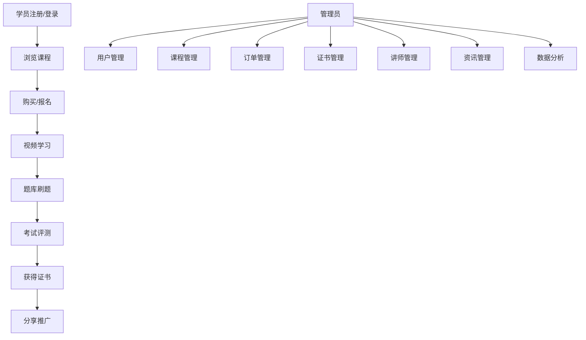
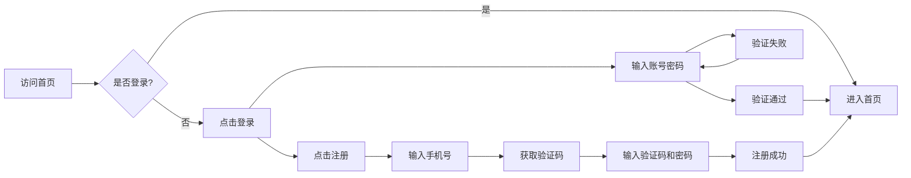
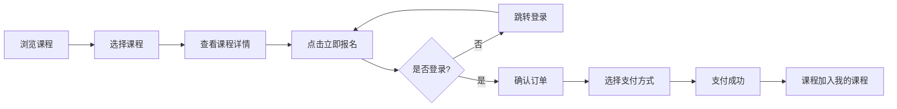
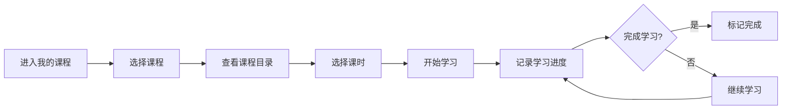
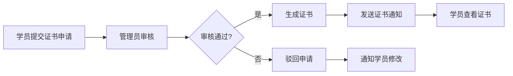
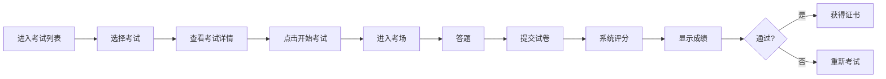

# 叁竹培训系统 - 需求规格说明书

**文档版本**: V4.0  
**编写日期**: 2026年6月10日  
**适用范围**: 叁竹养老培训管理平台  
**文档状态**: 正式版

---

## 目录

1. [产品说明](#1-产品说明)
2. [产品目标](#2-产品目标)
3. [系统用户](#3-系统用户)
4. [功能权限](#4-功能权限)
5. [用户痛点](#5-用户痛点)
6. [用户故事](#6-用户故事)
7. [产品效益](#7-产品效益)
8. [产品路线](#8-产品路线)
9. [技术路线](#9-技术路线)
10. [功能模块](#10-功能模块)
11. [业务流程](#11-业务流程)
12. [界面风格](#12-界面风格)
13. [部署结构和方式](#13-部署结构和方式)
14. [技术难点](#14-技术难点)
15. [非功能性需求](#15-非功能性需求)
16. [实施步骤和注意事项](#16-实施步骤和注意事项)
17. [附录](#附录)

---

## 1. 产品说明

### 1.1 产品概述

**叁竹培训系统**是一款面向养老行业从业人员的在线培训管理平台，旨在为养老机构、从业人员和管理部门提供一站式的培训、考证、学时管理服务。

### 1.2 产品定位

- **目标市场**: 养老行业培训机构、养老服务机构、从业人员
- **产品类型**: SaaS在线教育平台
- **核心价值**: 专业、便捷、高效的养老行业培训解决方案

### 1.3 产品口号

> 专业养老培训，助力人才成长

### 1.4 项目背景

叁竹培训是一个专注于**养老行业职业培训与技能认证**的在线教育平台。平台提供养老护理员、老年人能力评估师、健康照护师、营养配餐员等专业方向的在线课程、题库练习、证书认证等一站式培训服务。

### 1.5 系统架构

系统采用多端架构设计，包含以下四个主要端：

| 端名称 | 面向用户 | 主要功能 | 已实现页面数 |
| :--- | :--- | :--- | :---: |
| **数据驾驶舱** | 高级管理人员 | 数据可视化、运营分析、决策支持 | 1 |
| **学员网站端** | 学员（PC访问） | 课程浏览、搜索、购买、学习 | 16 |
| **学员小程序端** | 学员（移动端） | 视频学习、题库练习、证书查询 | 28 |
| **后台管理系统端** | 管理员 | 学员管理、课程管理、订单管理、系统设置 | 38 |

### 1.6 核心业务闭环



---

## 2. 产品目标

### 2.1 业务目标

| 序号 | 目标 | 说明 |
| :--- | :--- | :--- |
| 1 | 提升培训效率 | 通过在线平台，降低培训成本，提高学习效率 |
| 2 | 规范证书管理 | 实现证书申请、审核、发放全流程数字化 |
| 3 | 数据驱动决策 | 提供全面的运营数据分析，支持业务决策 |
| 4 | 扩大市场覆盖 | 通过线上平台，突破地域限制，服务更多学员 |

### 2.2 量化指标

| 指标 | 目标值 |
| :--- | :--- |
| 平台注册学员数 | 50,000+ |
| 课程完课率 | ≥75% |
| 证书通过率 | ≥90% |
| 系统响应时间 | ≤200ms |
| 系统可用性 | ≥99.9% |

---

## 3. 系统用户

### 3.1 用户角色定义

| 角色 | 描述 | 数量预估 |
| :--- | :--- | :--- |
| **超级管理员** | 系统最高权限，可管理所有模块 | 1-2人 |
| **运营数据员** | 负责课程、学员、订单等运营工作 | 5-10人 |
| **讲师** | 负责课程内容更新和学员答疑 | 50-150人 |
| **学员（会员）** | 付费学习的养老行业从业人员 | 5,000+ |
| **访客** | 未注册用户，可浏览课程信息 | 不限 |

### 3.2 用户画像

#### 超级管理员
- **年龄**: 25-45岁
- **职业**: 机构业务负责人
- **需求**: 全局数据监控、系统配置管理、权限分配

#### 运营数据员
- **年龄**: 25-35岁
- **职业**: 运营专员/数据分析师
- **需求**: 日常运营管理、数据统计分析、问题处理

#### 讲师
- **年龄**: 35-55岁
- **职业**: 养老行业专家/培训师
- **需求**: 课程内容管理、学员互动答疑

#### 学员（会员）
- **年龄**: 25-55岁
- **职业**: 养老护理员/健康照护师/营养师
- **需求**: 在线学习、证书考试、职业提升

---

## 4. 功能权限

### 4.1 权限矩阵

| 功能模块 | 超级管理员 | 运营数据员 | 讲师 | 学员 |
| :--- | :---: | :---: | :---: | :---: |
| 工作台/数据驾驶舱 | ✓ | ✓ | ✗ | ✗ |
| 学员管理 | ✓ | ✓ | ✗ | ✗ |
| 学习记录 | ✓ | ✓ | ✗ | ✓ |
| 课程管理 | ✓ | ✓ | ✓ | ✗ |
| 题库管理 | ✓ | ✓ | ✓ | ✗ |
| 课程分类 | ✓ | ✗ | ✗ | ✗ |
| 课程分享 | ✓ | ✓ | ✓ | ✗ |
| 试卷管理 | ✓ | ✓ | ✗ | ✗ |
| 模拟考试 | ✓ | ✓ | ✗ | ✗ |
| 练习管理 | ✓ | ✓ | ✓ | ✗ |
| 订单管理 | ✓ | ✓ | ✗ | ✓ |
| 退款管理 | ✓ | ✗ | ✗ | ✓ |
| 发票管理 | ✓ | ✓ | ✗ | ✓ |
| 讲师管理 | ✓ | ✗ | ✗ | ✗ |
| 证书管理 | ✓ | ✓ | ✗ | ✗ |
| 证书查询 | ✓ | ✓ | ✗ | ✓ |
| 资讯管理 | ✓ | ✓ | ✗ | ✓ |
| 资讯分类 | ✓ | ✗ | ✗ | ✗ |
| Banner管理 | ✓ | ✓ | ✗ | ✗ |
| 用户管理 | ✓ | ✗ | ✗ | ✗ |
| 部门管理 | ✓ | ✗ | ✗ | ✗ |
| 子机构管理 | ✓ | ✗ | ✗ | ✗ |
| 角色权限 | ✓ | ✗ | ✗ | ✗ |
| 消息管理 | ✓ | ✓ | ✓ | ✓ |
| 基础设置 | ✓ | ✗ | ✗ | ✗ |
| 支付配置 | ✓ | ✗ | ✗ | ✗ |
| 短信配置 | ✓ | ✗ | ✗ | ✗ |

### 4.2 详细权限说明

#### 超级管理员
- 拥有系统全部权限
- 可进行系统配置、权限管理、数据管理等所有操作
- 可管理用户、部门、子机构等系统设置

#### 运营数据员
- 可查看工作台和数据驾驶舱
- 学员中心：学员管理（查看/编辑）、学习记录（查看）
- 课程中心：课程管理（查看）、题库管理（CRUD）、课程分享（查看/新增/删除）、试卷管理（CRUD）、模拟考试（CRUD）
- 订单中心：订单管理（查看）、发票管理（查看/审核/开具）
- 证书中心：证书查询（查看/审核）
- 内容中心：资讯管理（查看）、资讯分类（查看）、Banner管理（查看/新增/编辑/删除）
- 消息中心：消息管理（查看）
- 不可进行用户管理、角色权限、部门管理、子机构管理、基础设置、支付配置、短信配置

#### 讲师
- 课程中心：课程管理（查看）、题库管理（CRUD）、课程分享（查看/新增/删除）、练习管理（查看/编辑）
- 不可进行系统级配置操作

#### 学员
- 可浏览课程、购买课程、在线学习
- 可查看学习记录、证书信息
- 可申请发票、发起退款
- 可进行题库练习、错题复习

### 4.3 RBAC 权限模型

后台管理系统采用基于角色的访问控制（RBAC），预置两种角色：
- **超级管理员**：全部模块的全部操作权限
- **运营数据员**：学员管理（查看+编辑）、学习记录（查看）、课程管理（仅查看）、题库管理（CRUD）、课程分享（查看/新增/删除）、试卷管理（CRUD）、模拟考试（CRUD）、订单管理（仅查看）、发票管理（查看/审核/开具）、证书查询（查看/审核）、资讯管理（仅查看）、Banner管理（查看/新增/编辑/删除），**无系统设置权限**

### 4.4 登录方式

- **手机号/用户名 + 密码** 登录（所有端通用）
- **微信授权登录**（移动端、网站端）
- **记住登录状态**（网站端 7 天免登录、移动端记住登录状态）

---

## 5. 用户痛点

### 5.1 学员痛点

| 序号 | 痛点描述 | 影响 |
| :--- | :--- | :--- |
| 1 | 线下培训时间成本高，难以平衡工作与学习 | 学习意愿降低，证书获取周期长 |
| 2 | 学习进度难以追踪，缺乏学习规划 | 学习效率低，完课率不高 |
| 3 | 证书查询不便，真伪验证困难 | 证书可信度受影响 |
| 4 | 练习题目有限，缺乏针对性训练 | 考试通过率不稳定 |
| 5 | 学习内容枯燥，缺乏互动性 | 学习体验差，容易放弃 |

### 5.2 管理员痛点

| 序号 | 痛点描述 | 影响 |
| :--- | :--- | :--- |
| 1 | 学员信息分散，管理效率低 | 运营成本高，易出错 |
| 2 | 缺乏数据可视化，决策缺乏依据 | 业务发展盲目，难以优化 |
| 3 | 证书审核流程繁琐，耗时较长 | 学员满意度下降 |
| 4 | 退款、发票处理流程不清晰 | 财务纠纷增多 |
| 5 | 系统权限管理复杂，安全风险高 | 数据泄露风险 |

---

## 6. 用户故事

### 6.1 学员视角

| 序号 | 用户故事 | 场景说明 |
| :--- | :--- | :--- |
| 1 | **作为**一名养老护理员，**我希望**能够在线学习课程，**以便**灵活安排学习时间 | 工作之余碎片化学习 |
| 2 | **作为**一名学员，**我希望**能查看学习进度，**以便**了解自己的学习情况 | 掌握学习节奏 |
| 3 | **作为**一名学员，**我希望**能进行题库练习，**以便**提高考试通过率 | 针对性复习 |
| 4 | **作为**一名学员，**我希望**能查询证书状态，**以便**及时获取证书 | 职业发展需求 |
| 5 | **作为**一名学员，**我希望**能调整视频播放速度，**以便**适应自己的学习节奏 | 个性化学习体验 |

### 6.2 管理员视角

| 序号 | 用户故事 | 场景说明 |
| :--- | :--- | :--- |
| 1 | **作为**超级管理员，**我希望**能查看实时数据看板，**以便**掌握平台运营状况 | 日常管理决策 |
| 2 | **作为**运营数据员，**我希望**能快速审核证书申请，**以便**提高服务效率 | 证书查询流程 |
| 3 | **作为**管理员，**我希望**能批量处理订单，**以便**提高工作效率 | 订单管理 |
| 4 | **作为**管理员，**我希望**能设置角色权限，**以便**保障系统安全 | 权限管理 |
| 5 | **作为**管理员，**我希望**能接收系统消息提醒，**以便**及时处理待办事项 | 工作提醒 |

### 6.3 讲师视角

| 序号 | 用户故事 | 场景说明 |
| :--- | :--- | :--- |
| 1 | **作为**讲师，**我希望**能管理课程内容，**以便**更新教学资料 | 课程维护 |
| 2 | **作为**讲师，**我希望**能查看学员学习情况，**以便**提供针对性指导 | 教学反馈 |
| 3 | **作为**讲师，**我希望**能维护题库，**以便**丰富练习内容 | 题库管理 |

---

## 7. 产品效益

### 7.1 社会效益

| 方面 | 效益描述 |
| :--- | :--- |
| **人才培养** | 提升养老行业从业人员专业素质，促进养老服务质量提升 |
| **行业规范** | 标准化培训内容，推动行业规范化发展 |
| **就业促进** | 通过认证体系，提高从业人员就业竞争力 |

### 7.2 经济效益

| 方面 | 效益描述 |
| :--- | :--- |
| **成本降低** | 线上培训减少场地、人力成本，提高培训效率 |
| **收入增长** | 通过课程销售、证书服务实现盈利 |
| **规模化发展** | 突破地域限制，服务更多客户 |

### 7.3 管理效益

| 方面 | 效益描述 |
| :--- | :--- |
| **效率提升** | 自动化流程减少人工操作，提高管理效率 |
| **数据驱动** | 全面数据分析支持科学决策 |
| **风险控制** | 完善的权限管理和审计机制保障数据安全 |

---

## 8. 产品路线

### 8.1 阶段规划

| 阶段 | 时间 | 目标 | 关键功能 |
| :--- | :--- | :--- | :--- |
| **Phase 1** | 2026年06月 | 基础功能上线 | 课程管理、学员管理、订单管理、在线学习 |
| **Phase 2** | 2026年07月 | 核心功能完善 | 题库系统、证书管理、数据驾驶舱 |
| **Phase 3** | 2026年08月 | 用户体验优化 | 个性化推荐、学习社区、移动适配 |
| **Phase 4** | 2026年09月 | 高级功能扩展 | AI智能学习助手、企业版功能 |

### 8.2 功能优先级

| 优先级 | 功能模块 | 说明 |
| :--- | :--- | :--- |
| P0 | 课程学习 | 核心功能，必须优先完成 |
| P0 | 订单管理 | 交易核心，保障业务运转 |
| P0 | 证书管理 | 核心业务流程 |
| P0 | 题库系统 | 提升学习效果 |
| P0 | 数据驾驶舱 | 支持管理决策 |
| P0 | 消息中心 | 提升用户体验 |
| P0 | 发票管理 | 完善财务流程 |
| P0 | 角色权限 | 系统安全保障 |

---

## 9. 技术路线

### 9.1 技术架构

```
┌─────────────────────────────────────────────────────────────────┐
│                      前端展示层                                │
│  ┌─────────────┐ ┌─────────────┐ ┌─────────────┐ ┌──────────┐ │
│  │ 数据驾驶舱   │ │ 网站端      │ │ 小程序端    │ │ 管理后台 │ │
│  └─────────────┘ └─────────────┘ └─────────────┘ └──────────┘ │
└───────────────────┬───────────────┬───────────────┬────────────┘
                    │               │               │
┌───────────────────▼───────────────▼───────────────▼────────────┐
│                      API网关层                                 │
│           统一认证、限流、日志、监控                            │
└────────────────────────────────────┬───────────────────────────┘
                                    │
┌────────────────────────────────────▼───────────────────────────┐
│                      业务逻辑层                                 │
│  ┌─────────┐ ┌─────────┐ ┌─────────┐ ┌─────────┐ ┌─────────┐ │
│  │课程服务 │ │用户服务 │ │订单服务 │ │题库服务 │ │证书服务 │ │
│  └─────────┘ └─────────┘ └─────────┘ └─────────┘ └─────────┘ │
└────────────────────────────────────┬───────────────────────────┘
                                    │
┌────────────────────────────────────▼───────────────────────────┐
│                      数据持久层                                 │
│           MySQL + Redis + MongoDB + 文件存储                   │
└─────────────────────────────────────────────────────────────────┘
```

### 9.2 技术栈选择

| 分类 | 技术 | 版本 | 说明 |
| :--- | :--- | :--- | :--- |
| **前端框架** | Vue.js | 3.x | 主应用框架 |
| **UI组件** | Element Plus | 2.x | 后台管理界面 |
| **小程序** | UniApp | 最新版 | 跨端小程序开发 |
| **图表库** | ECharts | 5.x | 数据可视化 |
| **后端框架** | Spring Boot | 3.x | Java后端服务 |
| **数据库** | MySQL | 8.x | 关系型数据库 |
| **缓存** | Redis | 7.x | 缓存和会话管理 |
| **消息队列** | RabbitMQ | 3.x | 异步任务处理 |
| **文件存储** | MinIO | 最新版 | 对象存储 |

### 9.3 关键技术特性

| 特性 | 实现方案 |
| :--- | :--- |
| **学时记录** | 服务端定时记录学习时长，防止作弊 |
| **断点续学** | 记录播放位置，下次继续播放 |
| **数据可视化** | ECharts图表组件，支持多维度分析 |
| **权限管理** | RBAC角色权限模型，细粒度控制 |

---

## 10. 功能模块

本章节详细描述系统四大端（数据驾驶舱、学员网站端、学员小程序端、后台管理系统端）的功能模块，按照「端 → 模块 → 菜单/子页面 → 功能点」四级结构组织。

---

### 10.1 数据驾驶舱

**模块概述**: 面向高级管理人员的数据可视化分析平台，提供平台运营全维度数据监控与决策支持。

**实现页面**: `html/datacockpit/cockpits.html`

**页面定位**: 数据驾驶舱首页，是平台的核心数据展示中心，为管理人员提供直观、全面的运营数据概览。

#### 10.1.1 页面结构

| 区域 | 说明 |
| :--- | :--- |
| 顶部导航区 | 标题、副标题、平台入口按钮组、日期徽章 |
| KPI指标卡片区 | 机构人数、子机构、学员总数、讲师数、课程数、题库量、通过率、订单总数、订单金额 |
| 左侧区域 | 人员分布图、课程分布图、热销课程Top5 |
| 中央区域 | 分支机构分布地图、学员报名动态列表 |
| 右侧区域 | 学员趋势图、通过率趋势图、证书数据统计 |
| 底部区域 | 订单趋势图、订单动态、最新资讯列表 |

---

### 10.2 学员网站端

**模块概述**: 面向所有用户（含访客）的PC端展示与报名转化平台，核心目标是品牌展示与课程销售转化。

**已实现页面清单**:

| 页面文件 | 功能说明 |
| :--- | :--- |
| `index.html` | 网站首页 |
| `login.html` | 登录页 |
| `register.html` | 注册页 |
| `course-list.html` | 课程列表 |
| `course-detail.html` | 课程详情 |
| `live-class.html` | 直播课堂 |
| `exam-list.html` | 考试列表 |
| `exam-detail.html` | 考试详情 |
| `exam-practice.html` | 考试练习 |
| `exam-simulation.html` | 模拟考试 |
| `exam-hall.html` | 考场 |
| `exam-quiz.html` | 答题页 |
| `profile.html` | 个人中心 |
| `user-center.html` | 用户中心 |

#### 10.2.1 首页模块

##### 10.2.1.1 官网首页 (`index.html`)
- **页面定位**: 平台对外展示门户，核心目标是品牌展示与课程转化
- **页面元素**: 导航栏、课程分类触发器、搜索框、用户头像、Banner轮播、左侧分类导航、直播课程区域、热门课程区域、最新课程区域、课程卡片、右侧推荐课程、学习排行榜、限时优惠卡片、页脚

##### 10.2.1.2 登录页 (`login.html`)
- **页面定位**: 用户登录入口，提供手机号/用户名+密码登录和微信授权登录
- **页面元素**: 品牌Logo、标题、描述、功能特性列表、登录表单、账号输入框、密码输入框、记住登录复选框、忘记密码链接、登录按钮、隐私协议复选框、微信登录按钮、注册链接

##### 10.2.1.3 注册页 (`register.html`)
- **页面定位**: 新用户注册入口，通过手机号验证码方式注册
- **页面元素**: 品牌Logo、标题、描述、注册表单、手机号输入框、验证码输入框、获取验证码按钮、密码输入框、密码强度指示器、确认密码输入框、用户协议复选框、注册按钮

#### 10.2.2 课程中心模块

##### 10.2.2.1 课程列表页 (`course-list.html`)
- **页面定位**: 展示全部课程，支持分类筛选、标签筛选、价格筛选、多维度排序
- **页面元素**: 左侧分类导航、面包屑导航、筛选条件栏、价格筛选、排序方式、课程数量统计、课程卡片网格、分页器

##### 10.2.2.2 课程详情页 (`course-detail.html`)
- **页面定位**: 展示课程完整信息，提供购买和试听入口
- **页面元素**: 面包屑导航、课程封面区域、课程标题、课程标签、评分信息、课程元信息、价格区域、补贴说明、立即报名按钮、收藏按钮、Tab切换、课程介绍内容、课程亮点、章节目录、课时项、评价摘要、评价列表、问答列表、讲师信息卡片、推荐课程列表

##### 10.2.2.3 直播课堂页 (`live-class.html`)
- **页面定位**: 提供直播课程实时观看功能
- **页面元素**: 导航栏、视频播放器、观看人数、课件下载按钮、Tab切换、提问输入框、提问提交按钮、历史提问列表、课程目录、课时项

#### 10.2.3 考试中心模块

##### 10.2.3.1 考试列表页 (`exam-list.html`)
- **页面定位**: 展示可参加的考试列表
- **页面元素**: 考试卡片、考试状态、考试时间、报名入口

##### 10.2.3.2 考试详情页 (`exam-detail.html`)
- **页面定位**: 展示考试详细信息
- **页面元素**: 考试信息、考试规则、报名按钮

##### 10.2.3.3 考场页 (`exam-hall.html`)
- **页面定位**: 在线考试答题环境
- **页面元素**: 倒计时、题目列表、答题卡、提交按钮

##### 10.2.3.4 答题页 (`exam-quiz.html`)
- **页面定位**: 考试答题界面
- **页面元素**: 题目内容、选项、下一题/上一题、答题卡

#### 10.2.4 个人中心模块

##### 10.2.4.1 个人中心 (`profile.html`)
- **页面定位**: 用户个人信息管理
- **页面元素**: 用户信息、学习进度、证书信息

##### 10.2.4.2 用户中心 (`user-center.html`)
- **页面定位**: 用户功能入口集合
- **页面元素**: 订单管理、课程管理、收藏管理、证书查询

---

### 10.3 学员小程序端

**模块概述**: 面向学员的移动端平台，支持视频学习、题库练习、证书查询等核心功能。

**已实现页面清单**:

| 页面文件 | 功能说明 |
| :--- | :--- |
| `login.html` | 登录页 |
| `home.html` | 首页 |
| `course-list.html` | 课程列表 |
| `learn.html` | 学习页 |
| `exam-list.html` | 考试列表 |
| `exam-detail.html` | 考试详情 |
| `exam-hall.html` | 考场 |
| `exam-quiz.html` | 答题页 |
| `mock-exam-list.html` | 模拟考试列表 |
| `mock-exam-quiz.html` | 模拟答题 |
| `question-bank.html` | 题库 |
| `quiz.html` | 练习答题 |
| `wrong-notebook.html` | 错题本 |
| `wrong-practice.html` | 错题练习 |
| `my-courses.html` | 我的课程 |
| `my-orders.html` | 我的订单 |
| `my-certificates.html` | 我的证书 |
| `my-collections.html` | 我的收藏 |
| `my-materials.html` | 我的资料 |
| `my-shares.html` | 我的分享 |
| `my-mistakes.html` | 我的错题 |
| `my-question-bank.html` | 我的题库 |
| `news.html` | 资讯列表 |
| `news-detail.html` | 资讯详情 |
| `faq.html` | 常见问题 |
| `about.html` | 关于我们 |
| `admission.html` | 报名页面 |
| `practice-mode.html` | 练习模式 |

#### 10.3.1 首页模块

##### 10.3.1.1 首页 (`home.html`)
- **页面定位**: 小程序首页，展示核心功能入口和推荐内容

#### 10.3.2 学习模块

##### 10.3.2.1 课程列表页 (`course-list.html`)
- **页面定位**: 移动端课程浏览

##### 10.3.2.2 学习页 (`learn.html`)
- **页面定位**: 视频学习界面，支持断点续学

#### 10.3.3 考试模块

##### 10.3.3.1 考试列表页 (`exam-list.html`)
- **页面定位**: 展示可参加的考试

##### 10.3.3.2 模拟考试列表 (`mock-exam-list.html`)
- **页面定位**: 模拟考试入口

#### 10.3.4 题库模块

##### 10.3.4.1 题库页 (`question-bank.html`)
- **页面定位**: 题库练习入口

##### 10.3.4.2 练习答题页 (`quiz.html`)
- **页面定位**: 练习答题界面

##### 10.3.4.3 错题本 (`wrong-notebook.html`)
- **页面定位**: 错题记录和复习

##### 10.3.4.4 错题练习 (`wrong-practice.html`)
- **页面定位**: 针对错题的专项练习

#### 10.3.5 我的模块

##### 10.3.5.1 我的课程 (`my-courses.html`)
- **页面定位**: 已购买课程列表

##### 10.3.5.2 我的订单 (`my-orders.html`)
- **页面定位**: 订单记录管理

##### 10.3.5.3 我的证书 (`my-certificates.html`)
- **页面定位**: 证书查询和展示

##### 10.3.5.4 我的收藏 (`my-collections.html`)
- **页面定位**: 收藏的课程和内容

---

### 10.4 后台管理系统端

**模块概述**: 面向管理员的后台管理平台，支持学员管理、课程管理、订单管理、系统设置等功能。

**架构说明**: 采用iframe嵌套模式，`index.html` 作为框架页，包含侧边栏导航和顶部导航，其他页面通过iframe加载。

**已实现页面清单**:

| 页面文件 | 功能说明 |
| :--- | :--- |
| `index.html` | 后台主页（框架页） |
| `login.html` | 登录页 |
| `dashboard.html` | 工作台 |
| `admin-profile.html` | 管理员个人中心 |
| `student-list.html` | 学员管理 |
| `study-record.html` | 学习记录 |
| `course-list.html` | 课程管理 |
| `course-form.html` | 课程表单 |
| `chapter-form.html` | 章节表单 |
| `category-list.html` | 课程分类 |
| `share-list.html` | 课程分享 |
| `teacher-list.html` | 讲师管理 |
| `teacher-edit.html` | 讲师编辑 |
| `question-bank.html` | 题库管理 |
| `paper-management.html` | 试卷管理 |
| `mock-exam.html` | 模拟考试 |
| `practice-exam.html` | 练习管理 |
| `order-list.html` | 订单管理 |
| `refund-list.html` | 退款管理 |
| `invoice-list.html` | 发票管理 |
| `certificate-list.html` | 证书列表 |
| `certificate-manage.html` | 证书管理 |
| `article-list.html` | 资讯管理 |
| `article-category.html` | 资讯分类 |
| `user-management.html` | 用户管理 |
| `role-permission.html` | 角色权限 |
| `institution-management.html` | 子机构管理 |
| `department-management.html` | 部门管理 |
| `message-center.html` | 消息管理 |
| `system-settings.html` | 基础设置 |
| `external-config.html` | 服务配置 |
| `payment-settings.html` | 支付配置 |
| `sms-settings.html` | 短信配置 |
| `slider-list.html` | Banner管理 |

#### 10.4.1 框架页 (`index.html`)

**页面定位**: 后台管理系统主框架，包含侧边栏导航、顶部导航和iframe内容区域

**页面元素**:
- **侧边栏**: Logo、菜单导航（学员中心、课程中心、讲师中心、考试中心、订单中心、内容中心、系统设置）
- **顶部导航**: 侧边栏折叠按钮、Tab标签栏、通知按钮、管理员下拉菜单
- **内容区域**: iframe容器，加载各功能页面

**交互说明**:
- 点击菜单导航在iframe中打开对应页面
- Tab标签支持多页签管理
- 点击管理员头像展开菜单（个人信息、退出登录）

#### 10.4.2 工作台模块

##### 10.4.2.1 工作台 (`dashboard.html`)
- **页面定位**: 管理员首页，展示运营数据概览
- **页面元素**: 欢迎语、KPI统计卡片、订单趋势图、快捷操作、最近订单、待办事项、热销课程TOP5

#### 10.4.3 学员中心模块

##### 10.4.3.1 学员管理 (`student-list.html`)
- **页面定位**: 学员信息管理
- **页面元素**: 搜索、筛选、学员列表、添加学员按钮、编辑/删除操作

##### 10.4.3.2 学习记录 (`study-record.html`)
- **页面定位**: 学员学习进度查看
- **页面元素**: 学员选择、学习记录列表、课程进度统计

#### 10.4.4 课程中心模块

##### 10.4.4.1 课程管理 (`course-list.html`)
- **页面定位**: 课程列表管理
- **页面元素**: 搜索、筛选、课程列表、添加课程按钮、编辑/删除/上架/下架操作

##### 10.4.4.2 课程表单 (`course-form.html`)
- **页面定位**: 新建/编辑课程
- **页面元素**: 课程信息表单、封面上传、章节管理

##### 10.4.4.3 章节表单 (`chapter-form.html`)
- **页面定位**: 章节内容管理
- **页面元素**: 章节信息、课时列表、视频上传

##### 10.4.4.4 课程分类 (`category-list.html`)
- **页面定位**: 课程分类管理
- **页面元素**: 分类列表、添加/编辑/删除操作

##### 10.4.4.5 课程分享 (`share-list.html`)
- **页面定位**: 课程分享记录管理
- **页面元素**: 分享记录列表、统计信息

#### 10.4.5 讲师中心模块

##### 10.4.5.1 讲师管理 (`teacher-list.html`)
- **页面定位**: 讲师信息管理
- **页面元素**: 讲师列表、添加/编辑/删除操作

##### 10.4.5.2 讲师编辑 (`teacher-edit.html`)
- **页面定位**: 讲师信息编辑
- **页面元素**: 讲师信息表单、课程关联

#### 10.4.6 考试中心模块

##### 10.4.6.1 题库管理 (`question-bank.html`)
- **页面定位**: 题目管理
- **页面元素**: 题目列表、添加/编辑/删除操作、批量导入

##### 10.4.6.2 试卷管理 (`paper-management.html`)
- **页面定位**: 试卷管理
- **页面元素**: 试卷列表、新建/编辑/删除操作

##### 10.4.6.3 模拟考试 (`mock-exam.html`)
- **页面定位**: 模拟考试管理
- **页面元素**: 模拟考试列表、创建/编辑操作

##### 10.4.6.4 练习管理 (`practice-exam.html`)
- **页面定位**: 练习题目管理
- **页面元素**: 练习列表、配置操作

#### 10.4.7 订单中心模块

##### 10.4.7.1 订单管理 (`order-list.html`)
- **页面定位**: 订单列表管理
- **页面元素**: 订单列表、搜索、筛选、订单详情查看

##### 10.4.7.2 退款管理 (`refund-list.html`)
- **页面定位**: 退款申请管理
- **页面元素**: 退款列表、审核操作

##### 10.4.7.3 发票管理 (`invoice-list.html`)
- **页面定位**: 发票申请管理
- **页面元素**: 发票列表、开具/审核操作

#### 10.4.8 证书中心模块

##### 10.4.8.1 证书列表 (`certificate-list.html`)
- **页面定位**: 证书列表查看
- **页面元素**: 证书列表、搜索、筛选

##### 10.4.8.2 证书管理 (`certificate-manage.html`)
- **页面定位**: 证书审核管理
- **页面元素**: 审核列表、审核操作、证书发放

#### 10.4.9 内容中心模块

##### 10.4.9.1 资讯管理 (`article-list.html`)
- **页面定位**: 资讯文章管理
- **页面元素**: 资讯列表、添加/编辑/删除操作

##### 10.4.9.2 资讯分类 (`article-category.html`)
- **页面定位**: 资讯分类管理
- **页面元素**: 分类列表、添加/编辑/删除操作

##### 10.4.9.3 Banner管理 (`slider-list.html`)
- **页面定位**: 轮播图管理
- **页面元素**: Banner列表、添加/编辑/删除操作

#### 10.4.10 系统设置模块

##### 10.4.10.1 用户管理 (`user-management.html`)
- **页面定位**: 后台用户管理
- **页面元素**: 用户列表、添加/编辑/删除操作

##### 10.4.10.2 角色权限 (`role-permission.html`)
- **页面定位**: 角色和权限管理
- **页面元素**: 角色列表、权限配置

##### 10.4.10.3 子机构管理 (`institution-management.html`)
- **页面定位**: 子机构信息管理
- **页面元素**: 机构列表、添加/编辑/删除操作

##### 10.4.10.4 部门管理 (`department-management.html`)
- **页面定位**: 部门信息管理
- **页面元素**: 部门列表、添加/编辑/删除操作

##### 10.4.10.5 消息管理 (`message-center.html`)
- **页面定位**: 系统消息管理
- **页面元素**: 消息列表、发送消息操作

##### 10.4.10.6 基础设置 (`system-settings.html`)
- **页面定位**: 系统基础配置
- **页面元素**: 系统参数设置

##### 10.4.10.7 服务配置 (`external-config.html`)
- **页面定位**: 外部服务配置
- **页面元素**: API配置、第三方服务配置

##### 10.4.10.8 支付配置 (`payment-settings.html`)
- **页面定位**: 支付相关配置
- **页面元素**: 支付渠道配置

##### 10.4.10.9 短信配置 (`sms-settings.html`)
- **页面定位**: 短信服务配置
- **页面元素**: 短信模板、发送配置

#### 10.4.11 个人中心模块

##### 10.4.11.1 管理员个人中心 (`admin-profile.html`)
- **页面定位**: 管理员个人信息管理
- **页面元素**: 用户头像、基本信息（用户名、真实姓名、手机号、邮箱）、修改密码、保存修改按钮

---

## 11. 业务流程

### 11.1 学员注册登录流程



### 11.2 课程购买流程



### 11.3 学习流程



### 11.4 证书审核流程



### 11.5 考试流程



---

## 12. 界面风格

### 12.1 设计理念

- **简洁专业**: 清晰的布局结构，便于快速定位功能
- **现代感**: 采用卡片式设计，圆角、阴影营造层次感
- **一致性**: 各端保持统一的设计语言和交互模式

### 12.2 配色方案

| 颜色用途 | 颜色值 | 说明 |
| :--- | :--- | :--- |
| 主色调 | #1890FF | 品牌蓝色，用于主按钮、链接、高亮 |
| 背景色 | #F0F2F5 | 页面背景 |
| 卡片背景 | #FFFFFF | 内容卡片 |
| 文字主色 | #1F2937 | 标题、正文 |
| 文字辅色 | #6B7280 | 辅助说明文字 |
| 边框色 | #E5E7EB | 分隔线、边框 |
| 成功色 | #10B981 | 成功状态、通过标识 |
| 警告色 | #F59E0B | 警告状态、待处理标识 |
| 错误色 | #EF4444 | 错误状态、删除操作 |

### 12.3 字体规范

| 字体类型 | 字号 | 用途 |
| :--- | :--- | :--- |
| 页面标题 | 24px | 页面主标题 |
| 卡片标题 | 18px | 模块标题 |
| 正文 | 14px | 主要内容文字 |
| 辅助文字 | 12px | 说明、提示文字 |

### 12.4 组件规范

#### 12.4.1 按钮
- **主按钮**: 蓝色背景、白色文字、圆角-lg
- **次按钮**: 白色背景、灰色边框、灰色文字
- **危险按钮**: 红色背景、白色文字

#### 12.4.2 卡片
- 白色背景、圆角-xl、阴影-sm、灰色边框

#### 12.4.3 输入框
- 灰色边框、圆角-lg、聚焦时蓝色边框高亮

#### 12.4.4 表格
- 白色背景、灰色分隔线、悬停高亮

### 12.5 图标库

使用 Iconify 图标库，主要图标来源：
- `ri:` (Remix Icons) - 主要图标
- `fa:` (Font Awesome) - 辅助图标

---

## 13. 部署结构和方式

### 13.1 目录结构

```
html/
├── datacockpit/          # 数据驾驶舱
│   └── cockpits.html
├── backhand/             # 后台管理系统
│   └── eldercare/
│       ├── index.html
│       ├── login.html
│       ├── dashboard.html
│       └── ...
├── website/              # 学员网站端
│   └── eldercare/
│       ├── index.html
│       ├── login.html
│       ├── course-list.html
│       └── ...
├── mobile/               # 学员小程序端
│   └── eldercare/
│       ├── index.html
│       ├── login.html
│       ├── home.html
│       └── ...
└── libs/                 # 公共资源
    ├── echarts.min.js
    ├── iconify.min.js
    └── ...
```

### 13.2 部署方式

| 环境 | 部署方式 | 说明 |
| :--- | :--- | :--- |
| 开发环境 | 本地静态文件服务 | 直接打开HTML文件或使用本地服务器 |
| 测试环境 | Nginx静态部署 | 配置Nginx作为静态文件服务器 |
| 生产环境 | Nginx + CDN | 结合CDN加速，提升加载性能 |

---

## 14. 技术难点

### 14.1 学时记录防作弊
- **问题**: 学员可能通过后台播放获取学时
- **方案**: 服务端定时校验播放状态，要求学员定期交互

### 14.2 考试防作弊
- **问题**: 学员可能在考试时作弊
- **方案**: 随机出题、防切屏检测、答题时间限制

### 14.3 数据实时同步
- **问题**: 多端数据需要保持同步
- **方案**: 使用WebSocket实时推送，定期数据刷新

### 14.4 大文件视频处理
- **问题**: 视频文件较大，加载慢
- **方案**: 视频分片加载、CDN加速、自适应码率

---

## 15. 非功能性需求

### 15.1 性能需求

| 指标 | 要求 |
| :--- | :--- |
| 页面加载时间 | ≤2秒 |
| API响应时间 | ≤200ms |
| 并发用户数 | ≥1000 |
| 系统可用性 | ≥99.9% |

### 15.2 安全需求

| 需求 | 说明 |
| :--- | :--- |
| 用户认证 | JWT token认证 |
| 密码加密 | BCrypt加密存储 |
| 数据传输 | HTTPS加密 |
| 权限控制 | RBAC细粒度权限 |
| SQL注入防护 | 参数化查询 |

### 15.3 兼容性需求

| 平台 | 版本要求 |
| :--- | :--- |
| 浏览器 | Chrome 90+, Firefox 88+, Safari 14+ |
| 移动端 | iOS 13+, Android 9+ |
| 微信小程序 | 微信版本 7.0+ |

---

## 16. 实施步骤和注意事项

### 16.1 实施步骤

| 阶段 | 时间 | 任务 |
| :--- | :--- | :--- |
| 需求确认 | 1周 | 确认需求规格说明书 |
| UI设计 | 2周 | 完成各端界面设计 |
| 前端开发 | 4周 | 实现各端页面 |
| 后端开发 | 4周 | 实现API接口 |
| 联调测试 | 2周 | 前后端联调、功能测试 |
| 上线部署 | 1周 | 部署到生产环境 |

### 16.2 注意事项

1. **代码规范**: 统一代码风格，使用ESLint检查
2. **注释规范**: 关键代码添加注释说明
3. **测试覆盖**: 核心功能编写单元测试
4. **文档更新**: 代码变更同步更新文档
5. **安全审计**: 定期进行安全漏洞扫描

---

## 附录

### A. 页面文件清单汇总

| 端名称 | 页面数 | 文件列表 |
| :--- | :---: | :--- |
| 数据驾驶舱 | 1 | cockpits.html |
| 后台管理系统 | 38 | index.html, login.html, dashboard.html, admin-profile.html, student-list.html, study-record.html, course-list.html, course-form.html, chapter-form.html, category-list.html, share-list.html, teacher-list.html, teacher-edit.html, question-bank.html, paper-management.html, mock-exam.html, practice-exam.html, order-list.html, refund-list.html, invoice-list.html, certificate-list.html, certificate-manage.html, article-list.html, article-category.html, user-management.html, role-permission.html, institution-management.html, department-management.html, message-center.html, system-settings.html, external-config.html, payment-settings.html, sms-settings.html, slider-list.html |
| 学员网站端 | 16 | index.html, login.html, register.html, course-list.html, course-detail.html, live-class.html, exam-list.html, exam-detail.html, exam-practice.html, exam-simulation.html, exam-hall.html, exam-quiz.html, profile.html, user-center.html |
| 学员小程序端 | 28 | login.html, home.html, course-list.html, learn.html, exam-list.html, exam-detail.html, exam-hall.html, exam-quiz.html, mock-exam-list.html, mock-exam-quiz.html, question-bank.html, quiz.html, wrong-notebook.html, wrong-practice.html, my-courses.html, my-orders.html, my-certificates.html, my-collections.html, my-materials.html, my-shares.html, my-mistakes.html, my-question-bank.html, news.html, news-detail.html, faq.html, about.html, admission.html, practice-mode.html |

### B. 功能模块汇总

| 模块 | 子模块 | 页面数 |
| :--- | :--- | :---: |
| 数据驾驶舱 | 驾驶舱首页 | 1 |
| 学员网站端 | 首页、课程中心、考试中心、个人中心 | 16 |
| 学员小程序端 | 首页、学习、考试、题库、我的 | 28 |
| 后台管理系统 | 工作台、学员中心、课程中心、讲师中心、考试中心、订单中心、证书中心、内容中心、系统设置、个人中心 | 38 |

**文档结束**