# 需求规格说明书 - 机井管理信息化平台

## 文档信息

| 属性 | 内容 |
|------|------|
| 产品名称 | 机井管理信息化平台 |
| 版本号 | V1.0 |
| 文档类型 | 需求规格说明书 |
| 编写日期 | 2026年5月 |
| 文档状态 | 正式发布 |
| 保密级别 | 内部资料 |

---

## 修订历史

| 版本号 | 修订日期 | 修订内容 | 修订人 |
|--------|----------|----------|--------|
| V1.0 | 2026-05-19 | 初始版本 | 产品团队 |

---

## 目录

1. [产品概述](#1-产品概述)
2. [用户场景](#2-用户场景)
3. [业务流程](#3-业务流程)
4. [功能描述](#4-功能描述)
5. [原型设计](#5-原型设计)
6. [用例分析](#6-用例分析)
7. [部署需求](#7-部署需求)
8. [性能需求](#8-性能需求)
9. [其他内容](#9-其他内容)

---

## 1. 产品概述

### 1.1 产品背景

我国农业灌溉基础设施中，机井是最重要的水源设施之一。然而，传统机井管理面临诸多挑战：

- **分布广泛、巡检难度大**：机井分布范围广，地理环境复杂，巡检人员难以全面覆盖
- **设备老化、故障频发**：大量机井使用年限较长，设备老化严重，故障率居高不下
- **管护责任不清**：缺乏明确的管护责任体系，问题发生后难以追溯责任
- **考核缺乏依据**：传统考核方式主观性强，缺乏客观数据支撑
- **处理流程冗长**：问题从发现到处理环节多、耗时长、效率低

### 1.2 产品定位

机井管理信息化平台是一款面向省、市、县三级农业管理部门的机井运维管理解决方案。系统以Web端大数据驾驶舱为核心，辅以PC端业务管理系统和移动端应用，实现：

- 机井运行状态的实时监控
- 工单的全生命周期管理
- 一长两员（井长、管护员、维修员）队伍的科学考核
- 预警信息的及时响应

### 1.3 系统特点

#### 1.3.1 多终端协同

系统采用多终端架构设计，包括：

- **PC端管理系统**：适用于日常办公和管理决策，提供完整的业务功能
- **PC端大数据驾驶舱**：面向决策层，提供数据可视化和分析能力
- **移动端App**：适用于现场巡查和信息采集，支持离线使用
- **移动端登录页**：独立的移动端入口页面

#### 1.3.2 三级联动管理

系统支持省、市、县三级行政区划的层级管理：

- 上级可查看下级汇总数据，实现全局掌控
- 下级负责本辖区机井的日常管护
- 数据层层汇总、权限逐级划分

#### 1.3.3 数据驾驶舱

大数据驾驶舱提供直观的数据可视化展示：

- 支持从省级到市级的逐级下钻
- ECharts图表联动展示
- 帮助管理者快速掌握全省机井运行态势

#### 1.3.4 四维考核体系

建立科学的管护人员考核机制：

- 巡查绩效（权重30%）
- 工单处置（权重30%）
- 辖区健康（权重25%）
- 资质合规（权重15%）

#### 1.3.5 工单闭环管理

支持工单从发现、派发、处置到验收的全流程管理：

- 确保问题得到及时有效解决
- 全流程可追溯、可考核
- 支持多种触发方式和处置流程

#### 1.3.6 预警联动机制

内置多级预警体系：

- 设备故障预警
- 工单逾期预警
- 资质到期预警
- 巡查缺失预警

### 1.4 系统架构图

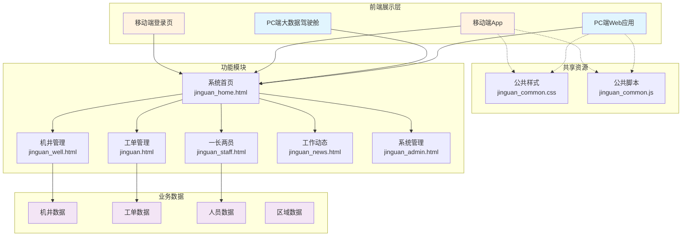

---

## 2. 用户场景

### 2.1 用户角色体系

系统设计了完善的用户角色体系，主要包括以下几类用户：

| 角色 | 职责描述 | 权限范围 | 管辖范围 |
|------|----------|----------|----------|
| 省级管理员 | 全省机井管理决策者 | 查看全省数据、统计分析、系统配置 | 河南省全境 |
| 市级管理员 | 全市机井管理协调者 | 查看全市数据、跨区县协调 | 所辖地级市 |
| 县级管理员 | 本县机井管理执行者 | 管理本辖区机井、人员、工单 | 所辖县区 |
| 井长 | 辖区机井第一责任人 | 机井巡查、问题上报、工单协调 | 辖区所有机井 |
| 管护员 | 机井日常维护执行者 | 日常巡检、简单维护、工单处置 | 指定机井 |
| 维修员 | 设备维修专业人员 | 设备维修、工单处置、资质认证 | 全县范围 |

### 2.2 典型使用场景

#### 场景一：省级管理者查看全省态势

**角色**：省级管理员

**前置条件**：管理员已登录系统

**操作步骤**：

1. 省级管理员登录系统，进入大数据驾驶舱
2. 查看全省核心指标：机井总数12,568口、异常机井247口、人员846人、本月工单1,384条
3. 查看机井状态分布饼图，了解正常/故障/维护中的比例
4. 查看近期工单趋势折线图，掌握工单变化趋势
5. 发现周口市数据异常，点击进入周口市详情
6. 进一步点击淮阳区，下钻至区级详情
7. 查看具体异常机井列表和待处理工单

**后置条件**：系统显示目标区域详细数据

**异常处理**：若下钻失败，提示网络错误并提供重试按钮

#### 场景二：县级管理员处理工单

**角色**：县级管理员

**前置条件**：存在待处置工单

**操作步骤**：

1. 县级管理员登录PC端系统
2. 进入工单管理页面，查看待处置工单列表
3. 选择某机井水泵故障工单，点击查看详情
4. 审核工单信息，确认问题属实
5. 选择辖区维修员，点击派单按钮
6. 系统发送工单通知至维修员移动端
7. 维修员完成维修后上传记录和照片
8. 管理员审核通过，工单状态更新为已结案

**后置条件**：工单闭环结案，相关数据更新

**异常处理**：若维修员无法按时完成，触发催办机制

#### 场景三：井长执行日常巡查

**角色**：井长

**前置条件**：井长已完成移动端登录

**操作步骤**：

1. 井长携带移动设备到达机井现场
2. 通过移动端App扫描机井二维码或手动搜索
3. 定位目标机井，查看基本信息、历史工单
4. 开始巡查任务，记录巡查时间戳
5. 检查机井外观、设备状态、运行环境
6. 发现异常情况，现场拍照并填写巡查记录
7. 系统自动生成工单并推送给相关处置人员
8. 完成巡查，上传巡查数据

**后置条件**：巡查记录上传成功，工单生成（若发现异常）

**异常处理**：若无网络连接，巡查数据本地缓存，待网络恢复后自动上传

#### 场景四：考核人员绩效评价

**角色**：县级管理员

**前置条件**：本月考核周期已结束

**操作步骤**：

1. 县级管理员登录一长两员管理模块
2. 进入考核排名模块，查看本月排名
3. 系统自动汇总各项考核数据
4. 查看四维考核得分构成：
   - 巡查绩效得分（30%权重）
   - 工单处置得分（30%权重）
   - 辖区健康得分（25%权重）
   - 资质合规得分（15%权重）
5. 查看综合得分排名
6. 对排名靠后人员发送改进提醒
7. 生成月度考核报告存档

**后置条件**：考核报告生成并存档

**异常处理**：若人员数据不完整，标记并允许手动补充

#### 场景五：预警信息处置

**角色**：系统自动触发

**前置条件**：存在触发预警条件的事件

**触发条件**：

- 机井连续3天无巡查记录
- 工单超过规定时限未处置
- 人员资质证书即将到期
- 机井设备检测到异常参数

**处置流程**：

1. 系统自动检测并生成预警信息
2. 根据预警级别（红色/橙色/黄色/蓝色）发送通知
3. 关联人员收到预警提醒
4. 人员接收预警并前往处置
5. 处置完成后通过移动端确认
6. 系统验证预警解除条件
7. 预警状态更新为已解除

---

## 3. 业务流程

### 3.1 业务流程图概述

本章节通过流程图详细描述机井管理信息化平台的核心业务流程。

### 3.2 机井管理流程

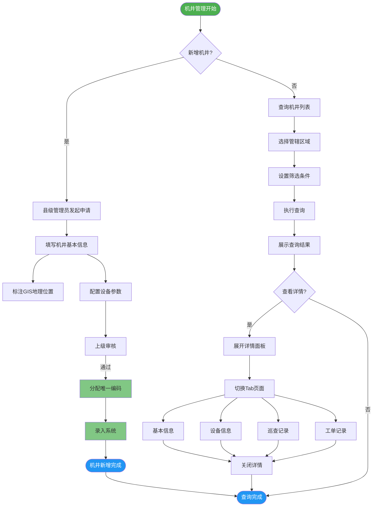

### 3.3 工单处理流程

```mermaid
flowchart LR
    subgraph 创建阶段["创建阶段"]
        A1([工单创建]) --> A2{问题来源}
        A2 -->|巡查发现| A3[巡查人员提交]
        A2 -->|监控告警| A4[系统自动生成]
        A2 -->|群众反馈| A5[客服受理录入]
        A3 --> A6[填写问题描述]
        A4 --> A6
        A5 --> A6
        A6 --> A7[上传现场照片]
        A7 --> A8[分配工单编号]
        A8 --> A9([待派发状态])
    end
    
    subgraph 分派阶段["分派阶段"]
        A9 --> B1{选择处置人员}
        B1 -->|井长| B2[分配至井长]
        B1 -->|管护员| B3[分配至管护员]
        B1 -->|维修员| B4[分配至维修员]
        B2 --> B5([待处置状态])
        B3 --> B5
        B4 --> B5
    end
    
    subgraph 处置阶段["处置阶段"]
        B5 --> C1[处置人员接收工单]
        C1 --> C2([处置中状态])
        C2 --> C3[现场处理]
        C3 --> C4[上传处理记录]
        C4 --> C5[提交验收申请]
        C5 --> C6([待验收状态])
    end
    
    subgraph 验收阶段["验收阶段"]
        C6 --> D1{验收审核}
        D1 -->|通过| D2[工单结案]
        D2 --> D3([已结案状态])
        D1 -->|不通过| D4[退回重新处置]
        D4 --> C2
    end
    
    subgraph 特殊情况["特殊情况"]
        D3 --> E1{问题核实}
        E1 -->|问题不存在| E2[标记问题不存在]
        E2 --> E3([问题不存在状态])
        D3 --> E4{工单撤回}
        E4 -->|符合条件| E5[撤回工单]
        E5 --> E6([已撤回状态])
        D3 --> E7{超时催办}
        E7 -->|超时未处置| E8[发送催办通知]
        E8 --> C2
    end
    
    style A1 fill:#4caf50,color:#fff
    style A9 fill:#ff9800,color:#fff
    style B5 fill:#ff9800,color:#fff
    style C2 fill:#ff9800,color:#fff
    style C6 fill:#ff9800,color:#fff
    style D3 fill:#2196f3,color:#fff
    style E3 fill:#9e9e9e,color:#fff
    style E6 fill:#9e9e9e,color:#fff
```

### 3.4 巡查管理流程

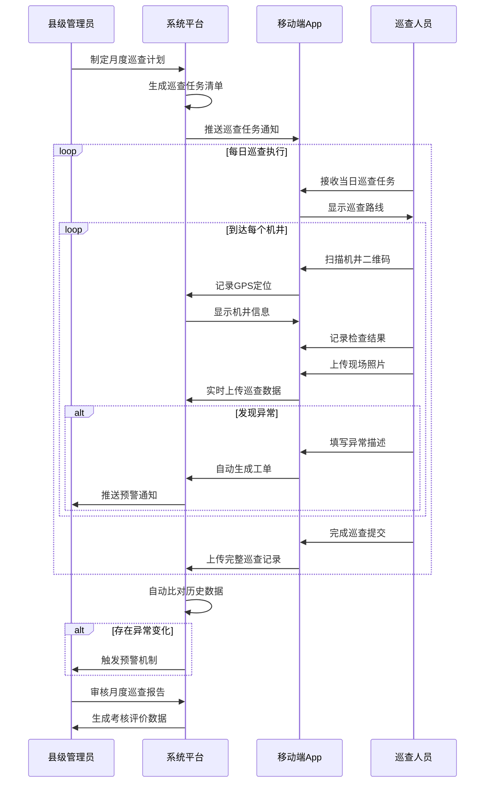

### 3.5 四维考核流程

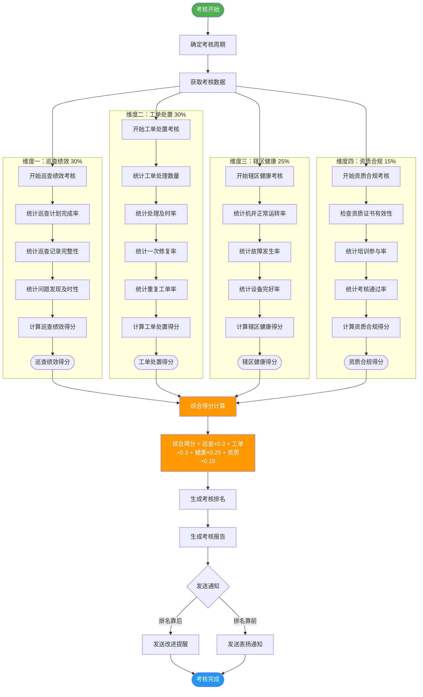

### 3.6 预警处理流程

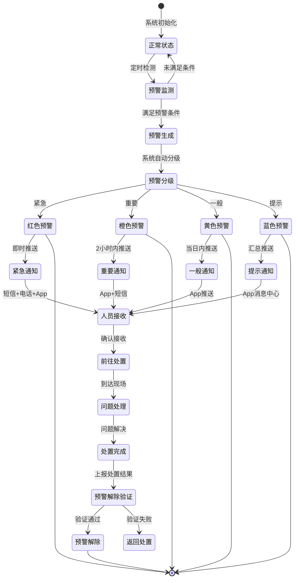

---

## 4. 功能描述

### 4.1 大数据驾驶舱

**文件路径**：`jinguan_dashboard.html`（694行）

**页面功能概述**：

大数据驾驶舱是系统的核心数据展示页面，面向省级管理者提供全省机井运行态势的综合视图。页面采用响应式布局，支持不同屏幕尺寸的适配展示。

**核心功能模块**：

| 模块名称 | 功能描述 | 数据指标 |
|----------|----------|----------|
| KPI指标卡片 | 展示核心业务指标 | 机井总数12,568口、异常机井247口、人员总数846人、本月工单1,384条 |
| 状态分布图 | ECharts饼图展示机井状态分布 | 正常11,578口、故障247口、维护中743口 |
| 工单趋势图 | 折线图展示近期工单变化 | 近7天工单数量：178、192、210、245、238、267、184 |
| 人员排名 | 展示工作绩效排名前列人员 | 姓名、角色、辖区、评分 |
| 政策公告 | 展示最新政策文件 | 公告标题、发布时间、重要性 |

**交互功能**：

- 三级下钻：省→市→县，逐级查看详细数据
- ECharts图表联动：悬停显示详细数值
- 顶部快捷入口：时间切换、用户信息、消息通知

### 4.2 系统首页

**文件路径**：`jinguan_home.html`（1679行）

**页面功能概述**：

系统首页是用户登录后的主入口，面向各级管理员提供日常工作所需的各类信息汇总和快捷操作入口。

**核心功能模块**：

| 模块名称 | 功能描述 | 数据指标 |
|----------|----------|----------|
| 核心指标卡片 | 六大核心业务指标 | 今日巡查1,284次、今日工单23条、待处置8条、逾期预警5条、在线人员1,256人、机井总数2,847口 |
| 巡查日历 | 日历形式展示巡查分布 | 本月各天巡查次数热力图 |
| 预警中心 | 当前重要预警信息 | 预警类型、级别、发生时间、关联机井 |
| 待办事项 | 当前用户待处理任务 | 任务描述、完成状态、截止时间 |
| 最新通知 | 系统发布的通知信息 | 标题、发布时间、发布人 |
| 快捷入口 | 主要功能快速跳转 | 巡查统计、工单管理、机井查询等 |

**交互功能**：

- 快捷搜索：按机井编号、负责人等信息搜索
- 预警筛选：按级别筛选和排序
- 待办操作：勾选完成操作
- 通知查看：点击查看详情

### 4.3 机井管理

**文件路径**：`jinguan_well.html`（1197行）

**页面功能概述**：

机井管理页面是系统最核心的业务页面之一，面向县级管理员提供机井信息的全面管理和日常运维支持。

**核心功能模块**：

| 模块名称 | 功能描述 | 数据内容 |
|----------|----------|----------|
| 地区选择树 | 三级行政区划选择 | 省、市、县（区）层级筛选 |
| 视图切换 | 列表视图/地图视图 | 不同展示方式切换 |
| 机井列表 | 展示符合条件的机井 | 编号、区域、类型、状态、负责人等 |
| 详情侧边栏 | 选中机井详细信息 | 四个Tab标签页切换 |
| 基本信息Tab | 静态属性信息 | 编号、区域、类型、建设时间、设计流量等 |
| 设备信息Tab | 配套设备详情 | 水泵型号、功率、扬程、变压器配置等 |
| 巡查记录Tab | 历史巡查记录 | 时间、人员、结果等 |
| 工单记录Tab | 关联工单历史 | 编号、类型、状态、人员等 |

**交互功能**：

- 列表/地图视图切换
- 地区树多选和级联选择
- 机井卡片点击展开详情
- 多条件筛选和排序
- 新增巡查和新增机井

### 4.4 工单管理

**文件路径**：`jinguan.html`（1816行）

**页面功能概述**：

工单管理页面是系统核心业务页面，面向各级管理员提供工单的全生命周期管理功能。

**核心功能模块**：

| 模块名称 | 功能描述 | 数据指标 |
|----------|----------|----------|
| 状态统计卡片 | 九种状态统计 | 全部42条、待派发2条、待处置5条、处置中3条、已结案28条等 |
| 筛选查询 | 多条件组合筛选 | 编号、机井、类型、状态、来源、时间 |
| 工单列表 | 表格形式展示 | 编号、机井、类型、来源、状态、处置人、时间等 |
| 详情弹窗 | 工单完整信息 | 基本信息、关联机井、处置记录、现场照片 |

**工单九种状态**：

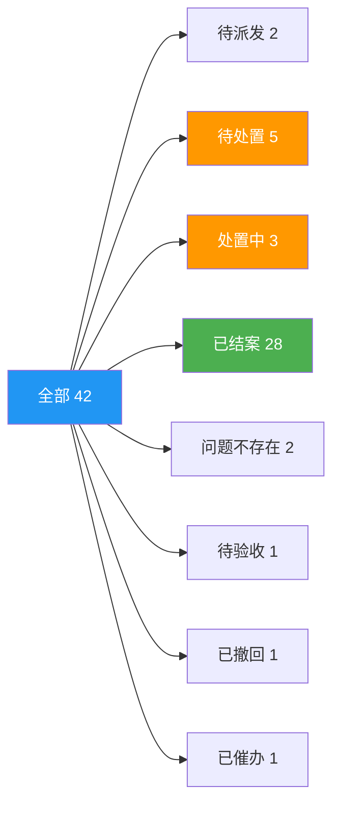

**交互功能**：

- 统计卡片点击快速筛选
- 列表排序和分页
- 派单、催办、结案操作
- 详情弹窗查看
- 批量导出数据

### 4.5 一长两员管理

**文件路径**：`jinguan_staff.html`（1157行）

**页面功能概述**：

一长两员管理页面面向县级管理员提供人员管理、考核评价和资质管理的综合功能。

**核心功能模块**：

| 模块名称 | 功能描述 | 数据内容 |
|----------|----------|----------|
| 统计卡片 | 人员总体情况 | 总数16人、井长、管护员、维修员人数 |
| 人员列表 | 人员信息表格 | 姓名、角色、性别、电话、区域、资质、时间等 |
| 考核排名 | 综合考核得分排名 | 四维考核得分及排名 |
| 资质管理 | 证书信息管理 | 证书名称、编号、日期、有效期、状态 |

**四维考核体系**：

| 考核维度 | 权重 | 考核指标 |
|----------|------|----------|
| 巡查绩效 | 30% | 计划完成率、记录完整性、问题发现及时性 |
| 工单处置 | 30% | 处理数量、及时率、一次修复率、重复工单率 |
| 辖区健康 | 25% | 机井正常率、故障率、完好率 |
| 资质合规 | 15% | 证书有效性、培训参与率、考核通过率 |

### 4.6 工作动态

**文件路径**：`jinguan_news.html`（849行）

**页面功能概述**：

工作动态页面面向各级用户提供通知公告、工作动态、预警信息、操作日志等综合信息聚合功能。

**核心功能模块**：

| 模块名称 | 功能描述 | 数据内容 |
|----------|----------|----------|
| 通知公告 | 系统文件通知 | 标题、类型、发布时间、发布人 |
| 动态时间线 | 重要事件时间轴 | 日期、事件类型、事件描述 |
| 预警中心 | 预警信息卡片 | 标题、内容、级别、时间、关联对象 |
| 工作简报 | 定期汇总报告 | 巡查情况、工单情况、异常处理、考核情况 |
| 操作日志 | 用户操作记录 | 时间、人员、类型、对象、结果 |

**预警级别定义**：

| 级别 | 颜色 | 说明 | 响应时限 |
|------|------|------|----------|
| 红色 | 紧急 | 重大故障、安全事故 | 即时响应 |
| 橙色 | 重要 | 重要设备故障、工单逾期 | 2小时内 |
| 黄色 | 一般 | 一般异常、巡查缺失 | 当日内 |
| 蓝色 | 提示 | 资质到期提醒 | 汇总推送 |

### 4.7 系统管理

**文件路径**：`jinguan_admin.html`（1763行）

**页面功能概述**：

系统管理页面面向省级或市级管理员提供系统基础配置和用户管理功能。

**核心功能模块**：

| 模块名称 | 功能描述 | 数据内容 |
|----------|----------|----------|
| 用户管理 | 系统用户CRUD | 用户名、姓名、角色、电话、区域、状态等 |
| 角色权限 | 角色定义和权限配置 | 省级/市级/县级管理员、井长、管护员、维修员 |
| 区域管理 | 行政区划维护 | 河南省14市136区县层级 |
| 系统配置 | 运行参数配置 | 工单时限、预警阈值、巡查周期、备份策略 |
| 数据字典 | 枚举值管理 | 机井类型、问题类型、预警级别等 |
| 数据备份 | 备份和恢复 | 备份时间、大小、状态 |

**河南省行政区划**：

```mermaid
graph TD
    ROOT[河南省]
    ROOT --> H1[郑州市]
    ROOT --> H2[开封市]
    ROOT --> H3[洛阳市]
    ROOT --> H4[平顶山市]
    ROOT --> H5[安阳市]
    ROOT --> H6[鹤壁市]
    ROOT --> H7[新乡市]
    ROOT --> H8[焦作市]
    ROOT --> H9[濮阳市]
    ROOT --> H10[许昌市]
    ROOT --> H11[漯河市]
    ROOT --> H12[三门峡市]
    ROOT --> H13[南阳市]
    ROOT --> H14[商丘市]
    ROOT --> H15[信阳市]
    ROOT --> H16[周口市]
    ROOT --> H17[驻马店市]
    ROOT --> H18[济源市]
    
    style ROOT fill:#e53935,color:#fff
    style H1 fill:#ff9800
    style H2 fill:#ff9800
    style H3 fill:#ff9800
    style H4 fill:#ff9800
    style H5 fill:#ff9800
    style H6 fill:#ff9800
    style H7 fill:#ff9800
    style H8 fill:#ff9800
    style H9 fill:#ff9800
    style H10 fill:#ff9800
    style H11 fill:#ff9800
    style H12 fill:#ff9800
    style H13 fill:#ff9800
    style H14 fill:#ff9800
    style H15 fill:#ff9800
    style H16 fill:#ff9800
    style H17 fill:#ff9800
    style H18 fill:#ff9800
```

### 4.8 PC端登录页

**文件路径**：`jinguan_login.html`（761行）

**页面功能概述**：

PC端登录页是用户访问系统的入口页面，提供用户身份认证功能。

**核心功能模块**：

| 模块名称 | 功能描述 |
|----------|----------|
| 左侧功能介绍 | 系统四大核心功能展示 |
| 登录表单 | 用户名、密码输入 |
| 记住密码 | 保存登录状态选项 |
| 登录按钮 | 提交认证 |

**四大功能模块**：

1. 大数据驾驶舱 - 数据可视化决策支持
2. 机井一张图 - GIS地图直观展示
3. 工单全流程 - 闭环管理追踪
4. 一长两员 - 考核评价管理

### 4.9 移动端主应用

**文件路径**：`jg_mobile_app.html`（2300行）

**页面功能概述**：

移动端主应用是面向现场工作人员的移动端核心页面，提供机井和工单的移动化管理功能，包含机井实景监控视频查看能力。

**核心功能模块**：

| 模块名称 | 功能描述 | Tab页面 |
|----------|----------|----------|
| 首页 | 功能入口展示 | 首页Tab |
| 机井管理 | 机井列表和查询 | 机井Tab |
| 工单管理 | 工单列表和处理 | 工单Tab |
| 机井实景 | 监控视频查看 | 首页快捷入口 |
| 个人中心 | 用户信息和设置 | 我的Tab |

**机井实景功能**：

| 功能模块 | 描述 |
|----------|------|
| 摄像头列表 | 展示机井关联的监控摄像头 |
| 区域筛选 | 支持按省/市/县/乡/村/井长进行筛选 |
| 状态指示 | 在线摄像头显示绿色状态和LIVE标识 |
| 视频播放 | 点击摄像头进入实时监控播放 |
| 播放控制 | 支持静音、录制、全屏功能 |
| 区域联动 | 选择上级区域自动更新下级选项 |

**移动端架构**：

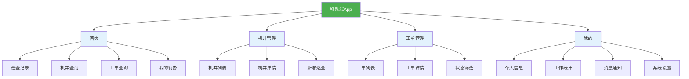

### 4.10 移动端登录页

**文件路径**：`jg_mobile_login.html`（608行）

**页面功能概述**：

移动端登录页是移动端用户访问系统的入口页面，针对移动场景优化登录体验。

**核心功能模块**：

| 模块名称 | 功能描述 |
|----------|----------|
| 登录方式Tab | 三种登录方式切换 |
| 密码登录 | 手机号+密码登录 |
| 微信登录 | 二维码扫描登录 |
| 验证码登录 | 手机号+短信验证码登录 |

**交互功能**：

- Tab滑动/点击切换登录方式
- 手机号格式校验
- 验证码倒计时发送
- 用户协议勾选
- 表单提交验证

---

## 5. 原型设计

### 5.1 大数据驾驶舱原型

**原型描述**：

大数据驾驶舱采用大屏展示风格，顶部显示页面标题和当前时间。

```
┌────────────────────────────────────────────────────────────────┐
│  大数据驾驶舱                                    2026-05-19 10:30│
├────────────────────────────────────────────────────────────────┤
│                                                                │
│  ┌──────────┐ ┌──────────┐ ┌──────────┐ ┌──────────┐          │
│  │机井总数  │ │异常机井  │ │人员总数  │ │本月工单  │          │
│  │  12,568 │ │   247   │ │   846   │ │  1,384  │          │
│  └──────────┘ └──────────┘ └──────────┘ └──────────┘          │
│                                                                │
│  ┌───────────────────────┐  ┌───────────────────────┐        │
│  │                       │  │                       │        │
│  │   [机井状态分布饼图]   │  │   [近期工单趋势图]     │        │
│  │   正常 11,578口       │  │        ___            │        │
│  │   故障   247口        │  │     __/   \__         │        │
│  │   维护   743口        │  │  ___/         \___     │        │
│  │                       │  │                       │        │
│  └───────────────────────┘  └───────────────────────┘        │
│                                                                │
│  ┌───────────────────┐  ┌───────────────────┐                │
│  │   [人员排名列表]   │  │   [政策公告列表]   │                │
│  │ 1. 张三  井长  95分│  │ 关于加强机井管护...│                │
│  │ 2. 李四  管护员 92分│  │ 河南省农业农村厅...│                │
│  │ 3. 王五  维修员 90分│  │ 巡查工作考核办法...│                │
│  └───────────────────┘  └───────────────────┘                │
│                                                                │
└────────────────────────────────────────────────────────────────┘
```

**界面截图位置**：`jinguan_dashboard.html` 第1-100行

### 5.2 系统首页原型

**原型描述**：

系统首页采用左右两栏布局，左侧展示核心指标和快捷入口，右侧展示预警和待办信息。

```
┌────────────────────────────────────────────────────────────────┐
│  首页 │ 机井 │ 工单 │ 我的                    [🔍搜索] [👤用户] │
├────────────────────────────────────────────────────────────────┤
│                                                                │
│  ┌─────────────┐ ┌─────────────┐ ┌─────────────┐              │
│  │ 📊 今日巡查  │ │ 📋 今日工单  │ │ ⏰ 待处置    │              │
│  │   1,284次   │ │    23条     │ │    8条      │              │
│  └─────────────┘ └─────────────┘ └─────────────┘              │
│                                                                │
│  ┌─────────────┐ ┌─────────────┐ ┌─────────────┐              │
│  │ ⚠️ 逾期预警  │ │ 👥 在线人员  │ │ 🔧 机井总数  │              │
│  │     5条     │ │   1,256人   │ │   2,847口   │              │
│  └─────────────┘ └─────────────┘ └─────────────┘              │
│                                                                │
│  ┌─────────────────────────────┐ ┌───────────────────────┐    │
│  │  ⚠️ 预警中心                 │ │ 📝 待办事项             │    │
│  │  ─────────────────────────  │ │  ─────────────────────│    │
│  │  🔴 周口市淮阳区水泵故障     │ │  □ 审核新机井申请       │    │
│  │  🟠 商丘市虞城县线路异常     │ │  □ 处理待派发工单       │    │
│  │  🟡 郑州市中牟县无巡查记录   │ │  □ 确认考核排名结果     │    │
│  └─────────────────────────────┘ └───────────────────────┘    │
│                                                                │
│  ┌─────────────────────────────┐ ┌───────────────────────┐    │
│  │  📢 最新通知                 │ │  📅 巡查日历             │    │
│  │  ─────────────────────────  │ │   5月巡查日历           │    │
│  │  关于开展春季安全大检查的通知 │ │  [1][2][3][4][5][6][7] │    │
│  │  2026年度考核工作安排        │ │  [8][9][10]...          │    │
│  └─────────────────────────────┘ └───────────────────────┘    │
└────────────────────────────────────────────────────────────────┘
```

**界面截图位置**：`jinguan_home.html` 第1-200行

### 5.3 机井管理原型

**原型描述**：

机井管理采用三栏布局，左侧为地区选择树，中间为机井列表，右侧为详情侧边栏。

```
┌────────────────────────────────────────────────────────────────┐
│  机井管理                    [列表] [地图]  [🔍搜索] [+新增机井]│
├────────────┬───────────────────────────────────┬────────────┤
│ 地区选择    │  机井列表                          │ 机井详情    │
│ ─────────  │  ─────────────────────────────────│ ──────────│
│ ☑ 河南省    │  ┌─────────────────────────────┐ │ 编号: J4001 │
│   ☑ 周口市  │  │ J4001 │ 淮阳区 │ 正常 │ 张三 │ │ 类型: 灌溉井 │
│     ☑ 淮阳区│  └─────────────────────────────┘ │ 深度: 80m   │
│     □ 项城市│  ┌─────────────────────────────┐ │ 状态: 正常  │
│   □ 南阳市  │  │ J4002 │ 淮阳区 │ 故障 │ 李四 │ │ ───────────│
│   □ 商丘市  │  └─────────────────────────────┘ │ [基本信息]  │
│   □ ...    │  ┌─────────────────────────────┐ │ [设备信息]  │
│            │  │ J4003 │ 项城市 │ 正常 │ 王五 │ │ [巡查记录]  │
│ [筛选条件]  │  └─────────────────────────────┘ │ [工单记录]  │
│ 类型: [全部]│                                   │            │
│ 状态: [全部]│                                   │ [新增巡查] │
│ 负责人: [...]│                                   │ [查看地图] │
└────────────┴───────────────────────────────────┴────────────┘
```

**界面截图位置**：`jinguan_well.html` 第1-300行

### 5.4 工单管理原型

**原型描述**：

工单管理顶部为九种状态的统计卡片，下方为筛选条件和工单列表。

```
┌────────────────────────────────────────────────────────────────┐
│  工单管理                                                         │
├────────────────────────────────────────────────────────────────┤
│  [全部42] [待派发2] [待处置5] [处置中3] [已结案28] [问题不存在2]...│
├────────────────────────────────────────────────────────────────┤
│  编号: [    ] 机井: [    ] 类型: [全部▼] 状态: [全部▼] [查询]   │
├────────────────────────────────────────────────────────────────┤
│  编号      │ 机井      │ 问题类型 │ 来源   │ 状态    │ 处置人  │
│  ──────────┼───────────┼──────────┼────────┼─────────┼────────│
│  GD202601  │ J4001    │ 水泵故障 │ 巡查   │ 待处置  │ 张三   │
│  GD202602  │ J4005    │ 线路老化 │ 巡查   │ 处置中  │ 李四   │
│  GD202603  │ J2012    │ 设备损坏 │ 群众   │ 待派发  │ -      │
│  GD202604  │ J3033    │ 水质异常 │ 监控   │ 已结案  │ 王五   │
├────────────────────────────────────────────────────────────────┤
│                                              [派单] [催办] [结案]│
└────────────────────────────────────────────────────────────────┘
```

**界面截图位置**：`jinguan.html` 第1-400行

### 5.5 移动端原型

**原型描述**：

移动端采用底部Tab导航，四个主Tab页面，内容区域展示不同功能模块。

```
┌──────────────────────────┐
│  首页                     │
├──────────────────────────┤
│                          │
│  ┌──────────────────┐   │
│  │    📊 今日巡查    │   │
│  │     1,284次      │   │
│  └──────────────────┘   │
│                          │
│  ┌────────┐ ┌────────┐  │
│  │机井查询│ │工单查询│  │
│  └────────┘ └────────┘  │
│                          │
│  ┌────────┐ ┌────────┐  │
│  │我的待办│ │更多功能│  │
│  └────────┘ └────────┘  │
│                          │
├──────────────────────────┤
│  [🏠首页] [🔧机井] [📋工单] [👤我的] │
└──────────────────────────┘
```

**界面截图位置**：`jg_mobile_app.html` 第1-300行

### 5.6 登录页原型

**原型描述**：

PC端登录页采用左右分栏，左侧展示系统功能介绍，右侧为登录表单。

```
┌────────────────────────────────┬────────────────────────────────┐
│                                │                                │
│   🌾 机井管理信息化平台         │      用户登录                   │
│                                │      ─────────                  │
│   ┌──────────────────────┐    │      用户名: [____________]     │
│   │ 📊 大数据驾驶舱        │    │      密　码: [____________]     │
│   │ 全省数据尽在掌握       │    │                                │
│   └──────────────────────┘    │      □ 记住密码                  │
│   ┌──────────────────────┐    │      [　　登 录　　]            │
│   │ 🗺️ 机井一张图         │    │                                │
│   │ GIS地图直观展示       │    │      还没有账号？[立即注册]     │
│   └──────────────────────┘    │                                │
│   ┌──────────────────────┐    │      © 2026 技术支持            │
│   │ 📋 工单全流程         │    │                                │
│   │ 闭环管理追踪         │    │                                │
│   └──────────────────────┘    │                                │
│   ┌──────────────────────┐    │                                │
│   │ 👥 一长两员           │    │                                │
│   │ 科学考核评价         │    │                                │
│   └──────────────────────┘    │                                │
│                                │                                │
└────────────────────────────────┴────────────────────────────────┘
```

**界面截图位置**：`jinguan_login.html` 第1-200行

---

## 6. 用例分析

### 6.1 系统用例图

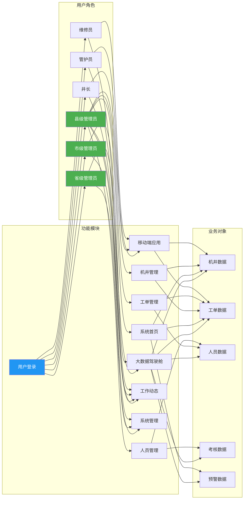

### 6.2 用户登录用例

```mermaid
useCaseDiagram
    left to right direction
    
    actor User as "用户"
    actor System as "系统"
    
    usecase UC1 as "输入用户名密码"
    usecase UC2 as "验证用户身份"
    usecase UC3 as "显示登录结果"
    usecase UC4 as "跳转主页面"
    usecase UC5 as "记录登录日志"
    
    User --> UC1
    UC1 --> UC2 : 提交登录
    UC2 --> System : 验证账号密码
    System --> UC3 : 返回验证结果
    UC3 --> User : 显示成功/失败
    UC3 --> UC4 : 验证通过
    UC4 --> User : 进入首页
    UC3 --> UC5 : 记录登录信息
```

### 6.3 机井管理用例

```mermaid
useCaseDiagram
    left to right direction
    
    actor Manager as "县级管理员"
    actor WellMaster as "井长"
    actor System as "系统"
    
    usecase UC1 as "查询机井列表"
    usecase UC2 as "查看机井详情"
    usecase UC3 as "新增机井"
    usecase UC4 as "编辑机井信息"
    usecase UC5 as "新增巡查记录"
    usecase UC6 as "查看巡查历史"
    
    Manager --> UC1
    Manager --> UC2
    Manager --> UC3
    Manager --> UC4
    
    WellMaster --> UC1
    WellMaster --> UC2
    WellMaster --> UC5
    WellMaster --> UC6
    
    UC1 --> System : 筛选查询
    UC2 --> System : 加载详情
    UC3 --> System : 保存机井
    UC4 --> System : 更新信息
    UC5 --> System : 记录巡查
    UC6 --> System : 查询历史
```

### 6.4 工单管理用例

```mermaid
useCaseDiagram
    left to right direction
    
    actor Inspector as "巡查人员"
    actor Manager as "县级管理员"
    actor Handler as "处置人员"
    actor System as "系统"
    
    usecase UC1 as "提交问题工单"
    usecase UC2 as "审核工单"
    usecase UC3 as "派发工单"
    usecase UC4 as "催办工单"
    usecase UC5 as "处置工单"
    usecase UC6 as "结案工单"
    usecase UC7 as "查询工单"
    
    Inspector --> UC1
    Manager --> UC2
    Manager --> UC3
    Manager --> UC4
    Handler --> UC5
    Manager --> UC6
    Manager --> UC7
    
    UC1 --> System : 创建工单
    UC2 --> System : 审核通过
    UC3 --> System : 分配人员
    UC4 --> System : 发送催办
    UC5 --> System : 提交处置
    UC6 --> System : 完成结案
    UC7 --> System : 检索工单
```

### 6.5 关键时序图

#### 6.5.1 用户登录时序

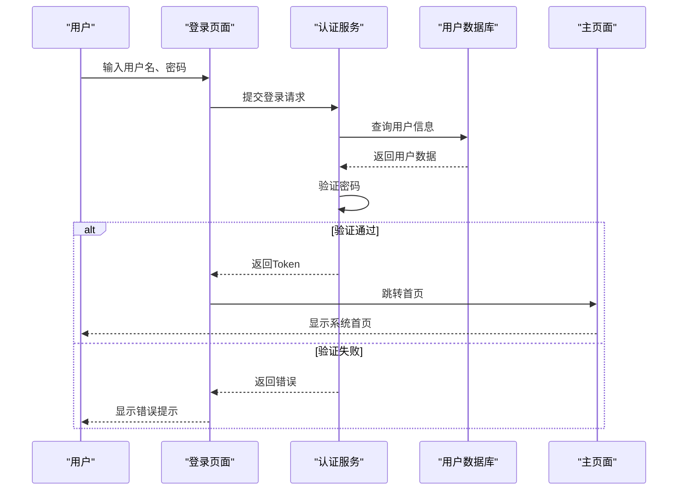

#### 6.5.2 工单处理时序

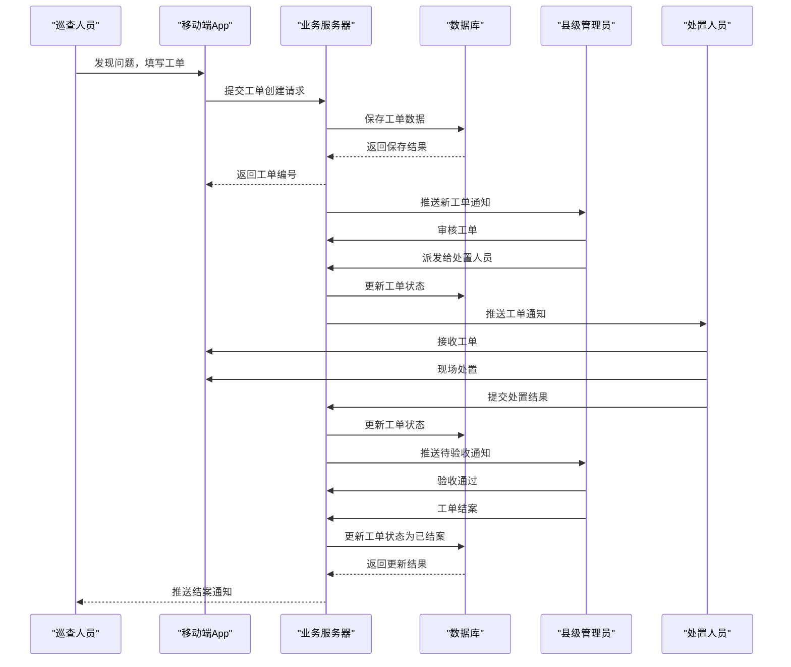

#### 6.5.3 巡查执行时序

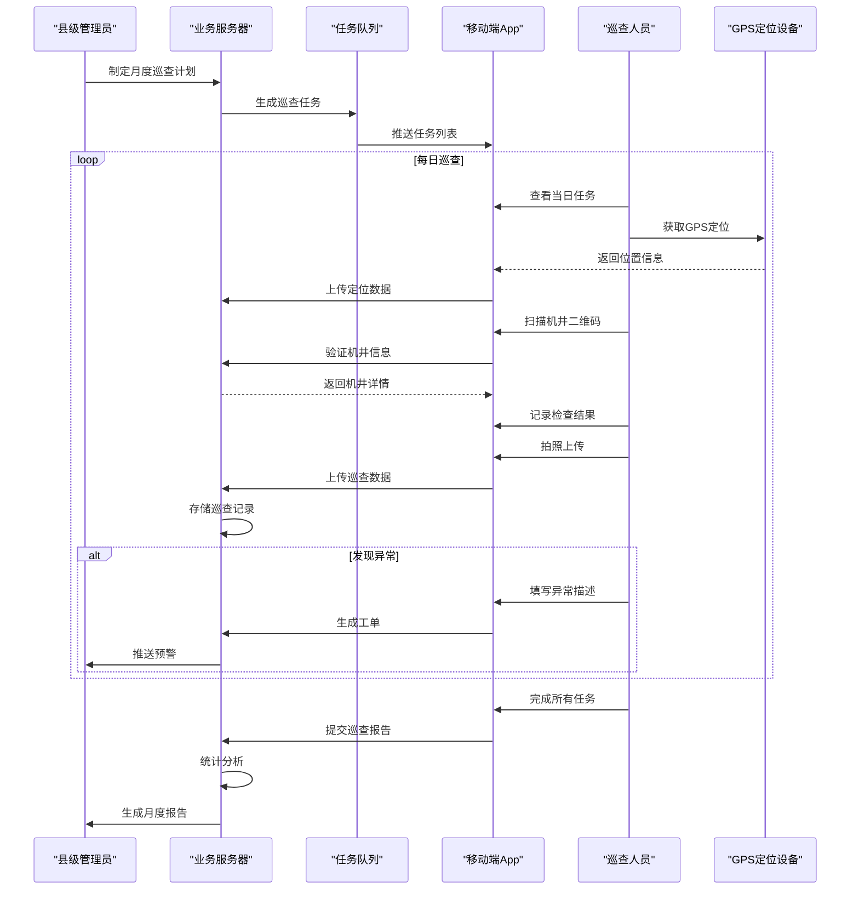

---

## 7. 部署需求

### 7.1 系统架构

机井管理信息化平台采用B/S架构设计，前端基于HTML、CSS、JavaScript实现，后端采用模块化API接口设计。系统支持本地部署和云端部署两种模式。

#### 7.1.1 前端架构

前端采用静态文件部署方式：

- 所有HTML页面可部署到任意Web服务器或CDN节点
- CSS样式表和JavaScript脚本经过优化，减少网络传输体积
- 支持多页面应用的页面跳转和单页应用的组件切换
- 响应式布局适配PC端和移动端不同屏幕尺寸

#### 7.1.2 后端架构

后端采用RESTful API设计：

- 接口遵循RESTful规范，使用JSON格式数据传输
- 支持跨域访问，前端与后端可分离部署
- 接口实现统一的认证鉴权和日志记录
- 数据库交互采用连接池管理，提升并发处理能力

### 7.2 服务器端环境要求

| 配置项 | 最低要求 | 推荐配置 |
|--------|----------|----------|
| CPU | 4核 | 8核以上 |
| 内存 | 8GB | 16GB或以上 |
| 磁盘空间 | 100GB | 500GB SSD |
| 操作系统 | Windows Server 2012 / CentOS 7 | Windows Server 2019 / Ubuntu 20.04 |
| Web服务器 | Nginx / Apache / IIS | Nginx |
| 数据库 | MySQL 5.7 / PostgreSQL 12 | MySQL 8.0 / PostgreSQL 14 |
| Java环境 | JDK 8 | JDK 11（如使用Java后端） |

### 7.3 客户端环境要求

#### 7.3.1 PC端浏览器

| 浏览器 | 最低版本 | 推荐版本 |
|--------|----------|----------|
| Chrome | 80 | 最新版本 |
| Firefox | 75 | 最新版本 |
| Safari | 13 | 最新版本 |
| Edge | 80 | 最新版本 |

#### 7.3.2 移动端设备

| 设备类型 | 系统版本 | 推荐机型 |
|----------|----------|----------|
| iOS | iOS 13及以上 | iPhone 8及以上 |
| Android | Android 8.0及以上 | 近两年发布机型 |

### 7.4 网络环境要求

| 网络类型 | 带宽要求 | 延迟要求 |
|----------|----------|----------|
| 公网访问 | 10Mbps以上 | 100ms以内 |
| 内网访问 | 100Mbps | 10ms以内 |
| 移动数据 | 4G网络 | 200ms以内 |

### 7.5 第三方依赖

#### 7.5.1 前端依赖

| 依赖名称 | 版本 | 用途 |
|----------|------|------|
| ECharts | 5.x | 数据可视化图表 |
| jQuery | 3.x | DOM操作和Ajax |
| Bootstrap | 5.x | 响应式布局框架 |

#### 7.5.2 后端依赖

| 依赖名称 | 版本 | 用途 |
|----------|------|------|
| Spring Boot | 2.7.x | 后端框架 |
| MyBatis | 3.5.x | ORM框架 |
| Shiro | 1.9.x | 安全框架 |

### 7.6 部署架构图

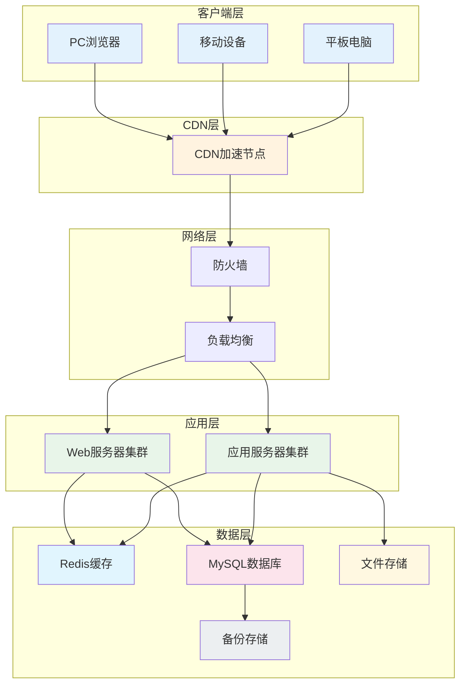

### 7.7 部署流程

#### 7.7.1 前端部署步骤

1. 打包前端文件：将html文件夹下的所有文件打包
2. 上传至Web服务器：使用FTP/SCP等方式上传至服务器指定目录
3. 配置Web服务器：配置Nginx/Apache支持SPA应用的URL重写
4. 配置缓存策略：为静态资源配置浏览器缓存，减少重复加载
5. 配置HTTPS：为网站配置SSL证书，启用HTTPS访问
6. 验证部署：访问各页面验证功能正常

#### 7.7.2 后端部署步骤

1. 导入数据库脚本：执行数据库初始化SQL脚本
2. 配置数据库连接：修改application.yml中的数据库连接信息
3. 部署应用包：将后端应用部署到应用服务器
4. 启动服务：启动后端服务并验证端口监听
5. 接口测试：验证核心接口的连通性和响应

---

## 8. 性能需求

### 8.1 响应时间指标

| 场景 | 性能指标 | 验收标准 |
|------|----------|----------|
| 首页首次加载 | ≤3秒 | 95%用户在3秒内完成加载 |
| 功能页面加载 | ≤2秒 | 页面完全渲染时间不超过2秒 |
| 列表数据查询 | ≤2秒 | 查询结果返回不超过2秒 |
| 图表数据加载 | ≤3秒 | ECharts图表渲染完成不超过3秒 |
| 表单提交保存 | ≤2秒 | 保存操作完成不超过2秒 |
| 地图数据加载 | ≤3秒 | 地图绑图和数据展示不超过3秒 |
| 移动端页面切换 | ≤300毫秒 | Tab切换响应时间不超过300毫秒 |
| 移动端列表加载 | ≤1秒 | 列表数据加载不超过1秒 |

### 8.2 并发处理能力

| 指标项 | 要求值 | 说明 |
|--------|--------|------|
| 同时在线用户数 | ≥500人 | 系统可支撑的并发在线用户数 |
| 功能并发请求数 | ≥100个/秒 | 同一功能的高峰并发请求处理能力 |
| 工单提交处理 | ≥50次/秒 | 工单提交的高频操作处理能力 |
| 数据查询处理 | ≥200次/秒 | 数据查询的并发处理能力 |
| 文件上传处理 | ≥10次/秒 | 图片和附件的上传处理能力 |

### 8.3 数据容量

| 数据类型 | 容量要求 | 存储周期 |
|----------|----------|----------|
| 机井数据 | 支持≥100,000口 | 永久保存 |
| 工单数据 | 支持≥1,000,000条 | 永久保存 |
| 巡查记录 | 支持≥10,000,000条 | 保留近5年 |
| 人员数据 | 支持≥10,000人 | 永久保存 |
| 文件附件 | 单个文件≤10MB | 保留近3年 |
| 日志数据 | 支持≥100,000,000条 | 保留近1年 |

### 8.4 可用性指标

| 指标项 | 要求值 | 说明 |
|--------|--------|------|
| 系统可用率 | ≥99.5% | 全年正常运行时间比例 |
| 故障恢复时间 | ≤30分钟 | 一般故障恢复时间要求 |
| 数据备份周期 | 每日一次 | 自动备份策略 |
| 数据恢复时间 | ≤1小时 | 从备份恢复数据的时间 |
| 计划内维护窗口 | ≤4小时/月 | 预留的计划维护时间 |

### 8.5 移动端性能指标

| 指标项 | 要求值 | 说明 |
|--------|--------|------|
| App安装包大小 | ≤50MB | iOS和Android安装包 |
| 首次加载时间 | ≤5秒 | 冷启动时间 |
| 页面切换时间 | ≤300毫秒 | 切换响应时间 |
| 内存占用峰值 | ≤200MB | 正常运行时的内存使用 |
| 电池消耗 | 低功耗 | 长时间使用的电池影响 |
| 离线存储容量 | ≥50MB | 本地缓存数据容量 |

---

## 9. 其他内容

### 9.1 安全需求

#### 9.1.1 用户认证与授权

| 安全措施 | 要求说明 |
|----------|----------|
| 密码策略 | 长度≥8位，包含大小写字母和数字 |
| 密码加密 | 采用不可逆加密算法存储，禁止明文 |
| 登录限制 | 连续5次登录失败锁定账户15分钟 |
| 会话管理 | Session超时时间30分钟，支持强制下线 |
| 权限控制 | 基于RBAC的细粒度权限控制 |

#### 9.1.2 数据传输安全

| 安全措施 | 要求说明 |
|----------|----------|
| 传输加密 | 全站启用HTTPS，TLS版本≥1.2 |
| 敏感数据 | 密码、身份证等敏感信息加密传输 |
| CSRF防护 | 接口实现CSRF Token验证 |
| SQL注入防护 | 参数化查询，防止SQL注入 |
| XSS防护 | 输入输出数据过滤，防止XSS攻击 |

#### 9.1.3 数据存储安全

| 安全措施 | 要求说明 |
|----------|----------|
| 数据库安全 | 配置强密码策略，定期更换 |
| 敏感字段加密 | 关键字段如密码加密存储 |
| 访问审计 | 记录关键业务操作的审计日志 |
| 数据备份 | 本地+异地备份，备份文件加密存储 |

### 9.2 数据规范

#### 9.2.1 行政区划规范

| 级别 | 编码规则 | 示例 |
|------|----------|------|
| 省级 | 6位数字 | 410000（河南省） |
| 市级 | 6位数字 | 411600（周口市） |
| 县级 | 6位数字 | 411603（淮阳区） |

#### 9.2.2 机井编码规范

| 字段 | 编码规则 | 说明 |
|------|----------|------|
| 总位数 | 18位 | 唯一编号 |
| 行政区划码 | 6位 | 所属县区代码 |
| 年份码 | 4位 | 建成年份 |
| 序号码 | 8位 | 当年新增序号 |
| 示例 | 410000202100000001 | 河南省2021年第1口机井 |

#### 9.2.3 状态值规范

**机井状态枚举**：

| 状态码 | 状态名 | 说明 |
|--------|--------|------|
| normal | 正常 | 机井正常运行 |
| fault | 故障 | 存在故障待处理 |
| maintain | 维护中 | 正在维护保养 |
| offline | 离线 | 设备离线无数据 |

**工单状态枚举**：

| 状态码 | 状态名 | 说明 |
|--------|--------|------|
| pending | 待派发 | 待分配处置人员 |
| waiting | 待处置 | 已派发待接收 |
| processing | 处置中 | 正在处理中 |
| done | 已结案 | 处理完成已验收 |
| noexist | 问题不存在 | 核实后问题不存在 |
| return | 已撤回 | 撤回的工单 |
| remind | 已催办 | 被催办的工单 |
| accept | 待验收 | 待验收审核 |

#### 9.2.4 时间格式规范

| 格式 | 示例 | 用途 |
|------|------|------|
| yyyy-MM-dd HH:mm:ss | 2026-05-19 10:30:00 | 数据库存储、全文检索 |
| yyyy-MM-dd | 2026-05-19 | 日期字段 |
| HH:mm:ss | 10:30:00 | 时间字段 |
| yyyy年MM月dd日 | 2026年05月19日 | 用户显示 |
| MM-dd HH:mm | 05-19 10:30 | 简短显示 |
| 刚刚/几分钟前/几小时前 | - | 相对时间显示 |

### 9.3 运维需求

#### 9.3.1 监控告警

| 监控项 | 告警阈值 | 告警方式 |
|--------|----------|----------|
| CPU使用率 | ≥80%持续5分钟 | 邮件+短信 |
| 内存使用率 | ≥85%持续5分钟 | 邮件+短信 |
| 磁盘使用率 | ≥90% | 邮件+短信 |
| 接口响应时间 | ≥5秒 | 邮件 |
| 接口错误率 | ≥1% | 邮件+短信 |
| 数据库连接数 | ≥80%最大值 | 邮件 |

#### 9.3.2 日志管理

| 日志类型 | 记录内容 | 保留周期 |
|----------|----------|----------|
| 操作日志 | 用户登录、关键业务操作 | 1年 |
| 系统日志 | 服务启动、异常信息 | 6个月 |
| 接口日志 | 请求参数、响应结果 | 3个月 |
| 错误日志 | 异常堆栈、错误详情 | 1年 |
| 安全日志 | 登录失败、权限异常 | 1年 |

#### 9.3.3 应急响应

| 事件级别 | 定义 | 响应时间 | 处理时限 |
|----------|------|----------|----------|
| P0-紧急 | 系统不可用 | 立即 | 4小时内恢复 |
| P1-严重 | 核心功能不可用 | 15分钟内 | 2小时内恢复 |
| P2-一般 | 非核心功能异常 | 1小时内 | 24小时内修复 |
| P3-轻微 | 界面或体验问题 | 1个工作日 | 1周内修复 |

### 9.4 扩展需求

#### 9.4.1 接口开放

| 接口类型 | 说明 | 认证方式 |
|----------|------|----------|
| RESTful API | 标准REST接口 | OAuth2.0 |
| WebSocket | 实时推送接口 | Token认证 |
| 文件上传 | 附件上传接口 | Token认证 |
| 数据导出 | Excel/CSV导出 | Token认证 |

#### 9.4.2 功能扩展

| 扩展方向 | 说明 |
|----------|------|
| 物联网集成 | 支持接入传感器数据 |
| 视频监控 | 支持接入视频监控画面 |
| 无人机巡检 | 支持无人机航拍数据接入 |
| 大数据分析 | 扩展数据分析和预测功能 |
| 移动支付 | 支持在线缴费功能 |

#### 9.4.3 多语言支持

| 语言 | 支持状态 |
|------|----------|
| 简体中文 | 已支持 |
| 繁体中文 | 后续扩展 |
| English | 后续扩展 |

---

## 附录

### 附录A：页面文件清单

| 文件名 | 说明 | 行数 | 页面类型 |
|--------|------|------|----------|
| jinguan_dashboard.html | 大数据驾驶舱 | 694 | PC端 |
| jinguan_home.html | 系统首页 | 1679 | PC端 |
| jinguan_well.html | 机井管理 | 1197 | PC端 |
| jinguan.html | 工单管理 | 1816 | PC端 |
| jinguan_staff.html | 一长两员管理 | 1157 | PC端 |
| jinguan_news.html | 工作动态 | 849 | PC端 |
| jinguan_admin.html | 系统管理 | 1763 | PC端 |
| jinguan_login.html | PC端登录页 | 761 | PC端 |
| jg_mobile_app.html | 移动端主应用（含机井实景） | 2300 | 移动端 |
| jg_mobile_login.html | 移动端登录页 | 608 | 移动端 |
| jinguan_common.css | 共享样式文件 | - | 共享 |
| jinguan_common.js | 共享JS工具函数 | - | 共享 |

### 附录B：术语表

| 术语 | 说明 |
|------|------|
| 机井实景 | 指机井现场监控视频功能，支持实时查看机井监控画面 |
| 一长两员 | 指井长、管护员、维修员三种角色，是机井管护的基本单元 |
| 四维考核 | 指从巡查绩效、工单处置、辖区健康、资质合规四个维度考核人员 |
| 工单 | 记录机井问题发现、处置、验收全过程的业务单据 |
| 大数据驾驶舱 | 以图表形式直观展示系统核心数据的综合展示页面 |
| 三级联动 | 省、市、县三级行政区划的数据关联和业务协同 |
| ECharts | 百度开源的数据可视化图表库 |
| GIS | 地理信息系统，用于展示和分析空间数据 |
| RBAC | 基于角色的访问控制，一种权限管理模型 |
| RESTful | 一种API设计风格，遵循HTTP协议语义 |
| SPA | 单页应用，一种Web应用架构 |

### 附录C：参考标准

| 标准名称 | 说明 |
|----------|------|
| GB/T 22239-2019 | 信息安全技术 网络安全等级保护基本要求 |
| GB/T 35273-2020 | 信息安全技术 个人信息安全规范 |
| SJ/T 11364-2014 | 电子电气产品有害物质限制使用标识要求 |
| WS/T 447-2014 | 基于电子病历的医院信息平台技术规范 |

---

*文档结束*

*本需求规格说明书版权归机井管理信息化平台项目组所有，未经许可不得对外传播。*
